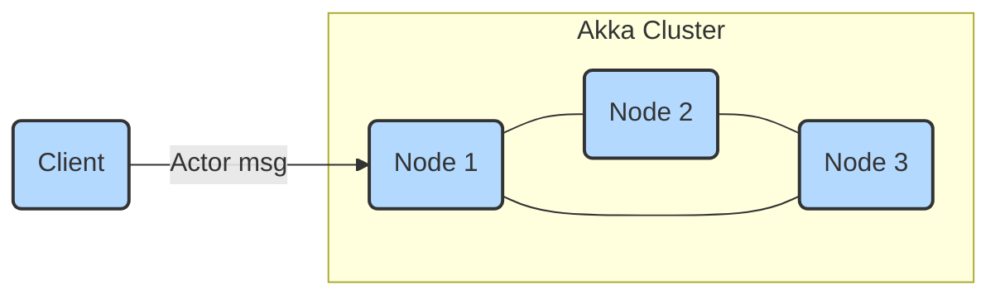

# Akka Cluster – Interview Preparation Guide (Expanded Edition)

> **Goal:** Help you explain, design, and troubleshoot Akka Cluster in a Scala interview—without assuming deep prior knowledge. Feel free to paste code snippets or diagrams from this file onto a whiteboard or into your notes.

---

## 1  What Is Akka Cluster?

Akka Cluster is an **opt‑in module for the Akka actor toolkit** that turns multiple JVMs—running on laptops, VMs, containers, or bare metal—into **one logical actor system**. It gives you:

* **Transparent Remote Messaging** – messages between actors look local, even if they cross machines.  
* **Elasticity** – add or remove nodes at runtime; actors rebalance automatically.  
* **Resilience** – each node liveness is monitored; failed nodes are ejected and their work is redistributed.  
* **Data Locality** – sharding lets you colocate state with workload (e.g., customer A’s cart always lives on the same shard).

<div align="center"><strong>Key idea:</strong> Akka Cluster focuses on <em>in‑process runtime concerns</em> (membership, failure detection, message routing). It does <em>not</em> build Docker images or provision servers—that’s the job of your CI/CD and orchestration layer.</div>

---

## 2  Core Concepts & Terminology

| Term | Quick Definition | Interview Talking Points |
|------|------------------|--------------------------|
| **Node / Member** | One JVM participating in the cluster. | Each member moves through states: `Joining → Up → Leaving → Exiting → Removed`. |
| **Seed Nodes** | Fixed contact points a new node pings to discover the cluster. | Run **≥3** seeds in prod to avoid single faults & split‑brain risks. |
| **Roles** | User‑defined strings (e.g., `api`, `worker`) attached to a node. | Use roles to pin critical services (Cluster Singleton) or segregate workloads. |
| **Gossip Protocol** | Anti‑entropy algorithm that spreads cluster state (membership list, reachability) in **O(log n)** hops. | Explain rumor‑mongering: every heartbeat picks a random peer to sync. |
| **Failure Detector** | *Phi‑Accrual* algorithm converts heartbeat delays into a “phi” suspicion level. | Tuned via `akka.cluster.failure-detector.*` (threshold, sample‑size). |
| **Downing Provider / SBR** | Decides which partition survives after a network split. | Akka’s built‑in <em>Split‑Brain Resolver</em> uses majority quorum by default. |
| **Cluster Singleton** | Guarantees exactly one live actor instance across the cluster. | Perfect for schedulers, leader election, or multi‑tenant cron jobs. |
| **Cluster Sharding** | Distributes many related entities across shards and nodes. | Enables millions of stateful “micro‑actors” without knowing their addresses. |
| **Distributed Data (CRDTs)** | Conflict‑free replicated data types, e.g. OR‑Map, PNCounter. | Great for shopping‑cart counts or feature flags where “last‑write‑wins” is OK. |
| **Cluster‑Aware Routers** | Send messages to a pool of actors distributed across nodes. | Replaced by Sharding in most modern designs. |
| **Distributed Pub/Sub** | Topic‑based broadcast bus inside the cluster. | Simplifies event fan‑out when Kafka isn’t necessary. |

---

## 3  Minimal Configuration in a Scala App

### `build.sbt`

```scala
lazy val akkaVersion = "2.9.1"   // or Apache Pekko if you need Apache‑2.0 license

libraryDependencies ++= Seq(
  "com.typesafe.akka" %% "akka-actor-typed" % akkaVersion,
  "com.typesafe.akka" %% "akka-cluster-typed" % akkaVersion,
  // opt‑in extras
  "com.typesafe.akka" %% "akka-cluster-sharding-typed" % akkaVersion,
  "com.typesafe.akka" %% "akka-persistence-typed" % akkaVersion
)
```

### `application.conf`

```hocon
akka {
  actor.provider = cluster       # enable the cluster extension

  remote.artery {
    transport = tcp
    canonical.hostname = ${?HOST_IP}   # env override for containers
    canonical.port     = 25520
  }

  cluster {
    seed-nodes = [
      "akka://ShoppingSys@node1:25520",
      "akka://ShoppingSys@node2:25520",
      "akka://ShoppingSys@node3:25520"
    ]
    roles = ["backend"]
    downing-provider-class = "akka.cluster.sbr.SplitBrainResolverProvider"
  }
}
```

**Why Artery?** It is the modern, high‑throughput transport built on Aeron, replacing Akka’s classic Netty remoting.

---

## 4  Bootstrapping the Cluster (Typed API Example)

```scala
object Guardian:
  def apply(): Behavior[Nothing] = Behaviors.setup { ctx =>
    val cluster = Cluster(ctx.system)

    // Auto‑join if this node is the first seed
    if cluster.selfMember.address.port.contains(25520) then
      cluster.manager ! JoinSelf

    // Deploy a Cluster Singleton
    ClusterSingleton(ctx.system)
      .init(SingletonActor(MyScheduler(), "billing-scheduler"))

    // Start sharding
    val sharding = ClusterSharding(ctx.system)
    sharding.init(
      Entity(typeKey = CartActor.TypeKey) { entityCtx =>
        CartActor(entityCtx.entityId)
      }
    )

    Behaviors.empty
  }

@main def main(): Unit =
  ActorSystem[Nothing](Guardian(), "ShoppingSys")
```

**What Happens Behind the Scenes**

1. JVM reads `application.conf` and loads the cluster extension.  
2. The node contacts its seed list, exchanges gossip, and transitions to **Up**.  
3. Actor messages marked for Sharding are wrapped and routed to the correct shard, even if the destination entity currently lives on another node.

---

## 5  Dynamic Cluster Formation (Akka Management)

Hard‑coding IPs is brittle for containers. **Akka Management** + **Cluster Bootstrap** solve this by:

1. Exposing an HTTP endpoint (`/bootstrap/seed-nodes`) on each pod.  
2. Using **Akka Discovery** to query the platform API (Kubernetes, AWS ECS, Marathon, Consul).  
3. Electing a stable set of seed nodes at runtime.

Add dependencies:

```scala
"com.lightbend.akka.management" %% "akka-management"               % "1.5.0",
"com.lightbend.akka.management" %% "akka-management-cluster-http"  % "1.5.0",
"com.lightbend.akka.management" %% "akka-management-cluster-bootstrap" % "1.5.0",
"com.lightbend.akka.management" %% "akka-discovery-kubernetes-api" % "1.5.0"
```

And configure:

```hocon
akka.management {
  http {
    hostname = 0.0.0.0
    port = 8558
  }
  cluster.bootstrap {
    contact-point-discovery {
      discovery-method = kubernetes-api
      service-name = "shopping-sys"
    }
  }
}
```

---

## 6  Patterns and Extensions

### 6.1  Cluster Singleton

```scala
val singleton = ClusterSingleton(system).init(
  SingletonActor(
    behavior = PaymentReconciliation(), 
    name     = "payment‑recon"
  )
)
```

Guarantees exactly **one** `PaymentReconciliation` actor runs, regardless of how many nodes exist. Optionally back it with **Persistence** so it can recover after failover.

### 6.2  Cluster Sharding + Persistence

```scala
Entity(typeKey = OrderEntity.TypeKey) { entityContext =>
  EventSourcedBehavior[Command, Event, State](
    persistenceId = PersistenceId.of(entityContext.entityTypeKey.name, entityContext.entityId),
    emptyState    = State.Empty,
    commandHandler = OrderEntity.commandHandler,
    eventHandler   = OrderEntity.eventHandler
  )
}
```

Each order is **an event‑sourced actor** transparently distributed across nodes.  
Sharding handles:

* **Entity Allocation** – new orders hashed to shards, shards to nodes.  
* **Rebalancing** – when nodes leave/join, shards migrate with no downtime.  
* **Remember Entities** – entities restart automatically after node restart.

### 6.3  Distributed Pub/Sub

```scala
val mediator = DistributedPubSub(system).mediator
mediator ! Publish(topic = "inventory‑events", msg = ItemSold(id))
```

---

## 7  Operational Concerns

| Concern | Recommendation |
|---------|----------------|
| **Ports** | Open 25520 (Artery data) + 8558 (Akka Management) in your Service/Ingress. |
| **Health Checks** | Use `/ready` and `/alive` endpoints from Akka Management for K8s probes. |
| **Monitoring** | Lightbend Telemetry (commercial) or Micrometer + Prometheus; key metrics: message throughput, actor mailbox size, shard rebalance rate. |
| **Split‑Brain** | Enable SBR with majority strategy. Never write custom `ClusterDowning`. |
| **Rolling Updates** | Drain pods gracefully: set `akka.cluster.shutdown-after-unreachability` and keep ≥1 seed alive. |
| **Back‑Pressure** | Favor streamed protocols (`Source` / `Sink`) over ask‑reply for bulk data. |
| **Large Messages** | Default frame limit is 128 KiB; raise `akka.remote.maximum-frame-size` when sending protobuf blobs. |
| **GC & Latency** | Pin JVM to G1 or ZGC, monitor `akka.remote.serialization-adapter` allocations. |
| **Security** | Enable TLS (`akka.remote.artery.ssl`) and require mutual auth between nodes. |

---

## 8  Best Practices Cheat‑Sheet

* **Prefer Typed APIs** – clearer, safer, and future‑proof.  
* **Keep Messages Immutable** – avoid closing over mutable state.  
* **Model Failures Explicitly** – use supervision and back‑off strategies.  
* **Tag Events** for Akka Projection to build read models in Elastic, Cassandra, or JDBC.  
* **Load‑Test with Multi‑JVM** – simulate node churn, partition, and message floods.  
* **Automate Chaos Testing** – use `toxiproxy` or K8s network policies to cut links.  
* **Document Message Contracts** – include versioning strategy (e.g., protobuf with `reserved` fields).  
* **Monitor Reachability** – alert on repeated `Unreachable` transitions.  
* **License Awareness** – Akka ≥2.7 is BSL; evaluate Apache Pekko if OSS license is mandatory.

---

## 9  Relationship to Deployment

| Layer | Responsibility |
|-------|----------------|
| **Akka Cluster** | Membership, message routing, failover, sharding, CRDT. |
| **Orchestrator (K8s, Nomad)** | Scheduling pods, resourcing CPU/mem, rolling updates. |
| **CI/CD** | Build images, push to registry, apply Helm charts or manifests. |
| **Cloud Provider** | Networking, load balancers, persistent volumes. |

Akka Cluster *assumes* the infrastructure can restart failed processes; it focuses on keeping the logical system alive **between** restarts.

---

## 10  Licensing & Ecosystem Notes

* Releases after **Akka 2.7 (Sept 2022)** are under **BSL 1.1**—free for dev & low‑scale, paid above 3 nodes or >N CPU cores.  
* After a 3‑year delay each version automatically relicenses to Apache‑2.  
* **Apache Pekko** is the community fork keeping the code Apache‑2; version numbers mirror Akka but start at 1.x.  
* Interviewers often ask how you mitigate license risk—have an answer (e.g., “we migrated to Pekko 1.1 plus Pekko Connectors for DB access”).

---

## 11  Sample Architecture Diagram



*Blue boxes* are JVMs; arrows show gossip/messaging links (full mesh by default).

---

## 12  Interview Questions to Practice

1. **“Walk me through how a new node joins an existing cluster.”** Cover seed discovery, gossip convergence, and `Up` transition.  
2. **“How does Cluster Sharding find the correct shard?”** Mention consistent‑hash over entityId → shardId, the `ShardCoordinator`, and shard hand‑off.  
3. **“What happens during a split‑brain and how do you resolve it?”** Explain SBR, majority strategy, node downing, and state recovery.  
4. **“Compare Cluster Singleton vs. external leader‑election (e.g., ZooKeeper).”** Discuss co‑location benefits and JVM stop‑the‑world risks.  
5. **“How would you deploy Akka Cluster on Kubernetes without hard‑coded IPs?”** Describe Cluster Bootstrap, service discovery, and readiness probes.  
6. **“How do you migrate from Akka 2.6 to Pekko 1.x?”** Talk about namespace change (`akka.` → `org.apache.pekko.`) and binary compatibility.  

---

## 13  Further Reading

* **Official Docs:** <https://doc.akka.io/docs/akka/current/index.html>  
* **Akka Management & Bootstrap:** <https://doc.akka.io/docs/akka-management/current/bootstrap/index.html>  
* **Chaos Engineering with Akka:** Blog series by Lightbend, 2023.  
* **Designing Event‑Driven Systems:** Bonnici, 2021 – practical sharding patterns.  

---

<span style="font-size:0.9em;">© 2025 Yurii Mysak — free to share with attribution.</span>
