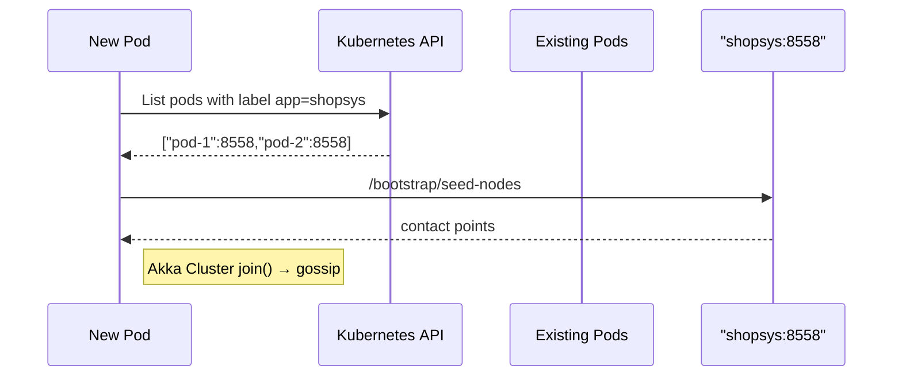
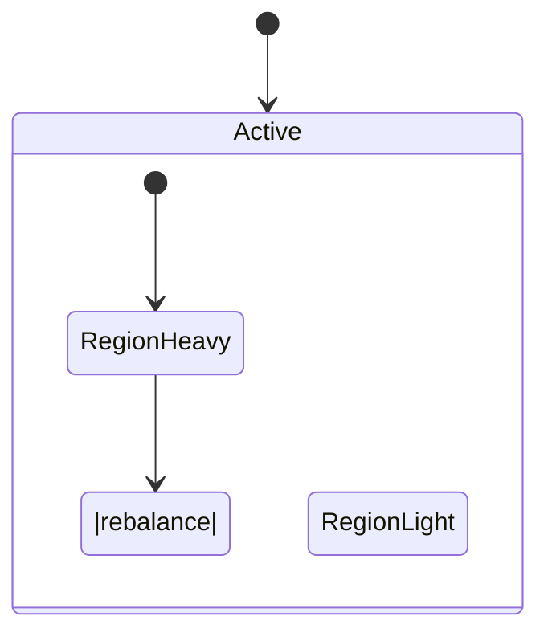

# Akka Cluster — Ultra‑Deep Dive (v3, 19 Jun 2025)

*A single reference document collating every Q&A detail to date, plus extra context, diagrams, and production‑grade snippets.*

---

## 0  Scope of This Doc

* Cluster formation & discovery paths (static seeds, Kubernetes Bootstrap, ECS/Fargate).  
* In‑depth review of transport (**Artery** TCP vs. Aeron‑UDP) and serialization.  
* Gossip & failure‑detection maths, tuning pitfalls.  
* Split‑brain theories & real‑world SBR configs.  
* Sharding architecture — coordinators, remembered entities, rebalance internals.  
* Observability stack: metrics, logging, tracing, chaos testing.  
* Security (TLS, mTLS, ACL) and performance tuning.  
* Cheat‑sheets & interview “white‑board quick wins.”

---

## 1  Cluster Discovery & Seed Nodes

### 1.1  Static Seed List (VM / bare‑metal)

```hocon
akka.cluster.seed-nodes = [
  "akka://ShopSys@10.0.0.11:25520",
  "akka://ShopSys@10.0.0.12:25520",
  "akka://ShopSys@10.0.0.13:25520"
]
akka.cluster {
  downing-provider-class = "akka.cluster.sbr.SplitBrainResolverProvider"
  shutdown-after-unsuccessful-join-seed-nodes = 30s
}
```

*Rule of Thumb* – **≥ 3 seeds** (odd) to maintain majority if one dies.

### 1.2  Cluster Bootstrap on Kubernetes

Flow diagram (simplified):



Key config knobs:

```hocon
akka.management.cluster.bootstrap {
  contact-point-discovery {
    # SRV lookup -> _shopsys-bootstrap._tcp.namespace.svc.cluster.local
    discovery-method = kubernetes-api
    service-name     = "shopsys-bootstrap"
    required-contact-point-nr = 3
  }
  new-cluster-enabled  = on
  downing-strategy     = "akka.cluster.sbr"  # piggyback on SBR
}
```

### 1.3  AWS ECS / Fargate

* Use **AWS Cloud Map** via `akka-discovery-aws-api` or DNS SRV.  
* IAM‑role credentials retrieved through the default provider chain.

---

## 2  Transport Layer — `akka.remote.artery`

| Feature | TCP (default) | Aeron UDP |
|---------|---------------|-----------|
| **Pros** | Works with firewalls, no extra deps. | Lower latency, zero‑copy, multicast option. |
| **Cons** | Head‑of‑line blocking under loss. | Needs extra port range; NAT unfriendly. |
| **Choose When** | Generic K8s clusters, load‑balancers. | Latency‑critical systems on bare‑metal or EC2 placement groups. |

### 2.1  Serialization & Compression

```hocon
akka.actor.serialization-bindings {
  "com.example.MyMsg" = jackson-cbor   # zero schema evolution pain
}
akka.remote.artery.advanced {
  compression {
    enabled = on
    advertise-interval = 3 s
    dictionary.max-size = 512          # per peer
  }
}
```

*Tip:* keep message payloads idempotent & immutable; follow **“schema‑first”** via protobuf or Avro when possible.

---

## 3  Gossip in Detail

Mathematical convergence:

```
Expected rounds ≈ log₂(N) + k
N = node count
k ≈ 5 to tolerate dropped packets
```

### 3.1  Tuning Table

| Property | Default | Notes |
|----------|---------|-------|
| `gossip-interval` | 1 s | Lower for faster failover (< 50 nodes). |
| `gossip-max-dissemination` | 4 | Caps how many peers each node fans to. |
| `failure-detector.*` | see docs | `threshold` 8 → mark after ≈ 40s of heartbeat silence at default timings. |

> **Rule:** Decrease `threshold` only if networking is stable (< 10 ms jitter).

---

## 4  Split‑Brain Resolver (SBR) — Real Configs

### 4.1  Majority (one DC)

```hocon
akka.cluster.sbr {
  down-all-on-uncertain-state = on
  active-strategy = "static-quorum"
  static-quorum {
    size = 3        # 3 surviving nodes minimum
    role = backend  # optional filter
  }
}
```

### 4.2  Keep Oldest (multi‑DC hot–standby)

```hocon
akka.cluster.sbr.active-strategy = keep-oldest
akka.cluster.sbr.keep-oldest.down-if-alone      = on
akka.cluster.sbr.keep-oldest.role               = control-plane
```

*Pattern*: run “control‑plane” seeds only in **DC‑A**; DC‑B relinquishes if link is cut.

---

## 5  Sharding Internals

```
Entity  ---[msg]---> Region ----> Shard ----> Entity Actor
                      ▲             ▲
              Coordinator <--- Rebalance Worker
```

### 5.1  Remembered Entities Modes

| Mode | Use‑Case | Storage |
|------|----------|---------|
| **`on`** | Stateful services needing automatic restart. | Akka Persistence (Cassandra, JDBC). |
| **`store`** | Same as `on` but *only* persists stop/start events (lighter). | Persistence. |
| **`off`** | Stateless/high‑volume. | None. |

```scala
Entity(TypeKey)(ctx => OrderBehavior(ctx.entityId))
  .withRememberEntities(true)
```

### 5.2  Rebalance Logic

1. Coordinator computes shard load distribution.  
2. Picks *n* shards (> `rebalanceThreshold`) to move off the heaviest region.  
3. Creates **RebalanceWorker** actors that send `BeginHandOff` to old region.  
4. Old region stops shard, confirms; messages buffered.  
5. New region starts shard, replays state, flushes buffer.  

Visualization (Mermaid):



---

## 6  Persistence & Projections

### 6.1  Choosing a Journal

| Backend | Latency | Footprint | Cloud‑native? |
|---------|---------|-----------|---------------|
| Cassandra | ~2 ms p99 | Heavy | Yes (Keyspaces). |
| JDBC (Postgres) | ~3–10 ms | Medium | Yes (RDS). |
| Spanner | ~10 ms | Light | GCP only. |

```hocon
akka.persistence.jdbc {
  slick.profile = "slick.jdbc.PostgresProfile$"
  connection-pool = "HikariCP"
  offset-store.start-from = "2024-01-01T00:00:00Z"
}
```

### 6.2  Akka Projection Example

```scala
Projection
  .atLeastOnce (
     sourceProvider = ShardedDaemonProcess(system).typedSourceProvider(tag),
     handler        = () => new OrdersToElasticHandler(elasticClient)
  )
  .withRestartBackoff(1.second, 30.seconds, 0.2)
```

---

## 7  Security Hardening

* **TLS intra‑cluster**:

  ```hocon
  akka.remote.artery.ssl {
    enabled = on
    trust-manager = "path/to/ca.pem"
    key-manager   = "path/to/node-keystore.p12"
  }
  ```

* Use **mTLS** plus **network policies** in K8s to block cross‑namespace traffic.  
* Set `akka.cluster.allow-unsafe-remote-features = off` in production.

---

## 8  Observability & Chaos

### 8.1  Metrics Pipeline

1. **Micrometer** registry: `akka.actor.typed` mailbox size, `akka.cluster` reachability.  
2. Export Prometheus `/metrics` via Akka HTTP route.  
3. Grafana dashboard panels: *Shard Distribution*, *Unreachable Count*, *SBR Down Events*.

### 8.2  Chaos Toolkit

* `kubectl taint node ...` to simulate node loss.  
* `toxiproxy` side‑cars → inject 500 ms latency jitter.  
* Validate SBR by running **network partition** injection and ensuring only majority side stays alive.

---

## 9  Performance & GC

| Goal | Knob | Typical Value |
|------|------|---------------|
| Low jitter | `-XX:+UseZGC` | sub‑millisecond pauses at cost of RAM. |
| Heap size | `JAVA_TOOL_OPTIONS` | Keep ≤ 50 % of node RAM to avoid eviction. |
| Serialization | `akka.actor.serializers` | Prefer Jackson Cbor / Protobuf with compression. |

*Enable **GC logging** → push to Loki → Grafana Alerts on > 100 ms pause.*

---

## 10  Troubleshooting Playbook

1. **Node stuck at “Joining”**  
   *Check seeds reachable; look for port 25520 blocked by NetworkPolicy.*

2. **Frequent Unreachable → Reachable flaps**  
   *Increase `gossip-interval` to 1.5 s or raise `threshold` to 10.*

3. **Shard “stuck migrating”**  
   *Search logs for `RebalanceWorker` timeouts, verify persistence backend IOPS.*

4. **SBR downing whole cluster**  
   *Mismatch between `expected-cluster-size` and actual node count; adjust or use `keep-oldest`.*

---

## 11  Interview “Flash Cards”

* *Define Phi‑Accrual and derive why `phi = -log10(p)`.*  
* Draw **seed discovery** on K8s whiteboard: SRV lookup → HTTP seed list → join.  
* Explain why Artery TCP chooses `bytebuf` pooling to cut GC.  
* Compare **Cluster Singleton** vs. DB row lock vs. ZooKeeper leader election.  
* Outline a migration path from **Akka 2.6 → Apache Pekko 1.x** (namespace swap, artifacts).

---

*Compiled by Yurii Mysak, 19 Jun 2025. Share freely under CC BY‑SA 4.0.*  
