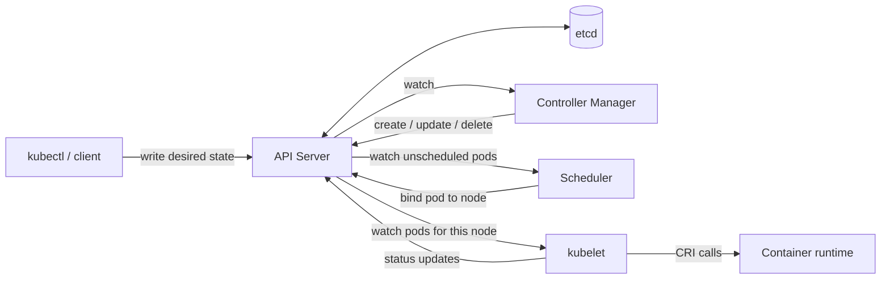

# Kubernetes: The Object Model

> **Priority:** Required
> **Est. time:** 45 min
> **Track:** Both
> **HelloInterview:** none

Kubernetes is not a set of nouns to memorize — it is one idea (declare desired state, let a
control loop converge reality toward it) applied to about a dozen object kinds. This file builds
the object model around that idea, because "why does Kubernetes do X" almost always reduces to
"because the controller is reconciling desired vs. actual state." The operational failure modes
that follow from getting these objects wrong are in [Kubernetes Operations](kubernetes-operations.md);
the on-call commands for diagnosing them are in
[Kubernetes Debugging Playbook](kubernetes-debugging-playbook.md).

---

## 1 · The Desired-State Model (Read This First)

Every object you create — a Deployment, a Service, a ConfigMap — is a **declaration**, written to
`etcd` via the API server. Kubernetes never executes your `kubectl apply` as a one-shot imperative
command. Instead, a population of **controllers**, each responsible for one kind of object, run an
infinite loop:

1. **Observe** current state (via a watch on the API server, not polling).
2. **Compare** it to desired state (the spec you wrote).
3. **Act** — create, update, or delete objects to close the gap.
4. Repeat forever, regardless of *why* the gap appeared (you scaled it, a node died, someone
   `kubectl edit`-ed a resource live, a rollout is mid-flight).

This is **level-triggered**, not **edge-triggered**: a controller doesn't care about the sequence
of events that produced the current state, only the current diff. That's what makes it self-healing
— a controller that crashed and restarted just re-reads current-vs-desired and picks up exactly
where any other instance would, with no event history to replay or lose.

| Component | Role |
|---|---|
| **API server** | Stateless front door; validates and persists objects to etcd; the only thing that talks to etcd directly. |
| **etcd** | Distributed, strongly-consistent key-value store; the entire cluster state lives here — cross-link [CAP & Consistency](../06-databases-and-distributed-data/CAP_Consistency.md), etcd is a Raft-backed CP system by design. |
| **Scheduler** | Watches for Pods with no assigned node, picks one (filter + score, see [Kubernetes Operations](kubernetes-operations.md)), writes the binding back to the API server. |
| **Controller manager** | Runs the built-in reconciliation loops (Deployment, ReplicaSet, Node, etc.), one control loop per controller. |
| **kubelet** | Node agent; watches for Pods bound to its node, calls the container runtime via CRI to actually run them, reports status back. |
| **kube-proxy** | Programs each node's packet-forwarding rules (iptables/IPVS) so Service virtual IPs resolve to real Pod IPs. |

Everything below is a variation on "which controller, watching which object kind, reconciling what."

---

## 2 · Pods

- The **atomic unit of scheduling** — not "a container." A Pod is a shared Linux network namespace
  and IPC namespace (see [Docker & Containers](docker-and-containers.md) for what a namespace
  actually is) that one or more containers run inside, so containers in the same Pod share
  `localhost` and can talk to each other without going through a Service at all.
- A hidden **pause/infra container** owns that shared network namespace for the Pod's lifetime; app
  containers attach to it. This is why a Pod's IP outlives individual container restarts within it.
- **Pods are mortal.** A bare Pod, once it dies, is gone — nothing recreates it. Every higher-level
  object below exists specifically to give Pods a lifecycle policy.
- **Init containers** run to completion, in order, before any app container starts — for one-time
  setup (schema migration, waiting on a dependency) that shouldn't be retried on every restart of
  the main container.
- Multi-container Pods are a deliberate pattern, not an accident: **sidecar** (a proxy alongside the
  app — the Envoy sidecar in [Service Mesh & Envoy](service-mesh-and-envoy.md) is the canonical
  example), **ambassador** (proxy outbound connections), **adapter** (normalize the app's output for
  some external system, e.g. a log or metrics shipper).

---

## 3 · ReplicaSets & Deployments

- **ReplicaSet**: "keep exactly N Pods matching this label selector alive." That's the entire job —
  count Pods matching the selector, create or delete until the count matches `replicas`.
- **Deployment**: manages ReplicaSets and adds rollout mechanics. Changing a Deployment's Pod
  template creates a **new** ReplicaSet and scales it up while scaling the old one down according to
  the update strategy — see [Kubernetes Operations](kubernetes-operations.md) for `maxSurge` /
  `maxUnavailable` and rollback.
- Old ReplicaSets are kept, scaled to zero, up to `revisionHistoryLimit` — that's what
  `kubectl rollout undo` actually rolls back to: an existing, already-defined ReplicaSet, not a
  recomputed diff.
- **Ownership**: `ownerReferences` chains Pod → ReplicaSet → Deployment. Delete the Deployment and
  the garbage collector cascades the delete down the chain. You almost never create a ReplicaSet
  directly — it exists as a Deployment implementation detail you'll recognize when debugging
  (`kubectl get rs` showing several old, zero-replica ReplicaSets is normal, not a leak).

---

## 4 · StatefulSets

For workloads that need an identity, not just a count:

- **Stable network identity**: Pods are named `<name>-0`, `<name>-1`, ... deterministically, not
  randomly, and keep that name across reschedules.
- **Stable storage**: `volumeClaimTemplates` gives each ordinal its own PersistentVolumeClaim, which
  is re-attached to the same ordinal (not a random one) if that Pod is rescheduled. Scaling down does
  **not** delete the PVC — data survival is the point, deletion is a deliberate separate action.
- **Ordered lifecycle**: Pods start 0, 1, 2, ... in order (each must be Running and Ready before the
  next starts) and terminate in reverse — required for anything that bootstraps or elects a leader
  off ordinal/identity.
- Requires a **headless Service** (`clusterIP: None`) to hand out per-Pod DNS:
  `<pod>.<service>.<namespace>.svc.cluster.local` — see Services below.

The stable-identity problem StatefulSets solve is the same one you already have deep intuition for:
Kafka broker IDs, Cassandra tokens, any quorum-based system that cares which specific member it's
talking to. See [Kafka Fundamentals](../07-messaging-and-streaming/Messaging-kafka_fundamentals.md)
for the distributed-systems side of exactly this problem.

---

## 5 · DaemonSets

- Exactly **one Pod per matching node**, automatically added when a node joins and removed when it
  leaves — no replica count to set, the node population *is* the count.
- Canonical uses: CNI plugins, CSI node plugins, log shippers, node-level metrics exporters, and
  `kube-proxy` itself is commonly run this way.
- Bypasses the normal scheduler spreading logic entirely — a DaemonSet doesn't compete for "which
  node is best," it targets "all nodes matching this selector," full stop.

---

## 6 · Jobs & CronJobs

- **Job**: run-to-completion, not restart-forever. `completions` (successful completions needed),
  `parallelism` (how many run concurrently), `backoffLimit` (retries before the Job is marked
  failed), `activeDeadlineSeconds` (hard wall-clock cap).
- **CronJob**: schedules Jobs on a cron expression. `concurrencyPolicy` (`Allow` / `Forbid` /
  `Replace`) decides what happens if the previous run hasn't finished when the next is due —
  `Allow` silently overlapping runs is a frequent source of duplicate-processing bugs.
- Lyft's own workflow orchestrator for data/ML pipelines (Flyte) is built on this same base
  primitive — pods scheduled and tracked to completion — even though you'd interact with Flyte's own
  API layer above it, not hand-write the Job YAML.

---

## 7 · Services

A **stable virtual IP + DNS name** in front of a mutable set of Pods, selected by label selector.

| Type | Mechanism | Reachable from |
|---|---|---|
| **ClusterIP** (default) | kube-proxy programs iptables/IPVS DNAT rules — no proxy process on the data path, just packet rewriting to a backing Pod IP | Inside the cluster only |
| **NodePort** | ClusterIP + the same port opened on every node (30000–32767), DNATed to the ClusterIP | Any node's IP, from outside |
| **LoadBalancer** | NodePort + a cloud-provider controller provisions an external L4 load balancer pointing at it | Outside the cluster, via the LB's address |
| **Headless** (`clusterIP: None`) | No virtual IP at all; DNS returns every backing Pod IP directly | Clients that want to load-balance themselves |

- A `type: LoadBalancer` Service on AWS is exactly the `aws_lb` / target-group resource you'd
  otherwise hand-write in Terraform — see [Terraform & AWS](terraform_aws_overview.md); the AWS
  cloud-controller-manager is what actually calls the AWS API on the Service's behalf.
- Headless Services matter beyond StatefulSets: a gRPC client that resolves every backend IP and
  load-balances client-side (common at a heavy-gRPC shop) needs the raw Pod IP list, not a single
  VIP that would defeat per-connection balancing — a real reason a Python/gRPC service might
  deliberately choose headless over ClusterIP.
- **Endpoints / EndpointSlices**: the actual, currently-Ready list of `Pod IP:port` pairs a Service
  resolves to right now. This is a separate object from the Service on purpose — it's what you
  inspect first when "the Service exists but nothing answers" (see
  [Kubernetes Debugging Playbook](kubernetes-debugging-playbook.md)).

---

## 8 · Ingress

- L7 (HTTP/HTTPS) routing **into** the cluster: host- and path-based rules mapping to backend
  Services, plus TLS termination.
- The `Ingress` object is only a spec. An **Ingress controller** (nginx-ingress, the AWS Load
  Balancer Controller, Envoy-based Contour) is the separate thing that watches Ingress objects and
  actually programs a proxy or a cloud load balancer to match.
- The newer **Gateway API** is the intended successor — it splits the single Ingress object into
  separate infra-owner and route-owner resources — worth knowing the name exists even though most
  running clusters you'll see still use plain Ingress.
- Ingress is **north-south** traffic (outside → in); it does not touch service-to-service traffic
  inside the cluster — that's the mesh's job, see
  [Service Mesh & Envoy](service-mesh-and-envoy.md#3--envoy-and-why-this-is-lyft-specific-context).
  For the reverse-proxy mechanics underneath any Ingress controller, see
  [Routing & Reverse Proxies](../10-networking/Networking-Routing-Reverse-Proxy.md).

---

## 9 · ConfigMaps & Secrets

- Decouple configuration from the image — the twelve-factor rule, elaborated for a real Python
  service in [Deploying Python Services](deploying-python-services.md#5--twelve-factor-config).
- Consumed as env vars (a **snapshot** taken once at container start, never updates live) or as a
  mounted volume (files the kubelet keeps in sync; the app must watch and reload, nothing does that
  for it automatically).
- **A Secret is base64, not encrypted.** By default it's stored in etcd only encoded, not encrypted
  — anyone with etcd read access or API access to the Secret object has the plaintext. Real
  protection requires etcd encryption-at-rest configuration or an external secret store; this is one
  of the most commonly assumed-wrong facts about Kubernetes.
- `immutable: true` on a ConfigMap/Secret stops the kubelet from watching it for changes (a real
  performance win at scale) and forces a genuinely new object + rollout on any change, instead of
  silent in-place drift no one notices.

---

## 10 · Namespaces

- A logical partition of one cluster: name scoping (two Deployments can both be named `api` in
  different namespaces), the RBAC boundary, and the boundary `ResourceQuota` / `LimitRange` apply to.
- **Not a network isolation boundary by default.** A Pod in `namespace-a` can reach a Pod in
  `namespace-b` unless a `NetworkPolicy` explicitly restricts it — namespaces organize humans and
  quotas, they don't sandbox traffic on their own.

---

## 11 · Object Model Summary

| Kind | Manages | Stable identity | Typical use |
|---|---|---|---|
| Pod | container(s) | No | The unit everything else wraps |
| ReplicaSet | Pods (by count) | No | Deployment implementation detail |
| Deployment | ReplicaSets | No | Stateless services |
| StatefulSet | Pods + PVCs | Yes | Databases, brokers, anything quorum-based |
| DaemonSet | one Pod/node | N/A | Node agents |
| Job | run-to-completion Pods | No | Batch / one-off tasks |
| CronJob | Jobs | No | Scheduled batch |
| Service | virtual IP → Pods | Yes (the VIP) | Stable access point |
| Ingress | L7 routes → Services | N/A | External HTTP entry point |

---

## Interview questions

1. **What actually happens between `kubectl apply` and a Pod running?**
   API server validates and writes the object to etcd; the relevant controller's watch fires and it
   reconciles (e.g. Deployment creates/updates a ReplicaSet, which creates Pods); the scheduler
   watches for unscheduled Pods and binds one to a node; that node's kubelet watches for Pods bound
   to it and calls the container runtime via CRI to actually start it.

2. **Why does Kubernetes use a reconciliation loop instead of executing commands directly?**
   Level-triggered convergence is self-healing and idempotent by construction — a controller that
   crashes and restarts just re-reads current-vs-desired state with no event history to replay, and
   any change to actual state (a node dying, someone editing a resource by hand) gets corrected the
   same way regardless of cause.

3. **Deployment vs. StatefulSet — what breaks if you use the wrong one?**
   A Deployment gives Pods random names/IPs and no per-replica storage identity — put a
   quorum-based store behind one and replicas can't reliably find "themselves" across restarts.
   A StatefulSet's ordered, one-at-a-time rollout is unnecessarily slow and rigid for a stateless
   API server that doesn't need it.

4. **Is a Kubernetes Secret actually secret?**
   No — by default it's base64-encoded in etcd, which is encoding, not encryption. Anyone with etcd
   or API read access sees plaintext. Real protection needs etcd encryption-at-rest or an external
   secret manager (e.g. AWS Secrets Manager/Vault, injected rather than stored as a native Secret).

5. **ClusterIP vs. NodePort vs. LoadBalancer vs. headless — when do you use each?**
   ClusterIP for internal-only service-to-service traffic (the default); NodePort mainly as a
   building block or for on-prem clusters without a cloud LB integration; LoadBalancer for real
   external entry points on a cloud provider; headless when clients need the raw Pod IP list —
   StatefulSets, or client-side load-balancing gRPC clients.

6. **Why do Endpoints/EndpointSlices exist as separate objects instead of Services listing Pod IPs directly?**
   It decouples "which Pods currently match and are Ready" (a fast-changing, controller-maintained
   fact) from the Service's own stable spec, supports headless Services and manually-managed
   endpoints, and — for EndpointSlices specifically — splits very large backend sets into multiple
   objects instead of one that grows unbounded.

7. **Why can't you edit most fields of a running Pod in place?**
   Pods are meant to be disposable and replaced, not mutated — the higher-level controller
   (Deployment, StatefulSet) owns the desired template; you change the template and let the
   controller create replacement Pods, rather than hand-patching a live one that the controller would
   likely just reconcile back anyway.

8. **What does a `type: LoadBalancer` Service actually create on AWS?**
   The AWS cloud-controller-manager watches for it and calls the AWS API to provision a real load
   balancer (NLB for L4) with a target group pointed at the Service's NodePort — the same resource
   you'd otherwise define directly in Terraform.
