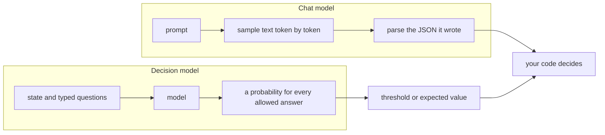
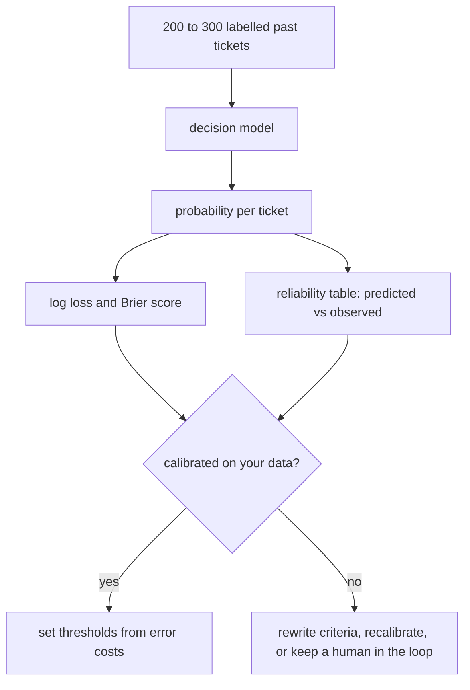

# Decision models: when an LLM answers with probabilities, not text

> Source: IT Iaido lesson 2026-10-05-2 · Fresh · AI / ML foundations · Intermediate · passed on 2026-10-05

> Fresh · AI / ML foundations · Intermediate · ~30 min · from today's feeds

## Why this matters
"Decision models" are a new kind of LLM API: you send text plus typed questions and get back a probability for every allowed answer instead of generated text.

TypeSafe AI's Jev opened the category (written up by Simon Willison on 2026-09-21), and Cloudflare shipped its own open-weight pair, Clef and Clef-flash, on Workers AI on 2026-10-01 (Cloudflare changelog, 2026-10-01).

It is today's core lesson in production clothes — a model that answers in probabilities is only as useful as those probabilities are on *your* data — and you already have the use cases: operator ticket triage, refund detection, agent guardrails, routing.

## Primer
This item previews rungs 09 (logistic regression), 32 (calibration), 33 (Jev) and 34 (Clef) of your AI/ML ladder; you are on rung 01. Three ideas carry you through it.

**Scores become probabilities.** A classifier computes one raw score (a *logit*) per allowed answer, then softmax turns the scores into probabilities that are positive and sum to 1: p_k = exp(z_k) / Σ_j exp(z_j). For a yes/no question this is the sigmoid (rung 09, "Logistic regression: from scores to probabilities"). A chat LLM does exactly this over its whole vocabulary at every step, then *samples* one token and moves on.

**A loss for probabilities.** Today's core lesson scored numeric predictions with MAE and MSE (IT Iaido 2026-10-05-1, "What machine learning actually optimises"). For classes the standard loss is *log loss*: an example costs −ln(probability given to the correct answer). Being 0.99 sure and right costs 0.01; being 0.99 sure and wrong costs ln(100) ≈ 4.6. Because confident mistakes are punished so hard, log loss rewards honest probabilities; so does the *Brier score*, the mean squared error between the predicted probability and the 0/1 truth. Both are "proper scoring rules" (rung 32).

**Calibration.** A model is calibrated when, among all the cases it scores 0.8, about 80% turn out true. Accuracy and calibration are different properties: two models can be right equally often while one of them is badly overconfident. Like generalisation in the core lesson, calibration is measured on held-out labelled data, never assumed.

## The idea

### The contract changes
A chat model's contract is "prompt in, sampled text out". When you use one as a classifier, you ask for JSON, parse it, retry on garbage, and any `"confidence": 0.9` it writes is just more sampled text, not a measurement. A decision model drops the text step:

> "Jev is an interesting variant on the usual LLM format: it still accepts text inputs, but instead of text output it returns floating point numbers corresponding to categories, yes/no questions, ratings, and associated confidence scores."
> — Simon Willison, *Jev introduces a new shape of LLM—System One, aka Decision Models*, 2026-09-21, https://simonwillison.net/2026/Sep/21/jev/

TypeSafe's own one-liner, which Willison quotes in the same post, is "unstructured state in, typed probabilistic decisions out". "System One" borrows Kahneman's name for the fast, automatic mode of thinking, as opposed to the slow, deliberate System 2 (Kahneman, *Thinking, Fast and Slow*, Part I, ch. 1 "The Characters of the Story"): a judgement, not a chain of reasoning.

Cloudflare's Clef makes the contract explicit with three question types, each defined by what it returns:

> "noul: A yes/no question. Returns the probability that the answer is yes." "choice: Pick one option from a set you define. Returns the chosen option, a probability per option, and a confidence value." "score: Rate against an ordered rubric. Returns a probability-weighted score and a probability per level."
> — Cloudflare, *Introducing Clef: Cloudflare's first open-source decision models, now on Workers AI*, 2026-10-01, https://developers.cloudflare.com/changelog/post/2026-10-01-clef-workers-ai/

Because the questions are typed, so are the answers: you cannot get back an option you did not list, and there is nothing to parse.



Neither vendor's post explains how the probabilities are produced inside the model, so treat the internals as a black box. What you can reason about is the output, because it must obey the Primer's rules: one probability per allowed answer, summing to 1.

### Reading a real response
Flavio Copes' walkthrough sends Clef-flash a single ticket — "The export button crashes the settings page in Safari…" — with three questions, and shows the response (Copes, *A deep dive into Clef*, 2026-10-01):

- `category` (choice): bug_report 0.9664, feature_request 0.0135, billing 0.0058, other 0.0143; `confidence` 0.9126.
- `severity` (score on a rubric 0 cosmetic, 1 workaround exists, 2 blocking): probabilities 0.0636, 0.766, 0.1704; `score` 1.1069; `confidence` 0.4298.
- `has_repro_steps` (noul): 0.5355.
- `usage`: 395 input tokens, 0 output tokens.

Three things to notice. First, `score` is the expected rubric level: 0×0.0636 + 1×0.766 + 2×0.1704 = 1.1068, equal to the shown 1.1069 up to rounding of the displayed probabilities — a point estimate with the spread behind it. Second, 0.5355 on repro steps is the model saying "I can't tell": the ticket names a browser but gives no steps. A chat model would have written "yes" or "no" and hidden the coin flip. Third, the `confidence` field is not defined in the sources I read. Both values match (Σp² − 1/K)/(1 − 1/K) to four decimals — 0 for a uniform spread over K answers, 1 for certainty — but that is my inference from two examples, not documented behaviour. You will recompute it in the lab.

### Probabilities hand the decision back to you

> "You pose a statement and get back a floating point number between 0 and 1 for how confident the model is that the statement is true."
> — Simon Willison, *Jev introduces a new shape of LLM—System One, aka Decision Models*, 2026-09-21, https://simonwillison.net/2026/Sep/21/jev/

Once the answer is a number, the policy lives in your code. Copes' Worker example sends a message to a human when the team choice's `confidence` is below 0.5 and pages on-call when the `urgent` probability is above 0.8 (Copes, 2026-10-01). Those thresholds are product decisions — what does a wrongly auto-approved refund cost, against an operator waiting an hour for a person? — and as Product Owner that trade-off is yours.

A threshold of 0.8 only works if 0.8 means "right about 80% of the time" on *your* traffic. That is the core lesson again: what counts is performance on unseen data from the distribution you will serve, and vendor numbers come from vendor data. So the first job with any decision model is an evaluation on your own labelled examples, scored with a proper loss, before a threshold ships:



### Cost, speed and the competition

> "Jev charges only for input—output is free—and the input price of their first model is $0.042 per million tokens—cheaper even than OpenAI's GPT-5 Nano ($0.05/million)."
> — Simon Willison, *Jev introduces a new shape of LLM—System One, aka Decision Models*, 2026-09-21, https://simonwillison.net/2026/Sep/21/jev/

Willison adds that questions are evaluated in parallel, so asking many takes about as long as asking one (Willison, 2026-09-21). Cloudflare reports median latency of 209.3 ms for Clef (27B parameters) and 38.8 ms for Clef-flash (9B) against 524.1 ms for Jev, and says Clef leads on 7 of 10 decision benchmarks; both have a 64K context and Apache 2.0 weights on Hugging Face (Cloudflare changelog, 2026-10-01). Copes cautions that those benchmarks are self-reported, that Jev does better on the reasoning-heavy ones, that Clef costs 2–6× more per token than Jev, and that image requests took 13–30 s on launch day (Copes, 2026-10-01). The shape is reaching local inference too: the Hugging Face blog index lists "New in llama.cpp: Decision Models" by ggml-org (Hugging Face blog, accessed 2026-10-05).

### When to reach for one

> "It's great for anything that can be expressed as a classification task—think spam detection, suggesting labels, prioritization and ranking."
> — Simon Willison, *Jev introduces a new shape of LLM—System One, aka Decision Models*, 2026-09-21, https://simonwillison.net/2026/Sep/21/jev/

For you that means triaging tickets from car-wash operators, flagging refund requests, guarding agents ("does this tool call touch payments?") and routing between agents or models. It is the wrong tool when you need text, an explanation, or an answer outside a closed set. And the category is two weeks old (Jev 2026-09-21, Clef 2026-10-01, sources below), so put it behind your own interface — a Scala `Decider` trait returning `Map[Answer, Double]` — and let an eval, not a launch post, pick the implementation.

## Lab
About 12 minutes; Python 3, standard library only.

**The question the lab answers:** can you check a decision model's numbers yourself? First you re-derive two fields of the real Clef response above; then you decide which of two refund detectors with the *same* accuracy you would trust behind an automatic threshold.

### Step 1 — re-derive `score` and `confidence` from the Clef response

Save as `clef_fields.py` and run `python3 clef_fields.py`.

```python
# Re-derive two fields of the sample Clef response (Copes, 2026-10-01)
sev = {0: 0.0636, 1: 0.766, 2: 0.1704}   # severity rubric level -> probability
cat = [0.9664, 0.0135, 0.0058, 0.0143]    # bug_report, feature_request, billing, other

print("level  p       level*p")
for k, p in sev.items():
    print(f"{k:5}  {p:.4f}  {k * p:.4f}")
print("score =", round(sum(k * p for k, p in sev.items()), 4), "  (response shows 1.1069)")

def peakedness(name, ps):   # my guess at `confidence`: 0 = uniform, 1 = certain
    k = len(ps)
    sq = sum(p * p for p in ps)
    print(f"{name}: K={k}  sum p^2={sq:.4f}  1/K={1 / k:.4f}  confidence={(sq - 1 / k) / (1 - 1 / k):.4f}")

peakedness("severity", list(sev.values()))   # response shows 0.4298
peakedness("category", cat)                  # response shows 0.9126
```

### Reading the output (Step 1)

```text
level  p       level*p
    0  0.0636  0.0000
    1  0.7660  0.7660
    2  0.1704  0.3408
score = 1.1068   (response shows 1.1069)
severity: K=3  sum p^2=0.6198  1/K=0.3333  confidence=0.4298
category: K=4  sum p^2=0.9343  1/K=0.2500  confidence=0.9125
```

**The score block.** Each row is one level of the severity rubric (0 cosmetic, 1 workaround exists, 2 blocking).

| column | meaning | better is… |
|---|---|---|
| `p` | the probability Clef gave that level, copied from the response; the three add up to 1 | not a quality measure — it is the model's answer |
| `level*p` | that level's contribution to the score | — |
| `score` | the sum of the `level*p` column: the expected severity | neither: it is a position on the 0–2 scale, not a grade |

Trace: 0 × 0.0636 = 0; 1 × 0.766 = 0.766; 2 × 0.1704 = 0.3408; 0 + 0.766 + 0.3408 = **1.1068**. The response shows 1.1069 because the probabilities it displays are rounded to four digits. Read 1.1068 as "most likely *workaround exists*, leaning a little towards *blocking*".

**The confidence lines.** They test the formula from "Reading a real response", (Σp² − 1/K)/(1 − 1/K).

| field | meaning |
|---|---|
| `K` | how many answers were allowed (3 severity levels, 4 categories) |
| `sum p^2` | square each probability and add them up; it is 1 when one answer has all the probability and 1/K when the probability is spread evenly |
| `1/K` | that even-spread floor |
| `confidence` | `sum p^2` rescaled so that an even spread gives 0 and certainty gives 1; **higher means more peaked**, which is not the same as more correct |

Trace for severity: 0.0636² + 0.766² + 0.1704² = 0.00404 + 0.58676 + 0.02904 = 0.61984; then (0.61984 − 0.33333) / (1 − 0.33333) = 0.28651 / 0.66667 = **0.4298**, the response's value. For category: 0.93435 − 0.25 = 0.68435; 0.68435 / 0.75 = **0.9125** against the response's 0.9126 (display rounding again).

**Verdict:** both fields reproduce. `score` is the probability-weighted average level, and the peakedness formula hits both `confidence` values to within 0.0001. That is still my inference from two examples, not documented behaviour, and by construction the formula measures only how spread out the probabilities are. So read `confidence` as "how decided the model is", never as "how likely it is to be right on your data".

### Step 2 — two refund detectors, scored message by message

Two models answer "Does this message ask for a refund?" on 10 labelled operator messages (toy numbers invented for this drill). Both land on the right side of 0.5 for the same 9 messages and both miss message 10, a real refund request. The difference is only how sure they are. Two scores measure that, one sentence each:

- **Log loss:** for each message take the probability the model gave to what actually happened, compute −ln of it, and average over messages; **lower is better**, and 0 would mean probability 1 on every true answer.
- **Brier score:** for each message compute (probability − truth)², with truth 1 for a refund and 0 for not, and average; **lower is better**, 0 is perfect, and always answering 0.5 scores 0.25.

Save as `refund_lab.py` and run `python3 refund_lab.py`.

```python
import math

# "Does this message ask for a refund?" on 10 labelled operator messages
# (toy numbers invented for this drill). truth: 1 = refund, 0 = not
y      = [1,    1,    1,    1,    1,    0,    0,    0,    0,    1]
honest = [0.9,  0.8,  0.7,  0.9,  0.6,  0.2,  0.1,  0.3,  0.2,  0.4]
cocky  = [0.99, 0.99, 0.99, 0.99, 0.99, 0.01, 0.01, 0.01, 0.01, 0.01]

def logloss(p, t): return -math.log(p if t == 1 else 1 - p)  # -ln(prob. given to the truth)
def brier(p, t):   return (p - t) ** 2                       # squared distance from 0/1 truth

print("msg truth | honest p  logL  brier | cocky p  logL  brier")
for i, (t, ph, pc) in enumerate(zip(y, honest, cocky), 1):
    print(f"{i:3} {t:5} | {ph:8.2f} {logloss(ph, t):5.3f} {brier(ph, t):6.3f}"
          f" | {pc:7.2f} {logloss(pc, t):5.3f} {brier(pc, t):6.3f}")

for name, ps in [("honest", honest), ("cocky", cocky)]:
    n = len(y)
    acc = sum((p >= 0.5) == (t == 1) for p, t in zip(ps, y)) / n
    print(f"{name:7} accuracy={acc:.2f}  log_loss={sum(map(logloss, ps, y)) / n:.3f}"
          f"  brier={sum(map(brier, ps, y)) / n:.3f}")
```

### Reading the output (Step 2)

| column | meaning | better is… |
|---|---|---|
| `msg`, `truth` | message number; 1 = really a refund request, 0 = not | — |
| `honest p`, `cocky p` | each model's probability that the message is a refund | — |
| `logL` | this message's log-loss cost: −ln(p) if truth is 1, −ln(1 − p) if truth is 0 | lower |
| `brier` | this message's Brier cost, (p − truth)² | lower |
| `accuracy` | share of messages where "p ≥ 0.5" agrees with the truth | higher |
| `log_loss`, `brier` (last two lines) | the averages of the `logL` and `brier` columns | lower |

The per-message output:

| msg | truth | honest p | logL | brier | cocky p | logL | brier |
|---:|---:|---:|---:|---:|---:|---:|---:|
| 1 | 1 | 0.90 | 0.105 | 0.010 | 0.99 | 0.010 | 0.000 |
| 2 | 1 | 0.80 | 0.223 | 0.040 | 0.99 | 0.010 | 0.000 |
| 3 | 1 | 0.70 | 0.357 | 0.090 | 0.99 | 0.010 | 0.000 |
| 4 | 1 | 0.90 | 0.105 | 0.010 | 0.99 | 0.010 | 0.000 |
| 5 | 1 | 0.60 | 0.511 | 0.160 | 0.99 | 0.010 | 0.000 |
| 6 | 0 | 0.20 | 0.223 | 0.040 | 0.01 | 0.010 | 0.000 |
| 7 | 0 | 0.10 | 0.105 | 0.010 | 0.01 | 0.010 | 0.000 |
| 8 | 0 | 0.30 | 0.357 | 0.090 | 0.01 | 0.010 | 0.000 |
| 9 | 0 | 0.20 | 0.223 | 0.040 | 0.01 | 0.010 | 0.000 |
| 10 | 1 | 0.40 | 0.916 | 0.360 | 0.01 | 4.605 | 0.980 |

```text
honest  accuracy=0.90  log_loss=0.313  brier=0.085
cocky   accuracy=0.90  log_loss=0.470  brier=0.098
```

Trace three rows:
- **Message 1, honest:** truth 1, p = 0.90 → logL = −ln 0.90 = 0.105; brier = (0.90 − 1)² = 0.010.
- **Message 6, honest:** truth 0, so the probability given to the truth is 1 − 0.20 = 0.80 → logL = −ln 0.80 = 0.223; brier = (0.20 − 0)² = 0.040.
- **Message 10, cocky:** truth 1, p = 0.01 → logL = −ln 0.01 = 4.605; brier = (0.01 − 1)² = 0.980. (Cocky's other brier entries are 0.0001, shown rounded as 0.000.)

Trace the averages:
- honest log loss: 0.105 + 0.223 + 0.357 + 0.105 + 0.511 + 0.223 + 0.105 + 0.357 + 0.223 + 0.916 = 3.13 → / 10 = **0.313**
- cocky log loss: 9 × 0.01005 + 4.605 = 4.696 → / 10 = **0.470**, of which message 10 alone contributes 4.605 / 10 = 0.46
- honest Brier: 0.010 + 0.040 + 0.090 + 0.010 + 0.160 + 0.040 + 0.010 + 0.090 + 0.040 + 0.360 = 0.850 → / 10 = **0.085**
- cocky Brier: 9 × 0.0001 + 0.980 = 0.981 → / 10 = **0.098**

**Verdict:** accuracy ties at 0.90 and cannot separate the two. Log loss (0.313 against 0.470) and Brier (0.085 against 0.098) both say **honest is better**. Almost all of cocky's log loss comes from one message where it was 99% sure and wrong; Brier agrees but more gently, because one message can cost at most 1.0 in Brier while −ln p keeps growing as p approaches 0.

### Step 3 — the reliability table: does "said" match "observed"?

Add these lines to the end of `refund_lab.py` and run it again; the new lines print below the Step 2 output.

```python

print("\nmodel   bin       n  said  observed")
for name, ps in [("honest", honest), ("cocky", cocky)]:
    for label, lo, hi in [("p < 0.5", 0.0, 0.5), ("p >= 0.5", 0.5, 1.01)]:
        b = [(p, t) for p, t in zip(ps, y) if lo <= p < hi]
        said = sum(p for p, _ in b) / len(b)   # average probability the model gave
        saw = sum(t for _, t in b) / len(b)    # share that really were refunds
        print(f"{name:7} {label:8}  {len(b)}  {said:.2f}  {saw:.2f}")
```

### Reading the output (Step 3)

```text
model   bin       n  said  observed
honest  p < 0.5   5  0.24  0.20
honest  p >= 0.5  5  0.78  1.00
cocky   p < 0.5   5  0.01  0.20
cocky   p >= 0.5  5  0.99  1.00
```

| column | meaning |
|---|---|
| `bin` | messages grouped by the probability the model gave them |
| `n` | how many messages fell into the bin |
| `said` | the average probability the model gave inside the bin |
| `observed` | the share of those messages that really were refund requests |

A calibrated model has `said` ≈ `observed`, so **a smaller gap is better**. The direction of the gap matters too: *overconfident* means `said` is more extreme (closer to 0 or 1) than `observed`; *underconfident* means it is closer to 0.5.

Trace the low bin: it holds messages 6–10 for both models. Honest gave them 0.2, 0.1, 0.3, 0.2, 0.4 → said = 1.2 / 5 = 0.24; their truths are 0, 0, 0, 0, 1 → observed = 1 / 5 = 0.20. Cocky gave all five 0.01 → said = 0.01 against the same observed 0.20.

**Verdict:** cocky's low bin is off by 0.19 in the dangerous direction: it says "1 in 100 is a refund" where 1 in 5 was, which is overconfidence exactly where an auto-reject threshold would sit. Honest's largest gap is 0.22, in its high bin, but it is underconfident (says 0.78, observes 1.00): imperfect, not dangerous, because it costs you automation rather than wrong decisions. With five examples per bin this is a drill, not evidence.

### Cause → consequence

1. **Cause:** the cocky model pushes every answer to 0.01 or 0.99, however clear or ambiguous the message is.
2. **Mechanism:** accuracy only checks which side of 0.5 a probability falls on, so it cannot see this. Log loss charges −ln(probability given to the truth), which explodes as that probability nears 0 (−ln 0.01 = 4.6), and the reliability table shows "0.01" coming true 20% of the time.
3. **Consequence:** a threshold rule trusts the number as given. "Auto-reject when p < 0.05" rejects five messages under cocky, one of them (message 10) a real refund request; under honest it rejects none (its lowest p is 0.1) and the doubtful ones reach a person.
4. **What it means in practice:** when you compare Jev and Clef on your own operator tickets, rank them by log loss and Brier, not accuracy, and read the reliability bins around the threshold you plan to ship. A real check uses a few hundred labelled messages and looks hardest at the bins around your threshold.

### Optional, live (needs a Cloudflare account and a Workers AI API token)
The request shape below is adapted from Copes' example to a car-wash ticket; compare the `noul` and `probabilities` you get with your own judgement.

```bash
curl https://api.cloudflare.com/client/v4/accounts/$CLOUDFLARE_ACCOUNT_ID/ai/run/@cf/cloudflare/clef-flash \
  -X POST \
  -H "Authorization: Bearer $CLOUDFLARE_AUTH_TOKEN" \
  -d '{
    "model": "clef-flash",
    "state": { "message": "Bay 3 took the payment but the wash never started. Customer wants the money back." },
    "questions": {
      "refund": { "type": "noul", "instructions": "Does `message` ask for a refund?" },
      "area": {
        "type": "choice",
        "instructions": "Which area does `message` concern?",
        "criteria": {
          "payments": "Card terminal, charges, refunds",
          "hardware": "Wash equipment, sensors, gates",
          "software": "POS app, reports, configuration",
          "other": null
        }
      }
    }
  }'
```

## Self-check
1. Clef returns `noul: 0.54` for "Does the ticket include steps to reproduce?". What should your code do with it, and why is this more useful than a chat model answering "yes"? <details><summary>Answer</summary>Treat it as "unknown": it is below any sensible act-automatically threshold, so route the ticket to a person or ask the reporter for steps. A chat model would collapse the same uncertainty into a confident-looking token and hide that it was a coin flip. The number is only trustworthy if the model is calibrated on your tickets, which you check on labelled data.</details>
2. Two decision models score the same accuracy on 300 of your labelled refund messages, but model A has log loss 0.21 and model B 0.38. You plan to auto-approve refunds when p ≥ 0.9. Which do you pick, and what else do you check first? <details><summary>Answer</summary>Model A: with equal accuracy, the lower log loss means fewer confident mistakes, which is exactly what an auto-approve rule at 0.9 depends on. Before shipping, check the reliability table for the ≥ 0.9 bin specifically (does it observe roughly 90% or more true refunds?) and price the false approvals that remain against the cost of human review.</details>
3. Cloudflare reports Clef leading on 7 of 10 decision benchmarks and Clef-flash at 38.8 ms median latency (Cloudflare changelog, 2026-10-01). Why is that not enough to choose it for your platform, and what is the cheapest experiment that settles it? <details><summary>Answer</summary>The figures are vendor-reported on vendor data (Copes notes the benchmarks are self-reported and that Jev wins the reasoning-heavy ones), and the core lesson says what matters is performance on unseen data from your own distribution. Label 200–300 past operator tickets, ask Jev and Clef the same typed questions, and compare log loss, Brier score, the reliability table near your thresholds, latency and cost per thousand tickets.</details>

## Sources
- [Jev introduces a new shape of LLM—System One, aka Decision Models](https://simonwillison.net/2026/Sep/21/jev/) — Simon Willison, 2026-09-21 — the definition of the shape, TypeSafe's "state in, decisions out" line, the 0-to-1 yes/no output, input-only pricing, parallel questions, the classification fit; all four blockquotes (accessed 2026-10-05)
- [Introducing Clef: Cloudflare's first open-source decision models, now on Workers AI](https://developers.cloudflare.com/changelog/post/2026-10-01-clef-workers-ai/) — Cloudflare, 2026-10-01 — the noul/choice/score question types and what each returns, model sizes, context, licence, vendor latency and benchmark figures (accessed 2026-10-05)
- [A deep dive into Clef, Cloudflare's decision model](https://flaviocopes.com/clef/) — Flavio Copes, 2026-10-01 — the sample request and response used in "Reading a real response" and the lab, the Worker routing thresholds, cost and launch-day latency caveats, the self-reported benchmark caveat (accessed 2026-10-05)
- [Hugging Face blog](https://huggingface.co/blog) — Hugging Face, index page — the "New in llama.cpp: Decision Models" post title as a sign of local-inference support (accessed 2026-10-05)
- Daniel Kahneman, *Thinking, Fast and Slow* (2011) — Part I, ch. 1 "The Characters of the Story" — the System 1 / System 2 vocabulary behind the "System One" label
