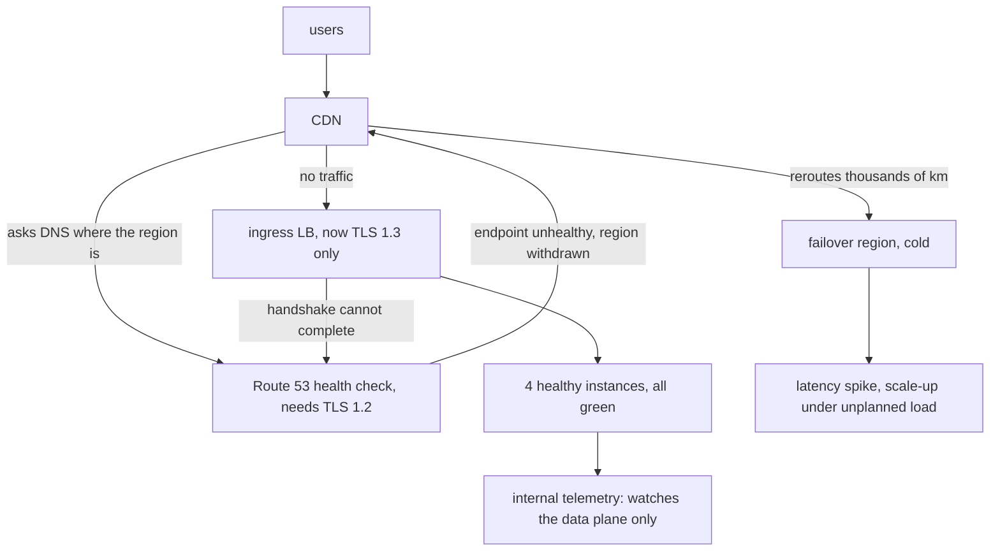

# High availability is not resilience — the TLS upgrade that hid behind green dashboards

> Source: IT Iaido lesson 2026-10-06-2 · Fresh · Software architecture & design · Intermediate · passed on 2026-10-07

> Fresh · Software architecture & design · Intermediate · ~20 min · from today's feeds

## Why this matters
Alexey Golev published this on InfoQ on 2026-10-01, and it is the clearest short statement I have read of a distinction that costs teams whole regions: high availability and resilience are two different problems, and solving one does not touch the other.

The case study is a compliance-driven TLS 1.3 upgrade that took a region out of service while every dashboard inside that region stayed green — the kind of incident that looks like nothing until you notice traffic has stopped arriving.

It sits above your current rung in the architecture ladder on purpose: you own product decisions about failover and on-call, and the article's trade-off (DNS failover versus a seconds-scale controller, tiered by how much the path is worth) is a decision you will be asked to make before you reach rungs 14 and 15.

## Primer
Five ideas the article assumes. You know the distributed-systems versions of most of them from Akka; these are the cloud-infrastructure names.

**Multi-AZ redundancy.** A cloud region is split into availability zones — separate failure domains with their own power and network. Running copies of a service in two or three AZs means one zone can disappear without the service stopping. This is the standard HA building block, and the article names it as exactly that: "A managed database with Multi-AZ failover, autoscaling groups behind load balancers, and a CDN help systems achieve respectable uptime."

**Load balancer.** The thing in front of your instances that accepts the client's connection — including the TLS handshake — and forwards the request to a healthy instance. In the incident it is the *public ingress* load balancer, the one clients terminate TLS against.

**DNS health checks.** AWS Route 53 is a DNS service that can be told to stop returning an address when that address stops answering. It does this by *probing from outside*: it opens a connection to your endpoint on a schedule and decides healthy or unhealthy from the result. For an HTTPS endpoint that probe includes a TLS handshake.

**Data plane vs control plane.** The data plane is the part that carries user requests: load balancers, instances, databases. The control plane is the part that decides where the data plane sends things: health checks, DNS records, routing tables, autoscaling decisions. They fail independently. Your application metrics — request rates, error rates, latency — are emitted *by* the data plane, so they see data-plane failures and are blind to control-plane ones.

**Failover.** Shifting traffic from a failing location to a standby one. DNS-based failover does this by changing what a name resolves to, which only takes effect once the health check flips, the change propagates, and every client's cached record expires. That chain is the source of the timing trade-off in this lesson.

## The idea

### Two different problems
The article's opening move is a definition, not a metaphor:

> "High availability is about surviving expected failures with minimal interruption. Resilience, on the other hand, is about recovering from conditions the system was never explicitly designed to handle."
> — Alexey Golev, *High Availability Is Not Resilience: Why Cloud Systems Fail When It Matters Most*, 2026-10-01, https://www.infoq.com/articles/high-availability-not-resilience-cloud/

Read that as two different engineering activities. HA is a *design* activity: you enumerate the failures you expect — an instance crashes, a zone goes dark, a dependency times out — and you buy redundancy that absorbs each one. It is verifiable, because you know what you are defending against. Resilience is a *capability* activity: you accept that something outside your list will break, and you invest in noticing it and getting back. Nothing about buying the first gives you the second. A system can be fully highly available and not resilient at all.

Golev gives three patterns where the gap shows.

**Correlated failures.** Multi-AZ models an entire zone failing at once. It does not model the software layer: a bad config pushed to every replica, a poisoned cache record served from every read replica, a dependency upgrade that quietly breaks a contract all copies rely on.

> "When independence breaks down at that level, redundancy stops working as insurance."
> — Alexey Golev, *High Availability Is Not Resilience*, 2026-10-01, https://www.infoq.com/articles/high-availability-not-resilience-cloud/

Redundancy is a bet on independence. Anything that reaches all copies through the same pipe — your deployment pipeline, your config store, your shared cache — cancels the bet.

**Untested degradation.** Graceful degradation is normally an assumption rather than a measurement: "Most systems are assumed to degrade gracefully, but few have ever been tested under realistic loads" (Golev, *High Availability Is Not Resilience*, 2026-10-01, https://www.infoq.com/articles/high-availability-not-resilience-cloud/).

**Rotted recovery paths.** Code and documents that are never executed decay silently while the infrastructure around them moves: "The system has been running for two years; the rebuild runbook was written before half of the current dependencies existed" (Golev, *High Availability Is Not Resilience*, 2026-10-01, https://www.infoq.com/articles/high-availability-not-resilience-cloud/). Unused failover code is in the same position as an untested branch — it compiles, and nobody knows whether it works.

### The control-plane trap
Then the case study, which is worth following step by step because every step is individually reasonable.

A team upgraded public ingress load balancers to TLS 1.3 for compliance. Nothing looked wrong: handshakes completed, services stayed healthy, metrics stayed flat. But:

> "Route 53 HTTPS health checks require the target endpoint to support TLS 1.2. If TLS 1.2 is disabled and only TLS 1.3 is available, the health checker cannot complete the handshake and will mark the endpoint unhealthy."
> — Alexey Golev, *High Availability Is Not Resilience*, 2026-10-01, https://www.infoq.com/articles/high-availability-not-resilience-cloud/

Route 53 marked the endpoint unhealthy, so it marked the region unhealthy, so the CDN stopped routing traffic there. Inside the region everything still looked fine — services up, load balancers healthy, dashboards clean. The only symptom was that traffic had stopped arriving. Users were transparently rerouted thousands of kilometres away, latency spiked, and the failover region began scaling under load it was not prepared for.

> "The system was highly available, but it was not resilient."
> — Alexey Golev, *High Availability Is Not Resilience*, 2026-10-01, https://www.infoq.com/articles/high-availability-not-resilience-cloud/



The one-line diagnosis is the article's own:

> "The data plane worked perfectly. The control plane broke."
> — Alexey Golev, *High Availability Is Not Resilience*, 2026-10-01, https://www.infoq.com/articles/high-availability-not-resilience-cloud/

Two numbers matter. "The actual issue took roughly forty minutes to isolate" (Golev, 2026-10-01) — forty minutes with every internal signal saying the system was fine. And the thing that eventually found it was outside-in: "Synthetic monitoring eventually revealed a pattern that internal telemetry could not show" (Golev, 2026-10-01). That follows from the Primer: telemetry is emitted by the data plane, and the data plane was healthy. Only a prober that enters the way a user enters sees the control plane's verdict.

For you this is a direct generalisation of something you already do in Akka: a circuit breaker's own state is control plane. An actor system whose routers are perfectly healthy can still be receiving nothing because the thing deciding where messages go has a stale view. The cloud version just puts the stale view in DNS, where you cannot see it from inside.

### The trade-off: DNS failover vs a controller
Golev ends on an operational choice. DNS failover is simple, universally understood and effectively free, but its speed is bounded by machinery you do not own, and its correctness depends entirely on the health check being right — which is exactly what failed above. AWS Application Recovery Controller (ARC) replaces that with continuous readiness checks across five regional endpoints and acts far faster, at the cost of being operationally heavier: it needs dedicated ownership, and it bills per cluster and per control.

> "DNS is bounded by health check interval, propagation delay, and client TTL for minutes in practice, but sometimes for longer. ARC operates in seconds."
> — Alexey Golev, *High Availability Is Not Resilience*, 2026-10-01, https://www.infoq.com/articles/high-availability-not-resilience-cloud/

His recommendation is tiered rather than uniform: ARC for critical customer-facing paths — payment, auth, booking — and DNS for internal tools and low-traffic APIs. The organisational half matters as much: separate on-call (response) from recovery ownership (preparation), and make failover drills a recurring engineering commitment whose findings turn into engineering work rather than a report. The honest framing he gives for why drills never finish is this:

> "In sufficiently complex systems, resilience is probabilistic, not provable."
> — Alexey Golev, *High Availability Is Not Resilience*, 2026-10-01, https://www.infoq.com/articles/high-availability-not-resilience-cloud/

And the reason to start anyway: "You don't need to redesign your entire architecture to start testing resilience" (Golev, 2026-10-01).

## Lab
**The question this lab answers:** if every instance in a region stays healthy the whole time, how do users lose service — and how much does the *recovery mechanism* you chose add to the outage?

About 7 minutes. Python 3, standard library only, no network and no cloud credentials. Everything below is a **model**, not a measurement: the only numbers taken from the article are the recovery-timing characterisations (DNS minutes, ARC seconds, and the forty minutes to isolate). Load, latencies, instance counts and the cold region's scale-up curve are mine, chosen to be plausible.

### Step 1 — write the simulation

Save as `control_plane_trap.py`. One tick is 30 simulated seconds. The data plane never breaks; at tick 3 the ingress starts offering TLS 1.3 only.

```python
"""A model of the control-plane trap. One tick = 30 simulated seconds.
Data plane: 4 healthy instances in eu-central, serving 1200 req/s at 180 ms.
Control plane: an HTTPS health checker that needs TLS 1.2 to finish a handshake.
At tick 3 the ingress is upgraded to TLS 1.3-only for compliance."""

TICK_S          = 30
LOAD_RPS        = 1200
HOME_LATENCY_MS = 180
FAR_LATENCY_MS  = 1150     # failover region, thousands of km away
FAILS_TO_FLIP   = 3        # consecutive failed checks before the endpoint is marked unhealthy
TLS13_ONLY_AT   = 3
FAILOVER_START_CAPACITY = 0.40   # fraction of LOAD_RPS the cold region can take
FAILOVER_SCALE_PER_TICK = 0.25

fails, region_unhealthy, far_capacity = 0, False, 0.0
rows = []

for tick in range(1, 11):
    tls13_only = tick >= TLS13_ONLY_AT
    offered    = "1.3 only" if tls13_only else "1.2+1.3"

    # --- data plane: never breaks. Real user clients all speak TLS 1.3. ---
    instances_up = 4
    dashboard    = "all green"

    # --- control plane: the checker needs TLS 1.2. ---
    hc_ok = not tls13_only
    fails = 0 if hc_ok else fails + 1
    if fails >= FAILS_TO_FLIP:
        region_unhealthy = True
    if hc_ok:
        region_unhealthy = False

    # --- CDN follows the control plane, not the data plane. ---
    if region_unhealthy:
        cdn = "failover"
        far_capacity = min(1.0, (far_capacity or FAILOVER_START_CAPACITY) + (FAILOVER_SCALE_PER_TICK if far_capacity else 0.0))
        success  = far_capacity
        latency  = FAR_LATENCY_MS
    else:
        cdn = "eu-central"
        success  = 1.0
        latency  = HOME_LATENCY_MS

    rows.append((tick, offered, instances_up, dashboard, "ok" if hc_ok else "handshake fail",
                 fails, "UNHEALTHY" if region_unhealthy else "healthy", cdn,
                 round(success * 100, 1), latency, round(LOAD_RPS * (1 - success) * TICK_S)))

hdr = ("tick", "ingress TLS", "up", "dashboard", "health check", "f", "R53 verdict", "CDN sends to", "succ%", "p50 ms", "lost req")
w   = (4, 11, 3, 9, 15, 2, 11, 12, 6, 7, 9)
print(" | ".join(h.ljust(x) for h, x in zip(hdr, w)))
print("-+-".join("-" * x for x in w))
for r in rows:
    print(" | ".join(str(c).ljust(x) for c, x in zip(r, w)))

lost = sum(r[-1] for r in rows)
print(f"\ndata-plane instances lost over 10 ticks: 0")
print(f"ticks with a green dashboard and no traffic: {sum(1 for r in rows if r[7] == 'failover')}")
print(f"user requests dropped: {lost}  (over {10*TICK_S}s of simulated time)")
```

Run it with `python3 control_plane_trap.py`.

### Step 2 — read the tick-by-tick trace

```text
tick | ingress TLS | up  | dashboard | health check    | f  | R53 verdict | CDN sends to | succ%  | p50 ms  | lost req 
-----+-------------+-----+-----------+-----------------+----+-------------+--------------+--------+---------+----------
1    | 1.2+1.3     | 4   | all green | ok              | 0  | healthy     | eu-central   | 100.0  | 180     | 0        
2    | 1.2+1.3     | 4   | all green | ok              | 0  | healthy     | eu-central   | 100.0  | 180     | 0        
3    | 1.3 only    | 4   | all green | handshake fail  | 1  | healthy     | eu-central   | 100.0  | 180     | 0        
4    | 1.3 only    | 4   | all green | handshake fail  | 2  | healthy     | eu-central   | 100.0  | 180     | 0        
5    | 1.3 only    | 4   | all green | handshake fail  | 3  | UNHEALTHY   | failover     | 40.0   | 1150    | 21600    
6    | 1.3 only    | 4   | all green | handshake fail  | 4  | UNHEALTHY   | failover     | 65.0   | 1150    | 12600    
7    | 1.3 only    | 4   | all green | handshake fail  | 5  | UNHEALTHY   | failover     | 90.0   | 1150    | 3600     
8    | 1.3 only    | 4   | all green | handshake fail  | 6  | UNHEALTHY   | failover     | 100.0  | 1150    | 0        
9    | 1.3 only    | 4   | all green | handshake fail  | 7  | UNHEALTHY   | failover     | 100.0  | 1150    | 0        
10   | 1.3 only    | 4   | all green | handshake fail  | 8  | UNHEALTHY   | failover     | 100.0  | 1150    | 0        

data-plane instances lost over 10 ticks: 0
ticks with a green dashboard and no traffic: 6
user requests dropped: 37800  (over 300s of simulated time)
```

### Reading the output

Every column, and which direction is better:

| column | meaning | better |
| --- | --- | --- |
| `tick` | 30 simulated seconds each | — |
| `ingress TLS` | what the public load balancer offers clients | — |
| `up` | healthy data-plane instances, out of 4 | higher |
| `dashboard` | what internal telemetry shows, derived from `up` | — |
| `health check` | whether the external HTTPS probe completed its handshake | `ok` |
| `f` | consecutive failed probes so far | lower |
| `R53 verdict` | the control plane's opinion of the region | `healthy` |
| `CDN sends to` | where user traffic actually goes | `eu-central` |
| `succ%` | share of the 1200 req/s that get an answer | higher |
| `p50 ms` | median user-visible latency | lower |
| `lost req` | requests dropped during that tick | lower |

The two columns to put side by side are `up` and `succ%`. `up` is 4 on every line — the data plane never loses a single instance, and `dashboard` stays `all green` from tick 1 to tick 10. Yet from tick 5 onward `succ%` collapses to 40 and `p50 ms` goes from 180 to 1150. Nothing in the `up` / `dashboard` pair predicts it, because nothing in the data plane caused it.

Trace tick 5 with digits. The ingress has offered TLS 1.3 only since tick 3, so the probe has failed at ticks 3, 4 and 5: `f` = 3, which reaches `FAILS_TO_FLIP = 3`, so `region_unhealthy` flips to `True` and the CDN switches to `failover`. The cold region starts at `FAILOVER_START_CAPACITY = 0.40`, so `succ%` = 0.40 × 100 = 40.0, and `lost req` = 1200 × (1 − 0.40) × 30 = 1200 × 0.60 × 30 = 21600. Tick 6 adds one scale-up step: 0.40 + 0.25 = 0.65, so `lost req` = 1200 × 0.35 × 30 = 12600. Tick 7: 0.65 + 0.25 = 0.90 → 1200 × 0.10 × 30 = 3600. Tick 8: min(1.0, 0.90 + 0.25) = 1.00 → 0 dropped. Total 21600 + 12600 + 3600 = 37800 requests, and latency stays at 1150 ms even after the drops stop.

**Verdict:** the outage is entirely invisible to the signals the team watches. Zero instances lost, six consecutive ticks of a green dashboard with no traffic arriving, 37,800 requests dropped and latency 6.4× worse (1150 ÷ 180 = 6.39). Only a probe that enters from outside, the way the health checker and a user do, distinguishes tick 2 from tick 5 — which is the article's "Synthetic monitoring eventually revealed a pattern that internal telemetry could not show" (Golev, *High Availability Is Not Resilience*, 2026-10-01, https://www.infoq.com/articles/high-availability-not-resilience-cloud/).

### Step 3 — price the recovery mechanism

Append this. It asks: once somebody has found the problem and re-enabled TLS 1.2, how long until users are back in the home region? The detect / propagate / TTL split and the seconds-scale alternative are the article's characterisation quoted above; the arithmetic is the model's.

```python
print("\n--- how long until users are home again, after the TLS config is fixed ---")
print("timings below are the article's stated characterisation (DNS: minutes; ARC: seconds),")
print("mapped onto this model's 30 s check interval. They are not measurements.\n")

def recover(name, detect_s, propagate_s, ttl_s):
    total = detect_s + propagate_s + ttl_s
    return (name, detect_s, propagate_s, ttl_s, total, round(total / 60, 2), round(LOAD_RPS * total))

plans = [
    recover("DNS, 60 s TTL",  FAILS_TO_FLIP * TICK_S, 60, 60),
    recover("DNS, 300 s TTL", FAILS_TO_FLIP * TICK_S, 60, 300),
    recover("controller",     10,                      0,   0),
]
hdr2 = ("plan", "detect s", "propagate s", "client TTL s", "total s", "total min", "far-region req")
w2   = (15, 8, 11, 12, 7, 9, 14)
print(" | ".join(h.ljust(x) for h, x in zip(hdr2, w2)))
print("-+-".join("-" * x for x in w2))
for p in plans:
    print(" | ".join(str(c).ljust(x) for c, x in zip(p, w2)))
print(f"\nratio, DNS 300 s TTL vs controller: {plans[1][4] / plans[2][4]:.0f}x the time in the gap")
print(f"plus the {40*60} s the article says isolating the cause took, before any of this starts")
```

```text
--- how long until users are home again, after the TLS config is fixed ---
timings below are the article's stated characterisation (DNS: minutes; ARC: seconds),
mapped onto this model's 30 s check interval. They are not measurements.

plan            | detect s | propagate s | client TTL s | total s | total min | far-region req
----------------+----------+-------------+--------------+---------+-----------+---------------
DNS, 60 s TTL   | 90       | 60          | 60           | 210     | 3.5       | 252000        
DNS, 300 s TTL  | 90       | 60          | 300          | 450     | 7.5       | 540000        
controller      | 10       | 0           | 0            | 10      | 0.17      | 12000         

ratio, DNS 300 s TTL vs controller: 45x the time in the gap
plus the 2400 s the article says isolating the cause took, before any of this starts
```

Columns: `detect s` is how long before the mechanism believes the endpoint is well again (three passing 30 s probes = 90 s); `propagate s` is how long the DNS change takes to spread; `client TTL s` is how long clients keep serving the old answer from cache; `total s` is the sum, the user-visible gap; `far-region req` is `LOAD_RPS × total s`, requests still paying the 1150 ms penalty. Lower is better in every column.

Arithmetic for the 300 s TTL row: 3 × 30 = 90 detect, + 60 propagate, + 300 TTL = 450 s = 450 ÷ 60 = 7.5 minutes, and 1200 × 450 = 540,000 requests served the slow way. The controller row is 10 + 0 + 0 = 10 s and 1200 × 10 = 12,000 requests — 450 ÷ 10 = 45× less time in the gap.

**Verdict:** the recovery mechanism is itself a design decision with a measurable cost, and the three DNS terms are additive — tuning only the check interval buys you 90 s out of 450. On this model the expensive controller is worth it at 540,000 affected requests and pointless at a few hundred, which is exactly why the article recommends tiering it by path rather than adopting it everywhere. Note also that all of this comes *after* diagnosis: 2400 s, the forty minutes the article reports, dwarfs every row in the table.

### Cause → consequence

1. **Cause.** Compliance required TLS 1.3 on public ingress, and TLS 1.2 was disabled at the same time.
2. **Mechanism.** The external health checker needs TLS 1.2 to complete a handshake, so it failed three times in a row (ticks 3, 4, 5), flipped the region to `UNHEALTHY`, and the CDN withdrew it — while the data plane, which emits all internal telemetry, stayed at 4/4 instances and `all green`.
3. **Consequence.** 37,800 requests dropped and user latency 6.4× worse in the model, with no internal signal to point at; in the real incident, roughly forty minutes to isolate (Golev, 2026-10-01).
4. **In practice.** Treat the control plane as a system with its own failure modes and its own tests. Probe from outside the way your health checker does, with the same protocol constraints. Make any change to the ingress TLS, cipher or certificate configuration a change that lists its external dependants. And decide per path — not once for the whole estate — whether minutes of DNS lag are acceptable or whether that path deserves a seconds-scale controller.

## Self-check
1. Your region's dashboards are entirely green and no instance has failed, yet request volume into the region has gone to zero. Which plane is broken, and why can your existing telemetry not tell you? <details><summary>Answer</summary>The control plane. Internal telemetry is emitted by the data plane — load balancers, instances, applications — so it reports on the part that is working. The control plane's verdict (health check result, DNS answer, CDN routing decision) is formed outside your region and is only visible to something probing in from outside, which is why "Synthetic monitoring eventually revealed a pattern that internal telemetry could not show" (Golev, *High Availability Is Not Resilience*, 2026-10-01).</details>
2. You run three replicas across three AZs. Name a failure that redundancy does not protect you from, and say what property it violates. <details><summary>Answer</summary>Anything that reaches all three copies through a shared channel: a bad config push, a poisoned cache record served from every read replica, a dependency upgrade that breaks a contract all replicas rely on. It violates the independence assumption that redundancy is a bet on — "When independence breaks down at that level, redundancy stops working as insurance" (Golev, 2026-10-01). Multi-AZ models a zone disappearing, not the software layer correlating.</details>
3. A colleague proposes moving every service off DNS failover onto AWS ARC. Give the two strongest arguments against doing it uniformly, and what you would propose instead. <details><summary>Answer</summary>First, cost and operational weight: ARC bills per cluster and per control and needs dedicated ownership, which is unjustifiable for internal tools and low-traffic APIs. Second, DNS is simple, universally understood and effectively free, and minutes of lag are acceptable for most paths. The article's own recommendation is tiering: ARC for critical customer-facing paths (payment, auth, booking), DNS elsewhere — because "DNS is bounded by health check interval, propagation delay, and client TTL for minutes in practice, but sometimes for longer. ARC operates in seconds" (Golev, 2026-10-01) is a trade-off, not a verdict.</details>

## Sources
- [High Availability Is Not Resilience: Why Cloud Systems Fail When It Matters Most](https://www.infoq.com/articles/high-availability-not-resilience-cloud/) — Alexey Golev, InfoQ, 2026-10-01 — the whole lesson: the HA/resilience definition, the three gap patterns (correlated failures, untested degradation, rotted recovery paths), the TLS 1.3 / Route 53 incident and its forty-minute isolation time, the control-plane framing, and the DNS-versus-ARC trade-off and tiering recommendation; every quoted passage above was copied from this page (accessed 2026-10-06; fetched via https://infoq.com/articles/high-availability-not-resilience-cloud)
