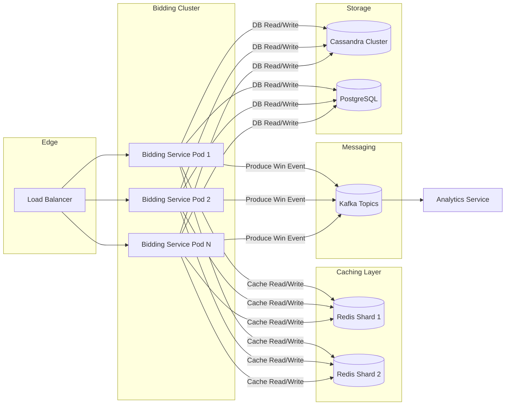

# Building a High-Scale Bidding Engine in Scala/Java

## Overview
High-scale bidding engines process tens of thousands of bid requests per second with strict latency requirements (often under 100ms end-to-end). This guide covers real-world architecture patterns, in-depth component designs, implementation examples in Scala/Java, and best practices for reliability, scalability, and maintainability.

---

## 1. Key Components Deep Dive

### 1.1 API Gateway / Load Balancer
- **Responsibilities**:  
  - TLS termination and certificate management  
  - Rate limiting to protect against traffic spikes and abusive clients  
  - Path-based routing for versioning and canary deployments  
- **Examples & Configuration**:  
  - **AWS Application Load Balancer**: Supports WebSockets, HTTP/2, certificate manager integration.  
  - **NGINX**: Lua plugins for dynamic routing, `limit_req_zone` for rate limiting.  
  - **HAProxy**: Advanced ACLs for geo-based routing and circuit breakers at edge.

### 1.2 Stateless Bidding Service
- **Concurrency Model**:  
  - **Scala**: Akka Actors + Akka HTTP for light-weight threading; backpressure via Akka Streams  
  - **Java**: Netty with `NioEventLoopGroup` and `CompletableFuture` pipelines  
- **Thread Pools & Executors**:  
  - Tune `fork-join` pool size for CPU-bound tasks  
  - Separate IO thread pool for DB/cache calls to avoid starvation
- **Heap & GC Tuning**:  
  - Use **G1GC**:  
    - `-XX:MaxGCPauseMillis=50`  
    - `-XX:InitiatingHeapOccupancyPercent=35`  
  - Off-heap caching with [Chronicle Map] for 0-GC lookup

### 1.3 Message Broker (Apache Kafka)
- **Topic Design**:  
  - **By Campaign**: Partition by campaign ID for data locality  
  - **By Geography**: Separate topics for regions to control cross-dc traffic  
- **Consumer Groups**:  
  - Group per microservice to scale independently  
  - `enable.auto.commit=false` + manual offset commit for exactly-once semantics with idempotent producers
- **Backpressure**:  
  - Adjust `max.poll.records` and `fetch.max.bytes`  
  - Use reactive Kafka client (e.g., Alpakka Kafka or Reactor Kafka)

### 1.4 In-Memory Cache (Redis)
- **Data Partitioning**:  
  - **Cluster Mode** with hash slot sharding  
  - Use **Consistent Hashing** in client to avoid hot keys  
- **Eviction & TTL Strategies**:  
  - `volatile-lru` for user sessions  
  - `allkeys-lfu` for frequently accessed campaign data  
- **High Availability**:  
  - Master-replica with Sentinel, or use Redis Enterprise Multi-AZ

### 1.5 Data Storage
- **Relational DB (PostgreSQL)**:  
  - Store campaign metadata, reporting aggregates  
  - Use **Connection Pooling** (HikariCP) with `maxPoolSize` tuned to CPU cores  
- **Wide-Column Store (Cassandra)**:  
  - For high write throughput of real-time logs  
  - **Data Modeling**: Time-series table per client, TTL-based archival  
- **Cold Storage**:  
  - S3 + Parquet for historical logs and ML pipelines

### 1.6 Monitoring & Metrics
- **Metrics Collection**:  
  - **Prometheus**: Expose `/metrics` via Micrometer or Kamon  
  - **Histogram vs Summary**: Use histograms for latency distribution  
- **Tracing**:  
  - **OpenTelemetry**: Instrument RPC calls, Kafka producers/consumers  
  - **Zipkin/Jaeger**: Visualize service call graphs
- **Alerting**:  
  - SLO-based alerts: e.g., P99 latency > 100ms for 5m  
  - Integrate with PagerDuty/Slack

---

## 2. Architecture Patterns & Diagrams



- **Circuit Breakers**:  
  - Degrade gracefully on DB/cache failures.  
  - Use **Resilience4j** with `retry`, `fallback`, and `rateLimiter` modules.

- **Canary & Blue-Green Deployments**:  
  - Deploy new versions to subset of pods behind path-based routing.

---

## 3. Detailed Implementation Examples

### 3.1 Scala + Akka HTTP + Alpakka Kafka

```scala
import akka.actor.ActorSystem
import akka.kafka.scaladsl.{Consumer, Producer}
import akka.kafka.{ConsumerSettings, ProducerSettings, Subscriptions}
import akka.stream.scaladsl._
import org.apache.kafka.clients.consumer.ConsumerConfig
import org.apache.kafka.clients.producer.ProducerRecord
import spray.json._

implicit val system = ActorSystem("bidding-engine")
implicit val ec = system.dispatcher

// Kafka consumer for win-notifications
val consumerSettings = ConsumerSettings(system, new StringDeserializer, new StringDeserializer)
  .withBootstrapServers("kafka:9092")
  .withGroupId("bidding-win-consumer")
  .withProperty(ConsumerConfig.AUTO_OFFSET_RESET_CONFIG, "earliest")

Consumer
  .plainSource(consumerSettings, Subscriptions.topics("win-events"))
  .mapAsync(4)(msg => handleWin(msg.value()))
  .runWith(Sink.ignore)

// HTTP Route for bidding
val route = post {
  path("bid") {
    entity(as[String]) { json =>
      val bidRequest = json.parseJson.convertTo[BidRequest]
      val responseF = processBid(bidRequest) // returns Future[BidResponse]
      complete(responseF.toJson.prettyPrint)
    }
  }
}
```

### 3.2 Java + Netty + Lettuce (Redis)

```java
EventLoopGroup bossGroup = new NioEventLoopGroup(1);
EventLoopGroup workerGroup = new NioEventLoopGroup();
RedisClient redisClient = RedisClient.create("redis://localhost");
StatefulRedisConnection<String, String> connection = redisClient.connect();
RedisAsyncCommands<String, String> asyncCmd = connection.async();

ServerBootstrap b = new ServerBootstrap();
b.group(bossGroup, workerGroup)
 .channel(NioServerSocketChannel.class)
 .childHandler(new ChannelInitializer<SocketChannel>() {
     @Override
     protected void initChannel(SocketChannel ch) {
         ch.pipeline().addLast(new HttpServerCodec(), new BidHandler(asyncCmd));
     }
 });
b.bind(8080).sync();
```

---

## 4. Best Practices Checklist

- **Latency**  
  - P99 < 100ms end-to-end  
  - Use lightweight serialization: Protocol Buffers, Kryo  
- **Throughput**  
  - Autoscale pods based on CPU and queue lag  
  - Partition keys to maximize parallelism  
- **Resilience**  
  - Circuit breakers on external calls  
  - Bulkhead isolation per downstream service  
- **Observability**  
  - End-to-end tracing, custom dashboards  
  - Alert on error rates, latency spikes, consumer lag  
- **Security**  
  - Mutual TLS between services  
  - Encrypt data at rest and in transit  
  - Rotate secrets via Vault/KMS  
- **Testing**  
  - Unit tests for strategy logic  
  - Integration tests with embedded Kafka and Redis  
  - Load testing with Gatling or JMeter

---

## 5. Advanced Topics

### 5.1 Dynamic Bid Shading
- Adjust bid price in-flight based on win probability and ROI metrics.
- Implement as a microservice that enriches bid requests before sending to exchanges.

### 5.2 ML-Driven Decisioning
- Use feature store (e.g., Feast) to retrieve user signals.
- Host models in TensorFlow Serving or ScaKit for real-time inference.

### 5.3 Multi-Region Deployment
- Deploy separate clusters in each region.
- Use global edge routing (AWS Global Accelerator) with health checks.

---

## Conclusion
A robust high-scale bidding engine relies on stateless, reactive services, precise tuning of JVM and networking layers, and resilient, observable infrastructure. Incorporate advanced patterns like bid shading and ML-based decisioning to stay competitive in real-time bidding markets.
