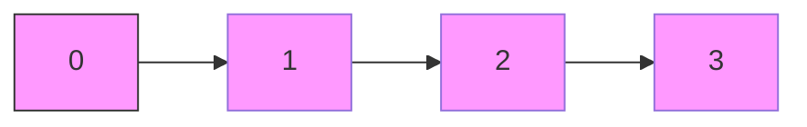
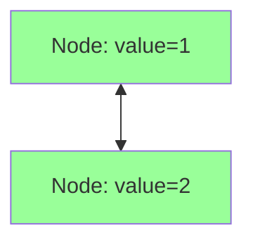

# Base Data Structures in Java (Scala Interop)

This file compares fundamental Java collections often used in Scala projects via Java interoperability.

---

## ArrayList vs LinkedList

### ArrayList

- **Structure:** Dynamic array (contiguous memory).
- **Access:** O(1) random access.
- **Insertion/Deletion:**  
  - End: O(1) amortized.  
  - Middle/front: O(n) (shifts elements).
- **Memory:** Lower per-element overhead.

```scala
import java.util.ArrayList
val arr = new ArrayList[Int]()
arr.add(1); arr.add(2)
println(arr.get(0))  // 1
```

<details>
<summary>Memory Layout (Mermaid)</summary>


</details>

---

### LinkedList

- **Structure:** Doubly linked list (nodes with prev/next pointers).
- **Access:** O(n) random access (traverse from head/tail).
- **Insertion/Deletion:** O(1) at ends or with known node.
- **Memory:** Higher overhead (node objects + pointers).

```scala
import java.util.LinkedList
val list = new LinkedList[Int]()
list.add(1); list.add(2)
println(list.getFirst())  // 1
```

<details>
<summary>Node Layout (Mermaid)</summary>


</details>

---

## HashSet vs TreeSet

| Feature                   | HashSet                         | TreeSet                            |
|---------------------------|---------------------------------|------------------------------------|
| Structure                 | Hash table                      | Red-Black tree                     |
| Order                     | Unordered                       | Sorted (natural or comparator)     |
| Add/Remove/Contains       | O(1) average, O(n) worst-case   | O(log n)                           |
| Null elements             | Allows one `null`               | Disallows `null`                   |

```scala
import java.util.{HashSet, TreeSet}

val hs = new HashSet[String]()
hs.add("apple"); hs.contains("apple")

val ts = new TreeSet[String]()
ts.add("banana"); ts.first()  // "banana"
```

---

## HashMap vs TreeMap

| Feature                   | HashMap                         | TreeMap                            |
|---------------------------|---------------------------------|------------------------------------|
| Structure                 | Hash table                      | Red-Black tree                     |
| Order                     | Unordered                       | Sorted by key                      |
| Put/Get/Remove            | O(1) average, O(n) worst-case   | O(log n)                           |
| Null keys/values          | One `null` key, any null value  | Disallows `null` keys/values       |

```scala
import java.util.{HashMap, TreeMap}

val hm = new HashMap[Int, String]()
hm.put(1, "one"); hm.get(1)

val tm = new TreeMap[Int, String]()
tm.put(2, "two"); tm.firstKey()
```

---

## Queue vs Stack

### Queue

- **Interface:** `java.util.Queue`
- **Common Implementation:** `LinkedList`, `ArrayDeque`
- **Behavior:** FIFO (First-In-First-Out)
- **Complexity:** O(1) add/remove at ends.

```scala
import java.util.{Queue, LinkedList}
val q: Queue[Int] = new LinkedList[Int]()
q.offer(1); q.offer(2)
println(q.poll())  // 1
```

### Stack

- **Legacy Class:** `java.util.Stack` (extends `Vector`)
- **Preferred:** `ArrayDeque` or `Deque` interface
- **Behavior:** LIFO (Last-In-First-Out)
- **Complexity:** O(1) push/pop (with Deque).

```scala
import java.util.ArrayDeque
val stack = new ArrayDeque[Int]()
stack.push(1); stack.push(2)
println(stack.pop())  // 2
```

---

*Next up: Sorting algorithms (Bubble, Selection, Merge, Quick) and Binary Search.*  
*Send “continue” when ready!*  
