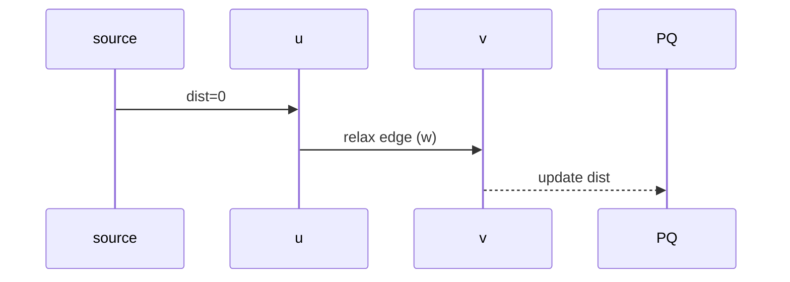

# Dijkstra’s Algorithm

This file covers:
- Definition & Use Cases
- Algorithm Steps
- Complexity
- Scala Example

---

## Definition & Use Cases

**Dijkstra’s Algorithm** finds the shortest paths from a single source node to all other nodes in a weighted graph with non-negative edge weights.

- **Applications:**  
  - GPS/navigation  
  - Network routing (OSPF)  
  - Game AI pathfinding  

---

## Algorithm Steps

1. **Initialization:**  
   - Set distance to source = 0; all others = ∞.  
   - Mark all nodes unvisited.  
   - Use a priority queue (min-heap) keyed on tentative distance.

2. **Main Loop:**  
   - Extract node `u` with smallest distance from PQ.  
   - For each neighbor `v` of `u` with edge weight `w`:  
     - If `dist(u) + w < dist(v)`, update `dist(v)` and enqueue/update `v` in PQ.  
   - Mark `u` visited (finalized).

3. **Termination:**  
   - Repeat until PQ empty or all reachable nodes finalized.

---

## Complexity

- **Time:** O((V + E) log V) with binary heap  
- **Space:** O(V + E)  

For dense graphs, using adjacency matrix and simple arrays: O(V²).

---

## Scala Example

```scala
import scala.collection.mutable
case class Edge(to: Int, weight: Int)

def dijkstra(graph: Map[Int, List[Edge]], source: Int): Map[Int, Int] =
  val dist = mutable.Map(graph.keys.map(_ -> Int.MaxValue).toSeq: _*)
  dist(source) = 0
  val pq = mutable.PriorityQueue.empty[(Int, Int)](
    Ordering.by(-_._2)
  )
  pq.enqueue(source -> 0)

  while pq.nonEmpty do
    val (u, d) = pq.dequeue()
    if d <= dist(u) then
      for Edge(v, w) <- graph.getOrElse(u, Nil) do
        val nd = d + w
        if nd < dist(v) then
          dist(v) = nd
          pq.enqueue(v -> nd)

  dist.toMap
```

<details>
<summary>Execution Flow (Mermaid)</summary>


</details>
