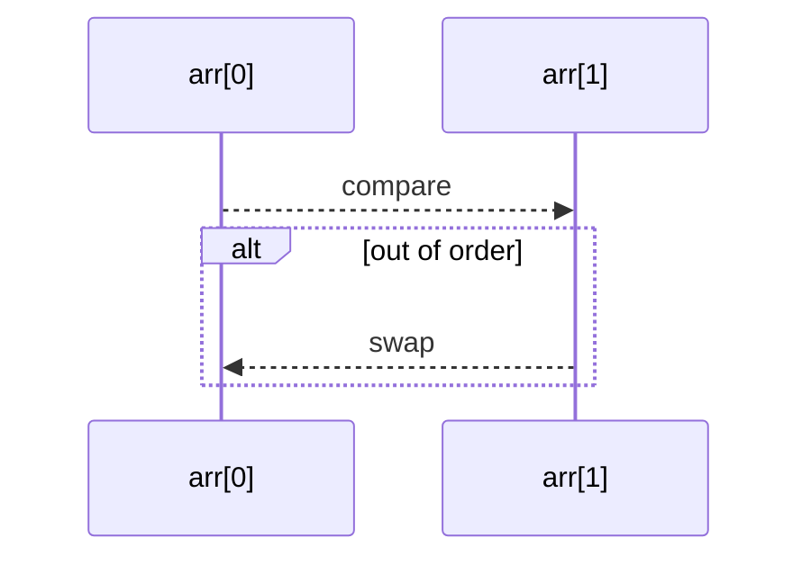

# Sorting & Searching Algorithms

This file covers classic sorting algorithms and binary search, with definitions, examples, and complexity notes.

---

## Bubble Sort

**Definition:** Repeatedly steps through the list, compares adjacent items, and swaps them if out of order.

- **Best Case:** O(n) (already sorted, single pass)  
- **Average/Worst Case:** O(n²)  
- **Space Complexity:** O(1)

```scala
def bubbleSort[A](arr: Array[A])(using ord: Ordering[A]): Unit =
  val n = arr.length
  for i <- 0 until n - 1 do
    var swapped = false
    for j <- 0 until n - i - 1 do
      if ord.gt(arr(j), arr(j + 1)) then
        val tmp = arr(j); arr(j) = arr(j + 1); arr(j + 1) = tmp
        swapped = true
    if !swapped then return
```

<details>
<summary>Visualization (Mermaid)</summary>


</details>

---

## Selection Sort

**Definition:** Divides input into sorted and unsorted regions; repeatedly selects the minimum from unsorted and moves to end of sorted.

- **Time Complexity:** O(n²)  
- **Space Complexity:** O(1)

```scala
def selectionSort[A](arr: Array[A])(using ord: Ordering[A]): Unit =
  val n = arr.length
  for i <- 0 until n - 1 do
    var minIdx = i
    for j <- i + 1 until n do
      if ord.lt(arr(j), arr(minIdx)) then minIdx = j
    if minIdx != i then
      val tmp = arr(i); arr(i) = arr(minIdx); arr(minIdx) = tmp
```

---

## Merge Sort

**Definition:** Divide-and-conquer: splits array, recursively sorts halves, then merges.

- **Time Complexity:** O(n log n)  
- **Space Complexity:** O(n)

```scala
def mergeSort[A](arr: Array[A])(using ord: Ordering[A]): Array[A] =
  def merge(left: Array[A], right: Array[A]): Array[A] =
    var i = 0; var j = 0; val buf = Array.newBuilder[A]
    while i < left.length && j < right.length do
      if ord.lteq(left(i), right(j)) then buf += left(i); i += 1
      else buf += right(j); j += 1
    buf ++= left.slice(i, left.length) ++= right.slice(j, right.length)
    buf.result()

  if arr.length <= 1 then arr
  else
    val mid = arr.length / 2
    merge(mergeSort(arr.slice(0, mid)), mergeSort(arr.slice(mid, arr.length)))
```

---

## Quick Sort

**Definition:** Divide-and-conquer: picks a pivot, partitions array into <, =, > pivot, recursively sorts partitions.

- **Average Time Complexity:** O(n log n)  
- **Worst Case:** O(n²) (poor pivot choice)  
- **Space Complexity:** O(log n) (stack)

```scala
def quickSort[A](arr: Array[A])(using ord: Ordering[A]): Array[A] =
  if arr.length <= 1 then arr
  else
    val pivot = arr(arr.length / 2)
    quickSort(arr.filter(ord.lt(_, pivot))) ++
      arr.filter(ord.equiv(_, pivot)) ++
      quickSort(arr.filter(ord.gt(_, pivot)))
```

---

## Binary Search

**Definition:** On sorted array, repeatedly divides search interval in half to find target.

- **Time Complexity:** O(log n)  
- **Space Complexity:** O(1)

```scala
def binarySearch[A](arr: Array[A], target: A)(using ord: Ordering[A]): Int =
  var lo = 0; var hi = arr.length - 1
  while lo <= hi do
    val mid = (lo + hi) >>> 1
    if ord.equiv(arr(mid), target) then return mid
    else if ord.lt(arr(mid), target) then lo = mid + 1
    else hi = mid - 1
  -1
```

---

*Next up: Recursion & Dynamic Programming.*  
*Send “continue” when you’re ready!*  
