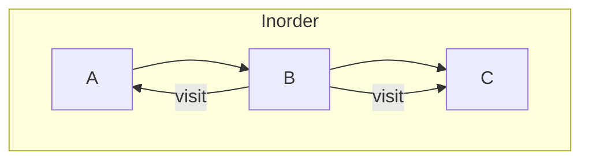
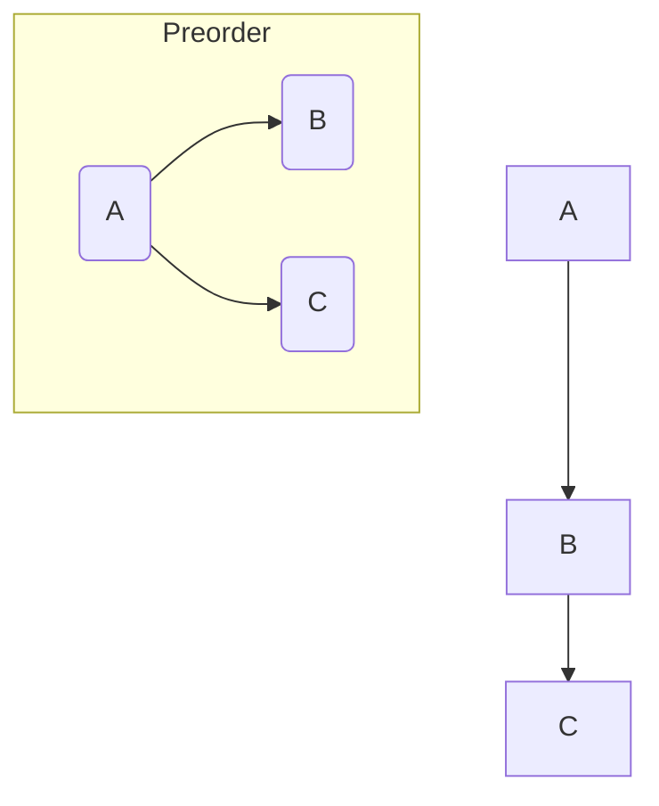
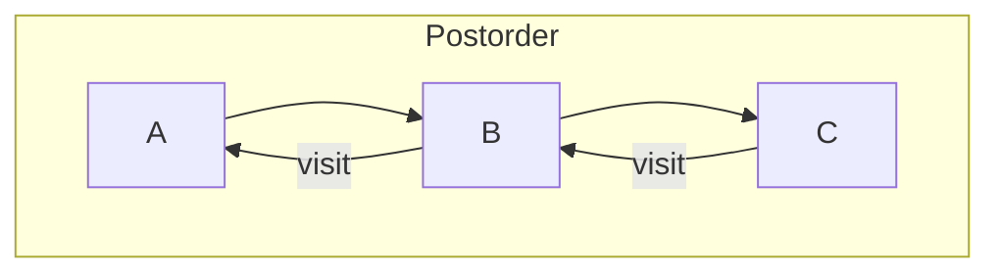
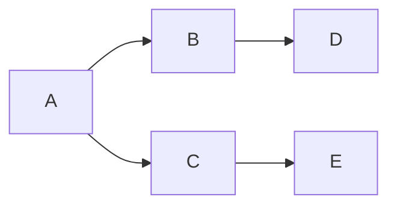

# Traversal & Graph Search

This file covers:
- Binary Search Tree Traversals (Inorder, Preorder, Postorder)
- Graph Search Algorithms (DFS, BFS)

---

## BST Traversals

Given a Binary Search Tree (BST), traversal strategies visit nodes in specific orders.

### Inorder Traversal

- **Order:** Left, Node, Right  
- **Use Case:** Retrieves values in sorted order for BST.
- **Complexity:** O(n) time, O(h) space (stack), where h = tree height.

```scala
def inorder[A](node: Node[A], result: List[A] = Nil): List[A] =
  if node == null then result
  else
    val leftList  = inorder(node.left, result)
    val withNode  = leftList :+ node.value
    inorder(node.right, withNode)
```

<details>
<summary>Diagram (Mermaid)</summary>


</details>

---

### Preorder Traversal

- **Order:** Node, Left, Right  
- **Use Case:** Copy tree, prefix notation.
- **Complexity:** O(n) time, O(h) space.

```scala
def preorder[A](node: Node[A], result: List[A] = Nil): List[A] =
  if node == null then result
  else
    val withNode = result :+ node.value
    val leftList = preorder(node.left, withNode)
    preorder(node.right, leftList)
```

<details>
<summary>Diagram (Mermaid)</summary>


</details>

---

### Postorder Traversal

- **Order:** Left, Right, Node  
- **Use Case:** Delete tree, postfix notation.
- **Complexity:** O(n) time, O(h) space.

```scala
def postorder[A](node: Node[A], result: List[A] = Nil): List[A] =
  if node == null then result
  else
    val leftList  = postorder(node.left, result)
    val rightList = postorder(node.right, leftList)
    rightList :+ node.value
```

<details>
<summary>Diagram (Mermaid)</summary>


</details>

---

## Graph Search

Given a graph `Map[Node, List[Neighbor]]`, two fundamental search strategies:

### Depth-First Search (DFS)

- **Strategy:** Explores as far along a branch as possible before backtracking.
- **Use Case:** Path finding, topological sort.
- **Complexity:** O(V + E) time, O(V) space (stack/recursion).

```scala
def dfs(start: Int, graph: Map[Int, List[Int]]): List[Int] =
  val visited = scala.collection.mutable.Set.empty[Int]
  def explore(u: Int, acc: List[Int]): List[Int] =
    if visited(u) then acc
    else
      visited.add(u)
      graph.getOrElse(u, Nil).foldLeft(acc :+ u)((lst, v) => explore(v, lst))
  explore(start, Nil)
```

<details>
<summary>DFS Tree (Mermaid)</summary>


</details>

---

### Breadth-First Search (BFS)

- **Strategy:** Explores neighbors level by level using a queue.
- **Use Case:** Shortest path in unweighted graphs.
- **Complexity:** O(V + E) time, O(V) space (queue).

```scala
def bfs(start: Int, graph: Map[Int, List[Int]]): List[Int] =
  import scala.collection.mutable
  val visited = mutable.Set(start)
  val queue   = mutable.Queue(start)
  var order   = List.empty[Int]

  while queue.nonEmpty do
    val u = queue.dequeue()
    order = order :+ u
    for v <- graph.getOrElse(u, Nil) do
      if !visited(v) then
        visited.add(v); queue.enqueue(v)
  order
```

<details>
<summary>BFS Tree (Mermaid)</summary>

```mermaid
flowchart TB
    A --> B &nbsp;&nbsp;&ndash;> C
    B --> D &nbsp;&nbsp;&ndash;> E
```
</details>

---
