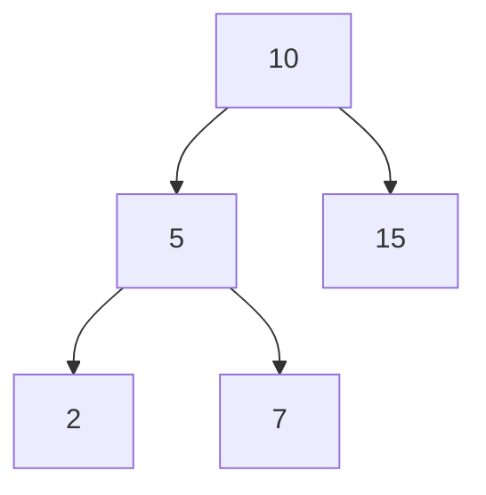
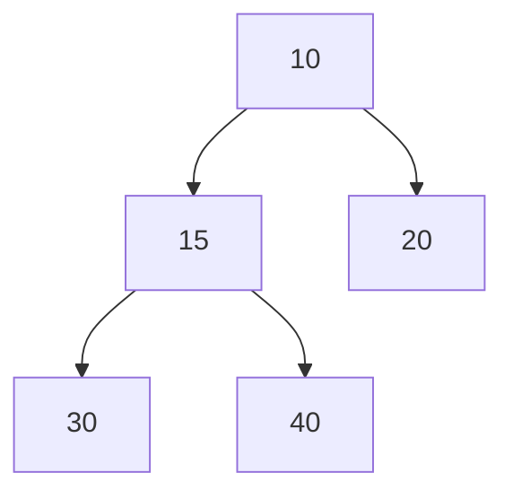

# Trees & Graphs

This file covers:
- Types of Trees: general overview
- Types of Graphs
- Tries (Prefix Trees)
- Binary Heaps

---

## Types of Trees: General Overview

Trees are hierarchical structures of nodes connected by edges:
- **Binary Tree:** Each node has ≤ 2 children.
- **Binary Search Tree (BST):** Binary tree with left < node < right property.
- **Balanced Trees:** Height-balanced for O(log n) operations:
  - **AVL Tree:** Strict balance factor ≤ 1.
  - **Red-Black Tree:** Color-based balancing; used in Java’s TreeMap/TreeSet.
    -  example of balanced search tree (sorted, balanced, optimized for same performance)
    - ```
      [10B]
      /   \
      [5R]   [20R]
      /  \     \
      [3B] [7B]  [30B]
      ```

- **B-Tree / B+ Tree:** Multi-way trees for disk-based storage (e.g., databases).

```scala
// Simple BST insertion
case class Node[A](value: A, left: Node[A] = null, right: Node[A] = null)
def bstInsert[A: Ordering](root: Node[A], v: A): Node[A] =
  if root == null then Node(v)
  else if summon[Ordering[A]].lt(v, root.value) then root.copy(left = bstInsert(root.left, v))
  else root.copy(right = bstInsert(root.right, v))
```

<details>
<summary>BST Structure (Mermaid)</summary>


</details>

---

## Types of Graphs

Graphs are collections of vertices (V) and edges (E):
- **Undirected / Directed:** Edges bidirectional vs unidirectional.
- **Weighted / Unweighted:** Edges with weights vs equal weight.
- **Cyclic / Acyclic:** Presence or absence of cycles.
- **Sparse / Dense:** |E| close to |V| vs |V|².

```scala
// Adjacency list representation
val graph: Map[Int, List[(Int, Int)]] = Map(
  1 -> List((2, 5), (3, 2)), // node -> List((neighbor, weight))
  2 -> List((1, 5)),
  3 -> List((1, 2))
)
```

---

## Tries (Prefix Trees)

A trie stores strings by common prefixes; each node represents a character.
- **Insert / Search:** O(m) for key length m.
- **Use Cases:** Autocomplete, dictionary, IP routing.

```scala
class TrieNode(var end: Boolean = false, val children: scala.collection.mutable.Map[Char, TrieNode] = scala.collection.mutable.Map())

class Trie():
  private val root = TrieNode()
  def insert(word: String): Unit =
    var node = root
    for c <- word do
      node = node.children.getOrElseUpdate(c, TrieNode())
    node.end = true

  def search(word: String): Boolean =
    var node = root
    for c <- word do
      node.children.get(c) match
        case Some(n) => node = n
        case None => return false
    node.end
```

<details>
<summary>Trie Diagram (Mermaid)</summary>

```mermaid
graph TD
    Root --> A['c'] --> B['a'] --> C['t'(end)]
    B --> D['r'] --> E['t'(end?)]
```
</details>

---

## Binary Heaps

A complete binary tree satisfying heap property:
- **Min-Heap:** Parent ≤ children.
- **Max-Heap:** Parent ≥ children.
- **Implementation:** Array-based, parent(i)=(i-1)/2, children=2i+1,2i+2.
- **Operations:** Insert, removeMin/removeMax O(log n).

```scala
import scala.collection.mutable.ArrayBuffer

class MinHeap[A](using ord: Ordering[A]):
  private val data = ArrayBuffer.empty[A]
  private def parent(i: Int) = (i - 1) >>> 1
  private def left(i: Int) = 2*i + 1
  private def right(i: Int) = 2*i + 2

  def push(v: A): Unit =
    data.append(v); siftUp(data.size - 1)

  def pop(): A =
    val res = data(0)
    data(0) = data.remove(data.size - 1)
    siftDown(0)
    res

  private def siftUp(i: Int): Unit =
    var idx = i
    while idx > 0 && ord.lt(data(idx), data(parent(idx))) do
      val p = parent(idx)
      val tmp = data(idx); data(idx) = data(p); data(p) = tmp
      idx = p

  private def siftDown(i: Int): Unit =
    var idx = i
    val n = data.size
    while left(idx) < n do
      val l = left(idx); val r = right(idx)
      val smallest = if r < n && ord.lt(data(r), data(l)) then r else l
      if ord.lt(data(smallest), data(idx)) then
        val tmp = data(idx); data(idx) = data(smallest); data(smallest) = tmp
        idx = smallest
      else return
```

<details>
<summary>Heap Structure (Mermaid)</summary>


</details>
