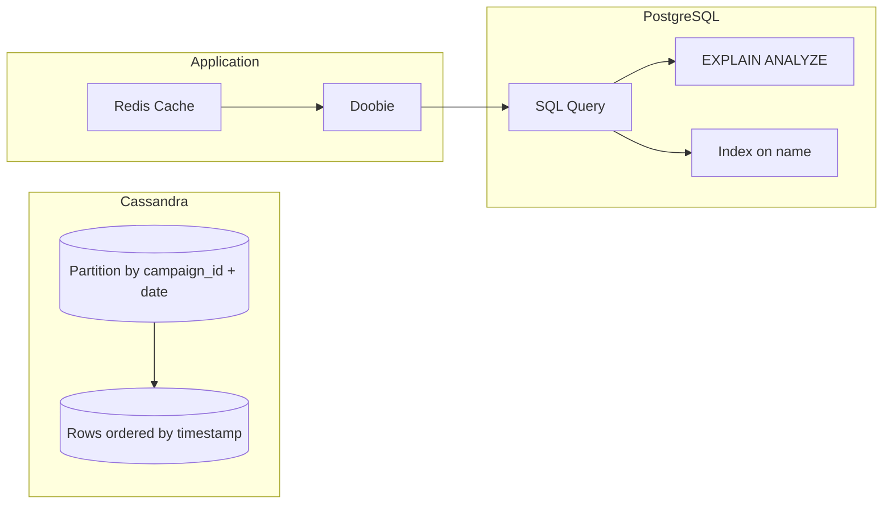

# Cassandra, Doobie/Postgres Integration & Indexing Strategies

## 1. Cassandra Partition Keys vs. Clustering Keys for Time-Series Data

### Definitions
- **Partition Key:** Determines which node stores the data. It is the primary way to distribute data across the cluster.
- **Clustering Key:** Defines the order of rows within a partition. Used for sorting and range queries.

### Revisit & Time-Series Example
- **Use Case:** Storing impression logs for ad campaigns.
- **Partition Key Choice:**  
  - `campaign_id` ⬅︎ groups all impressions for a campaign.
  - `{campaign_id, date}` ⬅︎ further splits by day to avoid large partitions.
- **Clustering Key Choice:**  
  - `timestamp` ⬅︎ orders impressions by time.

#### Example Table Schema
```sql
CREATE TABLE impressions (
  campaign_id UUID,
  date TEXT,
  timestamp TIMESTAMP,
  user_id UUID,
  impression_data TEXT,
  PRIMARY KEY ((campaign_id, date), timestamp)
) WITH CLUSTERING ORDER BY (timestamp DESC);
```

### Best Practices
- **Avoid Hotspots:** Choose partition keys that prevent a single node from receiving disproportionate traffic.
- **Partition Size:** Keep partitions under ~100MB for efficient reads.
- **Time Bucketing:** Break time-series data into daily or hourly buckets.

---

## 2. Doobie Integration with PostgreSQL

### What Is Doobie?
- A **functional JDBC** wrapper for Scala.
- Provides type-safe, composable database access.

### Schema Migrations & Zero-Downtime Deploys

#### Schema Migrations
- **Tooling:** Use Flyway or Liquibase.
- **Version Control:** Store migration scripts alongside code.

#### Example Migration Script (Flyway)
```sql
-- V2__add_campaign_table.sql
CREATE TABLE campaign (
  id UUID PRIMARY KEY,
  name TEXT NOT NULL,
  created_at TIMESTAMP DEFAULT now()
);
```

#### Zero-Downtime Deploy Strategy
1. **Backward-Compatible Changes:**  
   - Add nullable columns or new tables before writing code that uses them.
2. **Deploy in Phases:**  
   - **Phase 1:** Deploy migration script (add column).
   - **Phase 2:** Deploy application code reading new column.
   - **Phase 3:** Make column NOT NULL if required.
3. **Feature Flags:** Roll out new features gradually.

### Doobie Code Example
```scala
import doobie._
import doobie.implicits._

case class Campaign(id: java.util.UUID, name: String)

def findCampaign(id: UUID): ConnectionIO[Option[Campaign]] =
  sql"SELECT id, name FROM campaign WHERE id = $id"
    .query[Campaign]
    .option
```

---

## 3. Indexing & Query Optimization for Read-Heavy Workloads

### Indexing Basics
- **Primary Index:** Created on primary key automatically.
- **Secondary Index:** Explicit indexes on other columns.

### PostgreSQL Best Practices
- **B-Tree Indexes:** Default, good for equality/range queries.
- **GIN/GiST Indexes:** For full-text search or JSONB.

#### Example: Index for Campaign Lookups
```sql
CREATE INDEX idx_campaign_name ON campaign(name);
```

### Query Optimization Techniques
1. **Use EXPLAIN ANALYZE:** Inspect query plans and execution time.
2. **Avoid SELECT *:** Fetch only needed columns.
3. **Use Prepared Statements:** Benefit from query plan caching (supported by Doobie).
4. **Connection Pooling:** Use HikariCP to manage database connections.

### Read-Heavy Data Access Patterns
- **Pagination:** Use keyset pagination (`WHERE id > last_id LIMIT 20`).
- **Caching Layer:**  
  - Fetch from cache (Redis) first.
  - Fallback to database on cache miss.
- **Materialized Views:** Precompute heavy aggregates if appropriate.

---

## Diagrams



---

## Summary

- **Cassandra:** Use composite partition keys and clustering keys for time-series logs.
- **Doobie/Postgres:** Follow migration best practices and zero-downtime deploy phases.
- **Indexing:** Create appropriate indexes and optimize queries using EXPLAIN, prepared statements, and caching.

Use this guide to prepare for database design and integration discussions in interviews.
