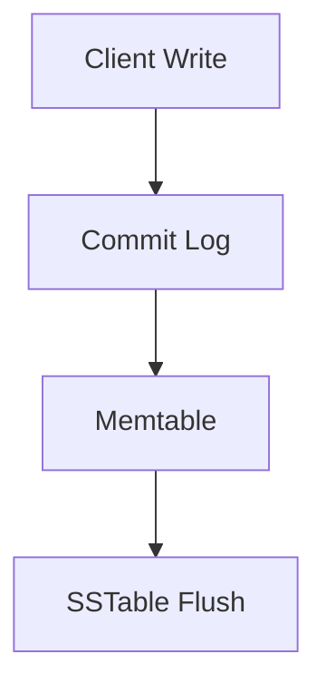

# Data Storage & Persistence Strategies

## Introduction
Choosing the right data storage solution is crucial for building applications that are reliable, scalable, and performant. This guide explains three primary storage types:
1. **Relational Databases** (e.g., PostgreSQL)  
2. **NoSQL Databases** (e.g., Cassandra, MongoDB)  
3. **In-Memory Stores** (e.g., Redis, Memcached)  

Each has its strengths, trade-offs, and ideal use cases. This document provides definitions, real-world examples, best practices, and diagrams to make these concepts clear even for those new to the field.

---

## 1. Relational Databases: PostgreSQL

### What Is It?
- A **relational database** organizes data into tables with rows and columns.
- Ensures **ACID** properties:
  - **Atomicity:** All parts of a transaction succeed or fail together.
  - **Consistency:** Data remains valid according to rules.
  - **Isolation:** Concurrent transactions do not interfere.
  - **Durability:** Once committed, data is permanent.

### When to Use PostgreSQL
- **Financial applications** where consistency is critical (e.g., banking).
- **Reporting systems** requiring complex SQL queries and joins.
- **Data integrity** needs (foreign keys, constraints).

### Key Concepts
- **Schema Design:**  
  - Normalize (3NF) to reduce duplication, then selectively denormalize for performance.
- **Indexes:**  
  - Speed up searches on specific columns (e.g., B‑Tree indexes for equality/range queries).
- **Partitioning:**  
  - Divide large tables by key or time range to improve query performance.

### Example Scenario
An e-commerce site uses PostgreSQL to track orders:
- **Orders Table:** `order_id`, `customer_id`, `created_at`, `total_amount`
- **Customers Table:** `customer_id`, `name`, `email`
- Use a **date-based partition** on `created_at` for orders older than one year.

---

## 2. NoSQL Databases: Cassandra & MongoDB

### What Is NoSQL?
- **NoSQL** covers databases that do not use a fixed relational schema. They prioritize scalability and flexibility over strict consistency.

### 2.1 Cassandra (Wide-Column Store)
- **Data Model:** Tables with rows and dynamic columns.
- **Consistency Model:** Tunable per-query (`ONE`, `QUORUM`, `ALL`).
- **Scalability:** Linear; add nodes to increase capacity.
- **Ideal For:**  
  - High-write workloads (IoT sensors, event logs).
  - Distributed systems across multiple data centers.

#### Best Practices
- **Partition Keys:**  
  - Choose keys that evenly distribute data; avoid “hot partitions.”
- **Clustering Columns:**  
  - Define ordering within partitions (e.g., by timestamp).
- **Write Path:**  
  - Data is appended to commit log then memtable, then flushed to SSTables.



### 2.2 MongoDB (Document Store)
- **Data Model:** JSON-like documents stored in collections.
- **Consistency Model:** Primary-replica set; read preference configurable.
- **Flexibility:** Schema-less—fields can vary by document.
- **TTL Indexes:** Automatically expire documents (e.g., session data).

#### Best Practices
- **Data Modeling:**  
  - Embed related data within documents when reads require full objects.
  - Use references when data is accessed independently.
- **Indexes:**  
  - Create compound indexes for multi-field queries.
- **Sharding:**  
  - Partition collections across shards using a shard key.

---

## 3. In-Memory Stores: Redis & Memcached

### Why In-Memory?
- Data stored in RAM for **microsecond to millisecond** access.
- Common for **caching**, **sessions**, and **real-time analytics**.

### 3.1 Redis
- **Features:**  
  - Supports data structures: strings, hashes, lists, sets, sorted sets.
  - Persistence options: RDB snapshots, AOF logs.
- **Use Cases:**  
  - Session storage with TTL.
  - Pub/Sub messaging.
  - Real-time leaderboards (sorted sets).

### 3.2 Memcached
- **Features:**  
  - Simple key-value cache.
  - LRU eviction policy by default.
- **Use Cases:**  
  - Caching rendered HTML fragments.
  - Offloading database read traffic.

### Best Practices for In-Memory Stores
- **Eviction Policies:**  
  - `LRU`, `LFU`, `allkeys-lru`, etc., based on access patterns.
- **Memory Limits:**  
  - Set `maxmemory` to prevent system OOM.
- **Data Expiry:**  
  - Use TTL for ephemeral data.

---

## 4. Design Considerations & Trade-offs

| Consideration         | Relational (PostgreSQL) | Cassandra              | MongoDB                | Redis/Memcached        |
|-----------------------|-------------------------|------------------------|------------------------|------------------------|
| Consistency           | Strong (ACID)           | Tunable (Eventual)     | Primary-secondary      | Eventual (typically)   |
| Schema Flexibility    | Fixed                   | Flexible               | Highly flexible        | Key-value only         |
| Write Throughput      | Moderate                | Very high              | High                   | Very high              |
| Read Latency          | Moderate                | Low to moderate        | Low to moderate        | Ultra-low              |
| Use Case Examples     | Transactions, Reports   | Metrics, Logging       | CMS, Catalogs          | Caching, Sessions      |

### Additional Concepts
- **CAP Theorem:** Trade-offs between Consistency, Availability, and Partition tolerance.  
  ```mermaid
  triangleDiagram
    title CAP Theorem
    A[Consistency]
    P[Partition Tolerance]
    A2[Availability]
  ```
- **ACID vs. BASE:**  
  - **ACID:** Atomic, Consistent, Isolated, Durable.  
  - **BASE:** Basically Available, Soft state, Eventual consistency.

---

## 5. Scenario Walkthroughs

### A. Web Application Session Management
1. **User Logs In:**  
   - Credentials verified in PostgreSQL.
2. **Session Created:**  
   - Session token stored in Redis with 30-minute TTL.
3. **Subsequent Requests:**  
   - Token looked up in Redis for fast validation.
4. **Logout:**  
   - Session key deleted or expires automatically.

### B. Real-Time Metrics Dashboard
1. **Event Ingestion:**  
   - Apache Kafka streams events to a Cassandra cluster.
2. **Data Storage:**  
   - Events written to Cassandra with a timestamp clustering column.
3. **Dashboard Caching:**  
   - Pre-aggregated metrics stored in Memcached for sub-second dashboard refresh.

---

## Conclusion
Understanding the strengths and limitations of each storage type allows architects to mix-and-match solutions:
- **Reliability & Complex Queries:** Use PostgreSQL.
- **High-Volume Writes & Scalability:** Choose Cassandra or MongoDB.
- **Low-Latency Access & Caching:** Opt for Redis or Memcached.

Always model data based on access patterns, monitor performance, and plan for growth.
