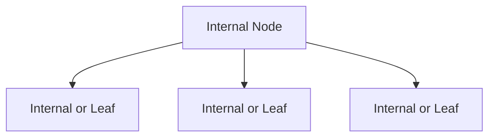

# B-Tree vs LSM Tree

## 1. Overview
B-Trees and LSM (Log-Structured Merge) Trees are both disk-based data structures designed to manage large volumes of data. They optimize I/O by organizing data in pages or files, but differ fundamentally in write and compaction strategies.

---

## 2. B-Tree

### 2.1 Definition
- **B-Tree**: A balanced m-ary search tree where each node contains between _t−1_ and _2t−1_ keys (for minimum degree _t_), and all leaves are at the same depth.

### 2.2 Variants
- **B+ Tree**: A common variant where all actual records are stored in leaf nodes, and internal nodes only hold keys. Leaf nodes are linked for efficient range scans.

### 2.3 Structure
- **Node Layout**:  
  - **Internal nodes**: contain _k_ keys and _k+1_ child pointers.  
  - **Leaf nodes**: store _k_ keys and pointers to records or data.
- **Fan-out** (_F_): Approximate number of children per node, influenced by page size and key size. Higher fan-out reduces tree height.

### 2.4 Operations
- **Search**:  
  - Start at root, binary search the keys in node, follow pointer.  
  - Complexity: _O(logₓ n)_ where _x_≈fan-out.
- **Insert**:  
  1. Find leaf.  
  2. Insert key; if overflow (>2t−1), split node.  
  3. Propagate split upwards.
- **Delete**:  
  1. Remove key; if underflow (<t−1), borrow from sibling or merge.  
  2. Adjust tree to maintain balance.

### 2.5 Disk I/O and Caching
- **Pages**: Data stored in fixed-size pages (4KB–16KB).  
- **Buffer Pool**: Caches frequently accessed pages (e.g., InnoDB buffer pool).  
- **Read/Write Amplification**:  
  - Read: minimal, one page per level.  
  - Write: in-place updates, single page write.

### 2.6 Use Cases
- Relational OLTP databases (MySQL InnoDB).  
- File systems (e.g., NTFS, ext4 indexing).  
- Indexed data with mixed read/write.

---

## 3. LSM Tree

### 3.1 Definition
- **LSM Tree**: Buffers writes in an in-memory structure and periodically flushes sorted runs to disk, merging them in the background.

### 3.2 Components
- **Write-Ahead Log (WAL)**: Ensures durability before in-memory writes.  
- **MemTable**: In-memory sorted table (e.g., skip list, red-black tree).  
- **SSTables**: Immutable, sorted on-disk files; each has a sparse index and optionally a Bloom filter.

### 3.3 Workflow
1. **Write Path**:  
   - Append to WAL.  
   - Insert into MemTable.
2. **Flush**: When MemTable size exceeds threshold, write to a new SSTable.
3. **Compaction**: Background process merges SSTables to reduce file count, remove tombstones, and maintain sorted order.

### 3.4 Compaction Strategies
| Strategy       | Description                                                                 | Pros                               | Cons                                |
|----------------|-----------------------------------------------------------------------------|------------------------------------|-------------------------------------|
| **Size-Tiered**| Merge smaller SSTables into larger ones when a threshold is reached.        | Simple; high write throughput      | High space & write amplification    |
| **Leveled**    | SSTables organized in levels (L0, L1…) with size limits; compact across levels. | Lower space & read amplification   | More CPU for frequent compactions   |

### 3.5 Read Path
- Check MemTable → WAL cache.  
- Query newest SSTables (L0) → perform Bloom filter check → index lookup → binary search in file.

### 3.6 Performance Characteristics
| Metric               | B-Tree            | LSM Tree                                |
|----------------------|-------------------|-----------------------------------------|
| Point Read Latency   | Low (_O(logₓ n)_) | Moderate (memtable + multiple SSTables) |
| Range Scan           | Efficient (leaf links) | Efficient but may need merge across files |
| Write Throughput     | Moderate          | High (append-only writes)               |
| Read Amplification   | Low               | High                                    |
| Write Amplification  | Low               | Moderate to High                        |
| Space Amplification  | Low               | High (due to obsolete versions, SSTables) |

### 3.7 Use Cases
- NoSQL databases (Cassandra, HBase, RocksDB).  
- Time-series databases (InfluxDB, Timescale).  
- Logging systems (e.g., Elasticsearch uses segment merges).

---

## 4. Comparison Summary

| Aspect               | B-Tree                                | LSM Tree                                         |
|----------------------|---------------------------------------|--------------------------------------------------|
| **Structure**        | Balanced tree, in-place updates       | Multi-level immutable files, merge-based         |
| **Write Pattern**    | Random writes, moderate throughput    | Sequential writes, optimized for high throughput |
| **Read Pattern**     | Single-path search, low amplification | Multi-source reads, uses filters/indexes         |
| **Latency**          | Predictable                           | Varies with compaction state                     |
| **Maintenance**      | Minimal                              | Requires tuning of compaction                     |
| **Storage Overhead** | Minimal                              | Additional storage for tombstones and SSTables   |
| **Ideal For**        | Mixed read/write, consistent low latency | Write-heavy, eventual consistency, time-series   |

---

## 5. Recommendations
- Use **B-Tree** when:
  - Latency predictability is critical.  
  - Workloads have balanced read/write with in-place updates.
- Use **LSM Tree** when:
  - You need to handle very high write rates.  
  - You can tolerate background compaction and eventual consistency.

---

## 6. Further Reading
- [The Log-Structured Merge-Tree (LSM-tree)](https://www.ijcet.org/vol10/issue2/IJCET-17-10-02-028.pdf)  
- [B+ Trees in Database Systems](https://www.cs.cmu.edu/~./ganger/711.f04/l03.pdf)
