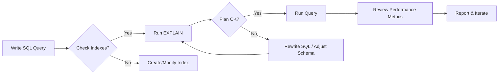

# Database Query Optimization Approaches

## 1. Introduction
Database query optimization aims to make data retrieval faster and more efficient. Think of it like finding the quickest route on a map: instead of traveling every single street, you pick highways and main roads to reach your destination quickly.

---

## 2. Indexing Strategies
### What is an Index?
An index is like a book’s table of contents or an alphabet in the back: it tells the database where to find specific values without reading every row.

- **Example**:
    ```sql
    -- Create an index on the `users` table for faster lookups by email
    CREATE INDEX idx_users_email ON users(email);
    ```
- **When to Use**: Columns often used in `WHERE`, `JOIN`, `ORDER BY`, or `GROUP BY`.

---

## 3. Execution Plan Analysis
### What Is an Execution Plan?
It’s a step-by-step recipe the database follows to run your query. It shows which indexes it uses, join types, and estimated costs.

- **How to View**:
    ```sql
    EXPLAIN ANALYZE
    SELECT *
    FROM orders o
    JOIN customers c ON o.customer_id = c.id
    WHERE o.order_date > '2025-01-01';
    ```
- **Key Elements**:
  - **Seq Scan**: Scanning every row (slow).
  - **Index Scan**: Using an index (fast).
  - **Join Methods**: Nested loop, hash join, merge join.

---

## 4. Query Rewriting / Refactoring
### Why Rewrite Queries?
Small changes in SQL can let the optimizer choose a better path, like rewriting directions to avoid traffic.

- **Subquery vs. JOIN**:
    ```sql
    -- Subquery (sometimes slower)
    SELECT *
    FROM orders
    WHERE customer_id IN (
      SELECT id FROM customers WHERE status = 'active'
    );

    -- JOIN (usually faster)
    SELECT o.*
    FROM orders o
    JOIN customers c ON o.customer_id = c.id
    WHERE c.status = 'active';
    ```

---

## 5. Statistics and Histograms
### What Are Statistics?
Databases collect stats (row counts, value distribution) to estimate how many rows a query will return, helping choose the cheapest plan.

- **Keep Them Fresh**:
    ```sql
    -- For PostgreSQL
    ANALYZE users;
    ```

---

## 6. Partitioning and Sharding
### Partitioning
Splitting one large table into smaller “chunks” based on a key (e.g., date).

- **Example**: Orders table partitioned by year:
    ```sql
    CREATE TABLE orders_2025 PARTITION OF orders FOR VALUES FROM ('2025-01-01') TO ('2026-01-01');
    ```
- **Benefit**: Queries for a specific year only scan that partition.

### Sharding
Distributing parts of the database across multiple servers. Similar to having multiple warehouses for different regions.

---

## 7. Caching and Materialized Views
### Caching
Storing results of frequent queries in memory (e.g., Redis).

### Materialized Views
Precomputed query results stored on disk. They need refreshing when data changes.

- **Example**:
    ```sql
    CREATE MATERIALIZED VIEW sales_summary AS
    SELECT date_trunc('day', order_date) AS day,
           SUM(amount) AS total
    FROM orders
    GROUP BY day;
    ```

---

## 8. Parameter Sniffing and Plan Stability
### What Is Parameter Sniffing?
The database uses the first set of parameter values to build a plan. If later values differ greatly, performance can suffer.

- **Fixes**:
  - Use `OPTIMIZE FOR UNKNOWN` (SQL Server).
  - Add hints or plan guides.

---

## 9. Denormalization and Schema Design
### Denormalization
Copying data into multiple tables to reduce complex joins. Like having multiple copies of a chapter in different books for quick reference.

- **Use Carefully**: More storage and risk of outdated duplicates.

---

## 10. Best Practices Checklist
- ✅ **Selective Indexes**: High-cardinality columns.
- ✅ **Avoid `SELECT *`**: Only fetch needed columns.
- ✅ **Limit Results**: Use `WHERE` and pagination.
- ✅ **Regularly Run `EXPLAIN`**: Catch slow queries early.
- ✅ **Update Statistics Frequently**.
- ✅ **Monitor with Tools**: e.g., `pg_stat_statements`, SQL Server Profiler.

---

## 11. Diagnostic Tools
- **CLI Tools**: `EXPLAIN`, `ANALYZE`, `SHOW INDEXES`, `ALTER SYSTEM`.
- **GUI/IDE Integration**: JetBrains DataGrip or IntelliJ Database console can visualize execution plans.
- **Monitoring**:
  - **PostgreSQL**: `pgAdmin`, `pg_stat_statements`.
  - **MySQL**: `MySQL Workbench`, `Performance Schema`.

---

## 12. Workflow Diagram


---

## 13. Non‑SQL & Big Data Optimizations

### 13.1 MongoDB
- **Indexing**: Create single-field, compound, and text indexes.
  ```js
  db.users.createIndex({ email: 1 });
  ```
- **Explain Plans**:
  ```js
  db.orders.find({ status: 'shipped' }).explain('executionStats');
  ```
- **Sharding**: Distribute collections across shards by shard key (e.g., `userId`).
- **Aggregation Pipeline**: Use `$match` early, `$project` to reduce data size, and `$facet` carefully.
- **Best Practices**:
  - Keep document size small (<16MB).
  - Use covered queries when possible.
  - Monitor with MMS or Atlas Performance Advisor.

### 13.2 Cassandra
- **Data Model**: Design around queries—denormalize and use wide rows when appropriate.
- **Partition Keys**: Choose to evenly distribute data and avoid hotspots.
- **Clustering Columns**: Control sort order within partitions.
- **Lightweight Transactions**: Use sparingly—can impact performance.
- **Tuning**:
  - Adjust `read_request_timeout_in_ms`.
  - Use `nodetool` for compaction and repair monitoring.
- **Best Practices**:
  - Avoid tombstones—design queries to prevent large deletes.
  - Batch writes by partition key only.

### 13.3 Redis
- **Data Structures**: Use the right type (strings, hashes, lists, sets, sorted sets).
- **Pipelining**: Send multiple commands in a batch.
- **Lua Scripting**: Execute atomic multi-step operations server-side.
- **Eviction Policies**: Configure LRU, LFU based on use case.
- **Best Practices**:
  - Use TTLs for cache keys.
  - Monitor with `redis-cli INFO`.
  - Shard with Redis Cluster for scale.

### 13.4 Hadoop / Spark
- **Partitioning**: Repartition and coalesce RDD/DataFrame to optimize parallelism.
- **Broadcast Variables**: Send read-only data to executors for joins.
- **Caching**: Persist hot datasets in memory or disk (e.g., `.cache()`).
- **Tuning**:
  - Adjust `spark.sql.shuffle.partitions`.
  - Use DataFrame API over RDD for Catalyst optimizations.
- **Best Practices**:
  - Avoid small files—use bulk writes.
  - Use vectorized formats (Parquet, ORC).
  - Monitor with Ganglia, Spark UI.

---

**Glossary for Non-DBAs**
- **Shard**: Horizontal partitioning across servers.
- **Aggregation Pipeline**: MongoDB’s data processing framework.
- **Partition Key**: Column or field used to segment data in distributed systems.
- **Broadcast Variable**: Spark way to share read-only data efficiently.

Happy optimizing across SQL and NoSQL landscapes!