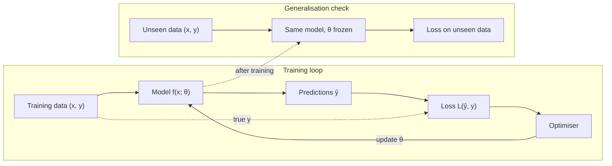

# What machine learning actually optimises

> AI / ML foundations · Beginner · ~25 min · rung 1 of 38 · needs: —

## Why this matters
Every ML system you will touch — a wash-count forecast, a tool router inside an agent, an LLM — is built from the same four parts: data, model, loss, optimiser.
Once you can name those four for a system, you know what to ask in review: what was it trained on, what does its loss reward, and how was it checked on data it never saw?
This rung sets up that frame; the other 37 rungs fill in its parts.

## The idea

### Supervised learning in one line
Given examples of inputs `x` paired with correct answers `y`, find a function `f` with `f(x) ≈ y` — including for inputs you have not seen yet. `x` holds the **features** (a home's size, rooms, district), `y` is the **target** (its sale price), and `f(x)`, written `ŷ` ("y-hat"), is the **prediction**. Moved to your platform: `x` = day of week, forecast temperature and chance of rain for one site; `y` = washes sold that day; `ŷ` = what the model expects tomorrow.

Kaggle's first lesson names the step that turns examples into `f`:

> "We use data to decide how to break the houses into two groups, and then again to determine the predicted price in each group. This step of capturing patterns from data is called **fitting** or **training** the model. The data used to **fit** the model is called the **training data**."
>
> — Kaggle Learn (Dan Becker), *Intro to Machine Learning*, lesson 1 "How Models Work", undated, https://www.kaggle.com/code/dansbecker/how-models-work

### A model is a family of functions
"Fit a line" does not mean one function. `price = a·size + b` is a *family* with one member for every pair `(a, b)`. The numbers that pick the member are the **parameters**, written together as `θ` (theta). **Training means choosing θ.** In Scala terms the model is curried — `def f(θ: Params)(x: Features): Double` — the architecture fixes the type of `θ`, training fixes its value, and serving calls the partially applied function. A decision tree is a family too (θ = its split points and leaf values); a neural network is the same idea with a far larger θ.

Picking the family is your decision, and it limits what training can do: no choice of `a` and `b` lets a straight line follow a price that jumps at a district boundary.

### Loss: one number for "how wrong"
To choose θ you need to score candidates. Google's crash course defines the scorer:

> "Loss is a numerical metric that describes how wrong a model's predictions are. Loss measures the distance between the model's predictions and the actual labels. The goal of training a model is to minimize the loss, reducing it to its lowest possible value."
>
> — Google, *Machine Learning Crash Course — Linear regression: Loss*, last updated 2026-01-05, https://developers.google.com/machine-learning/crash-course/linear-regression/loss

For numeric targets, with error `eᵢ = ŷᵢ − yᵢ` over `N` examples, two losses cover most cases:

- **MAE**, mean absolute error = `(1/N)·Σ|eᵢ|`. Same unit as the target: "on average we miss by 12 k$". Every k$ of error costs the same.
- **MSE**, mean squared error = `(1/N)·Σeᵢ²`. A miss of 10 costs 100; a miss of 100 costs 10 000. One large miss can outweigh many small ones, so MSE pulls the model toward outliers and MAE does not (Google MLCC, "Linear regression: Loss", the part on choosing a loss).

Classifiers ("spam or not", "will this customer churn") predict probabilities and use a different loss, log loss — rung 09.

### Optimiser: the search for θ
With a family and a loss fixed, training is a search: find the θ that makes training loss smallest. For a line under MSE there is a closed-form answer (`np.polyfit` computes it). For almost everything else the search is iterative: start from some θ, measure the loss, nudge θ in the direction that lowers it, repeat. That is gradient descent (rungs 06–07); Adam and friends refine it (rung 16).

The optimiser never sees houses or car washes, only the loss number. You know this from product work: **the loss is the acceptance criterion, and the optimiser meets it literally.** If the criterion is wrong, you get exactly what you specified and not what you meant. The lab below shows this with five homes.

### What you actually want: low loss on data you have not seen
Low training loss is not the goal. A lookup table keyed by house ID has zero training loss and cannot price a single new house. What you want is low loss on new inputs — **generalisation**. The gap between training loss and loss on unseen data is what **overfitting** means. The defence is old QA practice: keep some labelled data back, never let the optimiser see it, and measure on it. Training loss is the developer running tests they wrote while reading the code; held-out loss is the acceptance run on cases they never saw. Rung 03 covers validation splits and leakage — the ways held-out information sneaks back into training.



Note what is missing: no arrow from "Loss on unseen data" back to the optimiser. Once that number steers training, the data is no longer unseen.

### The frame every later rung hangs on
**data → model → loss → optimiser**, then a check on unseen data. The rest of this track fills in those parts:

- **Data:** pandas and splits (02–03), vectors (04–05), embeddings and tokens (20, 23).
- **Model:** logistic regression (09), trees and ensembles (10), neural networks (12), CNNs (18), the Transformer (22).
- **Loss / what "good" means:** log loss (09), evaluation metrics (11), calibration (32).
- **Optimiser:** gradient descent (06–07), backpropagation (13), SGD/momentum/Adam (16), regularisation, which accepts slightly worse training loss in exchange for better generalisation (17).

Rung 24 shows that LLM pretraining fills the same four parts. The order follows the DOU roadmap this track is built on:

> "Логіка проста — рекомендуємо тільки те, що колись проходили самі. Спочатку базовий вступ на Kaggle Learn, паралельно математика (необхідний мінімум, який дозволить розуміти все далі), потім класичний CV та CS231n і фіналимо найважливішим — практикою на 2-3 реальних Kaggle змаганнях."
>
> — Volodymyr Kubytskyi (The Fourth Law), *Що вчити, щоб стати ML / CV Engineer у 2026? Базова програма підготовки від команди The Fourth Law*, DOU, 16 Sep 2026, https://dou.ua/forums/topic/62000/

## Lab
About 10 minutes. Open a Kaggle notebook (Code → New Notebook) or run `python3` locally with numpy.

**The question the lab answers:** two people each propose a line for predicting house prices. Which line is better? The answer turns out to depend on how you score "wrong", and you will see exactly where that happens.

### Step 1 — the data and the two candidate models

Five ordinary homes: size in m² (the feature *x*) and price in k$ (the target *y*). Two candidate models, each a straight line `price = a·size + b`:

- **Line A:** `2·size + 20`
- **Line B:** `3·size − 30`

### Step 2 — run this

```python
import numpy as np

size  = np.array([40, 60, 80, 100, 120])    # m^2  -> feature x
price = np.array([95, 145, 175, 225, 255])  # k$   -> target y

LINES = [("A", 2, 20), ("B", 3, -30)]       # price = a*size + b

def per_house(size, price):
    print(" size  true |  A pred  A err | B pred  B err")
    for x, y in zip(size, price):
        pa, pb = 2*x + 20, 3*x - 30
        print(f"{x:5} {y:5} | {pa:7} {pa-y:6} | {pb:6} {pb-y:6}")

def scores(size, price):
    for name, a, b in LINES:
        err = (a*size + b) - price           # one error per house: prediction minus truth
        print(f"line {name}:  MAE = {np.abs(err).mean():7.1f}   MSE = {(err**2).mean():8.1f}")

per_house(size, price); scores(size, price)

print("\n--- add one mansion: 150 m^2, 700 k$ ---")
size2, price2 = np.append(size, 150), np.append(price, 700)
per_house(size2, price2); scores(size2, price2)
```

### Step 3 — reading the output

The program prints two blocks of the same shape: a **per-house table**, then two **scores**, one per line.

**How to read the per-house table.** Each row is one house. `A pred` is what line A predicts for it; `A err` is prediction minus true price. A negative error means the line guessed too low; positive, too high. Same for B.

**How to read the scores.** Both scores turn the list of per-house errors into one number, and **smaller is better**:
- **MAE** (mean absolute error): drop the minus signs, then average. "On average, how many k$ off are we?"
- **MSE** (mean squared error): square each error, then average. Same idea, but a miss twice as big costs four times as much.

**Block 1 — five ordinary homes**

| size | true | A pred | A err | B pred | B err |
|---:|---:|---:|---:|---:|---:|
| 40 | 95 | 100 | +5 | 90 | −5 |
| 60 | 145 | 140 | −5 | 150 | +5 |
| 80 | 175 | 180 | +5 | 210 | +35 |
| 100 | 225 | 220 | −5 | 270 | +45 |
| 120 | 255 | 260 | +5 | 330 | +75 |

```text
line A:  MAE =     5.0   MSE =     25.0
line B:  MAE =    33.0   MSE =   1785.0
```

Trace: A misses every house by exactly 5 → MAE = 5, MSE = 5² = 25. B is fine on small homes but drifts upward on big ones (+35, +45, +75) → MAE = (5+5+35+45+75)/5 = 33. Squaring makes B's big misses heavier: (25+25+1225+2025+5625)/5 = 1785.
**Verdict 1:** both scores say **A is better**. No disagreement.

**Block 2 — the same five homes plus one mansion (150 m², 700 k$)**

The first five rows are unchanged. One new row:

| size | true | A pred | A err | B pred | B err |
|---:|---:|---:|---:|---:|---:|
| 150 | 700 | 320 | −380 | 420 | −280 |

Both lines badly under-predict the mansion, but **B misses it by less** (280 vs 380), because B's steeper slope climbs faster.

```text
line A:  MAE =    67.5   MSE =  24087.5
line B:  MAE =    74.2   MSE =  14554.2
```

Trace for **MAE** (add up the misses, divide by 6):
- A: 25 (five homes) + 380 (mansion) = 405 → 405 / 6 = **67.5**
- B: 165 (five homes) + 280 (mansion) = 445 → 445 / 6 = **74.2**
- B saves 100 on the mansion but loses 140 on the normal homes → **A still wins** under MAE.

Trace for **MSE** (add up the squared misses, divide by 6):
- A: 125 + 380² = 125 + 144 400 = 144 525 → / 6 = **24 087.5**
- B: 8 925 + 280² = 8 925 + 78 400 = 87 325 → / 6 = **14 554.2**
- Squaring turns the mansion's 100 k$ gap into a 66 000 gap. That is far bigger than B's extra 8 800 on the normal homes → **B wins** under MSE.

**Verdict 2:** MAE says **A**, MSE says **B**. One house flipped MSE's answer, and did not move MAE's.

### Step 4 — the cause-and-effect chain

1. **Cause:** one unusual data point (the mansion) that both lines miss by hundreds of k$.
2. **Mechanism:** MAE counts a 380 k$ miss as 380 — the mansion is just a large miss. MSE counts it as 144 400 — the mansion is worth about 1 000 normal-sized misses.
3. **Consequence:** under MSE, whichever line misses the mansion by less wins, almost regardless of the other five houses. Under MAE, the five normal homes still decide.
4. **What it means in practice:** if you train a model by minimising MSE (the default for regression), a few outliers in your data can drag the whole model toward them. If your data has outliers you don't care about, MAE (or cleaning the data) keeps the model faithful to the typical case. If big misses are genuinely expensive (e.g. under-pricing a mansion costs real money), MSE is the right choice precisely *because* it punishes them.

**The loss you choose decides what "good" means.** Neither answer is wrong; they answer different questions.

### Stretch (1 minute) — let the optimiser choose

So far *you* proposed the lines. Training means letting an algorithm search for the best `a, b`. `np.polyfit` finds the line that minimises squared error (its docstring opens with "Least squares polynomial fit."):

```python
print(np.polyfit(size, price, 1).round(2))      # [ 2. 19.]      -> a≈2, b≈19: almost exactly line A
print(np.polyfit(size2, price2, 1).round(2))    # [   4.75 -169.54] -> slope more than doubles
```

Read it as `[a, b]`. Without the mansion, the best squared-error line is essentially A. Add one mansion and the slope jumps from 2 to 4.75: the optimiser rotates the whole line toward that single house, which is the cause-and-effect chain above happening automatically during training. A search that minimises MAE instead lands near `2.2·size + 8`, still close to A.

## Self-check
1. A model reaches training MSE of 0.0 on 10 000 rows. What do you still not know, and how do you find out? <details><summary>Answer</summary>Whether it generalises. Zero training loss fits memorisation just as well as real learning. Measure loss on labelled data the optimiser never saw (a held-out set). A large gap between training and held-out loss is overfitting.</details>
2. Your wash-count forecast has a few days a month when a fleet contract brings 300 washes instead of the usual 80. What does training with MSE rather than MAE do to the forecast for ordinary days, and how do you decide which to use? <details><summary>Answer</summary>MSE punishes the big fleet-day misses quadratically, so the fitted model is pulled upward toward them and over-forecasts ordinary days. MAE is far less affected and stays close to typical days. Decide by what a miss costs the business: if under-staffing on a fleet day is the expensive failure, MSE's sensitivity may be what you want. Often the better fix is a feature, such as "fleet booking today", so the model can tell the two kinds of day apart.</details>
3. Map `np.polyfit(size, price, 1)` onto data → model → loss → optimiser. Which parts do you pass in, and which are built in? <details><summary>Answer</summary>Data: you pass `size` (features) and `price` (target). Model family: you pass it through the degree `1`, meaning lines `a·x + b`. Loss: built in, squared error (least squares). Optimiser: built in, a closed-form least-squares solver. The return value is θ = (a, b). Nothing in the call checks generalisation; that is still your job.</details>

## Sources
- [DOU — what to study to become an ML/CV engineer in 2026 (The Fourth Law team)](https://dou.ua/forums/topic/62000/) — Volodymyr Kubytskyi, The Fourth Law, 16 Sep 2026 — the roadmap this track follows (Kaggle Learn plus a maths minimum first, then classical CV and CS231n, then Kaggle competitions); quoted in "The frame every later rung hangs on" (accessed 2026-10-05)
- [Kaggle Learn — Intro to Machine Learning](https://www.kaggle.com/learn/intro-to-machine-learning) — Kaggle, undated — the hands-on course for this phase; lesson 1 "How Models Work" (https://www.kaggle.com/code/dansbecker/how-models-work) is the source of the fitting / training / training-data definitions quoted above (accessed 2026-10-05)
- [Kaggle/learntools — source notebook of "How Models Work"](https://raw.githubusercontent.com/Kaggle/learntools/master/notebooks/machine_learning/raw/tut1.ipynb) — Kaggle, GitHub — the lesson text the Kaggle quote was checked against, because the Kaggle page renders in the browser and its text cannot be fetched directly (accessed 2026-10-05)
- [Google Machine Learning Crash Course — Linear regression: Loss](https://developers.google.com/machine-learning/crash-course/linear-regression/loss) — Google, last updated 2026-01-05 — definition of loss, MAE (L1) and MSE (L2), and the point that MSE moves the model toward outliers while MAE does not (accessed 2026-10-05)

## Next on this track
Next on AI / ML foundations: **Your first model: pandas in, predictions out** (rung 2 of 38, Beginner).
