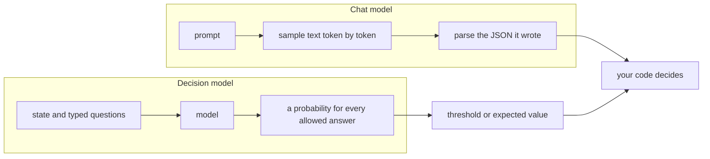
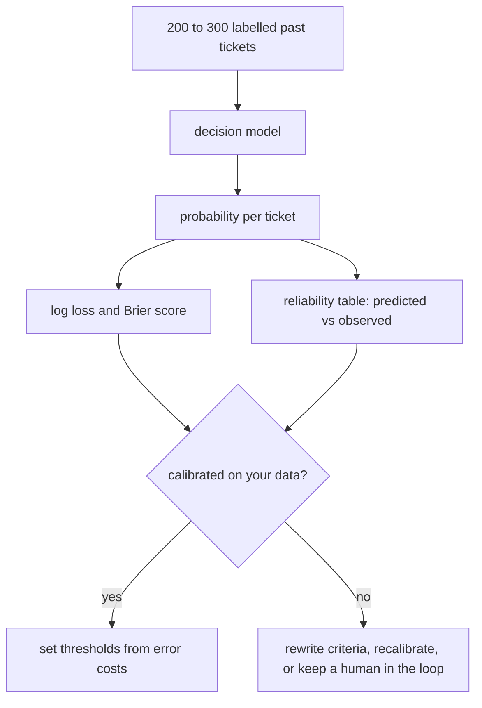

# Decision models: when an LLM answers with probabilities, not text

> Fresh · AI / ML foundations · Intermediate · ~25 min · from today's feeds

## Why this matters
"Decision models" are a new kind of LLM API: you send text plus typed questions and get back a probability for every allowed answer instead of generated text.

TypeSafe AI's Jev opened the category (written up by Simon Willison on 2026-09-21), and Cloudflare shipped its own open-weight pair, Clef and Clef-flash, on Workers AI on 2026-10-01 (Cloudflare changelog, 2026-10-01).

It is today's core lesson in production clothes — a model that answers in probabilities is only as useful as those probabilities are on *your* data — and you already have the use cases: operator ticket triage, refund detection, agent guardrails, routing.

## Primer
This item previews rungs 09 (logistic regression), 32 (calibration), 33 (Jev) and 34 (Clef) of your AI/ML ladder; you are on rung 01. Three ideas carry you through it.

**Scores become probabilities.** A classifier computes one raw score (a *logit*) per allowed answer, then softmax turns the scores into probabilities that are positive and sum to 1: p_k = exp(z_k) / Σ_j exp(z_j). For a yes/no question this is the sigmoid (rung 09, "Logistic regression: from scores to probabilities"). A chat LLM does exactly this over its whole vocabulary at every step, then *samples* one token and moves on.

**A loss for probabilities.** Today's core lesson scored numeric predictions with MAE and MSE (IT Iaido 2026-10-05-1, "What machine learning actually optimises"). For classes the standard loss is *log loss*: an example costs −ln(probability given to the correct answer). Being 0.99 sure and right costs 0.01; being 0.99 sure and wrong costs ln(100) ≈ 4.6. Because confident mistakes are punished so hard, log loss rewards honest probabilities; so does the *Brier score*, the mean squared error between the predicted probability and the 0/1 truth. Both are "proper scoring rules" (rung 32).

**Calibration.** A model is calibrated when, among all the cases it scores 0.8, about 80% turn out true. Accuracy and calibration are different properties: two models can be right equally often while one of them is badly overconfident. Like generalisation in the core lesson, calibration is measured on held-out labelled data, never assumed.

## The idea

### The contract changes
A chat model's contract is "prompt in, sampled text out". When you use one as a classifier, you ask for JSON, parse it, retry on garbage, and any `"confidence": 0.9` it writes is just more sampled text, not a measurement. A decision model drops the text step:

> "Jev is an interesting variant on the usual LLM format: it still accepts text inputs, but instead of text output it returns floating point numbers corresponding to categories, yes/no questions, ratings, and associated confidence scores."
> — Simon Willison, *Jev introduces a new shape of LLM—System One, aka Decision Models*, 2026-09-21, https://simonwillison.net/2026/Sep/21/jev/

TypeSafe's own one-liner, which Willison quotes in the same post, is "unstructured state in, typed probabilistic decisions out". "System One" borrows Kahneman's name for the fast, automatic mode of thinking, as opposed to the slow, deliberate System 2 (Kahneman, *Thinking, Fast and Slow*, Part I, ch. 1 "The Characters of the Story"): a judgement, not a chain of reasoning.

Cloudflare's Clef makes the contract explicit with three question types, each defined by what it returns:

> "noul: A yes/no question. Returns the probability that the answer is yes." "choice: Pick one option from a set you define. Returns the chosen option, a probability per option, and a confidence value." "score: Rate against an ordered rubric. Returns a probability-weighted score and a probability per level."
> — Cloudflare, *Introducing Clef: Cloudflare's first open-source decision models, now on Workers AI*, 2026-10-01, https://developers.cloudflare.com/changelog/post/2026-10-01-clef-workers-ai/

Because the questions are typed, so are the answers: you cannot get back an option you did not list, and there is nothing to parse.



Neither vendor's post explains how the probabilities are produced inside the model, so treat the internals as a black box. What you can reason about is the output, because it must obey the Primer's rules: one probability per allowed answer, summing to 1.

### Reading a real response
Flavio Copes' walkthrough sends Clef-flash a single ticket — "The export button crashes the settings page in Safari…" — with three questions, and shows the response (Copes, *A deep dive into Clef*, 2026-10-01):

- `category` (choice): bug_report 0.9664, feature_request 0.0135, billing 0.0058, other 0.0143; `confidence` 0.9126.
- `severity` (score on a rubric 0 cosmetic, 1 workaround exists, 2 blocking): probabilities 0.0636, 0.766, 0.1704; `score` 1.1069; `confidence` 0.4298.
- `has_repro_steps` (noul): 0.5355.
- `usage`: 395 input tokens, 0 output tokens.

Three things to notice. First, `score` is the expected rubric level: 0×0.0636 + 1×0.766 + 2×0.1704 = 1.1068, equal to the shown 1.1069 up to rounding of the displayed probabilities — a point estimate with the spread behind it. Second, 0.5355 on repro steps is the model saying "I can't tell": the ticket names a browser but gives no steps. A chat model would have written "yes" or "no" and hidden the coin flip. Third, the `confidence` field is not defined in the sources I read. Both values match (Σp² − 1/K)/(1 − 1/K) to four decimals — 0 for a uniform spread over K answers, 1 for certainty — but that is my inference from two examples, not documented behaviour. You will recompute it in the lab.

### Probabilities hand the decision back to you

> "You pose a statement and get back a floating point number between 0 and 1 for how confident the model is that the statement is true."
> — Simon Willison, *Jev introduces a new shape of LLM—System One, aka Decision Models*, 2026-09-21, https://simonwillison.net/2026/Sep/21/jev/

Once the answer is a number, the policy lives in your code. Copes' Worker example sends a message to a human when the team choice's `confidence` is below 0.5 and pages on-call when the `urgent` probability is above 0.8 (Copes, 2026-10-01). Those thresholds are product decisions — what does a wrongly auto-approved refund cost, against an operator waiting an hour for a person? — and as Product Owner that trade-off is yours.

A threshold of 0.8 only works if 0.8 means "right about 80% of the time" on *your* traffic. That is the core lesson again: what counts is performance on unseen data from the distribution you will serve, and vendor numbers come from vendor data. So the first job with any decision model is an evaluation on your own labelled examples, scored with a proper loss, before a threshold ships:



### Cost, speed and the competition

> "Jev charges only for input—output is free—and the input price of their first model is $0.042 per million tokens—cheaper even than OpenAI's GPT-5 Nano ($0.05/million)."
> — Simon Willison, *Jev introduces a new shape of LLM—System One, aka Decision Models*, 2026-09-21, https://simonwillison.net/2026/Sep/21/jev/

Willison adds that questions are evaluated in parallel, so asking many takes about as long as asking one (Willison, 2026-09-21). Cloudflare reports median latency of 209.3 ms for Clef (27B parameters) and 38.8 ms for Clef-flash (9B) against 524.1 ms for Jev, and says Clef leads on 7 of 10 decision benchmarks; both have a 64K context and Apache 2.0 weights on Hugging Face (Cloudflare changelog, 2026-10-01). Copes cautions that those benchmarks are self-reported, that Jev does better on the reasoning-heavy ones, that Clef costs 2–6× more per token than Jev, and that image requests took 13–30 s on launch day (Copes, 2026-10-01). The shape is reaching local inference too: the Hugging Face blog index lists "New in llama.cpp: Decision Models" by ggml-org (Hugging Face blog, accessed 2026-10-05).

### When to reach for one

> "It's great for anything that can be expressed as a classification task—think spam detection, suggesting labels, prioritization and ranking."
> — Simon Willison, *Jev introduces a new shape of LLM—System One, aka Decision Models*, 2026-09-21, https://simonwillison.net/2026/Sep/21/jev/

For you that means triaging tickets from car-wash operators, flagging refund requests, guarding agents ("does this tool call touch payments?") and routing between agents or models. It is the wrong tool when you need text, an explanation, or an answer outside a closed set. And the category is two weeks old (Jev 2026-09-21, Clef 2026-10-01, sources below), so put it behind your own interface — a Scala `Decider` trait returning `Map[Answer, Double]` — and let an eval, not a launch post, pick the implementation.

## Lab
About 8 minutes; Python 3, standard library only. Save as `decision_lab.py` and run `python3 decision_lab.py`.

```python
import math

# Part A: re-derive two fields of the sample Clef response (Copes, 2026-10-01)
sev = {0: 0.0636, 1: 0.766, 2: 0.1704}          # severity rubric level -> probability
cat = [0.9664, 0.0135, 0.0058, 0.0143]           # category probabilities

print("score    =", round(sum(k * p for k, p in sev.items()), 4))   # response shows 1.1069

def peakedness(ps):  # my guess at `confidence`: 0 = uniform, 1 = certain
    k = len(ps)
    return (sum(p * p for p in ps) - 1 / k) / (1 - 1 / k)

print("conf sev =", round(peakedness(list(sev.values())), 4))      # response shows 0.4298
print("conf cat =", round(peakedness(cat), 4))                      # response shows 0.9126

# Part B: two models answer "Does this message ask for a refund?" on 10 labelled
# operator messages (toy numbers invented for this drill)
y      = [1,    1,    1,    1,    1,    0,    0,    0,    0,    1]
honest = [0.9,  0.8,  0.7,  0.9,  0.6,  0.2,  0.1,  0.3,  0.2,  0.4]
cocky  = [0.99, 0.99, 0.99, 0.99, 0.99, 0.01, 0.01, 0.01, 0.01, 0.01]

def report(name, ps):
    n = len(y)
    acc   = sum((p >= 0.5) == (t == 1) for p, t in zip(ps, y)) / n
    logl  = -sum(math.log(p if t else 1 - p) for p, t in zip(ps, y)) / n
    brier = sum((p - t) ** 2 for p, t in zip(ps, y)) / n
    print(f"{name:7} accuracy={acc:.2f}  log_loss={logl:.3f}  brier={brier:.3f}")
    for lo, hi in [(0.0, 0.5), (0.5, 1.01)]:          # 2-bin reliability table
        b = [(p, t) for p, t in zip(ps, y) if lo <= p < hi]
        said = sum(p for p, _ in b) / len(b)
        saw  = sum(t for _, t in b) / len(b)
        print(f"         bin [{lo:.1f},{min(hi, 1):.1f}): n={len(b)}  said {said:.2f}  observed {saw:.2f}")

report("honest", honest)
report("cocky", cocky)
```

Expected output:

```text
score    = 1.1068
conf sev = 0.4298
conf cat = 0.9125
honest  accuracy=0.90  log_loss=0.313  brier=0.085
         bin [0.0,0.5): n=5  said 0.24  observed 0.20
         bin [0.5,1.0): n=5  said 0.78  observed 1.00
cocky   accuracy=0.90  log_loss=0.470  brier=0.098
         bin [0.0,0.5): n=5  said 0.01  observed 0.20
         bin [0.5,1.0): n=5  said 0.99  observed 1.00
```

What to read from it:

1. **Part A** reproduces the response: `score` is the expectation over rubric levels, and the peakedness formula hits both `confidence` values (0.9125 against 0.9126 is display rounding).
2. **Part B**: both models get 9 of 10 right, so accuracy cannot tell them apart. Log loss can: the cocky model's single miss (0.01 on a real refund request) costs −ln(0.01) ≈ 4.6 on its own, which is 0.46 of its 0.470 average. Its low bin says 0.01 and observes 0.20 — overconfident exactly where an auto-reject threshold would sit. The honest model is underconfident in its high bin (says 0.78, observes 1.00): imperfect, but not dangerous. With five examples per bin this is a drill, not evidence; a real check uses a few hundred labelled messages and looks hardest at the bins around your threshold.
3. **Optional, live (needs a Cloudflare account and a Workers AI API token):** the request shape below is adapted from Copes' example to a car-wash ticket; compare the `noul` and `probabilities` you get with your own judgement.

```bash
curl https://api.cloudflare.com/client/v4/accounts/$CLOUDFLARE_ACCOUNT_ID/ai/run/@cf/cloudflare/clef-flash \
  -X POST \
  -H "Authorization: Bearer $CLOUDFLARE_AUTH_TOKEN" \
  -d '{
    "model": "clef-flash",
    "state": { "message": "Bay 3 took the payment but the wash never started. Customer wants the money back." },
    "questions": {
      "refund": { "type": "noul", "instructions": "Does `message` ask for a refund?" },
      "area": {
        "type": "choice",
        "instructions": "Which area does `message` concern?",
        "criteria": {
          "payments": "Card terminal, charges, refunds",
          "hardware": "Wash equipment, sensors, gates",
          "software": "POS app, reports, configuration",
          "other": null
        }
      }
    }
  }'
```

## Self-check
1. Clef returns `noul: 0.54` for "Does the ticket include steps to reproduce?". What should your code do with it, and why is this more useful than a chat model answering "yes"? <details><summary>Answer</summary>Treat it as "unknown": it is below any sensible act-automatically threshold, so route the ticket to a person or ask the reporter for steps. A chat model would collapse the same uncertainty into a confident-looking token and hide that it was a coin flip. The number is only trustworthy if the model is calibrated on your tickets, which you check on labelled data.</details>
2. Two decision models score the same accuracy on 300 of your labelled refund messages, but model A has log loss 0.21 and model B 0.38. You plan to auto-approve refunds when p ≥ 0.9. Which do you pick, and what else do you check first? <details><summary>Answer</summary>Model A: with equal accuracy, the lower log loss means fewer confident mistakes, which is exactly what an auto-approve rule at 0.9 depends on. Before shipping, check the reliability table for the ≥ 0.9 bin specifically (does it observe roughly 90% or more true refunds?) and price the false approvals that remain against the cost of human review.</details>
3. Cloudflare reports Clef leading on 7 of 10 decision benchmarks and Clef-flash at 38.8 ms median latency (Cloudflare changelog, 2026-10-01). Why is that not enough to choose it for your platform, and what is the cheapest experiment that settles it? <details><summary>Answer</summary>The figures are vendor-reported on vendor data (Copes notes the benchmarks are self-reported and that Jev wins the reasoning-heavy ones), and the core lesson says what matters is performance on unseen data from your own distribution. Label 200–300 past operator tickets, ask Jev and Clef the same typed questions, and compare log loss, Brier score, the reliability table near your thresholds, latency and cost per thousand tickets.</details>

## Sources
- [Jev introduces a new shape of LLM—System One, aka Decision Models](https://simonwillison.net/2026/Sep/21/jev/) — Simon Willison, 2026-09-21 — the definition of the shape, TypeSafe's "state in, decisions out" line, the 0-to-1 yes/no output, input-only pricing, parallel questions, the classification fit; all four blockquotes (accessed 2026-10-05)
- [Introducing Clef: Cloudflare's first open-source decision models, now on Workers AI](https://developers.cloudflare.com/changelog/post/2026-10-01-clef-workers-ai/) — Cloudflare, 2026-10-01 — the noul/choice/score question types and what each returns, model sizes, context, licence, vendor latency and benchmark figures (accessed 2026-10-05)
- [A deep dive into Clef, Cloudflare's decision model](https://flaviocopes.com/clef/) — Flavio Copes, 2026-10-01 — the sample request and response used in "Reading a real response" and the lab, the Worker routing thresholds, cost and launch-day latency caveats, the self-reported benchmark caveat (accessed 2026-10-05)
- [Hugging Face blog](https://huggingface.co/blog) — Hugging Face, index page — the "New in llama.cpp: Decision Models" post title as a sign of local-inference support (accessed 2026-10-05)
- Daniel Kahneman, *Thinking, Fast and Slow* (2011) — Part I, ch. 1 "The Characters of the Story" — the System 1 / System 2 vocabulary behind the "System One" label
