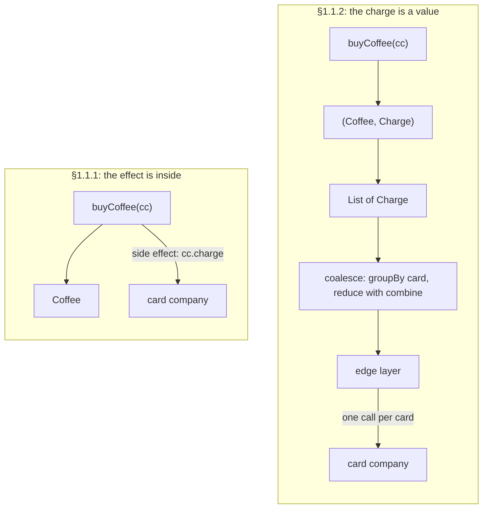

# What is FP: referential transparency and the substitution model

> Functional Programming in Scala (red book) · Beginner · ~30 min · rung 1 of 26 · needs: —

## Why this matters
Chapter 1 gives the argument behind habits you already have: a function that does more than return a value cannot be tested, reused or reasoned about locally, and the fix is to return the effect as a value and perform it at the edge.
It also introduces the substitution model, the check every later chapter uses to prove a refactoring kept the program's meaning.

## The idea

> Chapter map: Functional Programming in Scala (2nd ed.), ch. 1 "What is functional programming?" — §1.1 Understanding the benefits of functional programming (§1.1.1 A program with side effects, §1.1.2 A functional solution: Removing the side effects), §1.2 Exactly what is a (pure) function?, §1.3 Referential transparency, purity, and the substitution model, §1.4 Conclusion, then an unnumbered Summary.
> Section titles as listed in Manning liveBook, https://livebook.manning.com/book/functional-programming-in-scala-second-edition/chapter-1

1st edition: same §1.2 and §1.3; §1.1 is titled "The benefits of FP: a simple example", §1.4 is "Summary", and the code is in Scala 2 syntax.

### §1.1 Understanding the benefits of functional programming
The chapter opens with the premise: FP means building programs only from **pure functions**, functions with no **side effects**. A side effect is anything a function does besides returning its result: reassigning a variable, modifying a data structure in place, setting a field on an object, throwing an exception or halting with an error, printing or reading the console, reading or writing a file, drawing on the screen (ch. 1 intro). The obvious objection is that real programs need all of these. The book's answer is that FP restricts *how* you write programs, not *what* programs you can express. The rest of the book shows how. This chapter shows why, using one example.

#### §1.1.1 A program with side effects
A coffee shop, `Cafe`, sells a cup and charges a credit card:

```scala
class Cafe:
  def buyCoffee(cc: CreditCard): Coffee =
    val cup = Coffee()
    cc.charge(cup.price)   // side effect: actually charges the card
    cup
```

The signature promises `CreditCard => Coffee`. The body also contacts the card company, authorises the transaction, charges the card and stores a record. None of that shows up in the return value. The book names three problems:

- **Testing.** You do not want a test to contact a real card company, and the return value says nothing about the charge.
- **Design.** `CreditCard` should not know how to reach the card company or store records.
- **The first fix.** Pass the dependency in:

```scala
class Cafe:
  def buyCoffee(cc: CreditCard, p: Payments): Coffee =
    val cup = Coffee()
    p.charge(cc, cup.price)
    cup
```

This is better, because `Payments` can be an interface with a mock in tests. It is still not good. `Payments` has to be an interface even when one concrete class would do. The mock must keep internal state that the test inspects after the call. And `p.charge` is still a side effect. **Reuse** is still broken too. If Alice orders 12 coffees, calling `buyCoffee` 12 times means 12 charges and 12 processing fees. Avoiding that means a new `buyCoffees` with its own logic, or a batching `Payments` that has to guess when to send. Either way you cannot simply reuse `buyCoffee` (§1.1.1).

#### §1.1.2 A functional solution: Removing the side effects
The fix is to **return the charge as a value** instead of performing it. This separates *creating* a charge from *processing* (interpreting) it:

```scala
class Cafe:
  def buyCoffee(cc: CreditCard): (Coffee, Charge) =
    val cup = Coffee()
    (cup, Charge(cc, cup.price))

case class Charge(cc: CreditCard, amount: Double):
  def combine(other: Charge): Charge =
    if cc == other.cc then Charge(cc, amount + other.amount)
    else throw Exception("Can't combine charges with different cards")
```

`combine` merges two charges to the same card. It throws on different cards, and the book notes that chapter 4 replaces exceptions with something better. Buying many cups now reuses `buyCoffee` directly:

```scala
  def buyCoffees(cc: CreditCard, n: Int): (List[Coffee], Charge) =
    val purchases: List[(Coffee, Charge)] = List.fill(n)(buyCoffee(cc))
    val (coffees, charges) = purchases.unzip
    (coffees, charges.reduce((c1, c2) => c1.combine(c2)))
```

Twelve cups give one `Charge`. A test compares returned values, with no mock and no `Payments` interface. `Cafe` no longer knows how charges are processed. Someone still has to process them, but that code lives elsewhere. Because `Charge` is now a first-class value, you can write logic over it. `coalesce` merges a day's charges into one per card:

```scala
def coalesce(charges: List[Charge]): List[Charge] =
  charges.groupBy(_.cc).values.map(_.reduce(_.combine(_))).toList
```

It passes functions as values to `groupBy`, `map` and `reduce`, which chapter 2 explains. The conclusion of §1.1 is that the effect was not removed but **moved**. The decision (which cups, which card, how much) is now data. The one place that talks to the payment system sits at the edge. The book applies this discipline at every level of a program.

Beyond the book: the Scala 3 Book gives the same shape as advice:

> "Write the core of your application using pure functions, and then write an impure "wrapper" around that core to interact with the outside world."
>
> — Scala contributors, *Scala 3 Book — Pure Functions*, undated, https://docs.scala-lang.org/scala3/book/fp-pure-functions.html



### §1.2 Exactly what is a (pure) function?
A function `f: A => B` relates every value `a: A` to exactly one `b: B`, and `b` is determined **only** by `a`. Changes in internal or external state play no part in computing `f(a)`, and `f` does nothing observable except return `b` (§1.2). Examples: `intToString: Int => String` is a pure function. So is `+` on integers. So is `length` on a `String`, which gives the same answer for the same string every time.

The section then gives an informal definition. An expression is **referentially transparent (RT)** if it can be replaced by its result anywhere in a program without changing what the program means. `2 + 3` can be replaced by `5` everywhere. A function is **pure** if calling it with RT arguments is also RT (§1.2).

Beyond the book: the Scala 3 Book states the same idea as three conditions:

> "A function `f` is pure if, given the same input `x`, it always returns the same output `f(x)`"; "The function's output depends *only* on its input variables and its implementation"; "It only computes the output and does not modify the world around it".
>
> — Scala contributors, *Scala 3 Book — Pure Functions*, undated, https://docs.scala-lang.org/scala3/book/fp-pure-functions.html

### §1.3 Referential transparency, purity, and the substitution model
§1.3 states both definitions precisely. The order matters, because purity is defined *in terms of* RT:

- An expression `e` is **referentially transparent** if, for all programs `p`, every occurrence of `e` in `p` can be replaced by the result of evaluating `e` without changing the meaning of `p`.
- A function `f` is **pure** if the expression `f(x)` is referentially transparent for all referentially transparent `x`.

Apply this to the first `buyCoffee`. Whatever `p` is, `p(buyCoffee(aliceCreditCard))` and `p(Coffee())` do not mean the same thing. The first charges Alice's card and the second does not. So the call is not RT and `buyCoffee` is not pure. The §1.1.2 version returns `(Coffee, Charge)` and does nothing else, so replacing the call by that pair changes nothing.

RT gives you the **substitution model**: you evaluate a program by replacing equals with equals until you reach a value, the same equational reasoning used in school algebra. The book's pair of examples:

```scala
val x = "Hello, World"
val r1 = x.reverse     // dlroW ,olleH
val r2 = x.reverse     // dlroW ,olleH
// substitute x:  "Hello, World".reverse  twice — same results

// a fresh REPL session, as in the book
val x = new StringBuilder("Hello")
val y = x.append(", World")
val r1 = y.toString    // Hello, World
val r2 = y.toString    // Hello, World
// substitute y:  x.append(", World").toString  twice
//                r1 = Hello, World   r2 = Hello, World, World
```

Substituting `x` in the `String` case preserves every result, so `reverse` is pure. Substituting `y` in the `StringBuilder` case changes `r2`. `append` mutates `x`, so the two "identical" expressions run against different states of the same object. `append` is not pure (§1.3).

The section's conclusion is about what purity buys. With the substitution model, reasoning is **local**: to understand an expression you need its definition and its arguments, not the history of state changes before it. Pure functions are also **modular**. A pure function is a black box: input arrives only through arguments and output is only returned. That separates the logic of the computation from how the input is obtained and what happens to the result. This is why pure code is easier to test, reuse, parallelise, generalise and reason about (§1.3).

Beyond the book: the companion wiki notes that this definition is deliberately simple. Whether something counts as a side effect depends on who is observing:

> "Our definition of referential transparency in the chapter is a little bit simplistic, but it serves our purposes for the time being." "For example, the fact that memory allocations occur as a side effect of data construction is not something we usually care to track or are even able to observe on the JVM."
>
> — fpinscala contributors, *Chapter 1: What is functional programming?* (wiki), undated, https://github.com/fpinscala/fpinscala/wiki/Chapter-1:-What-is-functional-programming%3F

### §1.4 Conclusion
FP is programming with pure functions. The chapter showed *what* that means: RT expressions and the substitution model. It showed *why* it pays off: the Cafe example, where effects moved to the edge made code testable and composable. *How* to write real programs this way (loops, data structures, errors, I/O) is the rest of the book. Chapter 2 starts with recursion and higher-order functions. The chapter's unnumbered Summary repeats the main points:

- FP builds programs from pure functions, which have no side effects.
- A side effect is anything a function does besides returning a result.
- RT means an expression can be replaced by its result without changing the program's meaning. Purity is defined through RT.
- The substitution model lets you reason locally. Pure functions are modular: easier to test, reuse and combine.
- Programs with effects are written by pushing the effects outward, as `buyCoffee` did with `Charge`.

## Lab
**The question:** if you replay the chapter's own Cafe refactorings and its substitution tests, what does each step change? Specifically: what can you test, how many card-network calls does the same order make, and where exactly does substitution break?

Time: about 10 minutes. Chapter 1 has no numbered exercises (in the companion repo they start at chapter 2), so the lab replays the chapter's own example. `CafeV1`, `CafeV2` and `Cafe` are the three versions from §1.1. `Network` is a fake card company that counts calls.

### Step 1 — save the script
Save as `ch01.sc` (Scala 3; `scala-cli` needs no project).

```scala
//> using scala 3.3.4

// FP in Scala, 2nd ed., ch. 1: the Cafe refactorings (§1.1) and the substitution test (§1.3).

case class Coffee(price: Double = 2.75)

// A fake card network: the only mutable state in the file, so calls can be counted.
object Network:
  var calls = 0
  def post(card: String, amount: Double): Unit =
    calls += 1
    println(s"    [network] charge card=$card amount=$amount")

case class CreditCard(number: String):
  def charge(amount: Double): Unit = Network.post(number, amount)

trait Payments:
  def charge(cc: CreditCard, amount: Double): Unit

class MockPayments extends Payments:          // a test double that records calls
  var recorded = List.empty[(CreditCard, Double)]
  def charge(cc: CreditCard, amount: Double): Unit = recorded = recorded :+ (cc, amount)

case class Charge(cc: CreditCard, amount: Double):
  def combine(other: Charge): Charge =
    if cc == other.cc then Charge(cc, amount + other.amount)
    else throw Exception("Can't combine charges with different cards")

object CafeV1:                                // §1.1.1: the side effect is inside
  def buyCoffee(cc: CreditCard): Coffee =
    val cup = Coffee()
    cc.charge(cup.price)
    cup

object CafeV2:                                // §1.1.1: a Payments parameter
  def buyCoffee(cc: CreditCard, p: Payments): Coffee =
    val cup = Coffee()
    p.charge(cc, cup.price)
    cup

object Cafe:                                  // §1.1.2: the charge is a value
  def buyCoffee(cc: CreditCard): (Coffee, Charge) =
    val cup = Coffee()
    (cup, Charge(cc, cup.price))

  def buyCoffees(cc: CreditCard, n: Int): (List[Coffee], Charge) =
    val purchases: List[(Coffee, Charge)] = List.fill(n)(buyCoffee(cc))
    val (coffees, charges) = purchases.unzip
    (coffees, charges.reduce((c1, c2) => c1.combine(c2)))

def coalesce(charges: List[Charge]): List[Charge] =
  charges.groupBy(_.cc).values.map(_.reduce(_.combine(_))).toList

val alice = CreditCard("1111")
val bob   = CreditCard("2222")

println("A. CafeV1: buyCoffee charges the card itself")
Network.calls = 0
val cupsA = List(alice, alice, alice, bob, bob, alice).map(CafeV1.buyCoffee)
println(s"  cups: ${cupsA.size}   network calls: ${Network.calls}")

println("B. CafeV2: Payments passed in, tested with a mock")
val mock = MockPayments()
val cupsB = List.fill(12)(CafeV2.buyCoffee(alice, mock))
println(s"  cups: ${cupsB.size}   recorded charges: ${mock.recorded.size}   first: ${mock.recorded.head}")

println("C. Cafe: buyCoffee returns (Coffee, Charge)")
Network.calls = 0
val one = Cafe.buyCoffee(alice)
println(s"  buyCoffee(alice)      = $one")
println(s"  equals expected value : ${one == (Coffee(), Charge(alice, 2.75))}")
val (cupsC, chargeC) = Cafe.buyCoffees(alice, 12)
println(s"  buyCoffees(alice, 12) = ${cupsC.size} cups, $chargeC")
println(s"  network calls: ${Network.calls}")

println("D. coalesce: the order from A as charges, settled at the edge")
val charges = List(alice, alice, alice, bob, bob, alice).map(cc => Cafe.buyCoffee(cc)._2)
println(s"  charges: ${charges.size}")
val settled = coalesce(charges).sortBy(_.cc.number)
settled.foreach(c => println(s"  coalesced: $c"))
Network.calls = 0
settled.foreach(c => c.cc.charge(c.amount))   // the one impure step
println(s"  cups: ${charges.size}   network calls: ${Network.calls}")

println("E. Substitution test on buyCoffee: replace the call by its result")
def p(c: Coffee): Double = c.price            // a tiny "program" that uses a coffee
Network.calls = 0
val e1 = p(CafeV1.buyCoffee(alice))
val callsWithCall = Network.calls
Network.calls = 0
val e2 = p(Coffee())
println(s"  CafeV1: p(buyCoffee(alice)) = $e1, calls = $callsWithCall | p(Coffee()) = $e2, calls = ${Network.calls}")
val f1 = Cafe.buyCoffee(alice)
val f2 = (Coffee(), Charge(alice, 2.75))
println(s"  Cafe  : buyCoffee(alice) = $f1 | its result written out = $f2 | same: ${f1 == f2}")

println("F. String vs StringBuilder (section 1.3)")
locally {
  val x = "Hello, World"
  val r1 = x.reverse
  val r2 = x.reverse
  println(s"  String, x named          : r1 = $r1 | r2 = $r2 | equal: ${r1 == r2}")
  val s1 = "Hello, World".reverse
  val s2 = "Hello, World".reverse
  println(s"  String, x substituted    : r1 = $s1 | r2 = $s2 | equal: ${s1 == s2}")
}
locally {
  val x = new StringBuilder("Hello")
  val y = x.append(", World")
  val r1 = y.toString
  val r2 = y.toString
  println(s"  StringBuilder, y named   : r1 = $r1 | r2 = $r2 | equal: ${r1 == r2}")
}
locally {
  val x = new StringBuilder("Hello")
  val r1 = x.append(", World").toString
  val r2 = x.append(", World").toString
  println(s"  StringBuilder, y inlined : r1 = $r1 | r2 = $r2 | equal: ${r1 == r2}")
}
```

### Step 2 — run it

```bash
scala-cli run ch01.sc
```

Real output. It was captured by compiling exactly this code with the Scala 3.3.4 compiler, wrapped in an object the way `scala-cli` wraps a `.sc` file, and running it on 2026-10-06:

```text
A. CafeV1: buyCoffee charges the card itself
    [network] charge card=1111 amount=2.75
    [network] charge card=1111 amount=2.75
    [network] charge card=1111 amount=2.75
    [network] charge card=2222 amount=2.75
    [network] charge card=2222 amount=2.75
    [network] charge card=1111 amount=2.75
  cups: 6   network calls: 6
B. CafeV2: Payments passed in, tested with a mock
  cups: 12   recorded charges: 12   first: (CreditCard(1111),2.75)
C. Cafe: buyCoffee returns (Coffee, Charge)
  buyCoffee(alice)      = (Coffee(2.75),Charge(CreditCard(1111),2.75))
  equals expected value : true
  buyCoffees(alice, 12) = 12 cups, Charge(CreditCard(1111),33.0)
  network calls: 0
D. coalesce: the order from A as charges, settled at the edge
  charges: 6
  coalesced: Charge(CreditCard(1111),11.0)
  coalesced: Charge(CreditCard(2222),5.5)
    [network] charge card=1111 amount=11.0
    [network] charge card=2222 amount=5.5
  cups: 6   network calls: 2
E. Substitution test on buyCoffee: replace the call by its result
    [network] charge card=1111 amount=2.75
  CafeV1: p(buyCoffee(alice)) = 2.75, calls = 1 | p(Coffee()) = 2.75, calls = 0
  Cafe  : buyCoffee(alice) = (Coffee(2.75),Charge(CreditCard(1111),2.75)) | its result written out = (Coffee(2.75),Charge(CreditCard(1111),2.75)) | same: true
F. String vs StringBuilder (section 1.3)
  String, x named          : r1 = dlroW ,olleH | r2 = dlroW ,olleH | equal: true
  String, x substituted    : r1 = dlroW ,olleH | r2 = dlroW ,olleH | equal: true
  StringBuilder, y named   : r1 = Hello, World | r2 = Hello, World | equal: true
  StringBuilder, y inlined : r1 = Hello, World | r2 = Hello, World, World | equal: false
```

### Reading the output

- **`[network] charge …`**: one line per call to the card company. Fewer is better, because each call is a round trip and a processing fee (§1.1.1).
- **`cups`**: coffees served. It must be the same across designs, or the refactoring changed the product, not the plumbing.
- **`network calls` / `recorded charges`**: the metric being compared, at equal cups.
- **`Charge(CreditCard(nnnn),amount)`**: a charge as plain data. Printing it costs nothing.
- **`equal` / `same`**: whether substituting an expression preserved the result. `true` is what RT gives you.

**Parts A–D (§1.1).** The same six-cup order (Alice ×3, Bob ×2, Alice ×1), plus Alice's 12-cup order from the book:

| part | design | cups | card-network calls | how you test it |
|---|---|---:|---:|---|
| A | `CafeV1`: `cc.charge` inside | 6 | 6 | only by counting real calls |
| B | `CafeV2`: `Payments` passed in | 12 | 12 recorded on the mock | mock with internal state |
| C | `Cafe`: returns `(Coffee, Charge)` | 12 | 0 | `one == (Coffee(), Charge(alice, 2.75))` → `true` |
| D | `Cafe` + `coalesce`, edge pays | 6 | 2 | compare `Charge` values |

Trace the arithmetic. In C, `buyCoffees(alice, 12)` reduces 12 charges of 2.75 with `combine`: `12 × 2.75 = 33.0`, which is one `Charge`. In D, card `1111` has 3 + 1 = 4 cups, `4 × 2.75 = 11.0`. Card `2222` has `2 × 2.75 = 5.5`. The total `11.0 + 5.5 = 16.5` equals A's six charges, `6 × 2.75 = 16.5`. Same cups, same money, 6 calls down to 2.

**Verdict (A–D):** moving `Payments` in (B) made testing possible but kept one charge per cup. Returning `Charge` (C) made the test a plain value comparison and made batching (D) a five-line function. Batching was not bolted on afterwards. It became possible once the charge was a value.

**Part E (§1.3, the book's test on `buyCoffee`).** For `CafeV1`, `p(buyCoffee(alice))` and `p(Coffee())` both return `2.75`, but the first made 1 network call and the second made 0. The program's meaning changed, so the call is not RT. For `Cafe`, the call and its result written out are equal (`same: true`), and nothing else happened.

**Verdict (E):** the return value alone does not tell you whether an expression is RT. You have to check whether anything else happened. `CafeV1.buyCoffee` fails that check and `Cafe.buyCoffee` passes it.

**Part F (§1.3, `String` vs `StringBuilder`).**

| expression | r1 | r2 | equal? |
|---|---|---|---:|
| `String`, `x` named | `dlroW ,olleH` | `dlroW ,olleH` | true |
| `String`, `x` substituted by `"Hello, World"` | `dlroW ,olleH` | `dlroW ,olleH` | true |
| `StringBuilder`, `y` named | `Hello, World` | `Hello, World` | true |
| `StringBuilder`, `y` inlined as `x.append(", World")` | `Hello, World` | `Hello, World, World` | false |

Trace the last row. `x` starts as `Hello` (5 chars). The first `x.append(", World")` mutates it to `Hello, World` (5 + 7 = 12 chars) and returns the same object, so `r1` is `Hello, World`. The second `append` adds to that 12-char buffer, giving 12 + 7 = 19 chars, so `r2` is `Hello, World, World`. In the row above, `y` named the result once. Both `toString` calls read the buffer after a single append, so the answers matched. That is how such a bug hides until someone inlines the `val`.

**Verdict (F):** `x.reverse` is RT and survives substitution. `x.append(", World")` is not RT, and inlining it changes the program. The two code shapes look identical, so you have to check the property, not the shape.

### Cause → consequence

1. **Cause.** `buyCoffee` performed the charge instead of describing it, so part of its result was outside its return type.
2. **Mechanism.** Returning `(Coffee, Charge)` makes the effect a value. Values can be listed, grouped by card and reduced with `combine`. A call that has already run cannot.
3. **Consequence.** The same six-cup order settles in 2 network calls instead of 6, and the logic is tested by comparing `Charge` values, with no mock.
4. **In practice.** For any function in your services, ask whether you can call it twice in a row, in a test or a log line, with no consequences. If not, the effect is in the wrong layer. Before you inline a `val`, hoist an expression out of a loop or reorder two statements, check that the expressions are RT. The `StringBuilder` row shows what a "harmless" inline does when they are not.

## Self-check
1. `def register(u: User): UserId` writes a row to Postgres and returns the new id. Is it pure? What breaks, and what would the signature look like after pushing the effect out? <details><summary>Answer</summary>Not pure: it does something besides returning a value (it writes to a database), so `register(u)` is not referentially transparent — calling it twice is not the same as calling it once and reusing the result. What breaks: you cannot test it without a database, and you cannot batch or retry the writes as data. Pushed out, it returns a description instead, e.g. `def register(u: User): (UserId, InsertUser)` or `def register(u: User): Command`, and one edge layer executes the commands — which is also what lets you batch several inserts into one statement, exactly like `coalesce`.</details>
2. State referential transparency and purity in the book's order, and say which is defined in terms of which. <details><summary>Answer</summary>Referential transparency is a property of an *expression*: `e` is referentially transparent if, for all programs `p`, replacing every occurrence of `e` in `p` by its evaluated result does not change the meaning of `p`. Purity is then defined on top of it: a function `f` is pure if the expression `f(x)` is referentially transparent for all referentially transparent `x` (*FP in Scala* 2nd ed., §1.3). So purity is derived from referential transparency, not the other way round.</details>
3. `coalesce` is implemented with `groupBy` and `reduce(_.combine(_))`. What assumption about `combine` makes that correct, and what happens if a list mixes charges from two cards? <details><summary>Answer</summary>`reduce` applies `combine` in an unspecified association, so `combine` must be associative for the result to be well defined — it is, since it adds `Double` amounts for one fixed card. It is also commutative here, which is why ordering inside a group does not matter. Mixing cards is prevented by construction: `groupBy(_.cc)` means every group shares a card, so the `if cc == other.cc … else throw` inside `combine` can never reach the `throw` from `coalesce`. Called directly on a mixed list, `combine` throws — the partiality is the price of keeping `Charge` a simple pair rather than a map from card to amount.</details>

## Sources
- [Functional Programming in Scala, 2nd ed. (Chiusano, Bjarnason, Pilquist)](https://www.manning.com/books/functional-programming-in-scala-second-edition) — Manning — ch. 1 "What is functional programming?": the intro supplied the premise and the list of side effects. §1.1.1 "A program with side effects" supplied `Cafe`/`buyCoffee`, the `Payments` refactoring and the testing, design and reuse costs. §1.1.2 "A functional solution: Removing the side effects" supplied `Charge`/`combine`/`buyCoffees`/`coalesce`. §1.2 "Exactly what is a (pure) function?" supplied the definition of a function and the informal RT definition. §1.3 "Referential transparency, purity, and the substitution model" supplied the formal definitions, the `buyCoffee` RT test, the `String`/`StringBuilder` example, and local reasoning and modularity. §1.4 "Conclusion" and the Summary supplied the wrap-up. The book is cited inline by section (accessed 2026-10-06).
- [FP in Scala 2nd ed., ch. 1 (Manning liveBook)](https://livebook.manning.com/book/functional-programming-in-scala-second-edition/chapter-1) — Manning — the exact 2nd-edition section titles and numbering used in the chapter map (accessed 2026-10-06)
- [FP in Scala 1st ed., ch. 1 (Manning liveBook)](https://livebook.manning.com/book/functional-programming-in-scala/chapter-1) — Manning — the 1st-edition numbering noted under the chapter map (accessed 2026-10-06)
- [fpinscala companion repo](https://github.com/fpinscala/fpinscala) — Chiusano, Bjarnason, Pilquist and contributors — the `second-edition` branch's exercise layout, which starts at chapter 2. That confirms chapter 1 has no numbered exercises (accessed 2026-10-06)
- [fpinscala wiki: Chapter 1 notes](https://github.com/fpinscala/fpinscala/wiki/Chapter-1:-What-is-functional-programming%3F) — fpinscala contributors — the quoted note that the chapter's RT definition is simplified and that side effects depend on the observer (accessed 2026-10-06)
- [Scala 3 Book: Pure Functions](https://docs.scala-lang.org/scala3/book/fp-pure-functions.html) — Scala contributors, Scala 3 Book › Functional Programming › Pure Functions — the quoted three-condition definition of a pure function and the quoted "pure core, impure wrapper" advice (accessed 2026-10-06)

## Next on this track
Next on Functional Programming in Scala (red book): **Getting started: tail recursion, higher-order and polymorphic functions** (rung 2 of 26, Beginner).
