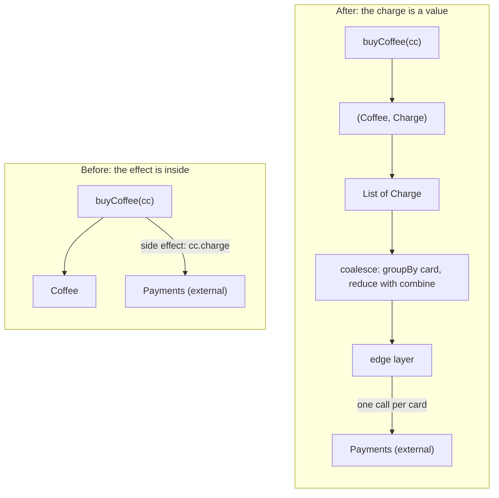

# What is FP: referential transparency and the substitution model

> Functional Programming in Scala (red book) · Beginner · ~15 min · rung 1 of 26 · needs: —

## Why this matters
You already write Scala and already avoid `var`. What chapter 1 of the red book gives you is the *argument* behind the habit, in a form you can use in review: a function that does something besides returning a value cannot be tested, reused, or reasoned about locally, and the fix is mechanical — return the effect as a value and perform it at the edge.
That is also the one tool the rest of this 26-rung track leans on: the substitution model, which is how you check your own refactorings instead of hoping.
The repo already has a definitions note (`02-functional-programming/Functional-Programming-Foundations.md`, "Pure Functions & Referential Transparency"); this rung supplies the reasoning that note skips.

## The idea

### The Cafe, first version (§1.1)
The book opens with a coffee shop (Chiusano, Bjarnason & Pilquist, *FP in Scala* 2nd ed., §1.1). `buyCoffee` takes a credit card, makes a cup, and charges the card:

```scala
def buyCoffee(cc: CreditCard): Coffee =
  val cup = Coffee()
  cc.charge(cup.price)   // a side effect
  cup
```

The signature says `CreditCard => Coffee`. The body does more than that: it talks to a payment system. **A side effect is anything a function does besides returning its result** — mutating a variable or a field, writing to a file or socket, reading hidden state, throwing, calling `println`.

Two concrete costs, both from §1.1:

- **Testing.** To test `buyCoffee` you would have to hit a real payment processor, or stub `CreditCard` with a mock that records calls and then assert on the recording. The interesting question — did it charge the right amount? — is not answerable from the return value, because the return value does not mention the charge.
- **Reuse.** Buying twelve coffees for a round is not `buyCoffee` twelve times: that is twelve payment calls with twelve fees. The logic you want to reuse is welded to the effect, so you cannot batch it. The book's first attempt at a fix, passing a `Payments` interface in, makes the test slightly less painful and the batching problem no better.

### Push the effect out
The book's actual fix changes the return type instead. `buyCoffee` returns the cup *and* a description of the charge:

```scala
case class Charge(cc: CreditCard, amount: Double):
  def combine(other: Charge): Charge =
    if cc == other.cc then Charge(cc, amount + other.amount)
    else throw Exception("can't combine charges to different cards")

def buyCoffee(cc: CreditCard): (Coffee, Charge) =
  val cup = Coffee()
  (cup, Charge(cc, cup.price))
```

Now `buyCoffees(cc, n)` is a fold over `n` charges, and `coalesce` groups a day's charges by card and reduces each group with `combine` — so a list of 50 charges across 20 cards becomes 20 payment calls. The code that talks to the payment system is one layer, at the outer edge, and everything inside it is ordinary data. The Scala 3 Book gives the same shape as advice:

> "Write the core of your application using pure functions, and then write an impure "wrapper" around that core to interact with the outside world."
>
> — Scala contributors, *Scala 3 Book — Pure Functions*, undated, https://docs.scala-lang.org/scala3/book/fp-pure-functions.html



Note what moved: nothing was deleted. Somebody still has to call the payment system. The effect was pushed to one place, and the part you want to test and reuse — which cups, which card, how much — became a value you can inspect, compare and combine.

### Pure, and referentially transparent (§1.2–1.3)
§1.2 defines a **pure function** as one whose return value is determined only by its arguments — `f: A => B` computes a `B` from an `A` and does nothing else. The Scala 3 Book states the same three conditions:

> "A function `f` is pure if, given the same input `x`, it always returns the same output `f(x)`"; "The function's output depends *only* on its input variables and its implementation"; "It only computes the output and does not modify the world around it".
>
> — Scala contributors, *Scala 3 Book — Pure Functions*, undated, https://docs.scala-lang.org/scala3/book/fp-pure-functions.html

§1.3 then makes it precise, and the order matters: **referential transparency is a property of expressions, purity is defined in terms of it.** An expression `e` is referentially transparent if, for every program `p`, replacing every occurrence of `e` in `p` with its evaluated result leaves the meaning of `p` unchanged. A function `f` is pure if the expression `f(x)` is referentially transparent for every referentially transparent `x`.

So "pure" is not a vibe about mutation. It is a testable claim: substitute and see whether the program still means the same thing.

### The substitution model
Substituting equals for equals, repeatedly, until you reach a value — that is the **substitution model**, and it is just the equational reasoning you did in school algebra. It works for any referentially transparent expression and lets you understand a piece of code by looking only at it, with no mental model of the heap or of what ran before.

§1.3 shows where it breaks, with two lines that look alike:

```scala
val x  = "Hello, World"          // String: immutable
val rx = x.reverse               // substitute x and nothing changes

val y  = new StringBuilder("Hello")
val ry = y.append(", World")     // substitute y and the answers diverge
```

Replace `x` by `"Hello, World"` anywhere and every result stays the same. Replace the *name* `y`'s definition into the two places it is used and the second `append` runs on an already-appended builder, so you get `"Hello, World, World"`. One of these you can refactor by inlining a `val`; the other has a bug waiting for whoever inlines it. The lab below runs exactly this.

### Why it pays off on Monday
- **Local reasoning.** The meaning of a pure expression is the expression. You do not need to know what the caller did first, which is the whole difficulty of reading someone else's Akka actor.
- **Modularity.** A `Charge` can be combined, grouped, logged, replayed and diffed because it is data. An already-executed charge cannot.
- **Safe refactoring.** Extracting a `val`, inlining a helper, hoisting a computation out of a loop, reordering two independent statements — all of these are only safe when the expressions involved are referentially transparent. The substitution model is how you check before you touch the code.

## Lab
**The question:** does returning the charge as a value actually change anything measurable, and can you see the substitution model break? The script prints the number of payment calls for the same six-coffee order under both designs, then runs the §1.3 substitution test.

Time: 5–10 minutes.

### Step 1 — save the script

Save this as `ch01.sc`. It is Scala 3; `scala-cli` needs no project.

```scala
//> using scala 3.3.4

// IT Iaido · fp-scala-01 · replays the two worked examples of
// Functional Programming in Scala, 2nd ed., ch. 1 (§1.1 and §1.3).

case class CreditCard(number: String)
case class Coffee(price: Double = 2.75)

case class Charge(cc: CreditCard, amount: Double):
  def combine(other: Charge): Charge =
    require(cc == other.cc, "cannot combine charges to different cards")
    Charge(cc, amount + other.amount)

object Payments:                        // the only impure thing in the file
  var calls = 0
  def charge(cc: CreditCard, amount: Double): Unit =
    calls += 1
    println(s"    [network] POST /charge card=${cc.number} amount=$amount")

val alice = CreditCard("1111")
val bob   = CreditCard("2222")

// ---------- Step 1: the effect is inside buyCoffee (§1.1) ----------
def buyCoffeeImpure(cc: CreditCard): Coffee =
  val cup = Coffee()
  Payments.charge(cc, cup.price)
  cup

println("Step 1 - buyCoffee charges the card itself")
Payments.calls = 0
val cups1 = List.fill(3)(buyCoffeeImpure(alice)) ++
            List.fill(2)(buyCoffeeImpure(bob))   ++
            List(buyCoffeeImpure(alice))
println(s"  cups: ${cups1.size}   payment calls: ${Payments.calls}")

// ---------- Step 2: buyCoffee returns (Coffee, Charge) (§1.1) ----------
def buyCoffee(cc: CreditCard): (Coffee, Charge) =
  val cup = Coffee()
  (cup, Charge(cc, cup.price))

def buyCoffees(cc: CreditCard, n: Int): (List[Coffee], Charge) =
  val purchases: List[(Coffee, Charge)] = List.fill(n)(buyCoffee(cc))
  val (coffees, charges) = purchases.unzip
  (coffees, charges.reduce(_ combine _))

def coalesce(charges: List[Charge]): List[Charge] =
  charges.groupBy(_.cc).toList.sortBy(_._1.number).map { case (_, cs) => cs.reduce(_ combine _) }

println()
println("Step 2 - buyCoffee returns (Coffee, Charge)")
Payments.calls = 0
List.fill(3)(buyCoffee(alice)).foreach { case (_, ch) => println(s"  per-cup charge: $ch") }
val (aliceCups, aliceCharge) = buyCoffees(alice, 3)
val (bobCups,   bobCharge)   = buyCoffees(bob, 2)
val (oneCup,    oneCharge)   = buyCoffee(alice)
println(s"  buyCoffees(1111, 3) -> $aliceCharge")
println(s"  buyCoffees(2222, 2) -> $bobCharge")
println(s"  buyCoffee(1111)     -> $oneCharge")
val charges = List(aliceCharge, bobCharge, oneCharge)
println(s"  payment calls so far: ${Payments.calls}")
println("  grouped by card:")
charges.groupBy(_.cc).toList.sortBy(_._1.number).foreach { case (card, cs) =>
  println(s"    ${card.number} -> ${cs.map(_.amount).mkString(", ")}")
}
val settled = coalesce(charges)
settled.foreach(c => println(s"  coalesced: $c"))
settled.foreach(c => Payments.charge(c.cc, c.amount))     // the edge, once per card
println(s"  cups: ${aliceCups.size + bobCups.size + 1}   payment calls: ${Payments.calls}")

// ---------- Step 3: the substitution model (§1.3) ----------
println()
println("Step 3 - the substitution model")
val x   = "Hello, World"
val r1  = x.reverse
val r2  = x.reverse
println(s"  String, x bound            : r1 = $r1 | r2 = $r2 | r1 == r2: ${r1 == r2}")
val r1s = "Hello, World".reverse        // x replaced by its value
val r2s = "Hello, World".reverse
println(s"  String, x substituted      : r1 = $r1s | r2 = $r2s | r1 == r2: ${r1s == r2s}")

val sb  = new StringBuilder("Hello")
val y   = sb.append(", World")
val r1b = y.toString
val r2b = y.toString
println(s"  StringBuilder, y bound     : r1 = $r1b | r2 = $r2b | r1 == r2: ${r1b == r2b}")

val sb2 = new StringBuilder("Hello")
val r1c = sb2.append(", World").toString   // y replaced by its definition
val r2c = sb2.append(", World").toString
println(s"  StringBuilder, y substituted: r1 = $r1c | r2 = $r2c | r1 == r2: ${r1c == r2c}")
```

### Step 2 — run it

```bash
scala-cli run ch01.sc
```

Expected output:

```text
Step 1 - buyCoffee charges the card itself
    [network] POST /charge card=1111 amount=2.75
    [network] POST /charge card=1111 amount=2.75
    [network] POST /charge card=1111 amount=2.75
    [network] POST /charge card=2222 amount=2.75
    [network] POST /charge card=2222 amount=2.75
    [network] POST /charge card=1111 amount=2.75
  cups: 6   payment calls: 6

Step 2 - buyCoffee returns (Coffee, Charge)
  per-cup charge: Charge(CreditCard(1111),2.75)
  per-cup charge: Charge(CreditCard(1111),2.75)
  per-cup charge: Charge(CreditCard(1111),2.75)
  buyCoffees(1111, 3) -> Charge(CreditCard(1111),8.25)
  buyCoffees(2222, 2) -> Charge(CreditCard(2222),5.5)
  buyCoffee(1111)     -> Charge(CreditCard(1111),2.75)
  payment calls so far: 0
  grouped by card:
    1111 -> 8.25, 2.75
    2222 -> 5.5
  coalesced: Charge(CreditCard(1111),11.0)
  coalesced: Charge(CreditCard(2222),5.5)
    [network] POST /charge card=1111 amount=11.0
    [network] POST /charge card=2222 amount=5.5
  cups: 6   payment calls: 2

Step 3 - the substitution model
  String, x bound            : r1 = dlroW ,olleH | r2 = dlroW ,olleH | r1 == r2: true
  String, x substituted      : r1 = dlroW ,olleH | r2 = dlroW ,olleH | r1 == r2: true
  StringBuilder, y bound     : r1 = Hello, World | r2 = Hello, World | r1 == r2: true
  StringBuilder, y substituted: r1 = Hello, World | r2 = Hello, World, World | r1 == r2: false
```

This output was reproduced from a line-for-line translation of `ch01.sc` (same structure, `StringBuilder` modelled as a small mutating class), because the course sandbox has no access to Maven Central and therefore cannot download a Scala compiler. The values are arithmetic and string operations with no float rounding, so `scala-cli run ch01.sc` on your machine will confirm them — tell me if any line differs.

### Reading the output

**`[network] POST /charge` lines** — one per call to the payment system. Fewer is better: each one is a round trip and, in the book's framing, a transaction fee.
**`cups`** — coffees served. This must stay the same in both designs, otherwise the refactoring changed the product, not the plumbing.
**`payment calls`** — the metric being compared. Lower is better *at equal cups*.
**`Charge(CreditCard(nnnn),amount)`** — a charge as plain data: which card, how much. It is a value, not an action; printing it costs nothing.
**`r1 == r2: true|false`** — whether substituting the name by its definition preserved the meaning. `true` is what referential transparency buys you.

| design | cups | payment calls | calls per cup |
|---|---:|---:|---:|
| Step 1 — effect inside `buyCoffee` | 6 | 6 | 1.00 |
| Step 2 — charge returned, coalesced at the edge | 6 | 2 | 0.33 |

Trace the arithmetic for card `1111`. Three cups at 2.75 give `2.75 + 2.75 = 5.50`, then `5.50 + 2.75 = 8.25` — that is `buyCoffees(1111, 3)`, one `Charge` built by two `combine` steps, zero network calls. The later single cup adds another `Charge(1111, 2.75)`. `coalesce` groups both under card `1111` (`8.25, 2.75` in the grouped print) and reduces them: `8.25 + 2.75 = 11.00`. Card `2222` has one group, `2.75 + 2.75 = 5.50`. Six cups, total `11.00 + 5.50 = 16.50` — the same money as the six 2.75 charges in Step 1 — delivered in 2 calls instead of 6.

**Verdict (Steps 1–2):** identical cups and identical money, 6 payment calls down to 2, and the only line that touches the network is the last `foreach`. The batching was not an optimisation bolted on afterwards; it became *possible* the moment the charge was a value. Note also that Step 2 calls `buyCoffee(alice)` three times just to print the per-cup charges, before the real work — and that is free, because nothing was charged. In Step 1 that debugging print would have cost three fees.

Now Step 3.

| expression | r1 | r2 | equal? |
|---|---|---|---:|
| `String`, `x` bound | `dlroW ,olleH` | `dlroW ,olleH` | true |
| `String`, `x` substituted by `"Hello, World"` | `dlroW ,olleH` | `dlroW ,olleH` | true |
| `StringBuilder`, `y` bound | `Hello, World` | `Hello, World` | true |
| `StringBuilder`, `y` substituted by `sb.append(", World")` | `Hello, World` | `Hello, World, World` | false |

Trace the last row. `sb` starts as `Hello` (5 chars). The first `sb.append(", World")` mutates it to `Hello, World` (12 chars) and returns the *same* object, so `r1` is `Hello, World`. The second `sb.append(", World")` appends to that 12-char buffer, giving 19 chars, so `r2` is `Hello, World, World`. In the row above, `y` named the result once, both `toString` calls read the same buffer after one append, and the answers matched — which is exactly how such a bug hides until someone inlines the `val`.

**Verdict (Step 3):** `x.reverse` is referentially transparent and survives substitution; `sb.append(", World")` is not, and the substitution changes the program's meaning. The two code shapes are visually identical, so the property, not the shape, is what you have to check.

### Cause → consequence

1. **Cause.** `buyCoffee` performed the charge instead of describing it, so its only observable output was outside its return type.
2. **Mechanism.** Returning `(Coffee, Charge)` makes the effect a value. Values can be put in a `List`, grouped by card, and reduced with `combine`; an executed network call cannot.
3. **Consequence.** The same six-coffee order settles in 2 payment calls instead of 6, and the business logic is testable by comparing `Charge` values — no mock, no payment sandbox.
4. **In practice.** This is the test for your own code: can I call this function twice in a row, in a test or a log line, without consequences? If not, the effect is in the wrong layer. And before you inline a `val`, hoist an expression out of a loop, or reorder two statements, ask whether the expression is referentially transparent — the `StringBuilder` row is what a "harmless" inline looks like when it is not.

## Self-check
1. `def register(u: User): UserId` writes a row to Postgres and returns the new id. Is it pure? What breaks, and what would the signature look like after pushing the effect out? <details><summary>Answer</summary>Not pure: it does something besides returning a value (it writes to a database), so `register(u)` is not referentially transparent — calling it twice is not the same as calling it once and reusing the result. What breaks: you cannot test it without a database, and you cannot batch or retry the writes as data. Pushed out, it returns a description instead, e.g. `def register(u: User): (UserId, InsertUser)` or `def register(u: User): Command`, and one edge layer executes the commands — which is also what lets you batch several inserts into one statement, exactly like `coalesce`.</details>
2. State referential transparency and purity in the book's order, and say which is defined in terms of which. <details><summary>Answer</summary>Referential transparency is a property of an *expression*: `e` is referentially transparent if, for all programs `p`, replacing every occurrence of `e` in `p` by its evaluated result does not change the meaning of `p`. Purity is then defined on top of it: a function `f` is pure if the expression `f(x)` is referentially transparent for all referentially transparent `x` (*FP in Scala* 2nd ed., §1.3). So purity is derived from referential transparency, not the other way round.</details>
3. `coalesce` is implemented with `groupBy` and `reduce(_ combine _)`. What assumption about `combine` makes that correct, and what happens if a list mixes charges from two cards? <details><summary>Answer</summary>`reduce` applies `combine` in an unspecified association, so `combine` must be associative for the result to be well defined — it is, since it adds `Double` amounts for one fixed card. It is also commutative here, which is why ordering inside a group does not matter. Mixing cards is prevented by construction: `groupBy(_.cc)` means every group shares a card, so the `require(cc == other.cc)` inside `combine` can never fail from `coalesce`. Called directly on a mixed list, `combine` throws — the partiality is the price of keeping `Charge` a simple pair rather than a map from card to amount.</details>

## Sources
- [Functional Programming in Scala, 2nd ed. (Chiusano, Bjarnason, Pilquist)](https://www.manning.com/books/functional-programming-in-scala-second-edition) — Manning — ch. 1 "What is functional programming?": §1.1 supplied the Cafe / `buyCoffee` example, the testing and reuse costs, and `Charge` / `coalesce`; §1.2 "Exactly what is a (pure) function?" the definition of a pure function; §1.3 "Referential transparency, purity, and the substitution model" the definition of referential transparency, the substitution model, and the `String` vs `StringBuilder.append` example the lab replays (book cited inline by section; accessed 2026-10-06)
- [Scala 3 Book: Pure Functions](https://docs.scala-lang.org/scala3/book/fp-pure-functions.html) — Scala contributors, Scala 3 Book › Functional Programming › Pure Functions — the quoted three-condition definition of a pure function and the quoted "pure core, impure wrapper" advice, which is the same push-the-effect-to-the-edge move as the book's refactoring (accessed 2026-10-06)

## Next on this track
Next on Functional Programming in Scala (red book): **Getting started: tail recursion, higher-order and polymorphic functions** (rung 2 of 26, Beginner).
