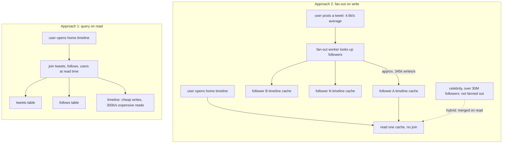

# Reliability, scalability, maintainability — the three concerns

> Designing Data-Intensive Applications · Beginner · ~20 min · rung 1 of 26 · needs: —

## Why this matters
Every later chapter of this book argues a trade-off, and argues it in the vocabulary of chapter 1: fault versus failure, load parameter, percentile, scale up versus scale out, accidental complexity. Skip it and the replication and partitioning chapters read as lists of mechanisms instead of answers to questions you can state.
You already run the Akka and JVM half of this by instinct — supervision, backpressure, p99 dashboards. What the chapter adds is the discipline of writing the assumption down first: which operations are common, what the fan-out is, what the tail looks like.
It also pays off in the Product Owner half of your work, because "reliable" and "scalable" become numbers you can put in an acceptance criterion instead of adjectives in a ticket.

## The idea

> Chapter map: Designing Data-Intensive Applications (Kleppmann, 1st ed.) ch. 1 "Reliable, Scalable, and Maintainable Applications" — §1.1 Thinking About Data Systems, §1.2 Reliability (Hardware Faults, Software Errors, Human Errors, How Important Is Reliability?), §1.3 Scalability (Describing Load, Describing Performance, Approaches for Coping with Load), §1.4 Maintainability (Operability, Simplicity, Evolvability), §1.5 Summary.
> DDIA leaves sections unnumbered, so the §1.x numbers are positional; the names are the chapter's own, per its contents at https://oreilly.com/library/view/designing-data-intensive-applications/9781491903063/ch01.html

### §1.1 Thinking About Data Systems
The chapter refuses the usual categories: databases, caches, queues, search indexes and stream processors are lumped together as **data systems**, because the boundaries blurred — datastores get used as queues, queues acquire database-like durability, and no single tool covers all of an application's data needs (Kleppmann, DDIA ch. 1, "Thinking About Data Systems"). Stitch such tools together behind your own code and the composite is itself a data system whose API makes guarantees — the cache will be invalidated correctly — that clients rely on without seeing the parts. Hence the three concerns the book reuses: **reliability**, **scalability**, **maintainability**.

### §1.2 Reliability
Reliability means continuing to work correctly when things go wrong — the right result at expected performance, tolerating mistakes and abuse (Kleppmann, DDIA ch. 1, "Reliability"). The distinction: a **fault** is one component deviating from its spec, a **failure** is the system as a whole stopping to provide the required service. Fault probability never reaches zero, so you build **fault-tolerant** mechanisms that keep faults from becoming failures, and trigger faults deliberately to prove they work (Chaos Monkey).

**Hardware faults** are the mild case: mostly independent, answered by redundancy. Disks have a mean time to failure of roughly 10 to 50 years, so a cluster with 10,000 disks should expect one disk death per day (Kleppmann, DDIA ch. 1, "Hardware Faults"), and the trend is to tolerate whole-machine loss in software. **Software errors** are the hard case, being systematic and correlated across nodes: one bad input kills every node, a dependency slows or corrupts, a small fault cascades. The chapter's case is the leap second of 30 June 2012, which hung many applications at once through a Linux kernel bug (Kleppmann, DDIA ch. 1, "Software Errors"). **Human errors** dominate in practice: one study found operator configuration errors the leading cause of outages, with hardware faults behind only 10–25% (Kleppmann, DDIA ch. 1, "Human Errors"). The remedies are design, not exhortation: fewer chances to err, a sandbox that decouples where a mistake is made from where it causes failure, testing at every level, fast rollback, gradual rollout, detailed monitoring. Reliability may be traded against cost, but only consciously.

### §1.3 Scalability
Scalability is not a label a system has; it is the question "if the system grows this way, what are our options for coping?" (Kleppmann, DDIA ch. 1, "Scalability").

**Describing Load.** **Load parameters** are requests per second, the read/write ratio, active users, cache hit rate — sometimes the average matters, sometimes only the tail. The example is Twitter, with November 2012 figures: posting a tweet runs at 4.6k requests/sec on average, over 12k requests/sec at peak, while home timeline reads run at 300k requests/sec (Kleppmann, DDIA ch. 1, "Describing Load"). Approach 1 joins tweets and follows on read; approach 2 keeps a per-user timeline cache and writes each new tweet into every follower's cache — **fan-out on write**. Twitter moved to approach 2 because reads outnumber writes by about two orders of magnitude, so it pays to do the work at write time. The catch is the real load parameter: at 75 followers on average, 4.6k posts/sec is about 345k writes/sec into timeline caches, but some accounts exceed 30 million followers, so one such tweet is 30 million cache writes inside a 5-second delivery target (Kleppmann, DDIA ch. 1, "Describing Load"). The deciding parameter is the *distribution* of followers per user weighted by posting rate, and the shipped design is a hybrid: ordinary users fanned out on write, celebrities merged in on read.



**Describing Performance.** Then ask what rising load does: with resources fixed, what degrades; with performance held, what extra resources it costs. Batch systems are judged by throughput, online systems by **response time** — what the client sees, including network delay and queueing — as distinct from **latency**, the time a request waits to be handled (Kleppmann, DDIA ch. 1, "Describing Performance"). Response time is a **distribution**, not a number: random delay comes from a context switch, a TCP retransmission, a garbage-collection pause. So report **percentiles**: p50, the median, is the midpoint with half the requests faster; p95, p99 and p999 describe the tail. Amazon specifies internal response times at the 99.9th percentile although it affects 1 request in 1,000, because the slowest requests belong to the customers with the most data, the most valuable ones, and Amazon has observed that a 100 ms increase in response time reduces sales by about 1% (Kleppmann, DDIA ch. 1, "Describing Performance"). Queueing makes tails fat: a server handles few things in parallel, so one slow request blocks those behind it (head-of-line blocking), which is also why you measure on the client side. Then **tail latency amplification**: a request that fans out to several backends waits for the slowest, so the chance of a slow user request grows with the fan-out (same section). And never average percentiles: a service's p99 comes from adding histograms. Beyond the book, Dean and Barroso quantify backends slow 1 % of the time:

> "If a user request must collect responses from 100 such servers in parallel, then 63% of user requests will take more than one second (marked "x" in the figure)."
>
> — Dean and Barroso, *The Tail at Scale*, 2013, https://research.google/pubs/the-tail-at-scale/

**Approaches for Coping with Load.** **Scaling up** is vertical, one bigger machine; **scaling out** is horizontal, load spread over many smaller machines in a shared-nothing architecture, and good designs mix them. Scaling is **elastic** (resources added automatically on detected load) or **manual** (a human reads capacity and decides): elastic suits unpredictable load, manual brings fewer surprises. Stateless services scale out easily; moving a stateful data system off a single node adds real complexity, which is why common wisdom was to scale a database up until cost or availability forced the move (Kleppmann, DDIA ch. 1, "Approaches for Coping with Load"). The conclusion to keep: there is no one-size-fits-all scalable architecture, no magic scaling sauce. An architecture is built around assumptions about which operations are common and which are rare — the load parameters — so guessing them wrong wastes the work.

### §1.4 Maintainability
Most of the cost of software is maintenance, not the initial build: fixing bugs, keeping it running, adapting it to new use cases, repaying technical debt, adding features (Kleppmann, DDIA ch. 1, "Maintainability"). Three principles follow.

**Operability.** Good operations can often work around bad software, but good software cannot run reliably with bad operations (Kleppmann, DDIA ch. 1, "Operability: Making Life Easy for Operations"). Operations means monitoring and restoring service, tracing causes, capacity planning, deployment, migrations, security, and keeping knowledge alive as people come and go. Software helps by giving visibility into runtime behaviour, automation hooks, independence from any one machine, an understandable operational model ("if I do X, Y happens") and overridable defaults.

**Simplicity.** Systems drift into a big ball of mud — exploding state space, tight coupling, tangled dependencies, inconsistent naming, performance hacks, special cases — which costs schedule and invites bugs. The chapter names the target precisely: **accidental complexity** is complexity not inherent in the problem the software solves, arising only from the implementation (Kleppmann, DDIA ch. 1, "Simplicity: Managing Complexity"). The tool against it is **abstraction**: high-level languages hide machine code, registers and syscalls; SQL hides on-disk structures, concurrency and crash recovery.

**Evolvability.** Requirements change constantly: new use cases, new platforms, legal constraints, growth forcing architectural change. Test-driven development and refactoring answer at the scale of a few files in one application, while the problem here is agility across a data system of several applications and services, hence the separate word **evolvability** (Kleppmann, DDIA ch. 1, "Evolvability: Making Change Easy"). The closing example is Twitter's rewiring from approach 1 to approach 2: how easily a system can be changed follows from its simplicity and its abstractions.

### §1.5 Summary
An application has **functional requirements** (what it must do) and **nonfunctional requirements** (security, reliability, scalability, maintainability). The book keeps using three: reliability, working correctly even when faults occur in hardware, software or humans; scalability, having strategies to keep performance good as load grows, which first needs load and performance in numbers; maintainability, through operability, simplicity and evolvability (Kleppmann, DDIA ch. 1, "Summary"). None has an easy fix, but the same patterns keep reappearing — surveying them is the rest of the book.

## Lab
**The question:** on one endpoint's 20 response times, does the mean tell you what users experienced — and how much does fan-out change the odds of a slow request and the write load of one business event?

Time: about 8 minutes. Pure Python, no dependencies.

### Step 1 — save the script
Save as `ddia_ch01.py`.

```python
# DDIA ch. 1 arithmetic: percentiles, tail-latency amplification, fan-out on write.
import math

# ---------- Part A: mean vs p50/p95/p99 (ch. 1, "Describing Performance") ----------
samples_ms = [21, 15, 1900, 18, 44, 14, 30, 22, 17, 180,
              12, 25, 61, 19, 16, 35, 20, 15, 27, 23]

print("A. Twenty response times, one endpoint, milliseconds")
print("   as measured :", samples_ms)
s = sorted(samples_ms)
n = len(s)
print("   sorted      :", s)
mean = sum(samples_ms) / n
print(f"   sum         = {sum(samples_ms)} ms over n = {n}")
print(f"   mean        = {sum(samples_ms)}/{n} = {mean:.1f} ms")
faster = sum(1 for x in s if x < mean)
print(f"   requests faster than the mean: {faster} of {n} ({100*faster/n:.0f}%)")

def pct(sorted_vals, p):
    """Nearest-rank percentile: the smallest value at or above which p of the sample lies."""
    rank = math.ceil(p / 100 * len(sorted_vals))   # 1-based rank
    return rank, sorted_vals[rank - 1]

for p in (50, 95, 99):
    rank, val = pct(s, p)
    print(f"   p{p:<2d} -> rank = ceil({p}/100 * {n}) = {rank}  -> sorted[{rank-1}] = {val} ms")

print(f"   mean / p50 ratio = {mean:.1f} / {pct(s,50)[1]} = {mean/pct(s,50)[1]:.1f}x")

# ---------- Part B: tail latency amplification (ch. 1, "Describing Performance") ----------
print()
print("B. One slow backend in a hundred, requests that fan out to k backends")
print("   fan-out k | P(all k fast) = 0.99^k | P(request slow) = 1 - 0.99^k")
for k in (1, 2, 5, 10, 20, 100):
    allfast = 0.99 ** k
    print(f"   {k:>9d} | {allfast:>22.6f} | {1-allfast:>26.4%}")

# ---------- Part C: fan-out on write (ch. 1, "Describing Load") ----------
print()
print("C. Car-wash completion event, fan-out on write")
sites = 120
washes_per_site_per_min = 3.0
avg_per_s = sites * washes_per_site_per_min / 60
peak_per_s = 15.5          # measured Saturday-noon peak
print(f"   sites = {sites}, washes per site per minute = {washes_per_site_per_min}")
print(f"   average washes/s = {sites} * {washes_per_site_per_min} / 60 = {avg_per_s:.1f}")
print(f"   peak washes/s    = {peak_per_s}  (peak/average = {peak_per_s/avg_per_s:.2f}x)")

consumers = [("receipts: issue + email row", 1),
             ("loyalty: points ledger row", 1),
             ("loyalty: tier recheck row", 1),
             ("reporting: per-site daily rollup", 1),
             ("reporting: per-chain hourly rollup", 1),
             ("reporting: operator shift stats", 1),
             ("reporting: machine utilisation", 1)]
print("   consumer                             writes/wash   avg writes/s   peak writes/s")
total = 0
for name, w in consumers:
    total += w
    print(f"   {name:<36} {w:>11d} {avg_per_s*w:>14.1f} {peak_per_s*w:>15.1f}")
print(f"   {'TOTAL fan-out':<36} {total:>11d} {avg_per_s*total:>14.1f} {peak_per_s*total:>15.1f}")

# Fan-out on read instead: no downstream writes, but each read joins the raw events.
invoice_events = 22        # washes on one corporate account per month
accounts = 4000
print(f"   fan-out on read: 0 extra writes/s; one monthly invoice joins {invoice_events} raw events,")
print(f"     so invoice night scans {accounts} * {invoice_events} = {accounts*invoice_events} events")
print(f"     against {total} * {avg_per_s:.1f} = {avg_per_s*total:.1f} writes/s saved all month")
```

### Step 2 — run it

```bash
python3 ddia_ch01.py
```

Real output, run on 2026-10-07:

```text
A. Twenty response times, one endpoint, milliseconds
   as measured : [21, 15, 1900, 18, 44, 14, 30, 22, 17, 180, 12, 25, 61, 19, 16, 35, 20, 15, 27, 23]
   sorted      : [12, 14, 15, 15, 16, 17, 18, 19, 20, 21, 22, 23, 25, 27, 30, 35, 44, 61, 180, 1900]
   sum         = 2514 ms over n = 20
   mean        = 2514/20 = 125.7 ms
   requests faster than the mean: 18 of 20 (90%)
   p50 -> rank = ceil(50/100 * 20) = 10  -> sorted[9] = 21 ms
   p95 -> rank = ceil(95/100 * 20) = 19  -> sorted[18] = 180 ms
   p99 -> rank = ceil(99/100 * 20) = 20  -> sorted[19] = 1900 ms
   mean / p50 ratio = 125.7 / 21 = 6.0x

B. One slow backend in a hundred, requests that fan out to k backends
   fan-out k | P(all k fast) = 0.99^k | P(request slow) = 1 - 0.99^k
           1 |               0.990000 |                    1.0000%
           2 |               0.980100 |                    1.9900%
           5 |               0.950990 |                    4.9010%
          10 |               0.904382 |                    9.5618%
          20 |               0.817907 |                   18.2093%
         100 |               0.366032 |                   63.3968%

C. Car-wash completion event, fan-out on write
   sites = 120, washes per site per minute = 3.0
   average washes/s = 120 * 3.0 / 60 = 6.0
   peak washes/s    = 15.5  (peak/average = 2.58x)
   consumer                             writes/wash   avg writes/s   peak writes/s
   receipts: issue + email row                    1            6.0            15.5
   loyalty: points ledger row                     1            6.0            15.5
   loyalty: tier recheck row                      1            6.0            15.5
   reporting: per-site daily rollup               1            6.0            15.5
   reporting: per-chain hourly rollup             1            6.0            15.5
   reporting: operator shift stats                1            6.0            15.5
   reporting: machine utilisation                 1            6.0            15.5
   TOTAL fan-out                                  7           42.0           108.5
   fan-out on read: 0 extra writes/s; one monthly invoice joins 22 raw events,
     so invoice night scans 4000 * 22 = 88000 events
     against 7 * 6.0 = 42.0 writes/s saved all month
```

### Reading the output

**Part A — the summary statistics.** Columns: `sorted` is the sample ordered smallest to largest, since every percentile is a position in that order; `rank` is the 1-based position the percentile picks; `sorted[i]` is the 0-based index Python actually reads. Lower milliseconds are better. `mean / p50 ratio` is a skew detector: at 1.0x the distribution is symmetric, and the further above 1.0x it goes, the more the mean is being dragged by the tail.

| statistic | value | what it answers |
|---|---:|---|
| mean | 125.7 ms | nothing a user experienced |
| p50 (median) | 21 ms | the typical request |
| p95 | 180 ms | the worst of the ordinary requests |
| p99 | 1900 ms | the worst case users actually hit |
| requests faster than the mean | 18 of 20 (90%) | how misleading the mean is here |
| mean / p50 | 6.0x | how skewed the distribution is |

Trace the arithmetic. The sum of the 20 values is 2514 ms, so the mean is 2514/20 = 125.7 ms. The single 1900 ms outlier contributes 1900/20 = 95 ms of that, i.e. 76% of the mean comes from one request in twenty. The median takes a position instead: rank = ceil(0.50 × 20) = 10, so it is the 10th smallest value, `sorted[9]` = 21 ms. p95: rank = ceil(0.95 × 20) = 19 → `sorted[18]` = 180 ms. p99: rank = ceil(0.99 × 20) = 20 → `sorted[19]` = 1900 ms. Note what 20 samples can and cannot support: the p99 here *is* the maximum, so with n = 20 you have one observation standing in for the worst 1% — fine for a demonstration, far too thin for an SLO.

**Verdict (A):** the mean, 125.7 ms, is slower than 18 of the 20 actual requests and 6.0x the median. Reporting it would claim an experience nobody had. p50 = 21 ms, p95 = 180 ms, p99 = 1900 ms describe the same sample without hiding the 1900 ms, which is exactly why DDIA reports percentiles instead of averages (Kleppmann, DDIA ch. 1, "Describing Performance").

**Part B — fan-out and the odds of a slow request.** `fan-out k` is how many backends one user request waits on; `P(all k fast)` = 0.99^k assumes independent calls each slow 1% of the time; `P(request slow)` = 1 − 0.99^k is the share of user requests that hit at least one slow backend. Lower is better, and it only goes up with k.

| fan-out k | P(all k fast) | P(request slow) |
|---:|---:|---:|
| 1 | 0.990000 | 1.0000% |
| 2 | 0.980100 | 1.9900% |
| 5 | 0.950990 | 4.9010% |
| 10 | 0.904382 | 9.5618% |
| 20 | 0.817907 | 18.2093% |
| 100 | 0.366032 | 63.3968% |

Trace k = 10. Each backend is fast with probability 0.99, and the request needs all ten to be fast: 0.99^10 = 0.904382, so 1 − 0.904382 = 0.095618, i.e. 9.5618% (about 9.6%) of user requests are slow. Your backend p99 of 1% has become a user-facing p90 problem without any single service getting worse. The k = 100 row, 63.3968%, reproduces the 63% figure Dean and Barroso quote above for a request collecting responses from 100 servers in parallel.

**Verdict (B):** going from 1 backend to 10 multiplies the share of slow user requests by about 9.6x (1.0000% → 9.5618%) with every backend's own latency unchanged. Fan-out is a latency decision, not only a topology decision: either cut the fan-out, or make the slow path optional (hedged requests, partial results, a timeout with a default).

**Part C — fan-out on write for one business event.** Columns: `writes/wash` is how many downstream rows one completed wash produces for that consumer; `avg writes/s` and `peak writes/s` multiply that by the wash rate. For writes, lower is better, but zero is not an option — the question is which side of the event you pay on. The chain is 120 sites, 3 washes per site per minute at peak-hour steady state, and a measured peak of 15.5 washes/s.

| consumer | writes/wash | avg writes/s | peak writes/s |
|---|---:|---:|---:|
| receipts: issue + email row | 1 | 6.0 | 15.5 |
| loyalty: points ledger row | 1 | 6.0 | 15.5 |
| loyalty: tier recheck row | 1 | 6.0 | 15.5 |
| reporting: per-site daily rollup | 1 | 6.0 | 15.5 |
| reporting: per-chain hourly rollup | 1 | 6.0 | 15.5 |
| reporting: operator shift stats | 1 | 6.0 | 15.5 |
| reporting: machine utilisation | 1 | 6.0 | 15.5 |
| **TOTAL fan-out** | **7** | **42.0** | **108.5** |

Trace the arithmetic, the same shape as DDIA's 4.6k posts/sec × 75 followers ≈ 345k writes/sec (Kleppmann, DDIA ch. 1, "Describing Load"). Average washes per second: 120 sites × 3.0 washes/min ÷ 60 s = 6.0 washes/s. Fan-out on write: 6.0 × 7 consumers = 42.0 writes/s average, and at the measured peak of 15.5 washes/s (15.5 / 6.0 = 2.58x the average, close to Twitter's 12k/4.6k ratio) it is 15.5 × 7 = 108.5 writes/s. The alternative, fan-out on read, adds 0 writes/s and instead joins raw events when someone asks: 4000 corporate accounts × 22 washes each = 88000 events scanned on invoice night, against the 42.0 writes/s you avoided for the whole month.

**Verdict (C):** 7 consumers turn one business event into 42.0 writes/s average and 108.5 writes/s at peak, so the number to put in a capacity sentence is the fan-out multiplied rate, not the 6.0 washes/s the business talks about. Writing it out also prices the alternative: fan-out on read is free at write time and costs an 88000-event scan on invoice night, which is the better trade only because invoices are monthly and receipts are immediate. That asymmetry — which operation is frequent — is the whole decision (Kleppmann, DDIA ch. 1, "Approaches for Coping with Load").

### Cause → consequence

1. **Cause.** Response times are a skewed distribution, and one request is served by many components, so no single number summarises what users got.
2. **Mechanism.** The mean adds every outlier into one figure (1900/20 = 95 ms of the 125.7 ms mean), while percentiles pick positions in the sorted sample and are immune to how extreme the tail is. Independently, waiting on k components turns a per-component 1% slow rate into 1 − 0.99^k, which is 9.5618% at k = 10.
3. **Consequence.** A service that looks healthy on means and per-component p99s can deliver a slow experience to 1 user request in 10, and a business event that looks like 6.0/s can arrive at the database as 108.5 writes/s at peak.
4. **In practice.** Put p50, p95 and p99 on the dashboard and in the acceptance criterion, never the average, and aggregate them by adding histograms rather than averaging percentiles. Write the fan-out down next to the rate: for every event, how many consumers, hence how many writes per second at peak. When a request fans out, cap it or make the slowest branch optional. And for a feature like a monthly invoice, decide on which side of the event to pay — write time or read time — by which operation is frequent, not by which is easier to code.

## Self-check
1. A service's dashboard shows mean response time 125.7 ms and the team reports it as "roughly how long a request takes". Using the lab's sample, say exactly why that sentence is false, and what you would report instead. <details><summary>Answer</summary>The mean is 2514/20 = 125.7 ms, but 18 of the 20 requests (90%) were faster than it, and 1900/20 = 95 ms of the mean comes from one request — so no user experienced "roughly 125.7 ms". The sample's typical request is p50 = 21 ms; the ordinary worst case is p95 = 180 ms; the real worst case users hit is p99 = 1900 ms. Report p50, p95 and p99 (percentiles of response time, each a position in the sorted sample) and keep the mean out of it. Response time is a distribution, which is why the book reports percentiles (Kleppmann, DDIA ch. 1, "Describing Performance").</details>
2. A disk in your storage cluster dies and the data stays available. A deployment pushes a configuration change that makes every node reject requests. Name each event as fault or failure, say which category of cause it belongs to, and which countermeasure the chapter prescribes for it. <details><summary>Answer</summary>The dead disk is a **fault** — one component deviating from its spec — and it did not become a **failure**, because the system as a whole kept providing service; it is a hardware fault, mostly independent of other disks, and the prescribed countermeasure is redundancy, with the expectation that at 10,000 disks and a mean time to failure of 10 to 50 years you lose one disk a day (Kleppmann, DDIA ch. 1, "Hardware Faults"). The bad configuration is a **failure**: every node rejects requests, so the system stopped serving. Its cause is human error, the leading cause of outages in the study the chapter cites, with hardware faults behind only 10–25% (Kleppmann, DDIA ch. 1, "Human Errors"); the countermeasures are a sandbox with real data and no real users, gradual rollout, fast configuration rollback, and monitoring that catches it early. Note that redundancy does not help here, because the error is systematic and correlated across nodes.</details>
3. Your car-wash platform must show each corporate customer a live "washes this month" counter. Which load parameters do you need before choosing fan-out on write versus fan-out on read, and what would make you build a hybrid? <details><summary>Answer</summary>You need the rate of the write event (completed washes per second, average and peak — 6.0/s and 15.5/s in the lab), the rate the counter is read, the fan-out per event (how many accounts and counters each wash touches), and above all the *distribution* of washes per account, not its average. Fan-out on write — increment each account's counter as the wash completes — makes reads a single lookup and costs writes proportional to the fan-out, which is what turned 6.0 washes/s into 42.0 writes/s across 7 consumers. Fan-out on read — count raw events when the page is opened — costs no writes and makes each read scan events, like the 4000 × 22 = 88000 events of invoice night. If reads dominate by orders of magnitude, write-time wins, exactly as it did for Twitter's home timeline (Kleppmann, DDIA ch. 1, "Describing Load"). You build a hybrid when the distribution is skewed: a fleet account with thousands of washes a month, or a counter nobody ever opens, is handled on read while ordinary accounts are fanned out on write — the same split DDIA describes for celebrity accounts.</details>

## Sources
- [Designing Data-Intensive Applications (Kleppmann, 1st ed.)](https://dataintensive.net/) — Martin Kleppmann, O'Reilly, 2017 — ch. 1 "Reliable, Scalable, and Maintainable Applications": "Thinking About Data Systems" gave the composite-data-system framing; "Reliability" (with "Hardware Faults", "Software Errors", "Human Errors") gave fault versus failure, the 10,000-disk and 10–50-year MTTF figures, the 2012 leap-second bug and the 10–25% outage split; "Scalability" → "Describing Load" gave load parameters and the Twitter numbers (4.6k and 12k posts/sec, 300k timeline reads/sec, 75 followers, 345k cache writes/sec, 30M-follower accounts, the hybrid), "Describing Performance" gave response time versus latency, percentiles, the 99.9th-percentile and 100 ms / 1% sales claims and tail latency amplification, "Approaches for Coping with Load" gave scaling up versus out, elastic versus manual and "no magic scaling sauce"; "Maintainability" gave operability, accidental complexity and evolvability; "Summary" gave the functional/nonfunctional framing. Cited inline by chapter and section throughout (accessed 2026-10-07).
- [Chapter 1 contents, O'Reilly online edition](https://oreilly.com/library/view/designing-data-intensive-applications/9781491903063/ch01.html) — O'Reilly Media — the exact section and subsection headings of ch. 1 used in the chapter map, since the book does not number them (accessed 2026-10-07).
- [The Tail at Scale (Dean and Barroso, CACM 2013)](https://research.google/pubs/the-tail-at-scale/) — Jeffrey Dean and Luiz André Barroso, Communications of the ACM 56(2), February 2013 — the verbatim quoted sentence on 100 parallel servers and 63% of requests exceeding one second, from the section "Component-Level Variability Amplified By Scale", which the lab's k = 100 row reproduces as 63.3968%. The research.google landing page carries only the abstract, so the quote was copied from the full-text copy at https://pdos.csail.mit.edu/6.824/papers/tail-dean.pdf (both accessed 2026-10-07).
- Related in your knowledge base: `15-system-design/napkin-math.md` for the latency and capacity arithmetic this rung's load parameters feed into; `19-observability-and-oncall/slos-and-error-budgets.md` for turning p95/p99 into SLOs; `06-databases-and-distributed-data/README.md`, where this lesson is filed once it passes.

## Next on this track
Next on Designing Data-Intensive Applications: **Relational vs document data models** (rung 2 of 26, Beginner).
