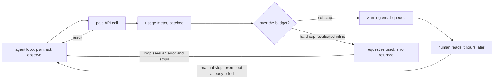
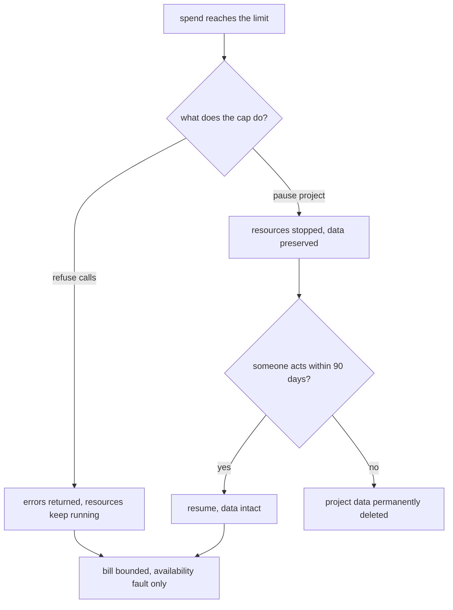

# Hard budget caps: the kill switch your agents need

> Fresh · AI / ML foundations · Intermediate · ~20 min · from today's feeds

## Why this matters
Simon Willison published this on 2026-10-03: a short argument that pay-by-usage services should ship with **hard** spending limits turned on by default, not warning emails you opt into. It lands on the same day as your DDIA chapter 1 lesson on faults versus failures, and it is the same lesson in a different currency — an autonomous agent holding a payment-capable credential is a fault source, the bill is its blast radius, and a hard cap is the fault-tolerance mechanism that keeps a fault from becoming a failure. You set Claude Code up for other teams, which means you hand other people loops that can spend money, so this is twenty minutes about a control you are responsible for installing.

## Primer
Four things the argument assumes.

**Pay-per-use billing.** Most cloud and model APIs do not sell you a box for a month; they meter what you consume — per API call, per gigabyte stored, per million tokens in and out — and bill the sum afterwards. There is no natural ceiling in that design. A loop that calls an endpoint ten thousand times produces ten thousand charges, and you find out when the invoice is computed.

**An agent loop with no human in it.** A coding or personal agent runs a plan-act-observe cycle: it decides on an action, performs it, reads the result, and decides again. If an action is a paid API call and the observation is an error, a naive retry policy turns one failed call into an unbounded stream of billed calls, at machine speed, with nobody watching. Nothing in the loop knows what money is.

**Budget vs alert vs cap.** These are three different objects and people use the word "budget" for all of them. A *budget* is a number you wrote down — an intention, with no enforcement. An *alert* (a soft cap) is a notification emitted when the meter crosses that number; spending continues. A *cap* (a hard cap) is enforced in the serving path: past the number, requests are refused or resources are stopped. Only the third one is a mechanism.

**Fault, failure, blast radius.** Borrowing DDIA's vocabulary, which is exactly the right vocabulary here: a *fault* is one component deviating from its spec, a *failure* is the system as a whole stopping doing what the user needs, and the job of fault tolerance is to prevent faults from causing failures (Kleppmann, DDIA ch. 1, "Reliability"). Kleppmann's three fault classes are hardware faults, software errors and human errors, and he notes that software errors are the correlated kind — the sort that hits every copy at once rather than one machine. A runaway agent loop is a software error with a billing relationship attached. *Blast radius* is how much damage one fault can do before something stops it; today that quantity is denominated in dollars.

## The idea

### The thing that is new is not the price, it is who initiates the spend
Willison's post is 505 words and makes one demand:

> "default hard budget caps. I'm talking about the feature of pay-by-usage services and APIs that lets you say "after $X/month, cut this thing off and return errors". These need to be **hard** limits. Soft caps, "after $X/month, send me a warning email", will not cut it."
> — Simon Willison, *We're going to need default hard budget caps on pretty much everything*, 2026-10-03, https://simonwillison.net/2026/Oct/3/default-hard-budget-caps/

His reason for the timing is the cheapness of creating spending systems:

> "Coding agents, and personal agents (coding agents wrapped in a less threatening UI), greatly reduce the friction of spinning up code that can do useful things. Sometimes those things cost money—calls to paid APIs, or hosted web applications, or systems that can bill for additional storage and compute."
> — Simon Willison, *We're going to need default hard budget caps on pretty much everything*, 2026-10-03, https://simonwillison.net/2026/Oct/3/default-hard-budget-caps/

Read that as a change in the fault population. Previously the things that could spend your money were written by a person who knew roughly what they cost, deployed by a person who reviewed them. Now the spending code is generated in seconds, often by someone who does not read it, and it is handed a credential. In DDIA's terms you have added a new, high-rate, correlated software-error source to a system whose only recovery mechanism was a human reading email. That is why this is a reliability topic and not a finance topic.

### Why a soft cap is not a mechanism
The structural problem with a warning email is a loop-boundary problem: the loop that is spending and the loop that reads email are different loops, with different latencies, and the second one is made of a person.

Three properties make the gap worse than it sounds. The alert fires *after* the threshold is crossed, so by construction the overshoot starts at the moment the alert is born. Metering is usually batched — usage is aggregated over minutes to hours before a budget evaluation runs — so the alert is already stale when it is sent. And the human latency is not the median case; it is whatever the worst recent incident was, because that is when the agent will misbehave. Friday 18:00 is a perfectly ordinary time for a loop to get stuck, and 11 hours of unattended burn is an unremarkable number. The Lab below prices exactly that.



The hard-cap path closes the loop inside the machine. The agent's own error handling becomes the enforcement surface: the thing that was spending is the thing that gets told no, with no hop through a human. That is the whole difference, and it is the same difference as a circuit breaker versus a dashboard.

### A cap is not one behaviour — it is at least three
"Cut this thing off" is ambiguous, and the ambiguity matters because each variant converts your unbounded failure into a *different* bounded fault. Returning errors leaves everything running and fails only the billable calls. Stopping resources is heavier. AWS's spend limit does the second:

> "If your usage in a project reaches its limit, AWS pauses that project which stops its resources so your costs stay within it."
> — Amazon Web Services, *Create a spend limit in AWS Settings*, AWS Account Management documentation, https://docs.aws.amazon.com/accounts/latest/reference/create-spend-limit.html

That is a controlled stop, and the documentation is explicit that it is not destructive at first:

> "AWS pauses your project and stops all resources. Your data is preserved."
> — Amazon Web Services, *Create a spend limit in AWS Settings*, AWS Account Management documentation, https://docs.aws.amazon.com/accounts/latest/reference/create-spend-limit.html

But the pause has a deadline, and this is the detail to carry away:

> "If you take no action within 90 days of your project being paused, AWS permanently deletes your project data."
> — Amazon Web Services, *Create a spend limit in AWS Settings*, AWS Account Management documentation, https://docs.aws.amazon.com/accounts/latest/reference/create-spend-limit.html

So the safety mechanism introduces its own failure mode. The cap bounds the money and converts a financial failure into an availability fault — services down, data intact — and then, if that fault is never attended to, into a data-loss failure 90 days later. Classic fault-tolerance economics: the mechanism trades one failure class for another, cheaper one, and you own the new one. Concretely it means a paused project needs an owner and a calendar entry, not just a cap.



### Defaults are the actual proposal
The sharp part of the post is one sentence:

> "I think hard budget caps need to be the default."
> — Simon Willison, *We're going to need default hard budget caps on pretty much everything*, 2026-10-03, https://simonwillison.net/2026/Oct/3/default-hard-budget-caps/

His shape is a mandatory cap with an explicit opt-in checkbox for anyone willing to accept uncapped liability. He also observes that the vendors are moving: AWS now offers a spend limit, and he notes that Google Cloud launched a similar feature in July 2026 called Spend Caps. The features existing is not the win, though. A safety property that must be discovered, understood and configured protects only the people who already knew they needed it — which is nobody's first weekend with an agent. Flipping the default inverts who carries the unbounded risk: today you opt out of unlimited liability, and the proposal is that you opt into it. The cost of the default is real — a cap that fires on a production system you did care about is an outage you caused yourself — and that cost is the reason the checkbox exists.

### What to do this week
For every project where an agent holds a credential: set a hard limit, not an alert; find out which of the three behaviours your provider implements, because that determines your recovery runbook; and if the behaviour is a pause, write down who owns the paused project and when they must act. For the Claude Code setups you install for other teams, the cap belongs in the setup, at a number that is embarrassing rather than ruinous, because the team that most needs it is the team that will not configure it.

## Lab
**The question this lab answers:** how much does a budget overshoot, over a single unattended weekend, under no cap, a soft cap that emails a human, and a hard cap that returns errors?

About 8 minutes. Python 3, standard library only, no network and no credentials. **Every price here is hypothetical**, picked round so you can check the arithmetic by hand; no vendor's pricing is claimed or cited. The model: a retrying agent loop makes 50 paid calls a minute at $0.004 a call, starting Friday 18:00, with an intended budget of $100, and nobody looks at it until Monday 09:00.

### Step 1 — write the model

Save as `agent_budget.py`.

```python
"""What a retrying agent loop costs over one weekend under three budget regimes.

All prices here are HYPOTHETICAL, chosen round so the arithmetic is checkable by hand.
No vendor pricing is claimed. One tick = 1 simulated hour; the loop is minute-resolution.
"""

COST_PER_CALL   = 0.004      # hypothetical: $0.004 per paid-API call
CALLS_PER_MIN   = 50         # a retry loop with no backoff
BUDGET          = 100.00     # what you intended to spend
WINDOW_MIN      = 63 * 60    # Friday 18:00 -> Monday 09:00
SOFT_DELAY_MIN  = 660        # 11 h: alert lands at night, human acts next midday

SPEND_PER_MIN   = COST_PER_CALL * CALLS_PER_MIN
THRESHOLD_MIN   = BUDGET / SPEND_PER_MIN          # minute the budget is reached
SOFT_STOP_MIN   = THRESHOLD_MIN + SOFT_DELAY_MIN  # minute the human actually stops it

print(f"spend per minute      : {CALLS_PER_MIN} calls x ${COST_PER_CALL:.3f} = ${SPEND_PER_MIN:.2f}/min")
print(f"budget reached at     : ${BUDGET:.2f} / ${SPEND_PER_MIN:.2f} = minute {THRESHOLD_MIN:.0f}")
print(f"soft cap stops at     : minute {THRESHOLD_MIN:.0f} + {SOFT_DELAY_MIN} = {SOFT_STOP_MIN:.0f}")
print(f"window                : {WINDOW_MIN} min ({WINDOW_MIN//60} h)\n")

def clock(minute):
    days = ["Fri", "Sat", "Sun", "Mon"]
    t = 18 * 60 + minute
    return f"{days[t // 1440]} {(t % 1440) // 60:02d}:{t % 60:02d}"

rows = []
for hour in range(1, WINDOW_MIN // 60 + 1):
    m = hour * 60
    nocap = SPEND_PER_MIN * m
    soft_min = min(m, SOFT_STOP_MIN)
    soft = SPEND_PER_MIN * soft_min
    if m < THRESHOLD_MIN:
        soft_state = "running"
    elif m < SOFT_STOP_MIN:
        soft_state = "alert sent"
    else:
        soft_state = "stopped"
    hard_min = min(m, THRESHOLD_MIN)
    hard = SPEND_PER_MIN * hard_min
    hard_state = "running" if m < THRESHOLD_MIN else "429 capped"
    calls = CALLS_PER_MIN * m
    rows.append((hour, clock(m), calls, f"{nocap:.2f}", f"{soft:.2f}", soft_state,
                 f"{hard:.2f}", hard_state))

hdr = ("h", "clock", "calls", "no cap $", "soft $", "soft state", "hard $", "hard state")
w   = (3, 9, 7, 9, 8, 11, 7, 11)
KEY = {18, 19, 20, 24, 36, 48, 63}
show = [r for r in rows if r[0] <= 12 or r[0] in KEY or r[0] == len(rows)]
print(" | ".join(h.ljust(x) for h, x in zip(hdr, w)))
print("-+-".join("-" * x for x in w))
prev = 0
for r in show:
    if r[0] - prev > 1:
        print(" | ".join("..." .ljust(x) for x in w))
    print(" | ".join(str(c).ljust(x) for c, x in zip(r, w)))
    prev = r[0]

nocap_f, soft_f, hard_f = (float(rows[-1][i]) for i in (3, 4, 6))
print(f"\nfinal bill  no cap: ${nocap_f:>7.2f}   overshoot {nocap_f/BUDGET:>5.2f}x")
print(f"final bill  soft  : ${soft_f:>7.2f}   overshoot {soft_f/BUDGET:>5.2f}x")
print(f"final bill  hard  : ${hard_f:>7.2f}   overshoot {hard_f/BUDGET:>5.2f}x")
```

### Step 2 — run it and read the weekend hour by hour

`python3 agent_budget.py`

```text
spend per minute      : 50 calls x $0.004 = $0.20/min
budget reached at     : $100.00 / $0.20 = minute 500
soft cap stops at     : minute 500 + 660 = 1160
window                : 3780 min (63 h)

h   | clock     | calls   | no cap $  | soft $   | soft state  | hard $  | hard state 
----+-----------+---------+-----------+----------+-------------+---------+------------
1   | Fri 19:00 | 3000    | 12.00     | 12.00    | running     | 12.00   | running    
2   | Fri 20:00 | 6000    | 24.00     | 24.00    | running     | 24.00   | running    
3   | Fri 21:00 | 9000    | 36.00     | 36.00    | running     | 36.00   | running    
4   | Fri 22:00 | 12000   | 48.00     | 48.00    | running     | 48.00   | running    
5   | Fri 23:00 | 15000   | 60.00     | 60.00    | running     | 60.00   | running    
6   | Sat 00:00 | 18000   | 72.00     | 72.00    | running     | 72.00   | running    
7   | Sat 01:00 | 21000   | 84.00     | 84.00    | running     | 84.00   | running    
8   | Sat 02:00 | 24000   | 96.00     | 96.00    | running     | 96.00   | running    
9   | Sat 03:00 | 27000   | 108.00    | 108.00   | alert sent  | 100.00  | 429 capped 
10  | Sat 04:00 | 30000   | 120.00    | 120.00   | alert sent  | 100.00  | 429 capped 
11  | Sat 05:00 | 33000   | 132.00    | 132.00   | alert sent  | 100.00  | 429 capped 
12  | Sat 06:00 | 36000   | 144.00    | 144.00   | alert sent  | 100.00  | 429 capped 
... | ...       | ...     | ...       | ...      | ...         | ...     | ...        
18  | Sat 12:00 | 54000   | 216.00    | 216.00   | alert sent  | 100.00  | 429 capped 
19  | Sat 13:00 | 57000   | 228.00    | 228.00   | alert sent  | 100.00  | 429 capped 
20  | Sat 14:00 | 60000   | 240.00    | 232.00   | stopped     | 100.00  | 429 capped 
... | ...       | ...     | ...       | ...      | ...         | ...     | ...        
24  | Sat 18:00 | 72000   | 288.00    | 232.00   | stopped     | 100.00  | 429 capped 
... | ...       | ...     | ...       | ...      | ...         | ...     | ...        
36  | Sun 06:00 | 108000  | 432.00    | 232.00   | stopped     | 100.00  | 429 capped 
... | ...       | ...     | ...       | ...      | ...         | ...     | ...        
48  | Sun 18:00 | 144000  | 576.00    | 232.00   | stopped     | 100.00  | 429 capped 
... | ...       | ...     | ...       | ...      | ...         | ...     | ...        
63  | Mon 09:00 | 189000  | 756.00    | 232.00   | stopped     | 100.00  | 429 capped 

final bill  no cap: $ 756.00   overshoot  7.56x
final bill  soft  : $ 232.00   overshoot  2.32x
final bill  hard  : $ 100.00   overshoot  1.00x
```

### Reading the output

| column | meaning | better |
| --- | --- | --- |
| `h` | simulated hours since the loop started, Friday 18:00 | — |
| `clock` | wall-clock time that hour ends at | — |
| `calls` | paid API calls made so far, uncapped | lower |
| `no cap $` | cumulative spend with a written-down budget and nothing enforcing it | lower |
| `soft $` | cumulative spend when the budget emails a human at the threshold | lower |
| `soft state` | `running` / `alert sent` (over budget, still spending) / `stopped` | `running`, then `stopped` fast |
| `hard $` | cumulative spend when the budget refuses calls at the threshold | lower |
| `hard state` | `running` / `429 capped` (calls refused, loop gets errors) | — |

The three money columns are identical for the first 8 hours — a cap costs nothing while you are inside your budget, which is the argument for making it the default. They diverge at hour 9, and the divergence is the whole lesson: `hard $` is flat at 100.00 for 54 consecutive hours while `no cap $` keeps climbing at the same $0.20 a minute it climbed at before anybody noticed.

Trace hour 9 with digits. Spend per minute is 50 × $0.004 = $0.20. The $100 budget is therefore reached at $100.00 ÷ $0.20 = minute 500, which is Saturday 02:20 — inside hour 9, between the hour-8 row (480 min × 0.20 = $96.00) and the hour-9 row. Under no cap, hour 9 is 540 min × 0.20 = $108.00. Under the soft cap the spend at hour 9 is also $108.00, because the email has been sent and nothing stopped: the alert bought zero dollars of protection. Under the hard cap it is min(540, 500) × 0.20 = 500 × 0.20 = $100.00 exactly. The soft cap stops at minute 500 + 660 = 1160, so its final bill is 1160 × 0.20 = $232.00, and the uncapped run finishes at 3780 × 0.20 = $756.00.

**Verdict:** against a $100 intention, no cap bills 7.56× ($756.00 ÷ $100.00), the soft cap bills 2.32×, and the hard cap bills 1.00× — exactly the budget, with no overshoot possible. The soft cap is not a 1.0 mechanism with slow paperwork; it is a 2.32× mechanism, and the multiplier is set by how long the human takes, not by the budget you wrote.

### Step 3 — price the human in the loop

Append this to the same file and run it again. It asks what the soft cap's overshoot actually depends on.

```python
print("\n--- how much the human response delay is worth, soft cap only ---")
hdr2 = ("human notices after", "stop minute", "final bill $", "overshoot", "$ burned after alert")
w2   = (19, 11, 12, 9, 20)
print(" | ".join(h.ljust(x) for h, x in zip(hdr2, w2)))
print("-+-".join("-" * x for x in w2))
for label, delay in [("15 min", 15), ("2 h", 120), ("8 h (a night)", 480),
                     ("11 h (the model)", 660), ("Mon 09:00", WINDOW_MIN - THRESHOLD_MIN)]:
    stop = min(WINDOW_MIN, THRESHOLD_MIN + delay)
    bill = SPEND_PER_MIN * stop
    print(" | ".join(str(c).ljust(x) for c, x in zip(
        (label, f"{stop:.0f}", f"{bill:.2f}", f"{bill/BUDGET:.2f}x", f"{bill - BUDGET:.2f}"), w2)))
```

```text
--- how much the human response delay is worth, soft cap only ---
human notices after | stop minute | final bill $ | overshoot | $ burned after alert
--------------------+-------------+--------------+-----------+---------------------
15 min              | 515         | 103.00       | 1.03x     | 3.00                
2 h                 | 620         | 124.00       | 1.24x     | 24.00               
8 h (a night)       | 980         | 196.00       | 1.96x     | 96.00               
11 h (the model)    | 1160        | 232.00       | 2.32x     | 132.00              
Mon 09:00           | 3780        | 756.00       | 7.56x     | 656.00              
```

Columns: `human notices after` is the response delay; `stop minute` is minute 500 plus that delay, capped at the end of the window; `final bill $` is `stop minute × $0.20`; `overshoot` is that bill divided by the $100 budget; `$ burned after alert` is everything spent after the warning was sent — the money the alert did not save. Lower is better in the last four columns.

Arithmetic for the 8-hour row: 500 + 480 = minute 980, so the bill is 980 × $0.20 = $196.00, the overshoot is $196.00 ÷ $100.00 = 1.96×, and the money burned after the alert is $196.00 − $100.00 = $96.00 — within four cents of doubling the budget, from one night's sleep. The last row is the honest worst case: if the alert is simply not read until Monday, the soft cap and no cap produce the same $756.00, because an unread alert is not a mechanism at all.

**Verdict:** the soft cap's protection is a linear function of human latency and nothing else, and human latency has no upper bound you control. Every row above is the *same* configured budget. A hard cap removes the variable: it is $100.00 in all five rows, because the enforcement happens in the request path rather than in somebody's inbox.

### Cause → consequence

1. **Cause.** An agent loop holds a credential that can bill, retries on error without backoff, and runs through a weekend with no human attached — a correlated software error in DDIA's sense (Kleppmann, DDIA ch. 1, "Reliability"), with a billing relationship.
2. **Mechanism.** Spend accrues at a constant rate in the request path. A soft cap evaluates the budget out of band and routes the response through a person, so the overshoot equals rate × human latency; a hard cap evaluates it inline and refuses the request, so the overshoot is zero by construction.
3. **Consequence.** In this model: $756.00 uncapped, $232.00 with a soft cap and an 11-hour human, $100.00 with a hard cap — 7.56× versus 2.32× versus 1.00× the intended budget.
4. **In practice.** Treat a payment-capable credential the way you treat an unbounded queue: it needs a ceiling enforced where the work happens, not a monitor. Set hard limits on every project an agent can reach, and set them as part of the setup you hand other teams, because the default is the only setting most projects will ever have. Then find out what your provider's cap actually does — refuse calls, or pause resources — and if it pauses, give the paused state an owner and a deadline, since AWS permanently deletes the data of a project left paused for 90 days (Amazon Web Services, *Create a spend limit in AWS Settings*, https://docs.aws.amazon.com/accounts/latest/reference/create-spend-limit.html).

## Self-check
1. An agent loop you handed to another team retries a paid API 50 times a minute all weekend and produces a four-figure bill. Using DDIA's vocabulary, name the fault, the failure, and the fault-tolerance mechanism that was missing — and say which of Kleppmann's three fault classes this belongs to. <details><summary>Answer</summary>The fault is the loop deviating from its spec — retrying without backoff and without a cost model — in one component. The failure is the system as a whole doing something the user never wanted: an unbounded bill. The missing mechanism is a hard spend limit evaluated in the request path, which converts the unbounded failure into a bounded fault (refused calls, or stopped resources). It is a software error, Kleppmann's correlated class, not a hardware fault: it hits every call through the same credential at once, so having more capacity or more replicas makes it strictly worse (Kleppmann, DDIA ch. 1, "Reliability").</details>
2. You enable AWS's spend limit on a project, the limit fires on a Friday, and nobody is paid to care because the services were experimental. What exactly happens at the moment the limit fires, what happens to your data, and what new deadline have you just created? <details><summary>Answer</summary>At the moment it fires, the project is paused and its resources are stopped — "If your usage in a project reaches its limit, AWS pauses that project which stops its resources so your costs stay within it" — and the data survives the pause: "AWS pauses your project and stops all resources. Your data is preserved." The new deadline is 90 days: "If you take no action within 90 days of your project being paused, AWS permanently deletes your project data" (all three: Amazon Web Services, *Create a spend limit in AWS Settings*, https://docs.aws.amazon.com/accounts/latest/reference/create-spend-limit.html). So the cap traded a financial failure for an availability fault, and that fault silently becomes a data-loss failure if it is left unattended. A paused project needs an owner and a calendar entry.</details>
3. A colleague argues that soft caps are fine because the team has good alerting and a 24/7 on-call rotation. Give the structural reason that is still weaker than a hard cap, and the one argument on his side. <details><summary>Answer</summary>Structural reason: a soft cap's overshoot is rate × human latency, and human latency is a variable you do not control and cannot bound — in the Lab, the identical $100 budget produced $103.00 at 15 minutes and $756.00 if the alert went unread, while the hard cap produced $100.00 in every case. Worse, the alert fires only after the threshold is crossed, and metering is batched, so it is stale when it is sent; the loop that is spending is not the loop reading the alert. His argument: a hard cap is itself a failure mode — it can take down a production system you did want to keep paying for, which is why Willison pairs the mandatory default with an explicit opt-in checkbox for accepting uncapped liability rather than removing the choice: "I think hard budget caps need to be the default" (Simon Willison, *We're going to need default hard budget caps on pretty much everything*, 2026-10-03, https://simonwillison.net/2026/Oct/3/default-hard-budget-caps/).</details>

## Sources
- [We're going to need default hard budget caps on pretty much everything](https://simonwillison.net/2026/Oct/3/default-hard-budget-caps/) — Simon Willison, 2026-10-03 — the whole argument: the hard-versus-soft distinction, why agents change the fault population, the "default, with an opt-in checkbox for uncapped liability" shape, and the observation that AWS now offers a spend limit and that Google Cloud launched a similar feature in July 2026 called Spend Caps; all three Willison quotes above are copied from this page (accessed 2026-10-07)
- [Create a spend limit in AWS Settings](https://docs.aws.amazon.com/accounts/latest/reference/create-spend-limit.html) — Amazon Web Services, AWS Account Management documentation — what a real hard cap does when it fires: pauses the project and stops its resources, preserves the data, and permanently deletes that data if no action is taken within 90 days; the three AWS quotes above are copied from this page (accessed 2026-10-07)
- [New early anomalies and spend caps on Google Cloud budgets](https://cloud.google.com/blog/topics/cost-management/new-early-anomalies-and-spend-caps-on-google-cloud-budgets) — Google Cloud, July 2026 — the second vendor Willison points at as evidence that hard caps are arriving; listed because his post cites it, and no claim above is made about its behaviour beyond his attribution (accessed 2026-10-07)
- Related in your knowledge base: `25-software-architecture/high-availability-is-not-resilience-the-tls-upgrade-that.md` — the same fault/failure split applied to availability instead of money.

## Next on this track
Fresh lessons sit outside the ladder; next on AI / ML foundations: **Your first model: pandas in, predictions out** (rung 2 of 38, Beginner).
