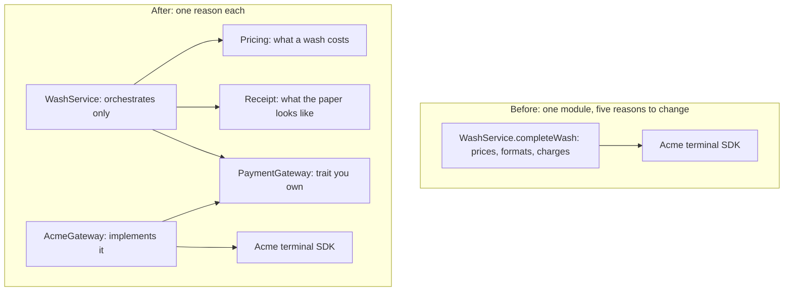

# Coupling and cohesion

> Software architecture & design · Beginner · ~20 min · rung 1 of 20 · needs: —

## Why this matters
Almost every design argument you will referee — "should this live in the same service?", "can we just add a flag here?" — is an argument about cohesion and coupling, usually without either word being said.
Having the precise words turns a taste fight into a check you can run: list the reasons each module can change, and list what a change in one forces in another.
It opens this track because dependency direction, layering, boundaries and modularity metrics are all refinements of these two ideas.

## The idea

### Cohesion: one reason to change
A module is cohesive when its parts serve one purpose and change for the same reason. The test is not "are these things related?" — almost anything is. It is: **when the business sends a change request, does this module get edited for that reason and no other?** A `Pricing` module edited only when prices or packages change is cohesive. A `WashService` edited when prices change, when the receipt layout changes, and when the payment vendor changes is not — it has three independent reasons to change, so three people end up in the same file for unrelated purposes.

### Coupling: a change that forces a change
Coupling is the other side of the same coin, and Martin Fowler's definition is the one worth memorising:

> "If changing one module in a program requires changing another module, then coupling exists."
>
> — Martin Fowler, *Reducing Coupling*, IEEE Software, July/August 2001, https://martinfowler.com/ieeeSoftware/coupling.pdf

Two things follow. First, coupling is not a code smell you can delete — it is how a system is wired together:

> "Coupling is desirable, because if you ban coupling between modules, you have to put everything in one big module."
>
> — Martin Fowler, *Reducing Coupling*, IEEE Software, July/August 2001, https://martinfowler.com/ieeeSoftware/coupling.pdf

That last clause is the trap behind "low coupling": a single giant module has zero inter-module coupling and is the worst design in the room, because it also has zero cohesion. The goal is the pair — **high cohesion, low coupling** — and the slogan that gets you there is *things that change together live together*. Co-locate the code one reason-to-change touches; put a boundary between code that changes for different reasons.

Second, since coupling is about forced change, you judge it by direction, not by count — and Fowler deliberately looks at the top:

> "I concern myself most with coupling at the highest-level modules."
>
> — Martin Fowler, *Reducing Coupling*, IEEE Software, July/August 2001, https://martinfowler.com/ieeeSoftware/coupling.pdf

### Two vocabularies for kinds of coupling
The classic structured-design taxonomy (Stevens, Myers and Constantine) ranks coupling from worst to best, and it still describes real code:

- **content** — one module reaches into another's internals (a mutated private field, a leaked `var`). Any internal change breaks the caller.
- **common** — two modules share mutable global state; either can corrupt the other's assumptions.
- **control** — the caller passes a flag that steers the callee's branching (`charge(amount, isRefund = true)`). The caller must know the callee's internal logic.
- **stamp** — a whole structure is passed when only two fields are used; the callee is now tied to the shape of everything it ignores.
- **data** — only the values actually needed are passed. Narrowest, cheapest, best.

Connascence is a finer instrument for the same question: what must change together, and how hard is that to find?

> "Connascence is a software design metric introduced by Meilir Page-Jones that quantifies the degree and type of dependency between software components… It evaluates dependencies based on three dimensions: strength, which measures the effort required to refactor or modify the dependency; locality, which considers how physically or logically close dependent components are in the codebase; and degree, which measures how many components are affected by the dependency."
>
> — Wikipedia contributors, *Connascence*, accessed 2026-10-08, https://en.wikipedia.org/wiki/Connascence

The forms, roughly weakest to strongest: **name** (two places agree on an identifier — the compiler enforces it and rename refactoring fixes it); **type** (they agree on a type); **meaning** (they agree on the *significance* of a value — `"premium"`, `status == 2`, an empty string meaning "unknown"); **position** (they agree on an order — positional arguments, a tuple, CSV columns); **algorithm** (both must compute the same thing the same way — a hash on each side of the wire); **timing** (one must happen before the other, or within some window). Name and type are static, visible at compile time; timing and algorithm are dynamic, visible only at runtime, which is why they cost most. Meaning is the silent killer: nothing in the type system says two string literals are the same concept, so the second one quietly rots.

Degree and locality are what make connascence actionable. The same connascence of meaning is tolerable between two lines of one private method (tiny degree, perfect locality) and a disaster between forty microservices (high degree, terrible locality). **Rule of thumb: as locality gets worse, the acceptable strength drops.** Inside a function, anything goes; across a service boundary, keep it to name and type.

### Stable things are cheap to couple to, volatile things are expensive
Coupling cost is strength multiplied by how often the other end changes. Your code is coupled to `java.util.List` and to the JVM memory model, and nobody worries: those have not moved in years. The same binding to a terminal vendor's SDK, a partner's ad-hoc CSV or last quarter's pricing rules is expensive, because that end moves. So the practical move is not "remove the dependency" but **invert it onto something you control and that changes rarely**: your own `PaymentGateway` interface is stable by construction, because you wrote it, and the vendor's SDK is pushed behind it. Fowler is honest that this heuristic does not settle everything:

> "Like so many design heuristics, this seems awfully incomplete."
>
> — Martin Fowler, *Reducing Coupling*, IEEE Software, July/August 2001, https://martinfowler.com/ieeeSoftware/coupling.pdf



## Lab
**The question:** does splitting `completeWash` into `Pricing`, `Receipt` and a `PaymentGateway` interface actually reduce the reasons-to-change per module, or does it just move code around?

The lab is Java 21 so it runs with no build tool. Mapping to your Scala: a Java `interface` is a `trait`, a `record` is a `case class`, and `enum WashPackage` is a sealed trait with three case objects.

### Step 1 — the before code, and the five change requests
`Before.completeWash` prices the wash with a `switch` on package-name strings, builds the receipt string, and calls the fake vendor SDK inline. The five change requests are the ones a real car wash sends: a new package, a VAT number on the receipt, a new terminal vendor, a price rise, and VAT as its own line. The program stores, per module, which of those five force an edit — so the counts in the tables below come from the program, not from me.

### Step 2 — the after code
`Pricing` holds a package-to-price table keyed by a `WashPackage` enum. `Receipt` renders. `PaymentGateway` is a one-method interface you own; `AcmeGateway` implements it over the SDK; `RecordingGateway` implements it in memory for tests. `WashService` only wires the three together.

### Step 3 — run it
Save as `WashService.java` and run:

```bash
java WashService.java
```

The full program is about 150 lines; the shape that matters is:

```java
enum WashPackage { BASIC, PREMIUM, DELUXE }
record Priced(WashPackage pkg, String label, long cents) {}

static final class Pricing {                      // reason to change: prices
    private static final Map<WashPackage, Priced> TABLE = Map.of(
        WashPackage.BASIC,   new Priced(WashPackage.BASIC,   "Basic wash",   1200L),
        WashPackage.PREMIUM, new Priced(WashPackage.PREMIUM, "Premium wash", 2500L),
        WashPackage.DELUXE,  new Priced(WashPackage.DELUXE,  "Deluxe wash",  3900L));
    static Priced price(WashPackage p) { return TABLE.get(p); }
}

static final class Receipt {                      // reason to change: layout
    static String render(String plate, Priced p, String auth) { /* … */ }
}

interface PaymentGateway { String charge(long cents); }   // reason to change: ~never

static final class After {                        // reason to change: the wash flow itself
    private final PaymentGateway gateway;
    After(PaymentGateway gateway) { this.gateway = gateway; }
    String completeWash(WashPackage pkg, String plate) {
        Priced priced = Pricing.price(pkg);
        String auth = gateway.charge(priced.cents());
        return Receipt.render(plate, priced, auth);
    }
}
```

Real output:

```text
-- behaviour must not change --
SPARKLE CAR WASH
plate: AA1234BB
Premium wash  25.00 EUR
auth: ACME-OK-2500
before == after: true

== BEFORE the split ==
module                    reasons  sdk?  triggered by
WashService.completeWash        5   yes  R1,R2,R3,R4,R5
modules: 1 | worst reasons-to-change in one module: 5 | modules that need the terminal SDK: 1
  R1 add a CERAMIC wash package -> opens 1 module(s): WashService.completeWash
  R2 put the shop VAT number on the receipt -> opens 1 module(s): WashService.completeWash
  R3 switch from the ACME terminal to a Nexi terminal -> opens 1 module(s): WashService.completeWash
  R4 raise the premium price to 27.50 -> opens 1 module(s): WashService.completeWash
  R5 show VAT as its own line and in the total -> opens 1 module(s): WashService.completeWash

== AFTER the split ==
module                    reasons  sdk?  triggered by
Pricing                         3    no  R1,R4,R5
Receipt                         2    no  R2,R5
AcmeGateway                     1   yes  R3
PaymentGateway                  0    no  -
WashService                     0    no  -
modules: 5 | worst reasons-to-change in one module: 3 | modules that need the terminal SDK: 1
  R1 add a CERAMIC wash package -> opens 1 module(s): Pricing
  R2 put the shop VAT number on the receipt -> opens 1 module(s): Receipt
  R3 switch from the ACME terminal to a Nexi terminal -> opens 1 module(s): AcmeGateway
  R4 raise the premium price to 27.50 -> opens 1 module(s): Pricing
  R5 show VAT as its own line and in the total -> opens 2 module(s): Pricing, Receipt

-- pricing+receipt tested with no terminal --
charged cents: [3900] | receipt has TEST-AUTH: true

-- connascence of the package identity --
before: literal "premium" appears in 2 places, checked at runtime -> meaning, degree 2
after:  WashPackage.PREMIUM appears in 1 place, checked by the compiler -> name/type, degree 1
```

### Reading the output
- **module** — the unit a developer opens in the editor.
- **reasons** — how many of the five change requests force an edit in that module. This is the cohesion score: **lower is better**, and 1 is ideal.
- **sdk?** — does this module compile against the vendor's SDK. **"no" is better**: an SDK-free module can be unit-tested with no terminal.
- **triggered by** — which request ids hit it, so you can check the count by hand.
- The `-> opens N module(s)` lines are the blast radius of one change: **lower is better**, 1 is ideal.

| | modules | worst reasons in one module | SDK-free modules | avg modules opened per change |
|---|---|---|---|---|
| Before | 1 | 5 | 0 of 1 | 1.0 |
| After | 5 | 3 | 4 of 5 | 1.2 |

Tracing the arithmetic for `Pricing`: the triggers listed are R1, R4, R5 → 1 + 1 + 1 = **3 reasons**. For the blast radius after the split: R1 opens 1, R2 opens 1, R3 opens 1, R4 opens 1, R5 opens 2 → (1 + 1 + 1 + 1 + 2) / 5 = 6 / 5 = **1.2 modules per change**. Before the split it was (1 + 1 + 1 + 1 + 1) / 5 = **1.0**, but each of those 1s is the single module that also contains the pricing table, the receipt format and the SDK call — the blast radius is 100% of the code either way.

**Verdict.** The split cuts the worst reasons-to-change in one module from **5 to 3**, takes SDK-free modules from **0 of 1 to 4 of 5**, and keeps behaviour identical (`before == after: true`). The average modules opened per change rises from 1.0 to 1.2 — honest cost: R5 (VAT on the receipt and in the total) is genuinely two concerns, so it touches two modules. That is the real trade: you pay a small coordination cost on cross-cutting changes to buy isolation on the four single-concern ones, and to get `Pricing` and `Receipt` testable with no payment terminal (`charged cents: [3900]` came from `RecordingGateway`, not hardware).

**The connascence of meaning that disappeared.** Before, the literal `"premium"` appeared in two separate `switch` statements — one choosing the price, one choosing the label. Nothing but a shared convention tied them together: the two sites agreed on what the string *means*, and a typo in either compiled fine and failed at runtime (output: `meaning, degree 2`). After, the package identity is `WashPackage.PREMIUM`, a single enum constant declared once. The two sites now agree on a *name and a type*, which the compiler checks and a rename refactoring updates (output: `name/type, degree 1`). Same dependency, weaker form, lower degree.

### Cause → consequence
1. **Cause** — `completeWash` mixed three reasons to change: prices, paper layout, payment vendor.
2. **Mechanism** — each reason needed its own edit in the same body, and the vendor SDK type was baked into that body, so the pricing logic could not be loaded without the terminal.
3. **Consequence** — 5 reasons-to-change in one module, no module testable without hardware, and the package identity carried as magic strings duplicated across two `switch` blocks.
4. **What it means in practice** — when you are sizing a change as PO, ask "how many unrelated reasons can this module change for?" A module above about three is where estimates go wrong, release trains collide, and two teams end up merging the same file. The cheap fix is almost always the one here: pull the volatile dependency behind a small interface you own, and give each reason-to-change its own home.

## Self-check
1. A teammate proposes merging `Pricing` and `Receipt` back together because "they're both about the wash price, so that's more cohesive". What is wrong with the argument? <details><summary>Answer</summary>Cohesion is not topical relatedness, it is shared reason to change. The lab output shows they are triggered by different requests: `Pricing` by R1, R4, R5 and `Receipt` by R2, R5. Merging them gives one module with 4 reasons to change instead of two with 3 and 2 — worse cohesion, even though the topic sounds the same.</details>
2. You find a service that reads `status == 2` to mean "paid", and a second service that writes `2` for the same meaning. Name the connascence, and say why the fix is to raise or lower its strength. <details><summary>Answer</summary>Connascence of meaning: both sides agree on the significance of the literal `2`, and nothing checks it. Locality is terrible (two deployables), degree is at least 2 and grows with every new reader. The fix is to make it *stronger but static* — a shared enum or a named constant in a shared schema, which turns it into connascence of name and type, caught at compile or contract-validation time instead of in production.</details>
3. Your module depends on `java.time.Instant` and on a partner's weekly-changing CSV export. Both are dependencies. Why is only one of them a problem, and what do you do about it? <details><summary>Answer</summary>Coupling cost is strength times the volatility of the other end. `Instant` is effectively frozen, so coupling to it is cheap however tightly you bind. The CSV changes weekly, so every change propagates into your code. You do not remove the dependency; you invert it onto something stable that you own — define your own domain type and a small parser/mapper interface, and let one adapter absorb the partner's format changes, so exactly one module has that reason to change.</details>

## Sources
- [Reducing Coupling](https://martinfowler.com/ieeeSoftware/coupling.pdf) — Martin Fowler, IEEE Software, July/August 2001 — the working definition of coupling, the argument that some coupling is necessary and desirable, the focus on high-level modules and the pattern of dependencies rather than their count, and the separated-interface move used in the lab's `PaymentGateway` (accessed 2026-10-08).
- [Connascence](https://en.wikipedia.org/wiki/Connascence) — Wikipedia contributors — the definition of connascence as Meilir Page-Jones' design metric and the three dimensions of strength, locality and degree; also the static (compile-time) versus dynamic (runtime) split used to rank the forms (accessed 2026-10-08).
- [connascence.io](https://connascence.io/) — named by this track's curriculum as the reference catalogue of connascence types; it was not reachable while this lesson was written, so the taxonomy above is cited from the Wikipedia entry instead and nothing here is quoted from it.
- Stevens, Myers and Constantine, *Structured Design*, IBM Systems Journal, 1974 — the classic content / common / control / stamp / data coupling ladder, given here as standard textbook material rather than a quoted claim.

## Next on this track
Next on Software architecture & design: **Dependency direction and the dependency rule** (rung 2 of 20, Beginner) — having decided that coupling is about forced change, you point the arrows so the forcing always runs toward the stable things.
