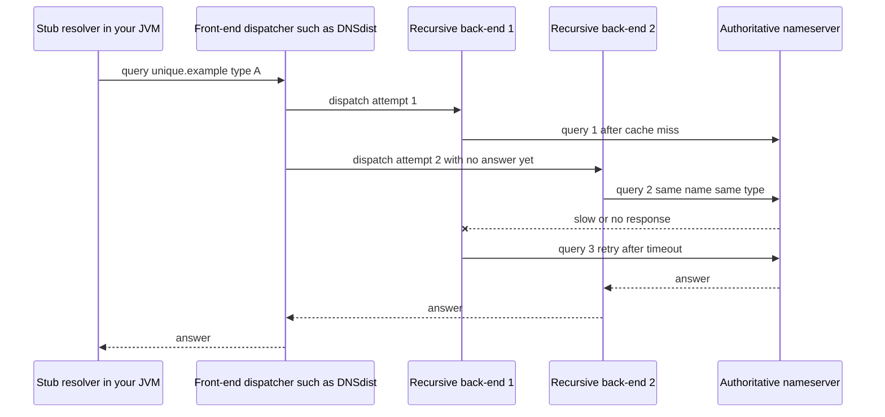
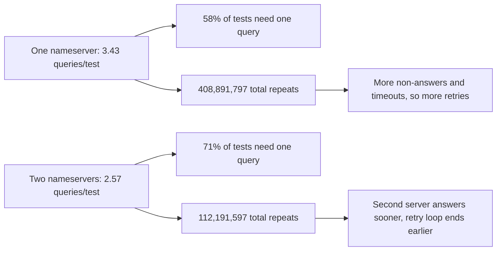

# Repeat DNS queries: why a second nameserver helps

> Fresh · Networking, modern · Intermediate · ~22 min · from today's feeds

## Why this matters
Today's item is "One or two nameservers?" by Geoff Huston, published on the APNIC Blog on 15 September 2026 — a measurement follow-up to his earlier work on how many duplicate DNS queries authoritative servers actually receive.
It is worth 22 minutes because it overturns an intuition you probably share: that adding a second authoritative nameserver means more servers for resolvers to probe and therefore more query traffic, when the measured result is the opposite.
You own zones and you run JVM services behind recursive resolvers, so both halves of this matter — the load your zone's nameservers absorb, and the retry behaviour that generates it.

## Primer
A **zone** is a slice of the DNS namespace that one administrator publishes. The **authoritative nameserver** for a zone answers from its own copy of that zone's data rather than from a cache (RFC 8499 §6). A **stub resolver** is the thin client inside your OS or JVM: it asks one configured server and does nothing clever itself. A **recursive resolver** is the server it asks — it walks the delegation chain from the root down, caches what it learns, and returns a final answer (RFC 8499 §6).

Records you need: an **NS record** names a host that is authoritative for a zone, by name, not by address (RFC 1035 §3.3.11). An **A record** holds an IPv4 address (RFC 1035 §3.4.1); **AAAA** is its IPv6 counterpart. **Dual-stack** here means one nameserver host reachable at both an IPv4 and an IPv6 address, so a resolver has two transport paths to the same server.

Every query carries a **query name** (the domain name asked about) and a **query type** (A, AAAA, NS, and so on) in its question section (RFC 1035 §4.1.2). Four response outcomes appear in today's tables, all defined in RFC 8499 §3: **NXDOMAIN** — the name does not exist; **NODATA** — the name exists but has no record of that type; **REFUSED** — the server declines for policy reasons; **SERVFAIL** — the server hit a problem and could not answer. NXDOMAIN and NODATA are definitive answers; REFUSED and SERVFAIL are not, which is why a resolver treats them as a reason to try again somewhere else. "No response" is a fifth case: nothing comes back at all, and the resolver can only time out and retry.

## The idea

### What was measured
The experiment avoided the thing that normally hides query behaviour — caching.

> "we tasked many millions of users to resolve a unique DNS name"
> — Geoff Huston, *One or two nameservers?*, 15 September 2026, https://blog.apnic.net/2026/09/15/one-or-two-nameservers/

A unique name per test means no cached copy exists anywhere, so every query a resolver sends must reach the authoritative server and can be counted. The run was a week long — "We ran this measurement from 5 to 11 August 2026" (Huston, *One or two nameservers?*, 15 September 2026). The Internet was split into six zones: "These zones are North America, South America, Europe and Africa, India, Asia, and China." Each zone got one authoritative server, and "This single authoritative nameserver is configured as a dual-stack server with both an IPv4 and an IPv6 address." The counting rule is narrow and worth holding onto: "A 'repeat' is defined as a query with the same query name and query type" — same name, same type, counted again.

Then the whole control test was repeated with two dual-stack nameservers per zone instead of one.

### The result that was not expected
With one nameserver, the article reports 254,894,985 tests, of which 147,233,117 (58%) needed a single query per query type, an average of 3.43 queries per test and 408,891,797 total repeats, averaging 3.80 repeats (Huston, *One or two nameservers?*, Table 2, 15 September 2026). With two nameservers: 150,221,951 tests, 106,376,529 (71%) single-query, 2.57 queries per test, and 112,191,597 total repeats, averaging 2.56.

Fewer repeats, with more servers. The author's own reaction:

> "This is a completely unexpected result."
> — Geoff Huston, *One or two nameservers?*, 15 September 2026, https://blog.apnic.net/2026/09/15/one-or-two-nameservers/

and the reason it is unexpected:

> "We would expect an increase in the repeat query count when the number of authoritative servers increases"
> — Geoff Huston, *One or two nameservers?*, 15 September 2026, https://blog.apnic.net/2026/09/15/one-or-two-nameservers/

The intuition behind that expectation is reasonable: two NS records give a resolver two addresses to sample, and resolvers do sample their options to pick a fast one. Instead, adding the second server "appears to significantly reduce the number of repeat queries."

### The response code is what drives the repeat count
The single-nameserver table breaks the average down by outcome, and the spread is enormous: NXDOMAIN 4.40 queries per test, NODATA 3.93, REFUSED 11.47, SERVFAIL 51.73, and no response at all 83.46 (Huston, *One or two nameservers?*, Table 1, 15 September 2026). A definitive answer costs about four queries per test, with 55–60% of tests satisfied by one. A non-answer costs an order of magnitude more, and silence costs twenty times more. REFUSED is the odd one out: it was accepted after a single response only 40% of the time, so resolvers mostly keep asking rather than believe it.

That is the first half of the explanation. A resolver repeats when it has no answer it can use. Anything that gets it a usable answer sooner — including a second server that is up when the first is struggling — cuts the repeat count.

### Where the duplicates sit in time
The timing data narrows it further. "The major difference in behaviour of query duplication occurs in the first second of DNS name resolution": with one nameserver over 85% of duplicates landed in that first second, versus about 75% with two. With two servers, repeats peaked at 0.75, 1.5 and 3 seconds — the doubling signature of exponential backoff. In both configurations 90% of repeats arrived within five seconds.

The sub-10-millisecond band is the interesting one. Rapid-fire repeats inside 10 ms were 17% of all repeats with one nameserver and 12% with two. No single resolver implementation retries in 10 ms; that is far below any sane timeout. And the peaks are oddly quantised: "A single nameserver sees local peaks of duplicate queries at 100ms, 310ms and 800ms", while the two-server case shows peaks at 50, 100, 310, 370, 750 and 800 ms. Between 10 ms and 70 ms, and especially 10–40 ms, the single-server case produced notably more repeats.

### The resolver-farm hypothesis
Huston's proposed mechanism is architectural, not a bug in any resolver. When query volume outgrows one box, "a single front end query dispatcher is placed in front of a set of individual recursive resolvers", and "An example of this setup can be seen with PowerDNS's DNSdist". Each back-end resolver has its own cache and its own retry timer. A unique query name means every back-end that sees the query misses its cache and goes to the authoritative server itself. From the outside that looks like one resolver asking the same question several times within milliseconds — exactly the sub-10-ms band.



The author is explicit that this is a hypothesis:

> "we cannot offer a definitive explanation of the behaviour."
> — Geoff Huston, *One or two nameservers?*, 15 September 2026, https://blog.apnic.net/2026/09/15/one-or-two-nameservers/

Treat it as the best available story, not a proven cause. What the data does support is the operational conclusion: "this observed behaviour points to some practical value in the DNS operational advice" of "using a minimum of two nameservers to serve a zone in today's DNS." Or, in the article's closing line, "It seems to keep recursive resolvers happy!"



## Lab
**The question:** what does the drop from 3.43 to 2.57 queries per test actually buy an authoritative server, and can a front-end dispatcher in front of several recursive back-ends plausibly produce the duplicate pattern Huston measured?

Part A works only with the article's published Table 2 numbers and derives the quantities it states in prose. Part B is a simulation we invented to test the plausibility of the resolver-farm story — its numbers are not measurements of anything.

### Step 1 — the script
Save as `nameservers.py` and run with `python3 nameservers.py`.

```python
#!/usr/bin/env python3
"""Part A: derive per-row arithmetic from Huston's published Table 2.
   Part B: simulate a resolver farm to see where duplicate queries come from."""

# ---------- Part A: the article's measurements, and what they imply ----------
# Columns copied from Table 2 of "One or two nameservers?" (APNIC, 15 Sep 2026).
TABLE2 = [
    # ns, tests,       single_query_tests, avg_q_per_test, total_repeats, avg_repeats
    (1, 254_894_985, 147_233_117, 3.43, 408_891_797, 3.80),
    (2, 150_221_951, 106_376_529, 2.57, 112_191_597, 2.56),
]
TEST_RATE = 20_000  # tests/second: our own assumption, not the article's

print("=== Part A: derived from the article's Table 2 (measured columns marked *) ===")
hdr = ("ns", "tests*", "1q-tests*", "1q-share", "q/test*", "repeats*",
       "repeats/test", "tests-with-rpt", "rpt/avg_rpt", "q per sec @20k")
print("{:>3} {:>13} {:>13} {:>8} {:>7} {:>13} {:>12} {:>15} {:>12} {:>14}".format(*hdr))
rows = []
for ns, tests, single, qpt, repeats, avg_rpt in TABLE2:
    share = single / tests * 100
    rpt_per_test = repeats / tests
    with_repeats = tests - single
    implied = repeats / avg_rpt          # how many "duplicated" episodes avg_repeats implies
    qps = qpt * TEST_RATE
    rows.append((ns, share, qpt, rpt_per_test, with_repeats, implied, qps, repeats, avg_rpt))
    print("{:>3} {:>13,} {:>13,} {:>7.2f}% {:>7.2f} {:>13,} {:>12.4f} {:>15,} {:>12,.0f} {:>14,.0f}"
          .format(ns, tests, single, share, qpt, repeats, rpt_per_test, with_repeats, implied, qps))

a, b = rows[0], rows[1]
print("\n-- change from one nameserver to two (our arithmetic) --")
print("single-query share : {:.2f}% -> {:.2f}%  = {:+.2f} points".format(a[1], b[1], b[1] - a[1]))
print("queries per test   : {:.2f} -> {:.2f}      = {:+.2f}%".format(a[2], b[2], (b[2]/a[2]-1)*100))
print("repeats per test   : {:.4f} -> {:.4f}  = {:+.2f}%".format(a[3], b[3], (b[3]/a[3]-1)*100))
print("avg repeats        : {:.2f} -> {:.2f}      = {:+.2f}%".format(a[8], b[8], (b[8]/a[8]-1)*100))
print("total repeats      : {:,} -> {:,} = {:+.2f}%".format(a[7], b[7], (b[7]/a[7]-1)*100))
print("queries/s @ {:,} tests/s : {:,.0f} -> {:,.0f} = {:,.0f} fewer"
      .format(TEST_RATE, a[6], b[6], a[6] - b[6]))
print("cross-check: tests-with-repeats vs repeats/avg_repeats -> "
      "1ns {:,} vs {:,.0f} ({:+.3f}%), 2ns {:,} vs {:,.0f} ({:+.3f}%)"
      .format(a[4], a[5], (a[5]/a[4]-1)*100, b[4], b[5], (b[5]/b[4]-1)*100))

# ---------- Part B: our own simulation of the resolver-farm hypothesis ----------
import random
TIMEOUT_MS, MAX_TRIES, SEED = 100, 4, 20260805
LAT = {"A": [35, 180, 310, 520, 800],   # overloaded primary: 1 in 5 answers inside the timeout
       "B": [30, 45, 60, 70, 95]}       # healthy second server: always inside the timeout

def run(n_backends, nsset):
    rng = random.Random(SEED)
    total, per_backend = 0, []
    print("\n--- {} back-end resolver(s) behind one dispatcher, nameservers {} ---"
          .format(n_backends, "+".join(nsset)))
    for i in range(n_backends):
        sent, answered = 0, False
        for attempt in range(MAX_TRIES):
            ns = nsset[attempt % len(nsset)]
            lat = rng.choice(LAT[ns])
            sent += 1
            late = lat > TIMEOUT_MS
            print("  backend {} attempt {} -> ns {}  latency {:>3}ms  {}  queries so far {}"
                  .format(i + 1, attempt + 1, ns, lat,
                          "TIMEOUT, retry" if late else "answered       ", sent))
            if not late:
                answered = True
                break
        per_backend.append(sent)
        total += sent
        if not answered:
            print("  backend {} gave up after {} queries".format(i + 1, sent))
    print("  per-backend query counts {}  TOTAL queries at the authoritative side {}"
          .format(per_backend, total))
    return total

print("\n=== Part B: our own simulation (NOT the article's measurements) ===")
res = {(n, len(s)): run(n, s) for n in (1, 4) for s in (["A"], ["A", "B"])}
print("\nsimulated totals: 1 backend  1ns={}  2ns={}   |  4 backends  1ns={}  2ns={}"
      .format(res[(1, 1)], res[(1, 2)], res[(4, 1)], res[(4, 2)]))
print("simulated fan-out cost 1->4 backends with one nameserver: {}x"
      .format(res[(4, 1)] / res[(1, 1)]))
print("simulated effect of the second nameserver at 4 backends: {} -> {} queries ({:+.1f}%)"
      .format(res[(4, 1)], res[(4, 2)], (res[(4, 2)] / res[(4, 1)] - 1) * 100))
```

### Step 2 — Part A output

```text
=== Part A: derived from the article's Table 2 (measured columns marked *) ===
 ns        tests*     1q-tests* 1q-share q/test*      repeats* repeats/test  tests-with-rpt  rpt/avg_rpt q per sec @20k
  1   254,894,985   147,233,117   57.76%    3.43   408,891,797       1.6042     107,661,868  107,603,104         68,600
  2   150,221,951   106,376,529   70.81%    2.57   112,191,597       0.7468      43,845,422   43,824,843         51,400

-- change from one nameserver to two (our arithmetic) --
single-query share : 57.76% -> 70.81%  = +13.05 points
queries per test   : 3.43 -> 2.57      = -25.07%
repeats per test   : 1.6042 -> 0.7468  = -53.44%
avg repeats        : 3.80 -> 2.56      = -32.63%
total repeats      : 408,891,797 -> 112,191,597 = -72.56%
queries/s @ 20,000 tests/s : 68,600 -> 51,400 = 17,200 fewer
cross-check: tests-with-repeats vs repeats/avg_repeats -> 1ns 107,661,868 vs 107,603,104 (-0.055%), 2ns 43,845,422 vs 43,824,843 (-0.047%)
```

### Step 3 — Part B output

```text
=== Part B: our own simulation (NOT the article's measurements) ===

--- 1 back-end resolver(s) behind one dispatcher, nameservers A ---
  backend 1 attempt 1 -> ns A  latency 800ms  TIMEOUT, retry  queries so far 1
  backend 1 attempt 2 -> ns A  latency 180ms  TIMEOUT, retry  queries so far 2
  backend 1 attempt 3 -> ns A  latency 180ms  TIMEOUT, retry  queries so far 3
  backend 1 attempt 4 -> ns A  latency 800ms  TIMEOUT, retry  queries so far 4
  backend 1 gave up after 4 queries
  per-backend query counts [4]  TOTAL queries at the authoritative side 4

--- 1 back-end resolver(s) behind one dispatcher, nameservers A+B ---
  backend 1 attempt 1 -> ns A  latency 800ms  TIMEOUT, retry  queries so far 1
  backend 1 attempt 2 -> ns B  latency  45ms  answered         queries so far 2
  per-backend query counts [2]  TOTAL queries at the authoritative side 2

--- 4 back-end resolver(s) behind one dispatcher, nameservers A ---
  backend 1 attempt 1 -> ns A  latency 800ms  TIMEOUT, retry  queries so far 1
  backend 1 attempt 2 -> ns A  latency 180ms  TIMEOUT, retry  queries so far 2
  backend 1 attempt 3 -> ns A  latency 180ms  TIMEOUT, retry  queries so far 3
  backend 1 attempt 4 -> ns A  latency 800ms  TIMEOUT, retry  queries so far 4
  backend 1 gave up after 4 queries
  backend 2 attempt 1 -> ns A  latency 520ms  TIMEOUT, retry  queries so far 1
  backend 2 attempt 2 -> ns A  latency 310ms  TIMEOUT, retry  queries so far 2
  backend 2 attempt 3 -> ns A  latency 180ms  TIMEOUT, retry  queries so far 3
  backend 2 attempt 4 -> ns A  latency  35ms  answered         queries so far 4
  backend 3 attempt 1 -> ns A  latency 800ms  TIMEOUT, retry  queries so far 1
  backend 3 attempt 2 -> ns A  latency 520ms  TIMEOUT, retry  queries so far 2
  backend 3 attempt 3 -> ns A  latency 310ms  TIMEOUT, retry  queries so far 3
  backend 3 attempt 4 -> ns A  latency 800ms  TIMEOUT, retry  queries so far 4
  backend 3 gave up after 4 queries
  backend 4 attempt 1 -> ns A  latency 520ms  TIMEOUT, retry  queries so far 1
  backend 4 attempt 2 -> ns A  latency  35ms  answered         queries so far 2
  per-backend query counts [4, 4, 4, 2]  TOTAL queries at the authoritative side 14

--- 4 back-end resolver(s) behind one dispatcher, nameservers A+B ---
  backend 1 attempt 1 -> ns A  latency 800ms  TIMEOUT, retry  queries so far 1
  backend 1 attempt 2 -> ns B  latency  45ms  answered         queries so far 2
  backend 2 attempt 1 -> ns A  latency 180ms  TIMEOUT, retry  queries so far 1
  backend 2 attempt 2 -> ns B  latency  95ms  answered         queries so far 2
  backend 3 attempt 1 -> ns A  latency 520ms  TIMEOUT, retry  queries so far 1
  backend 3 attempt 2 -> ns B  latency  60ms  answered         queries so far 2
  backend 4 attempt 1 -> ns A  latency 180ms  TIMEOUT, retry  queries so far 1
  backend 4 attempt 2 -> ns B  latency  30ms  answered         queries so far 2
  per-backend query counts [2, 2, 2, 2]  TOTAL queries at the authoritative side 8

simulated totals: 1 backend  1ns=4  2ns=2   |  4 backends  1ns=14  2ns=8
simulated fan-out cost 1->4 backends with one nameserver: 3.5x
simulated effect of the second nameserver at 4 backends: 14 -> 8 queries (-42.9%)
```

### Reading the output

**Part A columns.** `tests*`, `1q-tests*`, `q/test*` and `repeats*` are Huston's measured figures; everything else on the row is arithmetic we did. `1q-share` is the fraction of tests that finished with one query per query type — **higher is better**, it means resolvers believed the first answer. `q/test` is also the amplification factor against the ideal of one query per test — **lower is better**. `repeats/test` is total repeats spread over all tests. `tests-with-rpt` is tests minus single-query tests. `rpt/avg_rpt` is total repeats divided by the article's average-repeats figure. `q per sec @20k` applies the measured queries-per-test to a hypothetical 20,000 tests/second — our assumption, not a measured rate.

| ns | tests* | 1q-tests* | 1q-share | q/test* | repeats* | repeats/test | tests-with-rpt | rpt/avg_rpt | q/s @20k |
|---|---|---|---|---|---|---|---|---|---|
| 1 | 254,894,985 | 147,233,117 | 57.76% | 3.43 | 408,891,797 | 1.6042 | 107,661,868 | 107,603,104 | 68,600 |
| 2 | 150,221,951 | 106,376,529 | 70.81% | 2.57 | 112,191,597 | 0.7468 | 43,845,422 | 43,824,843 | 51,400 |

**Tracing the arithmetic.** The single-query share on the first row: 147,233,117 ÷ 254,894,985 = 0.577626…, so 57.76%, which is the 58% the article rounds to — "With one nameserver, 58% of the test cases completed the experiment using a single DNS query for each query type." Repeats per test on the same row: 408,891,797 ÷ 254,894,985 = 1.6042. On the second row: 112,191,597 ÷ 150,221,951 = 0.7468. The change is 0.7468 ÷ 1.6042 − 1 = −0.5344, i.e. −53.44%, which is a much bigger drop than the −25.07% in queries per test (2.57 ÷ 3.43 − 1 = −0.2507).

The cross-check row is the one that explains why 3.80 and 2.56 look inconsistent with 1.6042 and 0.7468. Dividing total repeats by the article's average repeats gives 408,891,797 ÷ 3.80 = 107,603,104, and tests minus single-query tests is 254,894,985 − 147,233,117 = 107,661,868. The two agree to within 0.055%. So the published "average repeats" figure is an average over the tests that repeated at all, not over all tests — 3.80 repeats among the 42% of tests that did repeat.

**Verdict (Part A):** the headline 3.43 → 2.57 understates the win. Measured on the tests that actually generate duplicates, a second nameserver cut total repeat volume by 72.56% and the per-test repeat load by 53.44%. At a hypothetical 20,000 tests/second that is 17,200 fewer queries per second your authoritative server never has to parse, log or rate-limit.

**Part B columns.** Each line is one query leaving one back-end resolver: which nameserver it went to, the simulated response latency, whether that exceeded the 100 ms timeout, and the running query count for that back-end. `TOTAL` is what the authoritative side sees — **lower is better**. All of these are simulated with a fixed seed (20260805); none of them are measurements.

| back-ends | nameservers | per-back-end counts | total queries |
|---|---|---|---|
| 1 | A | [4] | 4 |
| 1 | A+B | [2] | 2 |
| 4 | A | [4, 4, 4, 2] | 14 |
| 4 | A+B | [2, 2, 2, 2] | 8 |

**Tracing the arithmetic.** Back-end 1 with one nameserver: attempt 1 drew 800 ms > 100 ms timeout, attempt 2 drew 180 ms > 100, attempt 3 drew 180 ms > 100, attempt 4 drew 800 ms > 100 — four queries, no answer. Back-end 4 drew 520 ms then 35 ms, and 35 ≤ 100, so it stopped at two. Total for four back-ends is 4 + 4 + 4 + 2 = 14, against 4 for a single back-end: 14 ÷ 4 = 3.5× the query volume from the same one stub query. With the second nameserver in the rotation, every back-end's second attempt lands on B, whose worst latency is 95 ms, inside the timeout — so each stops at 2 and the total is 4 × 2 = 8, a drop of 8 ÷ 14 − 1 = −42.9%.

**Verdict (Part B):** a fan-out of independent retry timers behind one dispatcher multiplies a single stub query into many authoritative queries, and a second nameserver that answers inside the timeout truncates every one of those retry chains at the first retry. That is consistent with Huston's measured direction and with the sub-10-ms duplicate band, but it is a plausibility argument from a toy model, not evidence of the cause.

### Cause → consequence

1. **Cause.** A unique query name means no cache anywhere can satisfy the query, and a slow, REFUSED, SERVFAIL or silent response means the resolver has no answer it is willing to use.
2. **Mechanism.** Each recursive resolver — and in a resolver farm, each back-end behind the dispatcher — runs its own retry timer and sends its own copy of the same query name and query type, which is exactly the article's definition of a repeat. Timers fire independently, so copies stack up inside the first second.
3. **Consequence.** The authoritative server absorbs the multiplication: 3.43 measured queries per test with one nameserver, 408,891,797 repeats in the week (Huston, *One or two nameservers?*, Table 2, 15 September 2026). A second nameserver that can answer ends the retry chains earlier, and the measured figures fall to 2.57 queries per test and 112,191,597 repeats.
4. **What it means in practice.** For the zones you own: two authoritative nameservers is not just a redundancy checkbox, it measurably lowers the query rate you have to serve, so capacity planning and any rate-limiting thresholds should be set after the second server exists, not before. For your JVM services: a resolution that looks like a single `getaddrinfo` call can turn into a dozen queries on the wire when the authoritative side is slow or returns SERVFAIL, and the timeout you see is the sum of retries, not one round trip. If a service's DNS tail latency looks like 1 s, 2 s, 5 s steps, that is backoff, not the network — and the fix is usually on the authoritative side or in the resolver's server list, not in your client.

## Self-check
1. The article reports 3.80 average repeats with one nameserver, yet total repeats divided by total tests is 1.6042. Why are both right? <details><summary>Answer</summary>They have different denominators. 1.6042 = 408,891,797 repeats ÷ 254,894,985 tests, spread over every test. The published 3.80 is an average over only the tests that repeated at all: 408,891,797 ÷ 3.80 = 107,603,104, which matches tests minus single-query tests, 254,894,985 − 147,233,117 = 107,661,868, to within 0.055%. About 42% of tests repeated, and those averaged 3.80 repeats each.</details>
2. Why would you expect *more* repeat queries when a zone gains a second authoritative nameserver, and what did the measurement show instead? <details><summary>Answer</summary>Two NS records give a resolver two addresses it can probe and sample for latency, so the naive expectation is more query traffic — Huston states it as "We would expect an increase in the repeat query count when the number of authoritative servers increases" (*One or two nameservers?*, 15 September 2026, https://blog.apnic.net/2026/09/15/one-or-two-nameservers/). Measured, queries per test fell from 3.43 to 2.57, single-query tests rose from 58% to 71%, and total repeats fell from 408,891,797 to 112,191,597.</details>
3. Duplicate queries arriving within 10 ms of each other were 17% of all repeats with one nameserver. Why can that not be one resolver's retry timer, and what is the proposed explanation? <details><summary>Answer</summary>No resolver sets a retransmit timeout as low as 10 ms; real timers start in the hundreds of milliseconds. The proposed mechanism is a resolver farm: a front-end dispatcher in front of several independent recursive back-ends, each with its own cache and timer, so the same query name and type goes out several times almost at once. Huston names PowerDNS's DNSdist as an example of that architecture and states that he cannot prove it is the cause.</details>

## Sources
- [One or two nameservers?](https://blog.apnic.net/2026/09/15/one-or-two-nameservers/) — Geoff Huston, APNIC Blog, 15 September 2026 — the measurement, Tables 1 and 2, the timing breakdown, the resolver-farm hypothesis and every quoted passage in this lesson; accessed 2026-10-08.
- [RFC 8499: DNS Terminology](https://www.rfc-editor.org/rfc/rfc8499.html) — P. Hoffman, A. Sullivan, K. Fujiwara, IETF, January 2019 — §3 for the NXDOMAIN, NODATA, REFUSED and SERVFAIL response codes and §6 for stub resolver, recursive resolver and authoritative server; accessed 2026-10-08.
- [RFC 1035: Domain names — implementation and specification](https://rfc-editor.org/rfc/rfc1035) — P. Mockapetris, IETF, November 1987 — §3.3.11 for the NS record, §3.4.1 for the A record and §4.1.2 for the query name and query type fields of the question section; accessed 2026-10-08.

## Next on this track
Fresh lessons sit outside the ladder; next on Networking, modern: **What really happens in a TCP handshake and teardown** (rung 1 of 16, Beginner).
