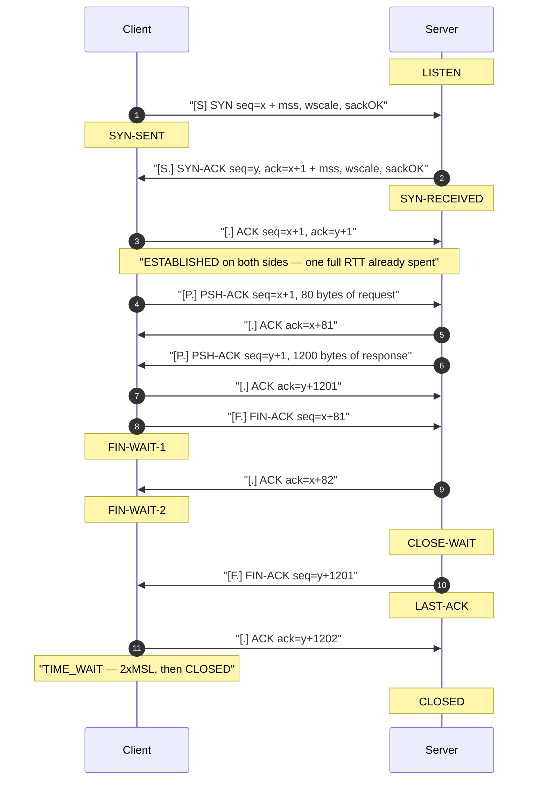

# What really happens in a TCP handshake and teardown

> Networking, modern · Beginner · ~20 min · rung 1 of 16 · needs: —

## Why this matters

Every HTTP call, JDBC query and Akka remoting link your services make begins with a three-way handshake and ends with either FIN/ACK or RST, and that opening handshake costs a full round trip before a single byte of your payload moves.

Most "mysterious" production symptoms — a p99 that is exactly one RTT worse than p50, `Connection reset by peer` in one log and a clean EOF in another, clients timing out while the server looks idle — are this one mechanism showing through.

It sits first on this ladder because latency budgets, congestion control, TLS and HTTP/2 are all built on top of a connection whose birth and death you can picture packet by packet.

## The idea

A TCP connection is not a thing that exists on the wire. It is a pair of state machines, one in each kernel, that agree on a shared numbering of bytes. The handshake is how they agree; the teardown is how they stop agreeing without losing data. Everything below follows one connection from `SYN` to `TIME_WAIT`.

### The three packets, and what each side learns

TCP is connection-oriented: before data flows, both endpoints must synchronise state (RFC 9293 §3.5 "Establishing a Connection"). Three segments do it.

1. **SYN** — the client picks an *initial sequence number* (ISN), call it `x`, sets the SYN flag, and sends it. An ISN is where this side starts counting its own outgoing bytes. It is chosen semi-randomly rather than starting at zero so that a stale segment from a previous connection on the same address pair cannot be mistaken for a fresh one (RFC 9293 §3.4 "Sequence Numbers"). The SYN also carries *options*: **MSS** (maximum segment size — the largest payload this side wants per segment, so the peer does not hand it something that will fragment), defined in RFC 9293 §3.2 "Specific Option Definitions"; **window scale** (a shift factor that multiplies the 16-bit receive-window field, without which a connection cannot advertise more than 65535 bytes in flight); and **SACK-permitted** (selective acknowledgement — "I can tell you about holes in the stream, not just the first missing byte"). Options are only negotiated here, in the SYN and SYN-ACK. Miss the handshake and you miss your chance.
2. **SYN-ACK** — the server picks its own ISN `y`, sets both SYN and ACK, and acknowledges with `ack = x + 1`. It sends its own MSS, window scale and SACK-permitted. Note the `+1`: a SYN carries no data but still consumes one sequence number, so `x + 1` means "I have everything through your SYN; the next byte I expect from you is number x+1".
3. **ACK** — the client replies `seq = x + 1, ack = y + 1`. Now both sides are ESTABLISHED and the client may send data in or after this packet.

The arithmetic is the whole point: **sequence and acknowledgement numbers are byte counters, not packet counters.** `seq` is the number of the first byte in this segment's payload. `ack` is the number of the next byte the sender of the ACK expects — cumulative, so one ACK covers everything before it. If the client sends an 80-byte request starting at `seq = x + 1`, the server's ACK is `x + 1 + 80 = x + 81`.

Those absolute numbers are unreadable, so tools rewrite them: `tcpdump` prints *relative* numbers (offsets from the ISN it saw) unless you pass `-S`, and Wireshark does the same via its "Relative sequence numbers" preference. Worth knowing before "seq 1" in one capture turns out to be `seq 2892841001` in another.

The cost is one round trip paid before the application gets anything: each new connection will have "a full roundtrip of latency before any application data can be transferred", and the New York-to-London example puts that floor at 56 ms (Grigorik, *High Performance Browser Networking*, ch. 2, "Three-Way Handshake"). That is the strongest argument for connection pooling and keep-alive in any service you own.

### Closing: graceful, half-closed, or abortive



A **graceful close** is four segments, a FIN and an ACK in each direction, because each direction of the stream is closed independently (RFC 9293 §3.6 "Closing a Connection"). The side that calls `close()` first sends FIN and moves to FIN-WAIT-1; its peer ACKs that FIN and moves to CLOSE-WAIT, which means "the other end is done sending, but my application has not closed yet". The gap in between is a legal **half-close**: the peer may keep sending for as long as it likes while the first side only receives (RFC 9293 §3.6.1 "Half-Closed Connections"). When the peer finally closes it sends its own FIN (LAST-ACK) and the first side ACKs it.

That first closer then sits in **TIME_WAIT for 2×MSL**, twice the maximum segment lifetime (RFC 9293 §3.6 "Closing a Connection"), for two reasons: its final ACK may be lost and somebody must still be there if the peer retransmits its FIN, and waiting two segment lifetimes guarantees every straggler from this connection has expired before the same four-tuple (source IP, source port, destination IP, destination port) is reused. The RFC works with an MSL of two minutes; real stacks pick their own, so the measured wait depends on the OS. Practical consequence: whichever side closes first accumulates TIME_WAIT sockets, which is why a high-churn client, not the server, usually runs out of ephemeral ports.

An **abortive close** skips all of it: one **RST** segment, no handshake, no TIME_WAIT on the sender. Anything still in the send buffer is discarded. The peer's next read fails with `ECONNRESET` instead of seeing end-of-stream. RST is also what you get when you connect to a port nobody is listening on.

### The two queues behind `listen()`

`listen(fd, backlog)` creates two queues. A SYN arrives, the kernel answers SYN-ACK and parks the half-open connection in the **SYN queue**; when the client's ACK arrives the connection moves to the **accept queue**, where it waits for your application to call `accept()`.

> "The Accept Queue contains fully established connections: ready to be picked up by the application."
> — Marek Majkowski, Cloudflare, *SYN packet handling in the wild*, 2018-01-15, https://blog.cloudflare.com/syn-packet-handling-in-the-wild/

Overflow behaviour differs by queue. If the SYN queue fills, new SYNs are discarded:

> "Inbound SYN packets to the SYN Queue are dropped."
> — Marek Majkowski, Cloudflare, *SYN packet handling in the wild*, 2018-01-15, https://blog.cloudflare.com/syn-packet-handling-in-the-wild/

and Linux's usual answer is to stop keeping state at all and encode it in the ISN instead:

> "By default SYN Cookies are enabled when needed - for sockets with a filled up SYN Queue."
> — Marek Majkowski, Cloudflare, *SYN packet handling in the wild*, 2018-01-15, https://blog.cloudflare.com/syn-packet-handling-in-the-wild/

If the accept queue fills — your service is up but too slow to `accept()` — the completing ACKs are thrown away too:

> "Inbound ACK packets to the SYN Queue are dropped."
> — Marek Majkowski, Cloudflare, *SYN packet handling in the wild*, 2018-01-15, https://blog.cloudflare.com/syn-packet-handling-in-the-wild/

From the client's side both look identical and nothing like an error: a dropped SYN or ACK produces no RST, so the client retransmits on its own backoff and eventually reports a connect timeout. A server overloaded in its accept loop is indistinguishable, from outside, from an unreachable one.

### The `tcpdump` flag legend

`tcpdump` prints flags in square brackets, where a dot means "ACK is also set":

| Printed | Flags | Means |
| --- | --- | --- |
| `[S]` | SYN | handshake packet 1 |
| `[S.]` | SYN+ACK | handshake packet 2 |
| `[.]` | ACK only | pure acknowledgement, no payload |
| `[P.]` | PSH+ACK | payload, deliver it to the app now |
| `[F.]` | FIN+ACK | graceful close, this direction is done |
| `[R]` | RST | abortive close / connection refused |

## Lab

**The question:** what does the three-way handshake actually cost, and how do you tell a graceful close from an abortive one — from the application side, with no packet sniffer?

The whole lab is one Python 3 file using only the standard library. Save it as `tcp_lab.py` and run `python3 tcp_lab.py`. It was run on Linux with Python 3.13; the output below is the real output of that run.

### Step 1 — the handshake tax

Three fresh connections to `example.com:80`, each timed in two parts: `connect()` (the handshake) and then time-to-first-byte. Then the same three requests over one connection that is already open.

```python
#!/usr/bin/env python3
"""TCP handshake lab: what the handshake costs, and FIN vs RST from the application side."""
import socket, struct, time, threading

HOST, PORT = "example.com", 80

print("=== Step 1: the handshake tax ===")
print(f"{'try':>4} {'connect_ms':>11} {'ttfb_ms':>9} {'total_ms':>9}")
fresh = []
for i in range(1, 4):
    t0 = time.perf_counter()
    s = socket.create_connection((HOST, PORT), timeout=10)
    t1 = time.perf_counter()
    s.sendall(b"GET / HTTP/1.1\r\nHost: example.com\r\nConnection: keep-alive\r\n\r\n")
    s.recv(1)
    t2 = time.perf_counter()
    c, f, tot = (t1-t0)*1000, (t2-t1)*1000, (t2-t0)*1000
    fresh.append((c, f, tot))
    print(f"{i:>4} {c:>11.1f} {f:>9.1f} {tot:>9.1f}")
    s.close()

print("\n--- same three requests on ONE reused connection ---")
s = socket.create_connection((HOST, PORT), timeout=10)
t0 = time.perf_counter(); s.recv(0); t_conn = (time.perf_counter()-t0)*1000
reused = []
for i in range(1, 4):
    t1 = time.perf_counter()
    s.sendall(b"GET / HTTP/1.1\r\nHost: example.com\r\nConnection: keep-alive\r\n\r\n")
    s.recv(4096)
    t2 = time.perf_counter()
    reused.append((t2-t1)*1000)
    print(f"{i:>4} {'(reused)':>11} {(t2-t1)*1000:>9.1f} {(t2-t1)*1000:>9.1f}")
s.close()
print(f"\nmean fresh total   = {sum(x[2] for x in fresh)/3:.1f} ms")
print(f"mean reused total  = {sum(reused)/3:.1f} ms")
print(f"mean connect() RTT = {sum(x[0] for x in fresh)/3:.1f} ms")
```

### Step 2 — graceful close (FIN) vs abortive close (RST)

A tiny loopback server answers `PING` with `PONG` and then closes. In the second round it sets `SO_LINGER` with a zero timeout, which is the documented way to make `close()` emit RST instead of FIN. The client reads once, waits, then reads again — and that second read is where the two closes diverge.

```python
print("\n=== Step 2: graceful close (FIN) vs abortive close (RST) ===")

def server(port, abortive):
    srv = socket.socket(); srv.setsockopt(socket.SOL_SOCKET, socket.SO_REUSEADDR, 1)
    srv.bind(("127.0.0.1", port)); srv.listen(1)
    conn, _ = srv.accept()
    conn.recv(64)
    conn.sendall(b"PONG")
    if abortive:
        # SO_LINGER with timeout 0 => close() sends RST instead of FIN
        conn.setsockopt(socket.SOL_SOCKET, socket.SO_LINGER, struct.pack("ii", 1, 0))
    conn.close(); srv.close()

for port, abortive, label in [(54701, False, "graceful (FIN)"), (54702, True, "abortive (RST)")]:
    th = threading.Thread(target=server, args=(port, abortive), daemon=True); th.start()
    time.sleep(0.15)
    cl = socket.create_connection(("127.0.0.1", port), timeout=5)
    cl.sendall(b"PING"); first = cl.recv(64)
    time.sleep(0.3)
    try:
        nxt = cl.recv(64)
        outcome = f"recv() returned {nxt!r}  -> clean end of stream (EOF)"
    except ConnectionResetError as exc:
        outcome = f"recv() raised ConnectionResetError: [Errno {exc.errno}] {exc.strerror}"
    print(f"{label:<16} first recv = {first!r:<8} then {outcome}")
    cl.close(); th.join(timeout=2)
```

### Step 3 — the accept queue fills

A server binds, calls `listen(1)` and then deliberately never calls `accept()`. Six clients try to connect with a 2-second timeout.

```python
print("\n=== Step 3: the accept queue fills ===")
srv = socket.socket(); srv.setsockopt(socket.SOL_SOCKET, socket.SO_REUSEADDR, 1)
srv.bind(("127.0.0.1", 54703)); srv.listen(1)   # backlog = 1, and we never call accept()
print(f"{'client':>7} {'connect_ms':>11}  result")
held = []
for i in range(1, 7):
    t0 = time.perf_counter()
    try:
        c = socket.create_connection(("127.0.0.1", 54703), timeout=2)
        held.append(c)
        print(f"{i:>7} {(time.perf_counter()-t0)*1000:>11.1f}  connected (never accepted)")
    except Exception as exc:
        print(f"{i:>7} {(time.perf_counter()-t0)*1000:>11.1f}  {type(exc).__name__}: {exc}")
for c in held: c.close()
srv.close()
print("\n(no packets were sniffed: every line above is what the socket API reported)")
```

The real output of the run:

```text
=== Step 1: the handshake tax ===
 try  connect_ms   ttfb_ms  total_ms
   1        22.1       1.4      23.5
   2        18.9       1.6      20.5
   3        17.6       1.8      19.4

--- same three requests on ONE reused connection ---
   1    (reused)       2.6       2.6
   2    (reused)       0.9       0.9
   3    (reused)       0.8       0.8

mean fresh total   = 21.1 ms
mean reused total  = 1.5 ms
mean connect() RTT = 19.5 ms

=== Step 2: graceful close (FIN) vs abortive close (RST) ===
graceful (FIN)   first recv = b'PONG'  then recv() returned b''  -> clean end of stream (EOF)
abortive (RST)   first recv = b'PONG'  then recv() raised ConnectionResetError: [Errno 104] Connection reset by peer

=== Step 3: the accept queue fills ===
 client  connect_ms  result
      1         0.1  connected (never accepted)
      2         0.0  connected (never accepted)
      3      2002.4  TimeoutError: timed out
      4      2002.4  TimeoutError: timed out
      5      2002.4  TimeoutError: timed out
      6      2002.4  TimeoutError: timed out

(no packets were sniffed: every line above is what the socket API reported)
```

### Reading the output

**Step 1 columns.** `connect_ms` is wall time inside `socket.create_connection`, which returns once the client has sent the third packet of the handshake — so it is one round trip plus a little kernel and DNS-cache overhead. `ttfb_ms` is the time from "request written" to "first byte readable". `total_ms` is the sum. **Lower is better in all three**; the number that matters is the ratio between `total_ms` fresh and `total_ms` reused.

| try | connect_ms | ttfb_ms | total_ms |
| --- | --- | --- | --- |
| 1 | 22.1 | 1.4 | 23.5 |
| 2 | 18.9 | 1.6 | 20.5 |
| 3 | 17.6 | 1.8 | 19.4 |
| **mean** | **19.5** | — | **21.1** |

| try | connect_ms | ttfb_ms | total_ms |
| --- | --- | --- | --- |
| 1 | (reused) | 2.6 | 2.6 |
| 2 | (reused) | 0.9 | 0.9 |
| 3 | (reused) | 0.8 | 0.8 |
| **mean** | — | — | **1.5** |

The arithmetic, digits shown. Handshake share of a fresh request: `19.5 / 21.1 = 0.924`, i.e. **92% of a fresh request was the handshake**, nothing to do with the server's work. Benefit of reuse: `21.1 / 1.5 = 14.07`, so the reused connection was **14.1× cheaper** than opening a new one.

Two honest caveats about this run. First, `ttfb_ms` of 1.4–1.8 ms is *lower than one round trip*, which is physically impossible for a real end-to-end server response — this sandbox's network path buffers the reply locally, so `ttfb_ms` here measures a local read, not a trip to `example.com`. On your Mac expect `ttfb` to be roughly one more RTT on top of `connect_ms`. Second, the fresh loop reads 1 byte (`s.recv(1)`) while the reused loop reads up to 4096 (`s.recv(4096)`), so the two `ttfb` columns are not strictly comparable either. The comparison that survives both caveats is fresh `total_ms` against reused `total_ms`, and that one is unambiguous.

**Verdict:** the handshake, not the server, dominated a short fresh request here — 92% of it — and reusing one connection made the same three requests 14.1× cheaper. Pool your connections.

**Step 2.** Both rounds received `b'PONG'` on the first read, so the data path was identical. The second read is the discriminator: FIN surfaces as `recv()` returning the empty bytes object `b''`, which is the socket API's end-of-stream signal (the peer closed its sending direction cleanly, everything it sent arrived). RST surfaces as `ConnectionResetError: [Errno 104] Connection reset by peer`, errno 104 being Linux's `ECONNRESET`.

| close style | first `recv()` | second `recv()` | what the peer sent |
| --- | --- | --- | --- |
| graceful | `b'PONG'` | `b''` (EOF) | `[F.]` FIN, then ACK of your FIN |
| abortive | `b'PONG'` | `ConnectionResetError` errno 104 | `[R]` RST, nothing else |

**Better is the graceful one**, and not only because the error log stays clean: with FIN you know the stream ended where the sender intended, so a truncated response is a protocol bug rather than an open question. With RST you cannot tell how much was lost. The price of graceful is that the side which sends the first FIN lands in TIME_WAIT for 2×MSL (RFC 9293 §3.6 "Closing a Connection"); the side that sends RST pays no such wait, which is exactly why `SO_LINGER(1, 0)` keeps turning up in code that churns through connections. It buys port reuse by giving up delivery guarantees.

**Verdict:** `b''` means FIN and is a clean end of stream; `ECONNRESET` means RST and is an abort with unknown truncation. You can distinguish them from the application with no sniffer at all.

**Step 3.** `connect_ms` is how long the client waited; `result` is what the socket API returned. Clients 1 and 2 connected in 0.1 ms and 0.0 ms — loopback, no accept needed, the kernel completed the handshake on the application's behalf and queued the connection. Clients 3 through 6 each sat for 2002.4 ms and then raised `TimeoutError`, which is the 2-second client timeout (`timeout=2` → 2002.4 ms measured) expiring.

| client | connect_ms | result | why |
| --- | --- | --- | --- |
| 1 | 0.1 | connected (never accepted) | admitted to the accept queue |
| 2 | 0.0 | connected (never accepted) | admitted to the accept queue |
| 3–6 | 2002.4 | `TimeoutError: timed out` | queue full, SYN silently dropped |

The server asked for `listen(1)`. Linux admitted **two** connections — a backlog of *n* typically admits *n+1*. After that the accept queue was full and the application never drained it, so the kernel dropped the arriving packets rather than refusing them, and the clients retransmitted their SYNs into silence until their own timeout fired. That is precisely the behaviour quoted above from the Cloudflare post: inbound SYN and ACK packets to a full queue are dropped, with no RST to tell the client why. **A timeout here is the better-than-nothing outcome**; what you want instead is a drained accept queue.

**Verdict:** an overloaded accept loop looks exactly like an unreachable host from the client side. If clients report connect timeouts while your service's own metrics look healthy, suspect the accept queue before you suspect the network.

### Optional: watch it on your Mac

Nothing above sniffed a packet. To see the real segments, run this on your own machine (two terminals), and read the output with the flag legend from "The idea":

```bash
# find your interface (usually en0)
route get default | grep interface

# terminal 1
sudo tcpdump -i en0 -nn -S 'host example.com and tcp port 80'

# terminal 2
curl -s -o /dev/null http://example.com/

# then, back in terminal 1's shell
netstat -an -p tcp | grep TIME_WAIT
```

What to look for, field by field — no capture is reproduced here because the numbers would be invented:

1. **First line, flags `[S]`** — your Mac's ephemeral port to port 80, `seq` equal to your ISN (absolute, because of `-S`), `win` your initial receive window, and an options list in square brackets containing `mss`, `sackOK`, `TS` (timestamps) and `wscale`.
2. **Second line, flags `[S.]`** — from port 80 back to you, a different `seq` (the server's ISN) and `ack` equal to your ISN + 1, with the server's own `mss` and `wscale` options.
3. **Third line, flags `[.]`** — your ACK, `seq` = your ISN + 1, `ack` = server ISN + 1, `length 0`.
4. Then `[P.]` in your direction carrying the `GET` (`length` equal to the request size), `[P.]` back with the response body, and finally two `[F.]` lines — one per direction — plus their ACKs. The IP:port on the *first* `[F.]` tells you which side closed first.
5. The `netstat` line confirms it: whichever side closed first is the one holding a `TIME_WAIT` socket. After a `curl`, that is usually your Mac.

Add `-w handshake.pcap` to the `tcpdump` command and open the file in Wireshark; `Statistics → Flow Graph` draws the same picture as the Mermaid diagram above, from your own packets. Remember that Wireshark shows relative sequence numbers by default, so its "seq 1" is the absolute number `-S` printed plus one.

### Cause → consequence

1. **Cause:** TCP requires both endpoints to agree on initial sequence numbers and options before any payload is accepted (RFC 9293 §3.5 "Establishing a Connection").
2. **Mechanism:** that agreement takes three segments, and the client cannot send data until the second one has arrived — one full round trip (Grigorik, *High Performance Browser Networking*, ch. 2, "Three-Way Handshake").
3. **Consequence:** a short request on a fresh connection is mostly handshake — 92% of it in this run (19.5 ms of 21.1 ms) — and connection churn also piles TIME_WAIT sockets on whichever side closes first, for 2×MSL each (RFC 9293 §3.6 "Closing a Connection").
4. **What it means for your work:** size and reuse connection pools rather than opening per request; prefer a graceful close so `b''`/EOF, not `ECONNRESET`, is your normal end-of-stream; make sure the side you control is not the one closing first if ephemeral ports are tight; and when clients report connect timeouts against a healthy-looking service, look at the accept queue and the backlog, because a full queue drops packets silently and produces timeouts, not errors.

## Self-check

1. A client sends a 120-byte request as the first data on a connection whose own ISN was `x`. What `seq` does that segment carry, and what `ack` will the server's acknowledgement carry? <details><summary>Answer</summary>`seq = x + 1`, because the SYN consumed sequence number `x` even though it carried no payload. The server's ACK carries `ack = x + 121` — the number of the next byte it expects, i.e. `x + 1 + 120`. Acknowledgements are cumulative byte counters, not packet counts.</details>
2. Your Scala service logs `ConnectionResetError`-style resets from one upstream and clean EOFs from another, for the same kind of request. What different thing is each peer doing, and which side of a graceful close pays the TIME_WAIT cost? <details><summary>Answer</summary>The reset peer is doing an abortive close: it sends a single RST, discarding anything still queued, so your read fails with `ECONNRESET` and you cannot tell whether the response was truncated. The other peer does a graceful close: FIN and ACK in each direction, so your read returns end-of-stream (`b''` in Python) and you know the stream ended where the sender intended. The side that sends the *first* FIN enters TIME_WAIT for 2×MSL (RFC 9293 §3.6 "Closing a Connection"); the side sending RST pays no such wait.</details>
3. Clients report connect timeouts against a service that is running and whose request-handling metrics look normal. Why does a full accept queue produce timeouts rather than connection-refused errors, and what would you check? <details><summary>Answer</summary>Because a full queue makes the kernel *drop* the inbound SYN or the completing ACK instead of answering with RST — the Cloudflare post states plainly that inbound SYN packets and inbound ACK packets to a full SYN queue are dropped. With nothing coming back, the client retransmits its SYN on its own backoff schedule and eventually reports a timeout; a refused connection would have returned RST immediately. Check the backlog passed to `listen()`, whether the application is actually calling `accept()` fast enough, and the queue-overflow counters; also remember a backlog of *n* typically admits *n+1*, as in Step 3 where `listen(1)` admitted two clients.</details>

## Sources

- [High Performance Browser Networking, ch. 2 "Building Blocks of TCP"](https://hpbn.co/building-blocks-of-tcp/) — Ilya Grigorik, O'Reilly — the "Three-Way Handshake" section supplied the one-full-roundtrip-before-data framing and the 56 ms New York-to-London floor used as the latency argument for connection reuse (accessed 2026-10-09).
- [RFC 9293: Transmission Control Protocol (TCP)](https://www.rfc-editor.org/rfc/rfc9293.html) — IETF, 2022 — §3.2 "Specific Option Definitions" for the MSS option, §3.4 "Sequence Numbers" for ISNs and byte-counter semantics, §3.5 "Establishing a Connection" for the three-way handshake, §3.6 "Closing a Connection" for FIN/ACK teardown and the 2×MSL TIME-WAIT, §3.6.1 "Half-Closed Connections" for the half-close (accessed 2026-10-09).
- [SYN packet handling in the wild (Cloudflare blog)](https://blog.cloudflare.com/syn-packet-handling-in-the-wild/) — Marek Majkowski, Cloudflare, 2018-01-15 — the four verbatim quotes on the SYN queue, the accept queue, what is dropped when each fills, and SYN cookies being enabled when needed (accessed 2026-10-09).

## Next on this track
Next on Networking, modern: **Latency vs bandwidth, RTT, and why the speed of light is the budget** (rung 2 of 16, Beginner).
