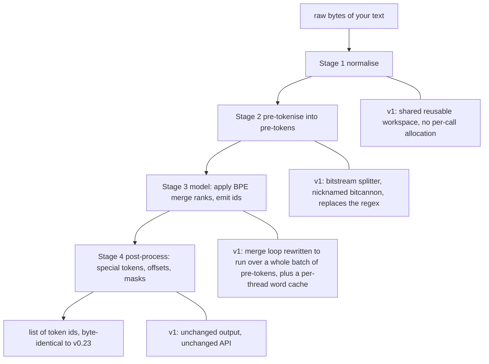
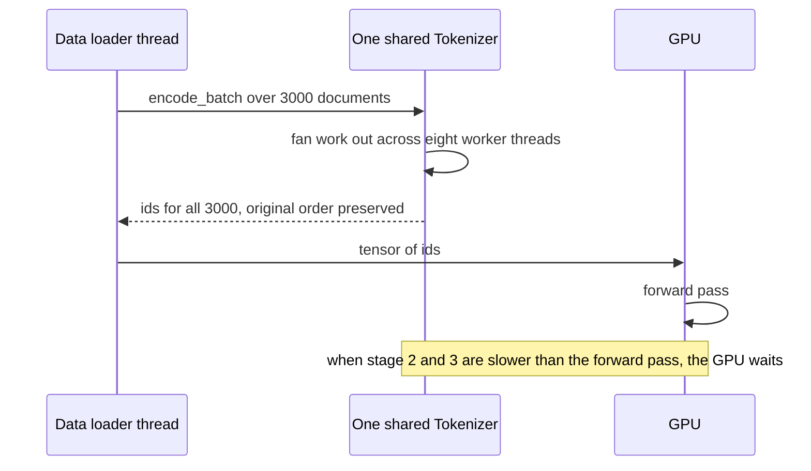

# Tokenizers v1: what a tokenizer does, and why it got 3-30x faster

> Fresh · AI / ML foundations · Intermediate · ~25 min · from today's feeds

## Why this matters

Today's item is the engineering write-up for version 1 of `tokenizers`, the Rust library that turns text into the integer ids every language model actually consumes — it is a pure-performance release: identical token ids, identical API, much faster encoding.

It was published by Hugging Face on 2026-09-21, written by Arthur Zucker, Simon Brandeis, Luc Georges and Lysandre, at https://huggingface.co/blog/tokenizers-v1.

It earns 25 minutes because it is two lessons in one: it is the clearest available description of what a tokenizer does mechanically, and it is a textbook CPU-optimisation case study — regex replaced by a bitstream scanner, allocation removed from the hot loop, a per-thread cache, and one shared object made safe for many threads — the same moves you would make in a JVM hot path, with measured numbers attached.

## Primer

A model never sees text. A neural network is arithmetic over arrays of numbers, so any text system first needs a function from bytes to integers. That function is the **tokenizer**: a deterministic map from a byte string to a list of **token ids** (integers indexing a fixed **vocabulary**), plus the inverse map back to bytes. Deterministic matters, because the model's learned weights are tied to those exact ids.

The dominant construction is **byte-level BPE** (Byte Pair Encoding). Training: start with a vocabulary of the 256 possible bytes, so nothing is ever out-of-vocabulary; count adjacent symbol pairs across a corpus; merge the most frequent pair into one new symbol; repeat until the vocabulary hits its target size. The ordered list of merges is the **merge table**, and each merge's position is its **rank**. Encoding replays that table greedily: apply the lowest-rank applicable merge until none applies. Frequent words collapse to one token; rare words stay several small pieces.

The `tokenizers` library runs this in four stages, and every optimisation in today's post lands on one of them:

1. **Normalise** — Unicode clean-up on the raw bytes.
2. **Pre-tokenise** — cut the text into **pre-tokens** (roughly words plus their leading space), traditionally with a regular expression.
3. **Model** — apply the merge table to each pre-token, producing ids.
4. **Post-process** — add special tokens, offsets, attention masks.

All of it runs on the **CPU**, while the model runs on the **GPU**. Tokenization is therefore a throughput bottleneck in front of an expensive accelerator — which is why someone spent a year making it faster.

You have passed "What machine learning actually optimises" (ai-ml-01), on the loss a model minimises. This is the other half — the data path feeding it — and a preview of the pipeline side of your next rung, "Your first model: pandas in, predictions out".

## The idea

### The claim

Version 1 of `tokenizers` changes nothing you can observe through the API, and a great deal under it. The post's framing is explicit about the motivation:

> "This is why we have chosen to heavily focus on performance for the upcoming version 1 of tokenizers."
> — Hugging Face, *tokenizers v1: encode, decode and scaling, measured*, 2026-09-21, https://huggingface.co/blog/tokenizers-v1

And the reason that motivation exists at all is the CPU-in-front-of-GPU shape from the Primer:

> "Your GPUs should never sit idle waiting for the CPU to complete its tokenization."
> — Hugging Face, *tokenizers v1: encode, decode and scaling, measured*, 2026-09-21, https://huggingface.co/blog/tokenizers-v1

The headline measurement, with its machine and baseline stated in the same breath, is that v1

> "encodes text 3 to 30 times faster than v0.23 with one thread on an Apple M4 Max."
> — Hugging Face, *tokenizers v1: encode, decode and scaling, measured*, 2026-09-21, https://huggingface.co/blog/tokenizers-v1

Per the same 2026-09-21 post, the 3x low end is `t5-base` and the 30x high end is `gpt2`. And because this is a performance release rather than a behaviour release, the post states that v1 "will produce the same token IDs as v0.23" and that "Encoding is unchanged: same call, same ids" (Hugging Face, 2026-09-21, https://huggingface.co/blog/tokenizers-v1). That is the single most important sentence for anyone running this in production: a 30x speed-up that moved token ids would be a model-breaking change, not an upgrade.

### The mechanism

Five changes, mapped onto the four stages:



**The bitstream splitter.** Stage 2 was a regular-expression engine walking the text character by character, deciding where words end. A regex engine is general, and generality costs branches. The post replaces it, for recognised split patterns, with a scan that computes per-byte classification as **bitmasks** — one machine word holding the yes/no answer for many bytes at once — and derives the split points from bit arithmetic rather than from a per-character state machine. This is the same trick as a SIMD JSON parser: turn "where are the boundaries" into integer bit operations over a block of bytes.

**The no-allocation model and the workspace split.** The old code allocated intermediate buffers per call. v1 separates the immutable tokenizer (vocabulary, merge table) from a mutable **workspace** that is reused across calls. In JVM terms: stop churning short-lived objects in the hot loop, pre-size one scratch buffer, reuse it. Allocation and the resulting memory traffic disappear from the profile.

**The merge loop.** Rather than merging one pre-token at a time, the rewritten loop processes a batch of pre-tokens, keeping the merge-rank lookups and the symbol list in cache-friendly shape.

**The word cache.** Natural text repeats words heavily. A per-thread cache maps an already-seen pre-token straight to its ids, skipping the merge loop entirely. Per-thread, not shared, so there is no lock on the hot path.

**Native parallelism.** One `Tokenizer` object is now safely usable from many threads, so a service can hold a single instance instead of one per worker. The post gives the scaling figure directly:

> "It scales at 76% of linear across eight workers."
> — Hugging Face, *tokenizers v1: encode, decode and scaling, measured*, 2026-09-21, https://huggingface.co/blog/tokenizers-v1

The API lever for that is batching: "For a batch, `encode_batch` is what scales across cores" (Hugging Face, 2026-09-21, https://huggingface.co/blog/tokenizers-v1). Decoding got the same treatment — bytes written into a reusable buffer, buffered streaming, batches decoded in parallel — though the 2026-09-21 post publishes no decode figures.



### The evidence, and its method

The method is stated, which is what makes the numbers usable: ten model families, eight of them BPE, on an Apple M4 Max, run from the `tokbench` repository, with the headline figures taken over **distinct** documents rather than one document repeated (Hugging Face, 2026-09-21, https://huggingface.co/blog/tokenizers-v1). That last detail is the honest one. Repeating a single document would let the word cache answer almost every lookup from memory and inflate the result, so measuring over distinct documents is the harder, fairer choice.

### The trade-offs

Four, and the post names all of them.

First, the bitstream split is conditional. Recognition of the tokenizer's split pattern is a precondition — "This depends on recognising the pattern." (Hugging Face, 2026-09-21, https://huggingface.co/blog/tokenizers-v1) — and a tokenizer whose pattern is not recognised, per the same post, "keeps the regex path and none of this speed-up". So the 3-30x range is partly a *coverage* range, not only a difficulty range.

Second, the word cache's payoff is workload-dependent: repetitive text hits it, high-entropy text (identifiers, hashes, base64) does not.

Third, and the warning you should carry away:

> "Small differences in benchmark design can produce large differences in tokenizer performance."
> — Hugging Face, *tokenizers v1: encode, decode and scaling, measured*, 2026-09-21, https://huggingface.co/blog/tokenizers-v1

Fourth, packaging and maturity: training now pulls in a C++ dependency, which can be disabled if you only encode, and v1 is a **release candidate** — not 1.0.0 — as of the 2026-09-21 post.

## Lab

**The question:** what does a byte-level BPE tokenizer actually do to your text, and can I reproduce the kind of measurement the post reports?

One honesty note before the code. This lab measures **v0.23.2, not v1**: the package index available in the lab environment served nothing newer than 0.23.2, and the Hugging Face hub was unreachable, so the tokenizer was trained locally instead of downloading `gpt2`. That is not a loss — v0.23 is precisely the baseline the post measures *against*, so what follows is the "before" side of the comparison, measured by hand.

Install:

```bash
pip install tokenizers
```

### Step 1: train a tiny byte-level BPE and watch it split

```python
#!/usr/bin/env python3
"""Tokenizer lab: what BPE does, and why a tokenizer benchmark is easy to fool."""
import os, time, random, tokenizers
from tokenizers import Tokenizer, models, trainers, pre_tokenizers, decoders

print("tokenizers version:", tokenizers.__version__, "| cores:", os.cpu_count())

print("\n=== Step 1: train a tiny byte-level BPE and watch it split ===")
corpus = [
    "the quick brown fox jumps over the lazy dog. " * 40,
    "tokenization splits text into tokens the model can look up. " * 40,
    "a handshake opens a connection before any data moves. " * 40,
]
tok = Tokenizer(models.BPE())
tok.pre_tokenizer = pre_tokenizers.ByteLevel(add_prefix_space=False)
tok.decoder = decoders.ByteLevel()
trainer = trainers.BpeTrainer(vocab_size=400, show_progress=False,
                              initial_alphabet=pre_tokenizers.ByteLevel.alphabet())
tok.train_from_iterator(corpus, trainer)
print("vocab size:", tok.get_vocab_size())
for text in ["the quick brown fox", "tokenization", "defenestration"]:
    enc = tok.encode(text)
    print(f"  {text!r:<22} -> {len(enc.ids):>2} tokens  {enc.tokens}")
    assert tok.decode(enc.ids) == text, "round-trip failed"
print("  decode(encode(x)) == x for all three")
```

### Step 2: same bytes, two benchmark designs

```python
print("\n=== Step 2: same bytes, two benchmark designs ===")
random.seed(7)
words = "the quick brown fox jumps over lazy dog tokenization handshake connection data".split()
one_doc = " ".join(random.choice(words) for _ in range(60))
repeated = [one_doc] * 3000
distinct = [" ".join(random.choice(words) for _ in range(60)) for _ in range(3000)]
assert len(repeated) == len(distinct) == 3000

def bench(name, docs, reps=3):
    best = None
    for _ in range(reps):
        t0 = time.perf_counter()
        total = sum(len(tok.encode(d).ids) for d in docs)
        dt = time.perf_counter() - t0
        best = dt if best is None else min(best, dt)
    nbytes = sum(len(d.encode()) for d in docs)
    print(f"  {name:<28} {best*1000:>8.1f} ms  {total:>7} tokens  {nbytes/best/1e6:>6.2f} MB/s")
    return best, total, nbytes

r_t, r_tok, r_by = bench("3000x the SAME document", repeated)
d_t, d_tok, d_by = bench("3000 DISTINCT documents", distinct)
print(f"  ratio (distinct / same) = {d_t / r_t:.2f}x slower for the same token count")
```

### Step 3: encode() in a loop vs encode_batch()

```python
print("\n=== Step 3: encode() in a loop vs encode_batch() ===")
def bench_batch(name, fn, reps=3):
    best = None
    for _ in range(reps):
        t0 = time.perf_counter(); fn(); dt = time.perf_counter() - t0
        best = dt if best is None else min(best, dt)
    print(f"  {name:<28} {best*1000:>8.1f} ms  {d_by/best/1e6:>6.2f} MB/s")
    return best
loop_t = bench_batch("loop of encode()", lambda: [tok.encode(d) for d in distinct])
batch_t = bench_batch("encode_batch()", lambda: tok.encode_batch(distinct))
print(f"  speed-up from encode_batch = {loop_t / batch_t:.2f}x on {os.cpu_count()} cores"
      f"  ({100 * (loop_t / batch_t) / os.cpu_count():.0f}% of linear)")
```

Real output, Linux container, Python 3.13, 2 CPU cores:

```text
tokenizers version: 0.23.2 | cores: 2

=== Step 1: train a tiny byte-level BPE and watch it split ===
vocab size: 356
  'the quick brown fox'  ->  4 tokens  ['the', 'Ġquick', 'Ġbrown', 'Ġfox']
  'tokenization'         ->  1 tokens  ['tokenization']
  'defenestration'       ->  8 tokens  ['de', 'f', 'en', 'e', 's', 't', 'r', 'ation']
  decode(encode(x)) == x for all three

=== Step 2: same bytes, two benchmark designs ===
  3000x the SAME document          379.4 ms   183000 tokens    3.42 MB/s
  3000 DISTINCT documents          363.3 ms   183488 tokens    3.25 MB/s
  ratio (distinct / same) = 0.96x slower for the same token count

=== Step 3: encode() in a loop vs encode_batch() ===
  loop of encode()                 379.2 ms    3.12 MB/s
  encode_batch()                   242.8 ms    4.87 MB/s
  speed-up from encode_batch = 1.56x on 2 cores  (78% of linear)
```

### Reading the output

**Step 1 — what the merge table did.**

| Input | Tokens | Pieces |
|---|---|---|
| `the quick brown fox` | 4 | `the`, `Ġquick`, `Ġbrown`, `Ġfox` |
| `tokenization` | 1 | `tokenization` |
| `defenestration` | 8 | `de`, `f`, `en`, `e`, `s`, `t`, `r`, `ation` |

Columns: **Input** is the raw text; **Tokens** is how many vocabulary ids the text cost — fewer is better, because every token costs model compute and context window; **Pieces** is the human-readable form of each id.

`vocab size: 356` is lower than the 400 requested because the corpus is tiny: training ran out of pairs worth merging before reaching the target, and 256 of those 356 entries are just the raw bytes.

`tokenization` became **one** token because it appeared 40 times in the training corpus, so BPE merged it all the way up: `t`+`o` → `to`, `to`+`k` → `tok`, and onwards until the whole word was a single symbol. `defenestration` never appeared in training, so no merge covered it; it fell back to the eight largest fragments the table happens to contain, including `ation`, which it learned from `tokenization`. That is the merge table doing exactly its job, and it is why an unusual word costs you more tokens than a common one of the same length.

The `Ġ` is not a typo. Byte-level BPE maps each raw byte to a printable stand-in character so the vocabulary is text; `Ġ` is the stand-in for a leading space (byte 0x20). Because the space is *inside* the token rather than thrown away, `decode` can rebuild the original bytes exactly — which is why the round-trip assertion passed for all three inputs.

**Verdict: a byte-level BPE tokenizer is a lossless, reversible byte-to-id map whose cost per word depends entirely on whether that word survived into the merge table.**

**Step 2 — the benchmark-design trap, measured.**

| Design | Wall clock (lower better) | Tokens | Throughput (higher better) | Tokens/s (higher better) |
|---|---|---|---|---|
| 3000x the SAME document | 379.4 ms | 183,000 | 3.42 MB/s | ~482,000 |
| 3000 DISTINCT documents | 363.3 ms | 183,488 | 3.25 MB/s | ~505,000 |

Columns: **Wall clock** is the best of three runs, so lower is better and noise is biased out. **Tokens** is the total ids produced, confirming the two designs are the same amount of work. **Throughput** is bytes/second, higher better — but the two document sets differ slightly in byte length, which is why MB/s and tokens/s point in opposite directions here; **Tokens/s** is the fairer column for this comparison.

The arithmetic, digits shown. The printed ratio is wall clock, distinct over repeated: 363.3 / 379.4 = 0.958, printed as 0.96. The script's label says "slower", but a ratio *below* 1 means the distinct-document run took only 96% of the time — it was marginally **faster**, despite producing 488 more tokens. Per token: 183,000 / 0.3794 s = 482,340 tokens/s for the repeated design, and 183,488 / 0.3633 s = 505,059 tokens/s for the distinct one, so 505,059 / 482,340 = 1.047, about 4.7% in favour of distinct documents.

State it plainly: **this lab does not reproduce a cache win.** It was never going to. The per-thread word cache is a v1 change, and this is v0.23.2 — the very baseline the post measures against. On v0.23 there is no cache for the repeated document to hit, so repetition buys nothing and the ~4% gap is measurement noise on a 2-core container, not a finding. This is the v0.23 baseline behaving as expected, not a refutation of the post. The post's own caveat is the thing to keep: "Small differences in benchmark design can produce large differences in tokenizer performance." (Hugging Face, 2026-09-21, https://huggingface.co/blog/tokenizers-v1). On v1, running this same comparison would be the way to *see* the cache — and that is precisely why the post reports its headline figures over distinct documents.

**Verdict: on v0.23 the two benchmark designs are indistinguishable; the design only starts to matter once a cache exists, so always report the distinct-document number.**

**Step 3 — batching is the parallelism lever.**

| Call style | Wall clock (lower better) | Throughput (higher better) |
|---|---|---|
| loop of `encode()` | 379.2 ms | 3.12 MB/s |
| `encode_batch()` | 242.8 ms | 4.87 MB/s |

Same 3000 distinct documents, same bytes, same ids out — only the call shape changed. The arithmetic: 379.2 / 242.8 = 1.562, printed as 1.56x. On 2 cores, perfect linear scaling would be 2.00x, so the efficiency is 1.562 / 2 = 0.781, printed as 78% of linear.

That sits strikingly close to the post's "It scales at 76% of linear across eight workers." (Hugging Face, 2026-09-21, https://huggingface.co/blog/tokenizers-v1) — but treat it as agreement in *shape*, not a replication: different library version, different machine, 2 workers against 8. What both numbers say is the same structural thing: the parallel win is real and large, and it is lost to a constant overhead per batch, so it never reaches 100%.

**Verdict: `encode_batch` gave 1.56x on 2 cores at 78% of linear, confirming that the per-call loop leaves cores idle and batching is the lever that uses them.**

### Cause → mechanism → consequence → practice

1. **Cause.** A model consumes integers, the conversion from bytes to integers is pure CPU work, and the model's forward pass runs on an accelerator that is far more expensive per second than the CPU feeding it.
2. **Mechanism.** The conversion is a four-stage pipeline, and its cost concentrates in pre-tokenising and in the merge loop. v1 attacks exactly those: a bitstream splitter instead of a regex, a reusable workspace instead of per-call allocation, a batch-wide merge loop, a per-thread word cache, and one shared tokenizer usable from many threads.
3. **Consequence.** 3 to 30 times faster single-thread encoding versus v0.23 on an Apple M4 Max, and 76% of linear across eight workers (Hugging Face, 2026-09-21, https://huggingface.co/blog/tokenizers-v1) — with no change to the ids, and with the win conditional on the split pattern being recognised and the cache win conditional on the workload.
4. **What it means for your work.** Three concrete moves. Call `encode_batch` and get tokenization off the request's critical path — the lab's own 1.56x on two cores is the floor of what batching buys. Benchmark with **distinct** documents and report wall clock plus tokens/s, or you will measure a cache instead of a tokenizer. And pin the tokenizer version in your dependency file: v1 is advertised to "produce the same token IDs as v0.23" (Hugging Face, 2026-09-21, https://huggingface.co/blog/tokenizers-v1), which is a guarantee worth verifying on your own vocabulary before rollout, because if ids ever move, every cached embedding and every fine-tune downstream of them is silently wrong.

## Self-check

1. `defenestration` cost 8 tokens while `tokenization` cost 1, from the same tokenizer. Why, and what does that tell you about the cost of domain jargon in a prompt? <details><summary>Answer</summary>BPE training merges the most frequent adjacent pairs into single vocabulary symbols; `tokenization` appeared 40 times in the training corpus, so merges stacked up until the whole word was one symbol. `defenestration` never appeared, so no merge spans it and it decomposes into whatever small fragments the table holds. Consequence: rare or domain-specific words cost several tokens each, so jargon-heavy text consumes more context window and more compute per character than ordinary prose.</details>
2. The post reports its headline numbers over *distinct* documents rather than one document repeated 3000 times. Which specific v1 mechanism would the repeated design have flattered, and why does that make distinct documents the honest choice? <details><summary>Answer</summary>The per-thread word cache, which maps an already-seen pre-token straight to its ids and skips the merge loop. With one document repeated, almost every lookup after the first hits that cache, so the measurement would report cache throughput rather than tokenization throughput. Distinct documents force the merge loop to actually run, which is why the post warns that "Small differences in benchmark design can produce large differences in tokenizer performance." (Hugging Face, 2026-09-21, https://huggingface.co/blog/tokenizers-v1).</details>
3. A colleague reads "3 to 30 times faster" and plans a 30x capacity saving for your service. Give the two conditions in the post that could make his real speed-up far smaller. <details><summary>Answer</summary>First, the bitstream splitter only applies when the tokenizer's split pattern is recognised — "This depends on recognising the pattern." (Hugging Face, 2026-09-21, https://huggingface.co/blog/tokenizers-v1) — and an unrecognised one keeps the regex path and none of the speed-up, so the 3-30x span is partly a coverage range; the 3x end is `t5-base` and the 30x end is `gpt2`. Second, the word cache's benefit depends on the workload: repetitive natural text hits it, while high-entropy input such as identifiers, hashes or base64 does not. A third, practical caveat: v1 is a release candidate, not 1.0.0, as of the 2026-09-21 post.</details>

## Sources

- [tokenizers v1: encode, decode and scaling, measured](https://huggingface.co/blog/tokenizers-v1) — Hugging Face (Arthur Zucker, Simon Brandeis, Luc Georges, Lysandre), 2026-09-21 — the entire subject of the lesson: the 3-30x and 76%-of-linear figures and their method (ten model families, eight BPE, Apple M4 Max, `tokbench`, distinct documents), the five mechanisms (bitstream splitter, word cache, rewritten merge loop, no-allocation model, native parallelism), the same-token-ids guarantee, and every trade-off quoted above; accessed 2026-10-09.
- Lab measurements in this lesson: `tokenizers` 0.23.2 on Python 3.13, Linux container, 2 CPU cores, tokenizer trained locally from the corpus printed in Step 1 — no network access, no model download; run 2026-10-09.
