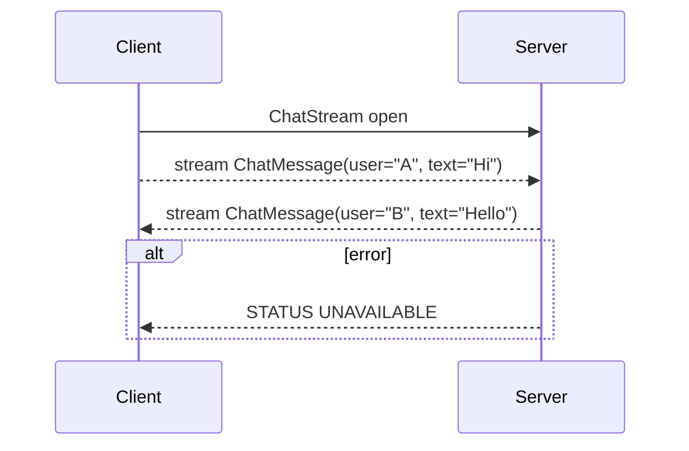

# gRPC & Protobuf Schema Design Interview Preparation

## 1. Overview of gRPC
- **What is gRPC?**  
  gRPC (gRPC Remote Procedure Call) is an open-source framework by Google that simplifies building efficient and robust communication between distributed services. It allows clients to call methods on a server application as if it were a local object, abstracting away the underlying network communication.
- **Key Features**  
  - **Transport**: Uses HTTP/2, enabling features like multiplexed streams, header compression (HPACK), and efficient binary framing.  
  - **IDL (Interface Definition Language)**: Uses Protocol Buffers (protobuf) to define service methods and message formats.  
  - **Multi-language support**: Automatic code generation for server and client stubs in languages like Java, Scala, Go, Python, C#, and more.  
  - **Streaming**: Supports four types of RPCs:  
    1. Unary RPC (single request → single response)  
    2. Server streaming (single request → stream of responses)  
    3. Client streaming (stream of requests → single response)  
    4. Bidirectional streaming (stream of requests ↔ stream of responses)
- **When to use gRPC vs. REST**  
  | Feature | gRPC | REST/JSON |
  |---|---|---|
  | Performance | Binary protocol; faster serialization/deserialization | Text-based JSON; higher overhead |
  | Contract | Strict schema enforced by `.proto` files | Typically looser, relies on documentation |
  | Streaming | Native support for streaming data | Requires custom implementations (e.g., SSE, websockets) |
  | Tooling | Auto-generated clients, strong evolution rules | Wide ecosystem, but manual client creation |

## 2. Core Concepts & HTTP/2 Primer
- **RPC (Remote Procedure Call)**: Invoking a function on a remote server as if local.  
- **HTTP/2 Advantages**:  
  - **Multiplexing**: Multiple streams over a single TCP connection avoid head-of-line blocking at the connection level.  
  - **Flow control & stream prioritization**: Efficient bandwidth usage between endpoints.  
  - **Header compression (HPACK)**: Reduces overhead for repetitive headers.  
- **gRPC Call Lifecycle**:  
  1. Client opens a stream with specific HTTP/2 headers.  
  2. Protobuf-encoded request message is sent.  
  3. Server processes the request and writes back responses (immediately or streamed).  
  4. At end, both sides send a status code indicating success or error.

## 3. Protobuf Basics & Wire Format
- **Syntax declaration**:  
  ```protobuf
  syntax = "proto3";
  package example;
  ```
- **Message definitions**:  
  ```protobuf
  message HelloRequest {
    string name = 1;      // Field number 1
  }
  message HelloReply {
    string message = 1;
  }
  ```
- **Wire types**: Each field type has a wire type (varint, 64-bit, length-delimited, etc.) optimizing space.  
- **Scalar vs. Composite types**:  
  - **Scalar**: `int32`, `int64`, `uint32`, `bool`, `string`, `bytes`  
  - **Composite**: `message`, `enum`, `map<KeyType, ValueType>`, `repeated` for lists  
- **Default values & presence**: In proto3, fields have defaults (zero for numeric, empty for string/bytes). Unset fields are not transmitted.

## 4. Schema Design Best Practices
1. **Design for clarity & single responsibility**  
   - Keep messages focused on one concept (e.g., `UserProfile`, `OrderRequest`).  
   - Avoid overloading a message with unrelated fields.

2. **Efficient Field Numbering**  
   - Reserve ranges for future expansions (e.g., custom options).  
   - Use lower numbers (<16) for frequently transmitted fields: smaller varint encoding.

3. **Mutually exclusive fields with `oneof`**  
   ```protobuf
   message SearchRequest {
     string query = 1;
     oneof pagination {
       int32 page_number = 2;
       string page_token = 3;
     }
   }
   ```
   - Saves space: only the set field is encoded.

4. **Immutable IDs & keys**  
   - Use stable identifiers (GUIDs or numeric IDs).  
   - Avoid changing semantics of existing fields.

5. **Repeated fields vs. streaming**  
   - For moderate lists (<100 items), `repeated` is fine.  
   - For very large data sets, prefer streaming RPCs to avoid large message payloads.

6. **Nested messages & composition**  
   ```protobuf
   message Address {
     string street = 1;
     string city = 2;
   }
   message UserProfile {
     string user_id = 1;
     Address address = 2;
   }
   ```
   - Promotes reuse and modularity.

7. **Comments & documentation**  
   - Use `//` comments above fields/services.  
   - Tools like `protoc-gen-doc` can generate API docs.

## 5. Versioning & Compatibility Strategies
- **Adding fields**: Safe if fields are optional or `repeated`.  
- **Removing or renaming**: Use `reserved` to mark deprecated numbers/names, preventing reuse:
  ```protobuf
  message Account {
    reserved 3, 5 to 7;
    reserved "old_field_name";
  }
  ```
- **Enum evolution**:  
  ```protobuf
  enum Status {
    ACTIVE = 0;
    INACTIVE = 1;
    UNKNOWN = 2;            // default fallback
  }
  ```
  - Always include an `UNKNOWN` or `UNSPECIFIED` default.

## 6. Detailed Example: Bidirectional Chat Service
```protobuf
syntax = "proto3";
package chat;

// Message for sending chat text
message ChatMessage {
  string user = 1;
  string text = 2;
  int64 timestamp = 3;
}

// Service for real-time chat
service ChatService {
  // Bi-directional streaming RPC
  rpc ChatStream (stream ChatMessage) returns (stream ChatMessage);
}
```
- **Use case**: Real-time chat application.  
- **Flow**: Client and server exchange `ChatMessage` streams concurrently.

## 7. Tools & Ecosystem
- **Code generation**:  
  ```bash
  protoc --grpc_out=./gen --proto_path=. --java_out=./gen Hello.proto
  ```
- **Testing & debugging**:  
  - `grpcurl`: CLI tool for invoking gRPC services.  
  - `buf lint` & `buf breaking`: Enforce style and detect breaking changes.

- **Integration with build tools**:  
  - **Maven/Gradle** for Java/Scala.  
  - **sbt** plugin for Scala: `sbt-protoc`.

## 8. Error Handling & Metadata
- **Status codes**: gRPC defines rich codes (e.g., `OK`, `INVALID_ARGUMENT`, `UNAVAILABLE`).  
- **Retries & deadlines**:  
  - Set deadlines in clients to prevent hanging calls.  
  - Use exponential backoff for retrying transient errors.

- **Metadata**:  
  - Key-value pairs sent as headers/trailers for auth tokens, tracing IDs.

## 9. Call Flow Diagrams


## 10. Interview Tips for Non-Experts
- **Explain concepts with analogies**: Compare streaming to water pipelines (continuous flow).  
- **Draw simple diagrams**: Sketch client-server interactions.  
- **Highlight benefits**: Emphasize performance gains and contract safety.  
- **Discuss real-world scenarios**: E.g., telemetry streaming, chat apps, microservices communication.
