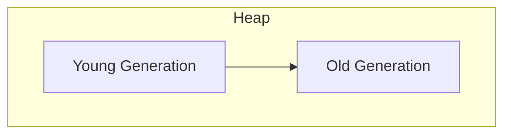
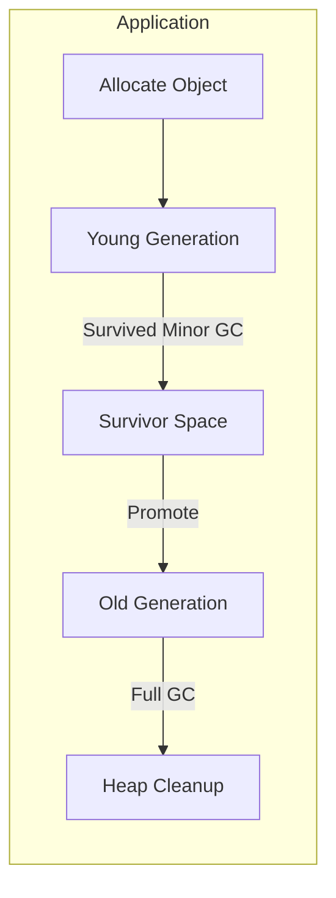

# JVM Performance Tuning: Benchmarking, GC Analysis, Heap Sizing, and JIT for Low Latency

## Introduction
Optimizing Java applications on the Java Virtual Machine (JVM) involves systematically measuring how code performs and adjusting settings to reduce delays and improve efficiency. This guide covers:
- **Benchmarking**: Measuring code performance in a controlled environment.
- **Garbage Collection (GC) Analysis**: Understanding how memory cleanup affects pauses.
- **Heap and Generation Sizing**: Configuring memory layout for optimal throughput and latency.
- **Just-In-Time (JIT) Compilation**: How the JVM compiles code on the fly for better performance.
- **Monitoring Tools**: Command-line and IDE integrations for real-time performance insights.

## 1. Benchmarking on the JVM
Benchmarking is the process of running code under controlled conditions to measure its performance accurately.

### 1.1 Why Use a Benchmarking Framework?
- **Warm-up Effects**: The JVM starts by interpreting code, then compiles hot methods. Frameworks manage warm-up automatically.
- **JIT Influence**: Benchmarks ensure the JIT compiler has had time to optimize methods before measurement.
- **Isolation**: Running separate JVM forks avoids interference from previous runs.

### 1.2 Tool: JMH (Java Microbenchmark Harness)
JMH is the de-facto standard for Java microbenchmarks, created by the OpenJDK team.

#### Example Benchmark Code
```java
import org.openjdk.jmh.annotations.*;

@State(Scope.Thread)
public class MyBenchmark {

    @Param({"1000", "10000"})
    private int size;

    @Benchmark
    @Warmup(iterations = 5, time = 1, timeUnit = TimeUnit.SECONDS)
    @Measurement(iterations = 10, time = 1, timeUnit = TimeUnit.SECONDS)
    @Fork(2)
    public void testMethod(Blackhole bh) {
        for (int i = 0; i < size; i++) {
            bh.consume(Math.sin(i));
        }
    }
}
```
- **@State**: Defines sharing scope.
- **@Param**: Parameterizes input sizes.
- **@Warmup/@Measurement**: Configure iterations and time.
- **@Fork**: Runs in separate JVM instances.
- **Blackhole**: Prevents the compiler from optimizing away unused results.

### 1.3 Best Practices
- **Use realistic workloads**: Benchmarks should reflect real application behavior.
- **Isolate other processes**: Close unnecessary applications to reduce noise.
- **Run on dedicated hardware or containers**: Prevent external interference.

## 2. Garbage Collection (GC) Analysis
Garbage Collection reclaims unused memory but can introduce pause times affecting latency.

### 2.1 GC Basics
- **Young Generation**: Area for short-lived objects.
- **Old Generation**: Area for longer-lived objects.
- **Minor GC**: Cleans the Young Generation.
- **Major/Full GC**: Cleans both generations, more expensive.

### 2.2 Enabling GC Logs
Add JVM flags to print detailed GC information:
```
-XX:+PrintGCDetails
-XX:+PrintGCDateStamps
-XX:+PrintGCTimeStamps
-XX:+PrintHeapAtGC
-Xloggc:gc.log
```
This outputs lines like:
```
2025-06-09T12:00:01.234+0300: 0.456: [GC (Allocation Failure) [PSYoungGen: 2048K->256K(2560K)] 4096K->2304K(5120K), 0.0056789 secs]
```

### 2.3 Interpreting Key Metrics
- **Pause Time**: Time the application is stopped for GC (e.g., 0.0056789 secs).
- **Throughput**: Percentage of time not spent in GC.
- **Allocation Rate**: How fast new objects are created.

### 2.4 Analysis Tools
- **GCViewer**: Desktop app that graphs GC pauses over time.
- **GCeasy.io**: Upload GC logs for visual reports.
- **Grafana + Prometheus**: Real-time monitoring for production systems.

## 3. Heap and Generation Sizing
Proper memory sizing reduces GC frequency and pause times.

### 3.1 JVM Memory Layout


### 3.2 Common Flags
- `-Xms<size>`: Initial heap size (e.g., 2g).
- `-Xmx<size>`: Maximum heap size.
- `-XX:NewRatio=<ratio>`: Ratio of Old:Young generations.
- `-XX:SurvivorRatio=<ratio>`: Ratio between Eden and Survivor spaces.
- `-XX:MaxGCPauseMillis=<ms>`: Target maximum pause time.

### 3.3 Sizing Guidelines
- **Set Xms = Xmx**: Prevents dynamic resizing overhead.
- **Young Gen Size**: Typically 25-40% of total heap; larger sizes can reduce minor GC frequency but increase pause duration.
- **Survivor Spaces**: Enough to allow short-lived objects to be promoted correctly.

### 3.4 Practical Steps
1. Start with a load test to measure baseline GC behavior.
2. Increase YoungGen if minor GCs are too frequent.
3. Adjust SurvivorRatio if promotions to OldGen happen too quickly.
4. Monitor OldGen fullness to avoid Full GCs.

## 4. Just-In-Time (JIT) Compilation for Low Latency
The JIT compiler translates bytecode into optimized machine code at runtime.

### 4.1 JIT Overview
- **Interpreter**: Runs bytecode directly.
- **C1 Compiler**: Quick, low-optimization compilation.
- **C2 Compiler**: Slower, high-optimization for frequently executed code.

### 4.2 Tiered Compilation
By default, the JVM uses tiered compilation to balance startup time and long-term performance.
Flags:
```
-XX:+TieredCompilation
-XX:TieredStopAtLevel=4
```

### 4.3 Inlining and HotSpot
- **Method Inlining**: Smaller methods get embedded into callers, reducing call overhead.
- Flags: `-XX:MaxInlineSize`, `-XX:InlineSmallCode`.
- **CompileThreshold**: How many invocations before JIT compilation.

### 4.4 Advanced Options
- **AOT (Ahead-of-Time) Compilation**: Pre-compile performance-critical classes with `jaotc`.
- **Escape Analysis**: JVM optimization to allocate objects on the stack if they don’t escape.

## 5. Tools for Monitoring Performance

### 5.1 Command-line Tools
- **jstat**: JVM statistics monitoring (e.g., `jstat -gc PID 1000`).
- **jmap**: Memory map of live objects (`jmap -heap PID`).
- **jstack**: Thread dump for diagnosing thread contention (`jstack PID`).
- **jcmd**: Multi-purpose command for GC, JIT diagnostics (`jcmd PID GC.heap_info`).
- **GC Logging**: Real-time log output with `-Xlog:gc*`.

### 5.2 IntelliJ IDEA Integrations
- **Built-in Profiler**: Start a CPU/memory recording in the Run menu.
- **VisualVM Plugin**: Connect to local/remote JVM instances for heap dumps.
- **Java Flight Recorder (JFR) Integration**: Launch JFR sessions and analyze recordings within the IDE.
- **Async Profiler Plugin**: Flame graphs for CPU or allocation profiling.
- **YourKit/YourKit IDEA Plugin**: Commercial profiler support directly inside IntelliJ.
- **JProfiler**: Connect JProfiler to IntelliJ for advanced profiling sessions.

## 6. Summary and Next Steps
- **Benchmark** with JMH, warm up, fork, realistic data.
- **Log GC** and analyze pause times and throughput.
- **Size Heap**: Align Xms/Xmx, tune generation sizes.
- **Tune JIT**: Use tiered compilation, adjust inlining.
- **Monitor** using CLI tools (jstat, jcmd) and IntelliJ integrations (profiler, JFR).
- **Continuous Monitoring**: Integrate performance metrics into dashboards for production.

---

**Diagram: JVM Memory Flow**


