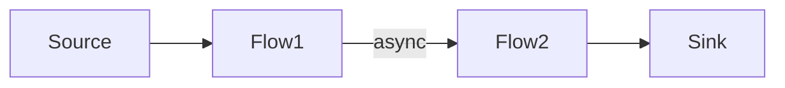

# Async Boundaries in Akka Streams

## Definition

An **async boundary** in Akka Streams is a demarcation point within a stream graph where downstream and upstream stages are executed on different Actors (i.e., different execution contexts), introducing asynchronous, non-blocking handoff between them.

## Why It Matters

- **Performance Tuning**: By default, Akka Streams fuses stages into a single Actor for maximum throughput and minimal latency. Introducing async boundaries allows you to exploit parallelism across CPU cores.
- **Fault Isolation**: Failures in one segment of the graph don’t propagate synchronously to the fused stages.
- **Backpressure Domains**: Each async boundary establishes its own backpressure signal, enabling finer control.

## How to Introduce an Async Boundary

Use the `.async` operator in your stream graph:

```scala
import akka.actor.ActorSystem
import akka.stream.scaladsl.{Source, Flow, Sink}
import akka.stream.ActorMaterializer

implicit val system = ActorSystem("AsyncBoundaryExample")
implicit val mat    = ActorMaterializer()

val source = Source(1 to 10)

val flow1 = Flow[Int].map { x =>
  println(s"Flow1: $x on ${Thread.currentThread().getName}")
  x * 2
}

val flow2 = Flow[Int].map { x =>
  println(s"Flow2: $x on ${Thread.currentThread().getName}")
  x + 1
}

val graph = source
  .via(flow1)
  .async               // <-- async boundary here
  .via(flow2)
  .toMat(Sink.ignore)(Keep.right)

graph.run()
```

### Thread Usage Diagram



## When to Use Async Boundaries

- **Parallelism**: When different stages have varying workloads and you want them to run concurrently.
- **External I/O**: To isolate blocking operations (e.g., database calls) and prevent them from stalling the entire fused graph.
- **Backpressure Control**: To define independent demand signals between logical segments.

---

# Reactive Streams Specification

## Overview

The **Reactive Streams** specification defines a standard for asynchronous stream processing with **non-blocking backpressure**, enabling interoperability among libraries such as Akka Streams, RxJava, and others.

## Core Interfaces

1. **Publisher[T]**: Produces potentially unbounded sequence of elements of type `T`.
2. **Subscriber[T]**: Consumes elements, receiving signals: `onSubscribe`, `onNext`, `onError`, `onComplete`.
3. **Subscription**: Represents a one-to-one lifecycle of a `Subscriber` subscribing to a `Publisher`. Provides `request(n: Long)` and `cancel()`.
4. **Processor[A, B]**: Both a `Subscriber[A]` and `Publisher[B]`, allowing transformation stages.

## Key Principles

- **Asynchronous**: Components communicate without blocking threads.
- **Non-Blocking Backpressure**: Consumers can signal demand upstream, preventing fast producers from overwhelming slower consumers.
- **Interoperability**: Libraries implementing the spec can compose pipelines across different engines.
- **Reactive Streams TCK**: A Technology Compatibility Kit to verify compliance.

## Simple Implementation Example

```scala
import org.reactivestreams.{Publisher, Subscriber, Subscription}

class PrintSubscriber extends Subscriber[Int] {
  private var subscription: Subscription = _

  override def onSubscribe(s: Subscription): Unit = {
    subscription = s
    subscription.request(1)            // Request the first element
  }

  override def onNext(elem: Int): Unit = {
    println(s"Received: $elem")
    subscription.request(1)            // Request the next element
  }

  override def onError(t: Throwable): Unit =
    println(s"Error: $t")

  override def onComplete(): Unit =
    println("Stream completed")
}
```

## Relation to Akka Streams

- **Source** implements `Publisher`, **Sink** implements `Subscriber`, and **Flow** implements `Processor`.
- Akka Streams manages async boundaries, buffering, and backpressure according to the Reactive Streams rules.

### Sequence Diagram

```mermaid
sequenceDiagram
  Publisher->>Subscription: request(n)
  Subscription->>Publisher: emit up to n elements
  Publisher->>Subscriber: onNext(data)
  Subscriber->>Subscription: request(more)
  ...
  Publisher->>Subscriber: onComplete()
```

---

*Doc generated on May 27, 2025*
