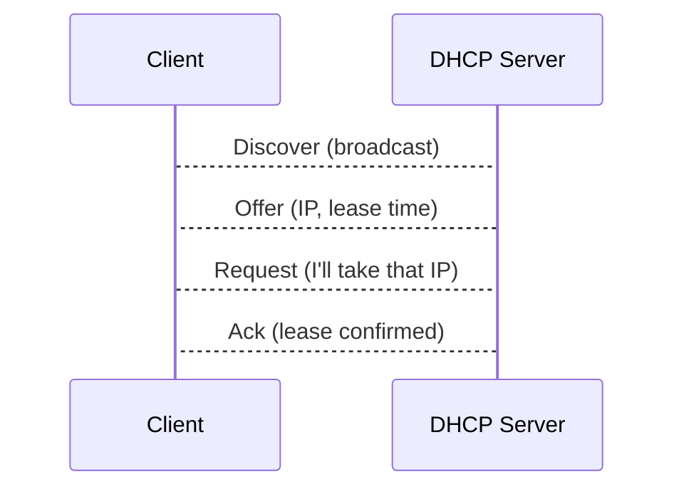

# DNS & DHCP – Name and Address Services

Networking would be chaos without **names** and **automatic addressing**.  
Two core services solve this:

* **DNS – Domain Name System** → *maps names to IPs*  
* **DHCP – Dynamic Host Configuration Protocol** → *hands out IPs and settings*

---

## 1  DNS Fundamentals

### 1.1  Why DNS?

Humans remember `chat.openai.com`, not `104.18.12.123`.  
DNS is a **distributed, hierarchical database** that translates domain names to resource records (*RRs*).


### 1.2  Key Components

| Element | Purpose |
|---------|---------|
| **Root (`.`)** | 13 root‑server clusters delegate TLDs. |
| **TLD** | Top‑Level Domains: `.com`, `.org`, `.ua`. |
| **Authoritative NS** | Stores final answer for a zone. |
| **Resolver** | Client‑side stub library + recursive server (often ISP or 127.0.0.53). |

**Record Types**

| Type | Description | Example |
|------|-------------|---------|
| **A** | IPv4 address | `example.com A 93.184.216.34` |
| **AAAA** | IPv6 address | `example.com AAAA 2606:2800:220:1:248:1893:25c8:1946` |
| **CNAME** | Alias to another name | `www → example.com` |
| **MX** | Mail exchanger | `example.com MX 10 mail.example.com` |
| **NS** | Delegated nameserver | `example.com NS ns1.icann.org` |
| **TXT** | Arbitrary text (SPF, DKIM) | `"v=spf1 include:_spf.google.com ~all"` |
| **SRV** | Service locator | `_sip._tcp.example.com SRV 0 5 5060 sip.server.com` |
| **PTR** | Reverse‑DNS | `34.216.184.93.in-addr.arpa PTR example.com` |

### 1.3  Resolution Flow (Recursive)

```
Client → Resolver → Root → .com NS → example.com NS → Answer
```   

1. **Iterative** queries let each server refer the resolver onward.  
2. **Caching** stores answers for *TTL* seconds, slashing latency & root traffic.

> **Analogy:** DNS is a **global phone book**; recursive resolvers are the *directory enquiries* operator.

### 1.4  Security

* **DNSSEC** signs records (RRSIG) to prevent spoofing.  
* Common attacks: cache‑poisoning, NXDOMAIN floods.

---

## 2  DHCP Basics

### 2.1  Purpose

Eliminates manual IP setup by **leasing** addresses plus:

* Subnet mask  
* Default gateway (Option 3)  
* DNS servers (Option 6)  
* NTP server, PXE boot file, vendor opts

### 2.2  The DORA Exchange



* All carry the **client MAC** for identification.  
* Leases have timers: **T1** (renew), **T2** (rebind), **Expiry**.

### 2.3  Static vs. Dynamic

| Feature | Static Config | DHCP |
|---------|---------------|------|
| Admin overhead | High | Low |
| IP consistency | Guaranteed | Via reservation |
| Risk of conflicts | Manual errors | Server controlled |
| Mobility | Poor | Excellent |

> **Reservation**: bind a **MAC → IP** so a device always gets the same address.

### 2.4  Dynamic DNS (DDNS)

DHCP server can update **A/PTR** records after leasing → names track moving hosts.

---

## 3  Quick Troubleshooting

| Symptom | DNS Tool | DHCP Tool |
|---------|----------|-----------|
| Name fails | `dig` / `nslookup` | – |
| Intermittent | `dig +trace` | `dhclient -v -r` renew |
| Wrong IP | Check zone serial | Verify reservation |
| Slow init | Check TTLs & `RES_OPTIONS` | Look for large Option 43 |

---

### Further Reading

* **UNIX & Linux System Administration Handbook** – Ch 16 (DNS), Ch 13.7 (DHCP)  
* DigitalOcean – “Introduction to DNS Terminology”  
* RFC 1034/1035 – DNS Specification  
* RFC 2131 – DHCP Protocol
