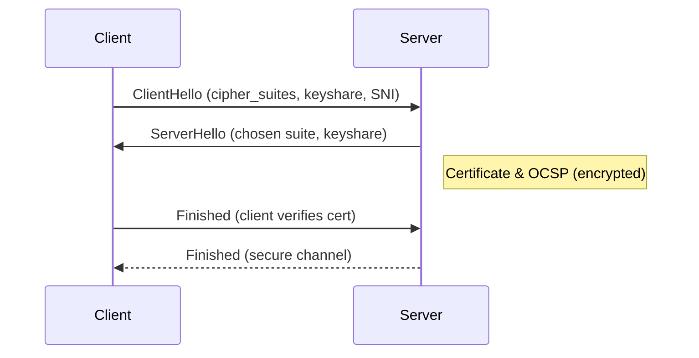

# HTTP, HTTPS, SSL & TLS – Web Transport Essentials

---

## 1  HTTP in a Nutshell

**Hypertext Transfer Protocol (HTTP)** is a **stateless, text‑based** request/response protocol that runs on **TCP (usually port 80)**.

### 1.1  Request Anatomy

```text
GET /chat HTTP/1.1
Host: openai.com
User‑Agent: curl/8.7
Accept: */*
```

| Component | Example | Purpose |
|-----------|---------|---------|
| **Method** | `GET` | Action to perform |
| **Path** | `/chat` | Resource on server |
| **Version** | `HTTP/1.1` | Feature set & rules |
| **Headers** | `Host`, `User‑Agent` | Metadata (key: value) |
| **Body** | (optional) | Data for POST/PUT |

Common **methods**: `GET`, `POST`, `PUT`, `DELETE`, `PATCH`, `HEAD`, `OPTIONS`.

> **Analogy:** A **restaurant order** – *method* = order type, *headers* = special instructions, *body* = the meal.

### 1.2  Response Anatomy

```text
HTTP/1.1 200 OK
Content‑Type: application/json
Content‑Length: 19

{"msg":"welcome"}
```

* **Status line** → numeric code + reason (e.g., `404 Not Found`).  
* **Payload** → resource or error description.

**Status Code Families**

| Range | Class | Typical Use |
|-------|-------|-------------|
| 1xx | Informational | 101 Switching Protocols |
| 2xx | Success | 200 OK, 204 No Content |
| 3xx | Redirection | 301 Moved Permanently |
| 4xx | Client Error | 400 Bad Request, 403 Forbidden |
| 5xx | Server Error | 500 Internal Server Error |

### 1.3  Versions at a Glance

| Version | Highlights | Wire Format |
|---------|------------|-------------|
| **HTTP/1.1** | Keep‑Alive, pipelining | Text |
| **HTTP/2** | Multiplexed streams, HPACK compression | Binary (frames) |
| **HTTP/3** | QUIC over UDP, 0‑RTT | Binary (QUIC frames) |


---

## 2  From HTTP to HTTPS – Enter TLS

HTTPS = **HTTP over TLS**, typically on **TCP 443**.

### 2.1  TLS vs. SSL

* **SSL v2/v3** – original Netscape protocol (obsolete).  
* **TLS 1.0–1.3** – IETF‑standardised successors (current).  
* SSL is dead jargon; say “TLS”.

### 2.2  TLS Handshake (1.3)



* **SNI** – Server Name Indication lets one IP host multiple HTTPS sites.  
* **ALPN** – Application‑Layer Protocol Negotiation selects HTTP/2 vs HTTP/3.  
* After the handshake, both sides share symmetric *session keys* → fast encrypted traffic.

### 2.3  Certificates

| Field | Example |
|-------|---------|
| **Subject** | `CN=chat.openai.com` |
| **Issuer** | Let’s Encrypt R3 |
| **Validity** | Not Before / Not After dates |
| **Public Key** | RSA 2048 / ECDSA P‑256 |

Browsers trust a **chain**: Site Cert → Intermediate → *Root CA* (stored locally).

> **Analogy:** A passport (certificate) issued by your government (CA) that foreign officers (clients) trust.

---

## 3  Security Properties Provided by TLS

| Property | How Achieved | Threat Mitigated |
|----------|--------------|------------------|
| **Confidentiality** | AES/GCM encryption | Packet snooping |
| **Integrity** | AEAD MAC tag | Bit‑flip attacks |
| **Authentication** | X.509 cert chain | MITM, spoofing |
| **Forward Secrecy** | Ephemeral Diffie‑Hellman | Future key leaks |

---

## 4  Performance Notes

* **TLS 1.3** cuts handshake to **1‑RTT** (or 0‑RTT resumption).  
* **HTTP/2 + TLS** mitigates head‑of‑line blocking with multiplexing.  
* Use **OCSP Stapling** & **HSTS** to harden without latency hits.

---

## 5  Quick Troubleshooting

| Tool | Command | Insight |
|------|---------|---------|
| `curl` | `curl -v https://example.com` | Full handshake log |
| `openssl s_client` | `openssl s_client -connect :443 -servername host` | Cert chain & ciphers |
| `ssllabs.com` | Online scan | Grade, weak ciphers |
| Browser dev‑tools | Security tab | Cert details, TLS version |

---

### Further Reading
* *HTTP: The Protocol Every Web Developer Must Know* – Parts 1 & 2  
* Steve’s Internet Guide – “SSL Certificates Explained”  
* *TLS 1.3 RFC 8446* – official specification
