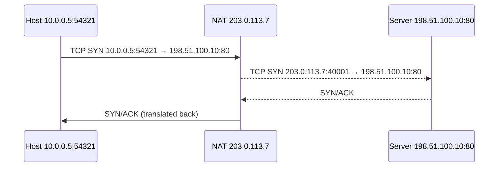
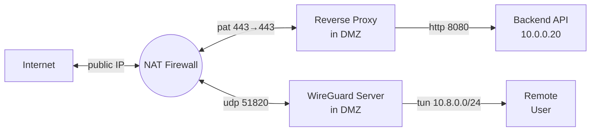

# Perimeter Networking – NAT, DMZ & VPNs

Modern networks rarely expose their private address space or internal hosts directly to the
Internet.  Three key concepts make this possible:

* **NAT** – Network Address Translation  
* **DMZ** – De‑Militarised Zone (perimeter subnet)  
* **VPN** – Virtual Private Network (encrypted tunnels)

---

## 1  Network Address Translation (NAT)

### 1.1  Why NAT?

IPv4 shortages + security → let many private hosts share **one public IP**.

```
Private LAN      NAT Router            Internet
10.0.0.0/24  →  203.0.113.7  ↔  Public sites
```

### 1.2  Types of NAT

| Name | Mapping | Use Case |
|------|---------|----------|
| **Static NAT** | One private ↔ one public | Host must be reachable (e.g., mail server) |
| **Dynamic NAT** | Pool of publics ↔ first‑come‑first‑served | Labs, ISP edge translations |
| **PAT / NAPT** (*Port Address Translation*) | Many privates ↔ one public + different **ports** | Home/SOHO routers |

> **Analogy:** PAT is a receptionist keeping one **office number** but different **extension numbers** for each employee.

### 1.3  How PAT Works



Router keeps a **translation table** (5‑tuple) until idle timeout.

### 1.4  Pros & Cons

| 👍 Benefits | 👎 Drawbacks |
|------------|-------------|
| Conserves IPv4 addresses | Breaks true end‑to‑end principle |
| Masks internal topology | Complicates VoIP, P2P (needs ALG, STUN) |
| Simple “poor‑man’s firewall” | Adds state, can bottleneck throughput |

---

## 2  DMZ – Perimeter Subnet

A **DMZ** is a *buffer network* between the untrusted Internet and trusted LAN.


### 2.1  Architectures

| Model | Description |
|-------|-------------|
| **Single‑Firewall, 3‑Leg** | One firewall with three interfaces – *Outside*, *DMZ*, *Inside*. |
| **Dual‑Firewall** | Edge firewall (Outside ↔ DMZ) + internal firewall (DMZ ↔ Inside).  Higher security at cost of gear/complexity. |

### 2.2  Typical DMZ Hosts

* Public web servers / reverse proxies  
* Mail relays (MX)  
* DNS authoritatives  
* Bastion (jump) hosts

Firewall rules: **Internet → DMZ (few ports)**, **DMZ → LAN (minimal: DB port)**, **LAN → DMZ (admin/SSH)**.

---

## 3  VPN – Secure Tunnels over Untrusted Networks

### 3.1  Why VPN?

* **Confidentiality** – Encrypt traffic across public Internet.  
* **Integrity & Auth** – Prevent tampering, validate peers.  
* **Virtual presence** – Remote host appears on internal IP network.

### 3.2  Modes

| Category | Typical Protocols | Use Case |
|----------|-------------------|----------|
| **Site‑to‑Site** | IPsec + IKEv2, DMVPN, WireGuard | Connect branch offices |
| **Remote Access** | OpenVPN, TLS VPN, SSTP, WireGuard | Teleworkers, road‑warriors |
| **Clientless / SSL Portal** | HTTPS reverse‑proxy | Quick browser access to intranet apps |

### 3.3  Key Protocol Building Blocks

* **IPsec** – Suite (AH, ESP) for Layer‑3 encryption. Works in **Tunnel** (new IP header) or **Transport** mode.  
* **IKEv2** – Key negotiation & mutual authentication (cert, PSK, EAP).  
* **SSL/TLS VPN** – Runs over TCP 443; easier to traverse firewalls/NAT.  
* **WireGuard** – Modern, lean (4k LOC) UDP‑based, uses Curve25519 + ChaCha20‑Poly1305; configured like SSH keys.

### 3.4  NAT Traversal

* **UDP 4500** encapsulation for IPsec when NAT detected (`NAT‑T`).  
* WireGuard & OpenVPN use single UDP/TCP ports that survive PAT.  
* Sometimes still need **port‑forward** in home NAT to reach self‑hosted VPN.

---

## 4  Putting It All Together



* **External clients** hit NAT’s public IP:443 → forwarded to DMZ reverse‑proxy.  
* **Employees** connect via VPN, join internal **10.8.0.0/24** subnet, reach services without extra firewall holes.

---

## 5  Quick Commands

```bash
# Simple DNAT on Linux (iptables)
iptables -t nat -A PREROUTING -i eth0 -p tcp --dport 443          -j DNAT --to-destination 192.0.2.10:443

# Enable IP forwarding (required for NAT/VPN)
sysctl -w net.ipv4.ip_forward=1

# Generate WireGuard keys
wg genkey | tee server.key | wg pubkey > server.pub
```

---

### Further Reading

* “Internet‑Computer‑Security.com” – NAT & DMZ primers  
* Cisco ASA/Firepower docs – Dual‑DMZ design patterns  
* RFC 4301 (IPsec), RFC 7427 (IKEv2 Signature Auth), WireGuard white‑paper
