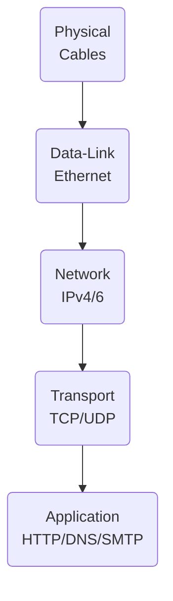

# Network Models & Architectures

This file groups the **conceptual frameworks** and **physical layouts** that underpin modern networking:  
*OSI vs. TCP/IP*, *network topologies*, and how *Intranets* & *Extranets* fit into the picture.

---

## 1  The OSI Model — 7 Layers

| # | Layer | Key PDU | Typical Protocols | Real‑World Analogy |
|---|-------|---------|-------------------|--------------------|
| 7 | **Application** | Data | HTTP, SMTP | Your browser |
| 6 | **Presentation** | Data | TLS, JPEG | Translator |
| 5 | **Session** | Data | NetBIOS, RPC | Conversation context |
| 4 | **Transport** | Segment | TCP, UDP | Shipping company |
| 3 | **Network** | Packet | IP, ICMP | Street map |
| 2 | **Data‑Link** | Frame | Ethernet, 802.11 | Postal truck |
| 1 | **Physical** | Bit | UTP, Fiber, Wi‑Fi radio | Road |

Mnemonic: **“All People Seem To Need Data Processing.”**

### Why it matters  
* Gives vendors a common language — easier troubleshooting and certification.  
* Isolation of change: you can swap **Ethernet** for **Wi‑Fi** (Layer 2) without rewriting **HTTP** apps (Layer 7). citeturn0search0

---

## 2  TCP/IP Model vs. OSI

| OSI | TCP/IP (DoD) | Example |
|-----|--------------|---------|
| App + Pres + Sess | **Application** | HTTP, DNS |
| Transport | **Transport** | TCP/UDP |
| Network | **Internet** | IP, ICMP |
| Data‑Link + Physical | **Network Access** | Ethernet, Wi‑Fi |

* TCP/IP compresses seven layers into **four**, focusing on protocols that actually run the Internet. citeturn0search2turn0search10  
* OSI is “*protocol‑agnostic documentation*,” while TCP/IP is an *implemented stack*.

---

## 3  Network Topologies

| Topology | Diagram | Pros | Cons | Typical Use |
|----------|---------|------|------|-------------|
| **Bus** | `──●──●──●──` | Easy, cheap | A single break kills net | Legacy Ethernet 10BASE‑2 |
| **Star** | `      ●      
   /  |  \   
●‑●‑●‑●` | Isolates failure, easy add/remove | Hub/Switch is SPOF | Modern LAN with switch |
| **Ring** | `●‑●‑●‑●` (loop) | Predictable latency | Break disrupts all | FDDI, Token Ring |
| **Mesh** | Each node links to many | Redundant paths | Expensive cabling | WAN backbones, Wireless mesh |
| **Hybrid/Tree** | Combination (e.g., star‑of‑stars) | Scalable | Config complexity | Enterprise networks |

  
Topologies describe **physical wiring** *and/or* **logical data flow**. citeturn0search1turn0search5

---

## 4  Intranet, Extranet & Internet

| Scope | Access | Purpose | Example |
|-------|--------|---------|---------|
| **Intranet** | Private, internal staff | HR portal, internal Git | `intranet.local` | 
| **Extranet** | Limited external partners | Supplier order tracking | Vendor portal |
| **Internet** | Public, global | Customer website | `example.com` |

*An extranet is essentially an **intranet extended** to trusted outsiders through VPNs or reverse proxies.* citeturn0search3turn0search7turn0search11

---

## 5  Quick Mapping Cheat‑Sheet

* **Ping** crosses Layers 1‑3; **TLS handshake** lives at Layers 5‑6; your **browser** is Layer 7.*

---

### Further Reading
* NetworkWorld – “OSI model explained” (2024)  
* Tutorialspoint – “OSI vs TCP/IP”, “Network Topologies”, “Intranet vs Extranet”
