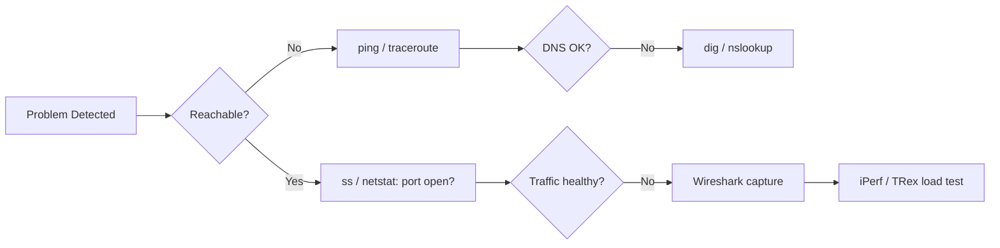

# Network Troubleshooting & Performance Tools

Networking issues are often like detective work—**observe**, **measure**, and **prove**.  
This cheat‑sheet groups the most common **CLI commands** and **toolkit utilities** you will meet on Linux & Windows.

---

## 1  Core TCP/IP Commands

| Platform | Command | What it Shows / Does | Quick Example |
|----------|---------|----------------------|---------------|
| **Linux** | `ip addr`, `ip link`, `ip route` | Modern replacement for ifconfig/route; manage & view addresses, links, routes. | `ip route get 8.8.8.8` |
| | `ss -lntup` | *Socket statistics* – list TCP/UDP sockets faster than netstat. | `ss -s` summary |
| | `ifconfig` *(legacy)* | Show & configure interfaces. | `sudo ifconfig eth0 down` |
| | `route -n` | Legacy routing table viewer. | `route add default gw 192.168.1.1` |
| | `netstat -rn` | Combined interface + route stats. | `netstat -plant` |
| **Windows** | `ipconfig /all` | Interface addresses, DNS & DHCP info. | `ipconfig /flushdns` |
| | `ping <host>` | ICMP echo / latency test. | `ping -n 10 google.com` |

> **Analogy:** `ping` is like tapping a microphone—“Can you hear me?”—while `ip route` is the **map** your packets follow.

### Quick Tips  

* **Capture once, filter later** with `tcpdump -i eth0 -w trace.pcap`.  
* Prefer `ss` over `netstat`—it hooks directly into `/proc` and is *much* faster (Linux 2.6.18 +).

---

## 2  Packet Capture & Protocol Analysis – *Wireshark*


* **Deep inspection** of 1000+ protocols, color‑coded decoding.  
* Use **capture filters** (`port 443`) to limit traffic; use **display filters** (`http.request && ip.addr==10.0.0.5`) to dissect afterwards.  
* Follow TCP stream to reconstruct HTTP conversations—great for debugging REST calls.

> **Tip:** Run `sudo wireshark` only when necessary; prefer `dumpcap` + non‑root capture groups for safety.

---

## 3  Traffic Generation & Load Testing

### 3.1 TRex (Cisco)

| Feature | Notes |
|---------|-------|
| *Packet generator* capable of **Line‑Rate** 1–400 Gb/s on commodity servers. |
| Supports **stateful** (TCP) and **stateless** (raw L2‑L4) flows. |
| Ideal for **router / firewall throughput** benchmarks. |
| YAML‑driven profiles; Python automation via `t-rex-client`. |

```
$ ./t-rex-64 -f cap2/dns.yaml -m 500 -d 60 -l 1000
```

### 3.2 iPerf / iPerf3

| Mode | Command | What it Measures |
|------|---------|------------------|
| **Server** | `iperf3 -s` | Listens (TCP/UDP) on port 5201 |
| **Client** | `iperf3 -c 10.0.0.5 -t 30` | Throughput, jitter, loss |
| **Reverse** | `iperf3 -c 10.0.0.5 -R` | Upstream bandwidth |

* Use `-u` for UDP, `-P 4` for parallel streams, `-b 0` to saturate link.

> **Analogy:** iPerf is a **speed‑gun** for your network, while TRex is a **traffic fire‑hose**.

---

## 4  Putting It Together – Troubleshoot Workflow



---

## 5  One-Liner Cheat‑Sheet

```bash
# Current default gateway (Linux)
ip route | awk '/default/ {print $3}'

# Top talkers (requires nload or bmon)
sudo nload             # live traffic graph

# List processes bound to port 80
sudo ss -ltnp sport = :80

# DNS latency
dig @1.1.1.1 google.com +stats +noquestion
```

---

### Further Reading
* *UNIX & Linux System Administration Handbook*, 5 ed – Ch 13.10  
* Microsoft *Networking Fundamentals*, Lesson 5  
* Official Wireshark User’s Guide  
* Cisco TRex Docs • iPerf3 README
