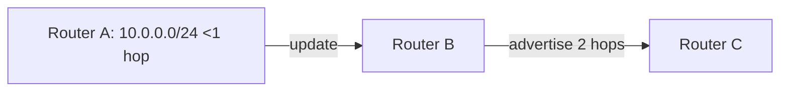

# Routing Fundamentals & Reverse Proxies

---

## 1  Routing Basics

A **router** decides where to forward packets using its **routing table**.

* **Lookup rule:** pick the entry whose prefix **matches the destination IP with the most bits** → **Longest Prefix Match** (LPM). citeturn0search4  
* **Default route** (`0.0.0.0/0`) is a catch‑all when no more‑specific prefix exists.

```bash
$ ip route show
default via 192.168.1.1 dev eth0           # ← GW for the Internet
192.168.1.0/24 dev eth0  proto kernel  scope link
```
citeturn0search5

> **Analogy:** Think of mailing a letter—if the city (network) matches, deliver locally; otherwise hand it to the post office (default GW).

---

## 2  Static vs. Dynamic Routes

| Approach | How Added | Pros | Cons | Use Cases |
|----------|-----------|------|------|-----------|
| **Static** | `ip route add 10.0.0.0/24 via 192.168.1.2` | Simple, predictable | Manual updates, error‑prone | Small, stable nets |
| **Dynamic** | Protocols exchange routes automatically | Self‑healing, scalable | CPU/bandwidth overhead | Enterprise & ISP cores |

---

## 3  RIP – Distance‑Vector Classic

* **Metric:** Hop‑count (max **15** → 16 = *infinite*) citeturn0search6  
* **Updates:** Every **30 s** broadcast full table to neighbours. citeturn0search0  
* **Timers:**  
  * **Invalid** (180 s) – route considered bad if no update.  
  * **Flush** (240 s) – remove route.  
  * **Holddown** – suppress flapping routes.



Modern networks mostly use **OSPF (link‑state)** or **BGP (path‑vector)**, but RIP remains exam‑relevant and easy to simulate.

---

## 4  How a Packet Is Forwarded (IPv4)

1. **Ingress:** Router receives frame, strips L2 header.  
2. **Lookup:** Perform LPM on destination IP in the **RIB/FIB**.  
3. **Rewrite:** Decrement TTL, update checksum.  
4. **Egress:** Encapsulate in new L2 frame, send out selected interface.

---

## 5  Reverse Proxy – Application‑Layer Forwarder

A **reverse proxy** sits in front of backend servers and forwards **client → proxy → origin**.

| Function | Benefit |
|----------|---------|
| TLS off‑load | Offload CPU‑heavy crypto |
| Load balancing | Distribute traffic | 
| Caching & compression | Improve latency |
| Security firewall | Hide internal topology, apply WAF rules |
| Protocol translation | HTTP/2 ⇄ HTTP/1.1, gRPC gateway |

Popular implementations: **Nginx**, **HAProxy**, **Envoy**, **Apache mod_proxy**.

> **Router vs. Reverse Proxy:**  
> *Router* forwards at **Layer 3/4** based on IP; *reverse proxy* forwards at **Layer 7** based on URL/Host headers.

---

## 6  Quick‑Use Cheat‑Sheet

```bash
# Show route chosen for 8.8.8.8
ip route get 8.8.8.8

# Add static backup route with metric 200
ip route add 0.0.0.0/0 via 10.0.0.254 metric 200

# Simulate RIP in a lab (FRRouting)
frr# router rip
frr(config-router)# network 10.0.0.0/24
```

---

### Further Reading

* Cisco – “Routing Information Protocol (RIP) Technical Overview”  
* Linux man‑page `ip-route(8)`  
* NetworkLessons – “Longest Prefix Match Routing”
