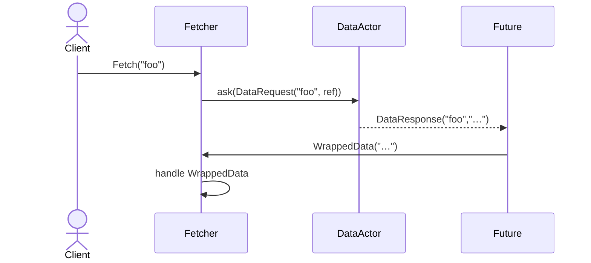
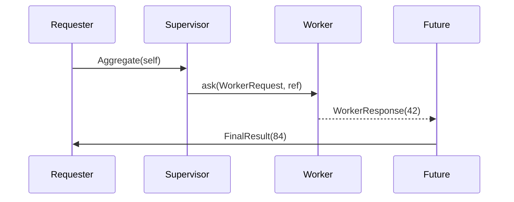

# Akka ask + pipeTo Patterns Summary

## 1. Simple “ask to self and pipe back”

**Overview:**
- Actor A sends a `DataRequest(id, replyTo)` to Actor B via `ask`, receiving a `Future[DataResponse]`.
- The future is transformed into a `WrappedData` message and piped back to Actor A.
- Actor A handles success (`WrappedData`) or failure (`FetchFailed`).

**Code Example:**
```scala
// Messages
case class Fetch(id: String)
case class DataRequest(id: String, replyTo: ActorRef)
case class DataResponse(id: String, payload: String)
case class WrappedData(payload: String)
case class FetchFailed(reason: Throwable)

// Fetcher actor
class Fetcher(dataActor: ActorRef) extends Actor {
  import context.dispatcher
  implicit val timeout: Timeout = 3.seconds

  def receive: Receive = {
    case Fetch(id) =>
      val f = (dataActor ? (ref => DataRequest(id, ref))).mapTo[DataResponse]
      f.map(resp => WrappedData(resp.payload))
       .recover { case ex => FetchFailed(ex) }
       .pipeTo(self)

    case WrappedData(payload) =>
      println(s"Got data: $payload")
    case FetchFailed(err) =>
      println(s"Fetch failed: ${err.getMessage}")
  }
}
```

**Sequence Diagram:**


---

## 2. “ask + pipeTo another actor” (fire-and-forward)

**Overview:**
- Supervisor asks Worker for data and pipes the processed `FinalResult` directly to Requester.

**Code Example:**
```scala
case class Aggregate(requester: ActorRef)
case object WorkerRequest
case class WorkerResponse(result: Int)
case class FinalResult(value: Int)
case class WorkFailed(reason: Throwable)

class Supervisor(worker: ActorRef) extends Actor {
  import context.dispatcher
  implicit val timeout: Timeout = 2.seconds

  def receive: Receive = {
    case Aggregate(requester) =>
      (worker ? WorkerRequest)
        .mapTo[WorkerResponse]
        .map(wr => FinalResult(wr.result * 2))
        .recover { case ex => WorkFailed(ex) }
        .pipeTo(requester)
  }
}
```

**Sequence Diagram:**


---

## Key Points

- **Non-blocking:** `ask` returns a `Future`, avoiding actor blocking.  
- **Separation of concerns:** Actor handles messages; async logic lives in the future pipeline.  
- **Error handling:** Use `.recover` to produce well-defined failure messages.  
- **Flexibility:** Chain async transformations (`map`, `flatMap`) before `pipeTo`.

---

## Imports & Implicits

```scala
import akka.pattern.{ask, pipe}
import akka.util.Timeout
import context.dispatcher   // ExecutionContext for futures
implicit val timeout: Timeout = 3.seconds
```
