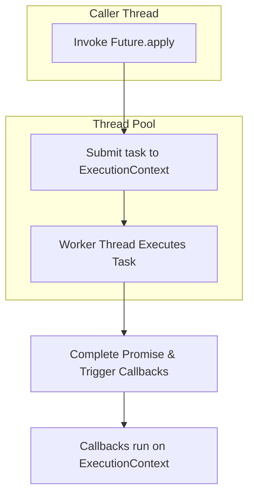

# Scala & Akka Futures: Definitions, Catches, and Async Patterns

## 1. Definitions

**Future[T]**: An immutable, single-assignment container for a value of type `T` that may not yet be available. Represents an asynchronous computation that will eventually complete with a value or an exception.

**Promise[T]**: A writable, single-assignment container which can be completed with a `Future`’s result, allowing manual control over completion.

**ExecutionContext**: An abstraction over a thread pool responsible for executing the logic of `Future`s and their callbacks. Provides threads or CPUs for asynchronous work.

## 2. Execution & Threading

- By default, `Future { ... }` uses the implicit `ExecutionContext` in scope, typically `ExecutionContext.global`, which is backed by a `ForkJoinPool`.
- In Akka-based applications, prefer using an `ActorSystem`’s dispatcher to avoid interfering with other libraries:

```scala
implicit val ec: ExecutionContext = system.dispatcher
```

> **Nuance**: Performing blocking operations (e.g., `Await.result`, JDBC calls) inside Futures can starve threads in the pool, leading to deadlocks or poor throughput.

### Execution Flow Diagram



## 3. Common Catches & Pitfalls

| Pitfall                  | Description                                                                 | Avoid / Fix                                                      |
|--------------------------|-----------------------------------------------------------------------------|------------------------------------------------------------------|
| Blocking in Futures      | Using `Await.result` or blocking I/O within a Future can consume all threads.| Use non-blocking libraries or dedicate a separate dispatcher       |
| Swallowed Exceptions     | Exceptions thrown inside `map`/`flatMap` may be unobserved if no handler is registered. | Use `recover`, `recoverWith`, or `onComplete` to handle failures  |
| Callback Thread Context  | Callbacks (`onComplete`, `foreach`) execute on the provided ExecutionContext, not the original caller thread. | Be explicit about which dispatcher to use for callbacks           |
| Creating Multiple ECs    | Instantiating new ExecutionContexts per Future wastes resources and can exhaust thread pools. | Define and reuse a single implicit ExecutionContext               |
| Race Conditions          | Multiple Futures accessing shared mutable state can lead to data races.     | Prefer immutable data or use `Promise` for coordination            |

## 4. Async Composition Patterns

### For-Comprehension (Sequential Composition)

```scala
val result: Future[Combined] = for {
  a <- futureA
  b <- futureB(a)
} yield combine(a, b)
```

### Parallel Bulk Operations

```scala
// Runs compute(item) for each item in parallel
val allResults: Future[List[Result]] = Future.traverse(items)(compute)
```

### Akka `pipeTo` Pattern

```scala
import akka.pattern.pipe
futureResult.pipeTo(self)
```

Redirects the future’s result as a message to an actor, enabling seamless integration.

## 5. Best Practices & Recommendations

1. **Isolate Blocking Calls**: Use a dedicated dispatcher for blocking operations:
   ```scala
   val blockingDispatcher = system.dispatchers.lookup("blocking-dispatcher")
   Future { blockingCall() }(blockingDispatcher)
   ```
2. **Tune Thread Pools**: Adjust thread pool sizes based on workload and hardware.
3. **Prefer Functional Composition**: Chain `map`/`flatMap` or use for-comprehensions over nested callbacks.
4. **Handle Failures Explicitly**: Always provide fallback logic with `recoverWith` or `fallbackTo`.
5. **Avoid Shared Mutable State**: Use immutability or `Promise` to coordinate where necessary.

## 6. Summary of Core Methods

| Method            | Purpose                               | Returns               |
|-------------------|---------------------------------------|-----------------------|
| `map`             | Transform the success value           | `Future[U]`           |
| `flatMap`         | Chain dependent Futures               | `Future[U]`           |
| `transform`       | Transform both success & failure      | `Future[U]`           |
| `recover`         | Handle failure & provide alternate    | `Future[T]`           |
| `recoverWith`     | Handle failure with another Future    | `Future[T]`           |
| `fallbackTo`      | Fallback to another Future if failed  | `Future[T]`           |
| `onComplete`      | Execute callback on completion        | `Unit`                |

---

*Generated by ChatGPT on May 27, 2025.*