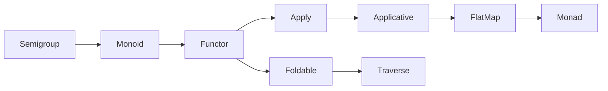

# Typeclass Hierarchy in Scala

## 1. Hierarchy Diagram



## 2. Semigroup
**Definition**: A type `A` with an associative binary operation.  
**Method Introduced**:
```scala
def combine(x: A, y: A): A
```
- **Why**: Allows combining two values of type `A` into one, following the law of associativity so grouping does not matter.  
**Example**:
```scala
implicit val intSemigroup: Semigroup[Int] = (x, y) => x + y
```

## 3. Monoid
**Definition**: A `Semigroup` with an identity element.  
**Method Introduced**:
```scala
def empty: A
```
- **Why**: Provides a neutral element that does not change other elements when combined.  
**Example**:
```scala
implicit val intMonoid: Monoid[Int] = new Monoid[Int] {
  def combine(x: Int, y: Int): Int = x + y
  def empty: Int = 0
}
```

## 4. Functor
**Definition**: A type constructor `F[_]` that supports mapping over its contents.  
**Method Introduced**:
```scala
def map[A, B](fa: F[A])(f: A => B): F[B]
```
- **Why**: Transforms the inner values of a context `F` without altering the structure.  
**Example**:
```scala
implicit val optionFunctor: Functor[Option] = (fa, f) => fa.map(f)
```

## 5. Apply
**Definition**: A `Functor` that supports function application lifted over a context.  
**Method Introduced**:
```scala
def ap[A, B](ff: F[A => B])(fa: F[A]): F[B]
```
- **Why**: Applies a function wrapped in the context to a value wrapped in the context.  
**Example**:
```scala
implicit val listApply: Apply[List] = new Apply[List] {
  def map[A, B](fa: List[A])(f: A => B): List[B] = fa.map(f)
  def ap[A, B](ff: List[A => B])(fa: List[A]): List[B] =
    for {
      f <- ff
      a <- fa
    } yield f(a)
}
```

## 6. Applicative
**Definition**: An `Apply` with the ability to lift values into the context.  
**Method Introduced**:
```scala
def pure[A](a: A): F[A]
```
- **Why**: Embeds a plain value into the context, enabling construction of contexts from values.  
**Example**:
```scala
implicit val optionApplicative: Applicative[Option] = new Applicative[Option] {
  def pure[A](a: A): Option[A] = Some(a)
  def ap[A, B](ff: Option[A => B])(fa: Option[A]): Option[B] = ff.flatMap(f => fa.map(f))
  def map[A, B](fa: Option[A])(f: A => B): Option[B] = fa.map(f)
}
```

## 7. FlatMap
**Definition**: Supports monadic chaining (sequential composition).  
**Method Introduced**:
```scala
def flatMap[A, B](fa: F[A])(f: A => F[B]): F[B]
```
- **Why**: Enables chaining operations that produce effects in the context `F`.  
**Example**:
```scala
implicit val optionFlatMap: FlatMap[Option] = new FlatMap[Option] {
  def flatMap[A, B](fa: Option[A])(f: A => Option[B]): Option[B] = fa.flatMap(f)
  def map[A, B](fa: Option[A])(f: A => B): Option[B] = fa.map(f)
}
```

## 8. Monad
**Definition**: Combines `Applicative` and `FlatMap`, supporting pure and flatMap.  
**Methods Introduced**:
```scala
def pure[A](a: A): F[A]
def flatMap[A, B](fa: F[A])(f: A => F[B]): F[B]
```
- **Why**: Allows composition of effectful computations in a context, supporting `for`-comprehensions.  
**Example**:
```scala
implicit val optionMonad: Monad[Option] = new Monad[Option] {
  def pure[A](a: A): Option[A] = Some(a)
  def flatMap[A, B](fa: Option[A])(f: A => Option[B]): Option[B] = fa.flatMap(f)
  def tailRecM[A, B](a: A)(f: A => Option[Either[A, B]]): Option[B] = ...
}
```

## 9. Foldable
**Definition**: A type constructor `F[_]` that can be folded to a summary value.  
**Method Introduced**:
```scala
def foldLeft[A, B](fa: F[A], b: B)(f: (B, A) => B): B
```
- **Why**: Aggregates elements of the structure using an accumulator and a combining function.  
**Example**:
```scala
implicit val listFoldable: Foldable[List] = (fa, b, f) => fa.foldLeft(b)(f)
```

## 10. Traverse
**Definition**: A `Functor` and `Foldable` that supports traversing with effects.  
**Method Introduced**:
```scala
def traverse[G[_]: Applicative, A, B](fa: F[A])(f: A => G[B]): G[F[B]]
```
- **Why**: Applies a function producing effects to each element and combines the results into a context of `F[B]`.  
**Example**:
```scala
implicit val listTraverse: Traverse[List] = new Traverse[List] {
  def traverse[G[_]: Applicative, A, B](fa: List[A])(f: A => G[B]): G[List[B]] = ...
  def foldLeft[A, B](fa: List[A], b: B)(f: (B, A) => B): B = fa.foldLeft(b)(f)
  def map[A, B](fa: List[A])(f: A => B): List[B] = fa.map(f)
}
```
